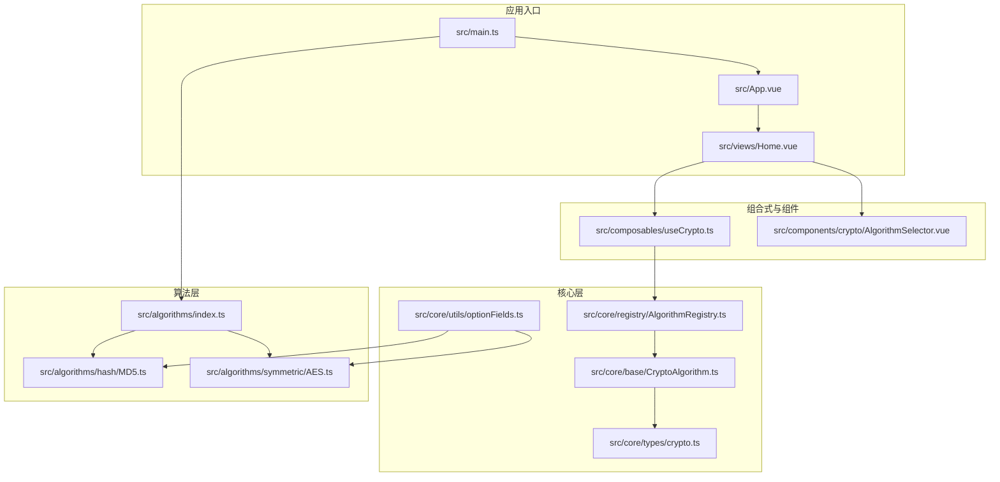
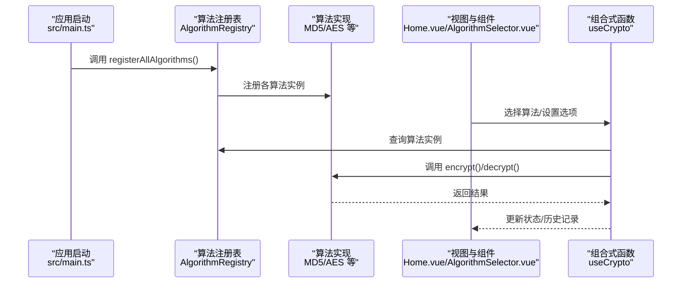
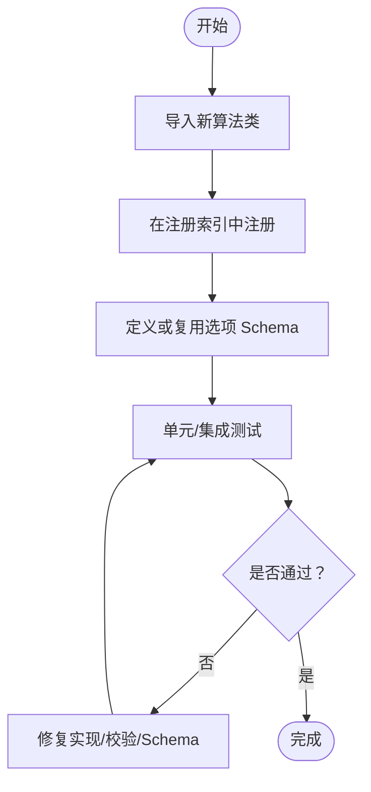
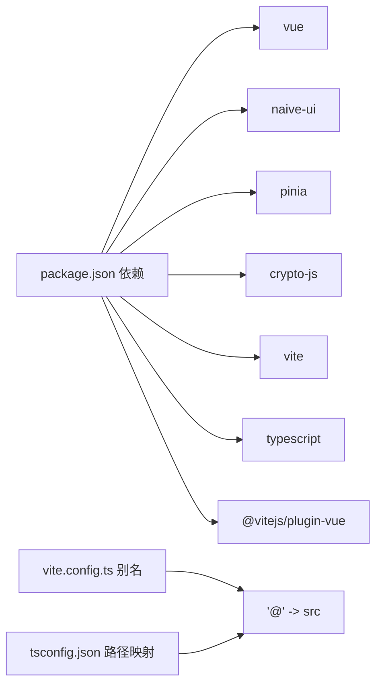

# 开发指南

<cite>
**本文引用的文件**
- [package.json](file://package.json)
- [vite.config.ts](file://vite.config.ts)
- [tsconfig.json](file://tsconfig.json)
- [src/main.ts](file://src/main.ts)
- [src/App.vue](file://src/App.vue)
- [src/views/Home.vue](file://src/views/Home.vue)
- [src/algorithms/index.ts](file://src/algorithms/index.ts)
- [src/algorithms/hash/MD5.ts](file://src/algorithms/hash/MD5.ts)
- [src/algorithms/symmetric/AES.ts](file://src/algorithms/symmetric/AES.ts)
- [src/core/base/CryptoAlgorithm.ts](file://src/core/base/CryptoAlgorithm.ts)
- [src/core/registry/AlgorithmRegistry.ts](file://src/core/registry/AlgorithmRegistry.ts)
- [src/core/types/crypto.ts](file://src/core/types/crypto.ts)
- [src/core/utils/optionFields.ts](file://src/core/utils/optionFields.ts)
- [src/composables/useCrypto.ts](file://src/composables/useCrypto.ts)
- [src/components/crypto/AlgorithmSelector.vue](file://src/components/crypto/AlgorithmSelector.vue)
</cite>

## 目录
1. [简介](#简介)
2. [项目结构](#项目结构)
3. [核心组件](#核心组件)
4. [架构总览](#架构总览)
5. [详细组件分析](#详细组件分析)
6. [依赖关系分析](#依赖关系分析)
7. [性能考虑](#性能考虑)
8. [故障排查指南](#故障排查指南)
9. [结论](#结论)
10. [附录](#附录)

## 简介
本开发指南面向希望扩展与维护编码器项目的开发者，系统阐述以下主题：
- 新算法添加流程与算法注册机制
- 代码规范与测试策略
- 开发环境搭建、调试技巧、性能监控与错误处理最佳实践
- 算法实现模板与组合式函数扩展指南
- 组件开发规范与质量保证路径

## 项目结构
项目采用基于功能域的组织方式，核心模块包括：
- 核心层：算法抽象基类、注册表、类型定义与公共工具
- 算法层：哈希、编码、HMAC、对称与非对称算法实现
- 视图与组件层：Vue 组合式函数与 UI 组件
- 应用入口：初始化与全局注册

图表来源
- [src/main.ts](file://src/main.ts#L1-L10)
- [src/App.vue](file://src/App.vue#L1-L33)
- [src/views/Home.vue](file://src/views/Home.vue#L1-L220)
- [src/algorithms/index.ts](file://src/algorithms/index.ts#L1-L59)
- [src/algorithms/hash/MD5.ts](file://src/algorithms/hash/MD5.ts#L1-L28)
- [src/algorithms/symmetric/AES.ts](file://src/algorithms/symmetric/AES.ts#L1-L171)
- [src/core/base/CryptoAlgorithm.ts](file://src/core/base/CryptoAlgorithm.ts#L1-L165)
- [src/core/registry/AlgorithmRegistry.ts](file://src/core/registry/AlgorithmRegistry.ts#L1-L114)
- [src/core/types/crypto.ts](file://src/core/types/crypto.ts#L1-L104)
- [src/core/utils/optionFields.ts](file://src/core/utils/optionFields.ts#L1-L137)
- [src/composables/useCrypto.ts](file://src/composables/useCrypto.ts#L1-L217)
- [src/components/crypto/AlgorithmSelector.vue](file://src/components/crypto/AlgorithmSelector.vue#L1-L63)

章节来源
- [src/main.ts](file://src/main.ts#L1-L10)
- [src/App.vue](file://src/App.vue#L1-L33)
- [src/views/Home.vue](file://src/views/Home.vue#L1-L220)
- [src/algorithms/index.ts](file://src/algorithms/index.ts#L1-L59)
- [src/core/base/CryptoAlgorithm.ts](file://src/core/base/CryptoAlgorithm.ts#L1-L165)
- [src/core/registry/AlgorithmRegistry.ts](file://src/core/registry/AlgorithmRegistry.ts#L1-L114)
- [src/core/types/crypto.ts](file://src/core/types/crypto.ts#L1-L104)
- [src/core/utils/optionFields.ts](file://src/core/utils/optionFields.ts#L1-L137)
- [src/composables/useCrypto.ts](file://src/composables/useCrypto.ts#L1-L217)
- [src/components/crypto/AlgorithmSelector.vue](file://src/components/crypto/AlgorithmSelector.vue#L1-L63)

## 核心组件
- 算法注册表：集中管理算法注册、查询、分组与批量操作，提供单例访问便捷导出。
- 算法抽象基类：统一加密/解密接口、输入校验、选项校验、常用数据转换辅助方法。
- 类型系统：统一的算法类型、选项、结果与历史记录接口，确保跨算法一致性。
- 组合式函数 useCrypto：封装算法选择、执行、历史记录、加载状态与错误处理。
- 选项字段工具：提供可复用的选项字段定义，简化算法选项 Schema 的编写。

章节来源
- [src/core/registry/AlgorithmRegistry.ts](file://src/core/registry/AlgorithmRegistry.ts#L1-L114)
- [src/core/base/CryptoAlgorithm.ts](file://src/core/base/CryptoAlgorithm.ts#L1-L165)
- [src/core/types/crypto.ts](file://src/core/types/crypto.ts#L1-L104)
- [src/composables/useCrypto.ts](file://src/composables/useCrypto.ts#L1-L217)
- [src/core/utils/optionFields.ts](file://src/core/utils/optionFields.ts#L1-L137)

## 架构总览
应用启动时通过入口脚本注册全部算法，随后由 UI 层通过组合式函数与组件进行交互。算法实现遵循统一基类，使用注册表集中管理，UI 通过组合式函数读取算法分组与选项 Schema，完成用户操作闭环。

图表来源
- [src/main.ts](file://src/main.ts#L1-L10)
- [src/algorithms/index.ts](file://src/algorithms/index.ts#L28-L54)
- [src/core/registry/AlgorithmRegistry.ts](file://src/core/registry/AlgorithmRegistry.ts#L26-L38)
- [src/views/Home.vue](file://src/views/Home.vue#L19-L34)
- [src/composables/useCrypto.ts](file://src/composables/useCrypto.ts#L74-L217)
- [src/components/crypto/AlgorithmSelector.vue](file://src/components/crypto/AlgorithmSelector.vue#L1-L63)

## 详细组件分析

### 算法注册机制与扩展流程
- 注册入口：应用启动时调用注册函数，集中导入并注册各类算法。
- 扩展步骤：
  1) 在算法目录新增实现类，继承抽象基类并实现必要方法。
  2) 在注册索引中导入该类并在注册函数中注册。
  3) 如需自定义选项，返回对应的 OptionsSchema；如可复用字段，优先使用工具函数。
  4) 如需导出额外工具函数，在注册索引中导出。
- 注意事项：
  - 算法名称需唯一，重复注册会触发覆盖警告。
  - 支持解密的算法需将支持标志设为真。
  - 选项校验应在子类中实现，确保输入安全。

图表来源
- [src/algorithms/index.ts](file://src/algorithms/index.ts#L28-L54)
- [src/core/base/CryptoAlgorithm.ts](file://src/core/base/CryptoAlgorithm.ts#L23-L87)
- [src/core/utils/optionFields.ts](file://src/core/utils/optionFields.ts#L119-L136)

章节来源
- [src/algorithms/index.ts](file://src/algorithms/index.ts#L1-L59)
- [src/core/registry/AlgorithmRegistry.ts](file://src/core/registry/AlgorithmRegistry.ts#L26-L38)
- [src/core/base/CryptoAlgorithm.ts](file://src/core/base/CryptoAlgorithm.ts#L23-L87)
- [src/core/utils/optionFields.ts](file://src/core/utils/optionFields.ts#L119-L136)

### 算法实现模板与最佳实践
- 继承与实现要点：
  - 必须实现名称、显示名、类型、描述与支持解密标志。
  - 实现核心加密/解密方法，必要时重写选项校验与 Schema。
  - 使用基类提供的数据转换辅助方法，避免重复实现。
- 选项 Schema 设计：
  - 将通用字段抽离为可复用项，减少重复代码。
  - 使用禁用条件控制字段可用性，提升用户体验。
- 错误处理：
  - 在核心方法中捕获异常并返回标准化结果对象。
  - 对不支持的操作明确提示，避免误导用户。

章节来源
- [src/algorithms/hash/MD5.ts](file://src/algorithms/hash/MD5.ts#L1-L28)
- [src/algorithms/symmetric/AES.ts](file://src/algorithms/symmetric/AES.ts#L1-L171)
- [src/core/base/CryptoAlgorithm.ts](file://src/core/base/CryptoAlgorithm.ts#L23-L87)
- [src/core/utils/optionFields.ts](file://src/core/utils/optionFields.ts#L1-L137)

### 组合式函数扩展指南
- useCrypto 的职责：
  - 管理当前算法、输入输出、选项与加载状态。
  - 提供加密/解密、清空、交换、复制等操作。
  - 与注册表交互，动态获取算法分组与选项 Schema。
- 扩展建议：
  - 新增算法后，确保注册索引导出并注册。
  - 若算法需要特殊选项或行为，可在组合式函数中补充处理逻辑。
  - 保持状态与副作用最小化，便于测试与维护。

章节来源
- [src/composables/useCrypto.ts](file://src/composables/useCrypto.ts#L1-L217)
- [src/core/registry/AlgorithmRegistry.ts](file://src/core/registry/AlgorithmRegistry.ts#L78-L95)

### 组件开发规范
- 选择器组件：
  - 使用分组选项展示算法，支持过滤与描述信息。
  - 与组合式函数联动，实现选中算法的即时更新。
- 视图层：
  - 合理划分左右布局，左侧算法与选项，右侧输入输出与操作区。
  - 通过消息组件反馈操作结果，增强用户感知。
- 交互与状态：
  - 严格区分加密/解密两种操作，支持自动切换与手动切换。
  - 交换输入输出时同步操作类型，避免状态错配。

章节来源
- [src/components/crypto/AlgorithmSelector.vue](file://src/components/crypto/AlgorithmSelector.vue#L1-L63)
- [src/views/Home.vue](file://src/views/Home.vue#L1-L220)

## 依赖关系分析
- 运行时依赖：Vue 3、Naive UI、Pinia、crypto-js。
- 开发依赖：Vite、TypeScript、Vue TS 插件。
- 路径别名：@ 指向 src，便于模块导入与维护。

图表来源
- [package.json](file://package.json#L12-L25)
- [vite.config.ts](file://vite.config.ts#L7-L11)
- [tsconfig.json](file://tsconfig.json#L19-L22)

章节来源
- [package.json](file://package.json#L1-L27)
- [vite.config.ts](file://vite.config.ts#L1-L13)
- [tsconfig.json](file://tsconfig.json#L1-L26)

## 性能考虑
- 算法实现：
  - 避免在核心加密/解密循环中进行昂贵的字符串拼接与转换。
  - 合理使用缓存与一次性计算（如模式与填充的映射）。
- UI 与状态：
  - 使用计算属性与响应式状态，减少不必要的重渲染。
  - 对长文本输入/输出进行防抖或延迟处理，避免频繁复制与格式化。
- 构建与运行：
  - 使用生产构建与 Tree-shaking，移除未使用的算法与组件。
  - 合理拆分路由与组件，按需加载以降低首屏负担。

## 故障排查指南
- 常见问题与定位：
  - 算法不可用：确认已在注册索引中导入并注册，检查名称唯一性。
  - 选项无效：核对选项 Schema 与禁用条件，确保必填项与格式满足。
  - 加密/解密失败：查看返回结果中的错误信息，检查密钥、IV、模式与填充配置。
  - 输出格式异常：确认输出/输入格式选项与大小写设置。
- 调试技巧：
  - 在组合式函数中打印当前算法与选项，核对实际传入值。
  - 使用浏览器开发者工具断点跟踪异步流程，定位异常抛出位置。
  - 分模块测试：先单独测试算法实现，再联调 UI 与历史记录。
- 错误处理最佳实践：
  - 统一返回标准化结果对象，前端据此展示错误信息。
  - 对用户输入进行显式校验与提示，避免静默失败。
  - 记录关键上下文（算法名、操作、输入摘要），便于回溯。

章节来源
- [src/core/base/CryptoAlgorithm.ts](file://src/core/base/CryptoAlgorithm.ts#L23-L87)
- [src/composables/useCrypto.ts](file://src/composables/useCrypto.ts#L78-L168)
- [src/core/registry/AlgorithmRegistry.ts](file://src/core/registry/AlgorithmRegistry.ts#L26-L38)

## 结论
本指南提供了从架构到实现、从开发到运维的完整参考路径。遵循统一的算法抽象、严格的注册与扩展流程、一致的类型与选项设计，以及完善的错误处理与测试策略，可确保项目在长期演进中保持高质量与可维护性。

## 附录

### 开发环境搭建
- 安装依赖：使用包管理器安装项目依赖。
- 启动开发服务器：运行开发脚本，访问本地预览地址。
- 类型检查：运行类型检查脚本，确保类型安全。

章节来源
- [package.json](file://package.json#L6-L11)
- [vite.config.ts](file://vite.config.ts#L1-L13)
- [tsconfig.json](file://tsconfig.json#L1-L26)

### 测试策略
- 单元测试：针对算法核心方法与选项校验编写用例，覆盖正常与异常分支。
- 集成测试：模拟 UI 操作流程，验证组合式函数与注册表协作。
- 回归测试：新增算法后，回归既有算法与 UI 行为，确保无破坏性变更。

### 算法实现模板（步骤）
- 新建类并继承抽象基类，填写元信息与能力声明。
- 实现核心加密/解密方法，必要时重写选项校验与 Schema。
- 在注册索引中导入并注册该算法。
- 编写测试用例并验证输出格式与边界条件。

章节来源
- [src/core/base/CryptoAlgorithm.ts](file://src/core/base/CryptoAlgorithm.ts#L13-L165)
- [src/algorithms/index.ts](file://src/algorithms/index.ts#L28-L54)