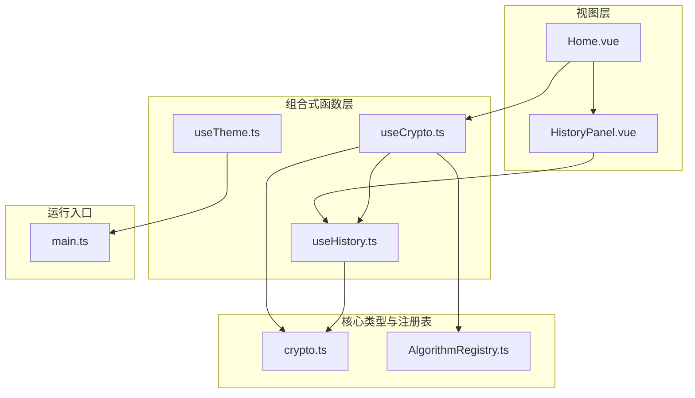
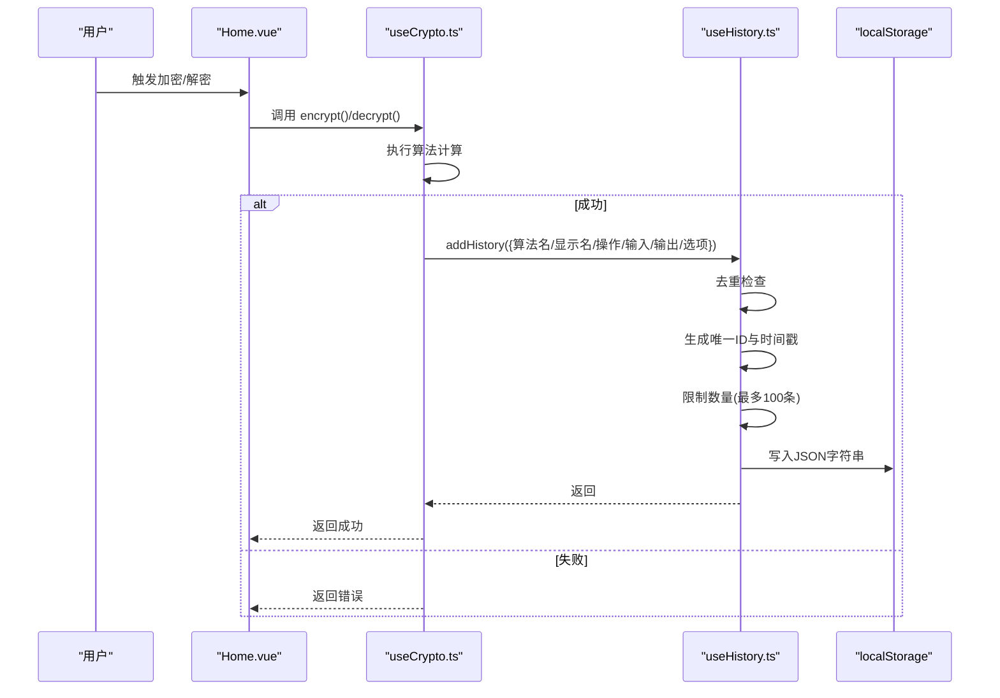
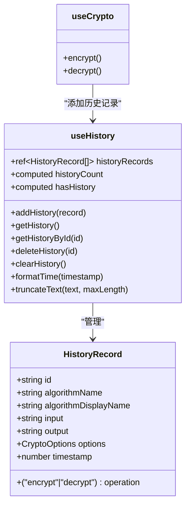
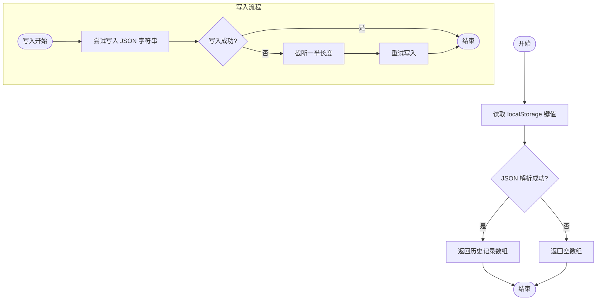
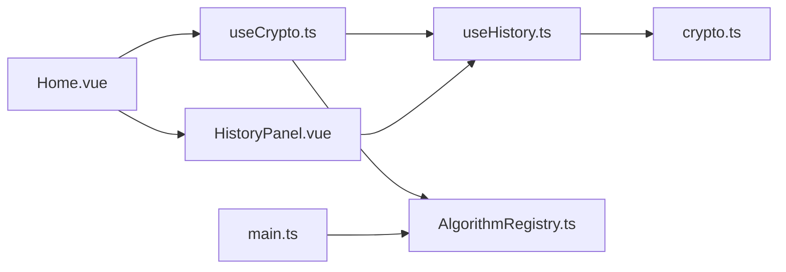
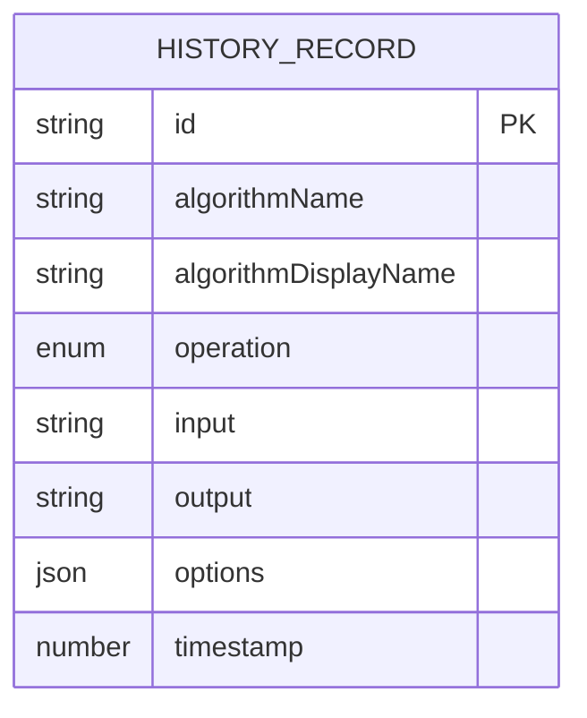
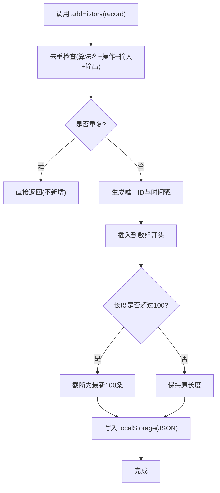

# 数据持久化

<cite>
**本文引用的文件**
- [useHistory.ts](file://src/composables/useHistory.ts)
- [HistoryPanel.vue](file://src/components/history/HistoryPanel.vue)
- [crypto.ts](file://src/core/types/crypto.ts)
- [useCrypto.ts](file://src/composables/useCrypto.ts)
- [Home.vue](file://src/views/Home.vue)
- [useTheme.ts](file://src/composables/useTheme.ts)
- [AlgorithmRegistry.ts](file://src/core/registry/AlgorithmRegistry.ts)
- [main.ts](file://src/main.ts)
- [package.json](file://package.json)
</cite>

## 目录
1. [简介](#简介)
2. [项目结构](#项目结构)
3. [核心组件](#核心组件)
4. [架构总览](#架构总览)
5. [详细组件分析](#详细组件分析)
6. [依赖关系分析](#依赖关系分析)
7. [性能考量](#性能考量)
8. [故障排查指南](#故障排查指南)
9. [结论](#结论)
10. [附录](#附录)

## 简介
本文件聚焦于编码器项目中的数据持久化机制，系统性阐述历史记录管理与数据存储的实现方案。内容涵盖：
- localStorage 使用策略与键空间管理
- 历史记录数据结构与去重逻辑
- 存储容量管理与性能优化
- 数据迁移与版本演进建议
- 备份与恢复流程
- 跨浏览器兼容性与隐私保护
- 开发者最佳实践与扩展指导

## 项目结构
围绕数据持久化，项目采用“组合式函数 + 组件”的分层设计：
- 组合式函数层：封装业务状态与持久化逻辑（如历史记录、主题）
- 视图层：通过组件消费组合式函数提供的状态与方法
- 类型层：统一定义历史记录与算法等核心数据模型

图表来源
- [Home.vue](file://src/views/Home.vue#L1-L220)
- [HistoryPanel.vue](file://src/components/history/HistoryPanel.vue#L1-L138)
- [useCrypto.ts](file://src/composables/useCrypto.ts#L1-L217)
- [useHistory.ts](file://src/composables/useHistory.ts#L1-L153)
- [useTheme.ts](file://src/composables/useTheme.ts#L1-L53)
- [crypto.ts](file://src/core/types/crypto.ts#L1-L104)
- [AlgorithmRegistry.ts](file://src/core/registry/AlgorithmRegistry.ts#L1-L114)
- [main.ts](file://src/main.ts#L1-L10)

章节来源
- [Home.vue](file://src/views/Home.vue#L1-L220)
- [HistoryPanel.vue](file://src/components/history/HistoryPanel.vue#L1-L138)
- [useCrypto.ts](file://src/composables/useCrypto.ts#L1-L217)
- [useHistory.ts](file://src/composables/useHistory.ts#L1-L153)
- [useTheme.ts](file://src/composables/useTheme.ts#L1-L53)
- [crypto.ts](file://src/core/types/crypto.ts#L1-L104)
- [AlgorithmRegistry.ts](file://src/core/registry/AlgorithmRegistry.ts#L1-L114)
- [main.ts](file://src/main.ts#L1-L10)

## 核心组件
- 历史记录组合式函数：负责历史记录的读取、写入、去重、截断与格式化
- 历史记录面板组件：提供可视化的历史记录列表、删除与清空功能，并支持从历史记录恢复
- 加密组合式函数：在每次加密/解密成功后自动添加历史记录
- 主题组合式函数：演示了与历史记录类似的 localStorage 使用模式

章节来源
- [useHistory.ts](file://src/composables/useHistory.ts#L1-L153)
- [HistoryPanel.vue](file://src/components/history/HistoryPanel.vue#L1-L138)
- [useCrypto.ts](file://src/composables/useCrypto.ts#L74-L217)
- [useTheme.ts](file://src/composables/useTheme.ts#L1-L53)

## 架构总览
历史记录的端到端流程如下：
- 用户在首页进行加密或解密操作
- 成功后调用历史记录组合式函数添加记录
- 记录被写入 localStorage，同时内存状态保持同步
- 历史记录面板展示并允许用户删除或清空

图表来源
- [Home.vue](file://src/views/Home.vue#L36-L52)
- [useCrypto.ts](file://src/composables/useCrypto.ts#L78-L168)
- [useHistory.ts](file://src/composables/useHistory.ts#L43-L73)

## 详细组件分析

### 历史记录数据结构与去重逻辑
- 数据结构
  - 字段：唯一ID、算法名、算法显示名、操作类型（加密/解密）、输入、输出、可选的算法选项、时间戳
  - 设计目标：完整复现一次操作，便于恢复与审计
- 去重策略
  - 基于“算法名+操作+输入+输出”四元组判断是否重复
  - 若重复则直接返回，不新增记录
- 时间戳与格式化
  - 以毫秒级时间戳存储，前端提供人性化时间格式化（刚刚、分钟前、今天/昨天、日期时间）

图表来源
- [crypto.ts](file://src/core/types/crypto.ts#L93-L103)
- [useHistory.ts](file://src/composables/useHistory.ts#L36-L151)
- [useCrypto.ts](file://src/composables/useCrypto.ts#L74-L217)

章节来源
- [crypto.ts](file://src/core/types/crypto.ts#L93-L103)
- [useHistory.ts](file://src/composables/useHistory.ts#L43-L73)
- [useHistory.ts](file://src/composables/useHistory.ts#L100-L130)

### localStorage 使用策略与键空间管理
- 历史记录键：固定键名用于存放历史记录数组
- 主题键：固定键名用于存放主题偏好
- 读取策略：尝试解析 localStorage 中的 JSON；异常时回退为空数组
- 写入策略：序列化为 JSON 并写入；若写入异常则进行“半量截断”写入，避免丢失全部历史
- 键空间隔离：不同模块使用不同键名，避免冲突

图表来源
- [useHistory.ts](file://src/composables/useHistory.ts#L8-L26)
- [useTheme.ts](file://src/composables/useTheme.ts#L6-L14)

章节来源
- [useHistory.ts](file://src/composables/useHistory.ts#L8-L26)
- [useTheme.ts](file://src/composables/useTheme.ts#L6-L14)

### 存储容量管理与性能优化
- 数量上限：最大保留100条历史记录
- 自动截断：超过上限时仅保留最新100条
- 去重：避免重复记录占用空间
- 异常降级：写入失败时自动截断一半，保证可用性
- 内存与存储一致性：内存状态与 localStorage 同步更新，减少重复解析

章节来源
- [useHistory.ts](file://src/composables/useHistory.ts#L4-L5)
- [useHistory.ts](file://src/composables/useHistory.ts#L66-L69)
- [useHistory.ts](file://src/composables/useHistory.ts#L22-L25)

### 数据备份与恢复
- 备份：用户可通过浏览器开发者工具导出 localStorage 中的历史记录键值，或在应用层面提供导出功能（建议）
- 恢复：历史记录面板支持点击单项恢复到输入区；也可在新环境导入历史记录键值后自动加载
- 跨设备迁移：建议通过导出/导入 JSON 的方式实现，避免直接拷贝 localStorage

章节来源
- [HistoryPanel.vue](file://src/components/history/HistoryPanel.vue#L30-L33)
- [Home.vue](file://src/views/Home.vue#L75-L85)

### 跨浏览器兼容性与隐私保护
- 兼容性
  - localStorage 在现代浏览器中广泛支持；需注意无痕模式下可能不可用
  - 建议在写入前检测可用性，并提供降级处理
- 隐私保护
  - 历史记录包含输入/输出明文，应避免在不受信任的环境中使用
  - 可考虑提供“清空历史记录”快捷入口与一键清除功能
  - 对敏感数据建议在使用后立即清空或手动删除

章节来源
- [useHistory.ts](file://src/composables/useHistory.ts#L18-L26)
- [HistoryPanel.vue](file://src/components/history/HistoryPanel.vue#L47-L57)

### 与算法注册表的关系
- 算法注册表负责管理所有算法，历史记录中包含算法名与显示名，确保历史记录可读性与可恢复性
- 通过算法注册表的分组能力，历史记录可按算法类型组织展示

章节来源
- [AlgorithmRegistry.ts](file://src/core/registry/AlgorithmRegistry.ts#L85-L95)
- [useHistory.ts](file://src/composables/useHistory.ts#L57-L61)

## 依赖关系分析
- 组合式函数依赖
  - useHistory 依赖 crypto.ts 中的 HistoryRecord 接口
  - useCrypto 依赖 useHistory 与 AlgorithmRegistry
- 组件依赖
  - HistoryPanel 依赖 useHistory
  - Home 依赖 useCrypto，并通过事件与 HistoryPanel 交互
- 运行入口
  - main.ts 注册所有算法，为历史记录中的算法信息提供基础

图表来源
- [useHistory.ts](file://src/composables/useHistory.ts#L1-L2)
- [crypto.ts](file://src/core/types/crypto.ts#L93-L103)
- [useCrypto.ts](file://src/composables/useCrypto.ts#L1-L4)
- [AlgorithmRegistry.ts](file://src/core/registry/AlgorithmRegistry.ts#L1-L1)
- [HistoryPanel.vue](file://src/components/history/HistoryPanel.vue#L16-L17)
- [Home.vue](file://src/views/Home.vue#L12-L34)
- [main.ts](file://src/main.ts#L3)

章节来源
- [useHistory.ts](file://src/composables/useHistory.ts#L1-L2)
- [useCrypto.ts](file://src/composables/useCrypto.ts#L1-L4)
- [HistoryPanel.vue](file://src/components/history/HistoryPanel.vue#L16-L17)
- [Home.vue](file://src/views/Home.vue#L12-L34)
- [main.ts](file://src/main.ts#L3)

## 性能考量
- 读取成本：初始化时一次性从 localStorage 读取，后续只在变更时写入
- 写入成本：每次新增记录都会触发写入；建议在批量操作时合并写入（当前实现逐次写入）
- 去重成本：线性扫描现有记录进行比较，复杂度 O(n)；n 最大为100，开销可忽略
- 内存占用：最多100条记录，每条包含字符串与可选对象，总体较小
- I/O 频率：频繁操作会增加 localStorage 写入次数，建议在 UI 层节流或合并更新

章节来源
- [useHistory.ts](file://src/composables/useHistory.ts#L43-L73)
- [useHistory.ts](file://src/composables/useHistory.ts#L66-L69)

## 故障排查指南
- localStorage 不可用
  - 症状：历史记录无法读取或写入
  - 处理：检查浏览器隐私模式或存储配额；提供降级提示
- 写入失败
  - 症状：历史记录未保存或部分丢失
  - 处理：系统会自动进行半量截断写入；建议清理其他大体积键值
- 历史记录重复
  - 症状：出现完全相同的记录
  - 处理：去重逻辑会跳过重复项；如仍出现，检查输入/输出是否一致
- 时间显示异常
  - 症状：时间显示不符合预期
  - 处理：确认时间戳正确写入；检查本地时区设置

章节来源
- [useHistory.ts](file://src/composables/useHistory.ts#L18-L26)
- [useHistory.ts](file://src/composables/useHistory.ts#L43-L55)
- [useHistory.ts](file://src/composables/useHistory.ts#L100-L130)

## 结论
本项目通过组合式函数与组件的清晰分层，实现了简洁而可靠的历史记录持久化方案。其特点包括：
- 明确的键空间与数据结构
- 完备的去重与容量控制
- 异常降级与性能优化
- 与算法注册表的自然衔接

建议在后续版本中引入：
- 导出/导入功能，提升跨设备迁移体验
- 批量写入与节流策略，降低 I/O 频率
- 版本化存储与迁移脚本，支持未来字段演进

## 附录

### 数据模型图

图表来源
- [crypto.ts](file://src/core/types/crypto.ts#L93-L103)

### 关键流程图：历史记录添加

图表来源
- [useHistory.ts](file://src/composables/useHistory.ts#L43-L73)

### API 一览（与历史记录相关）
- 读取历史记录：getHistory()
- 获取单条历史记录：getHistoryById(id)
- 添加历史记录：addHistory(record)
- 删除历史记录：deleteHistory(id)
- 清空历史记录：clearHistory()
- 格式化时间：formatTime(timestamp)
- 文本截断：truncateText(text, maxLength)

章节来源
- [useHistory.ts](file://src/composables/useHistory.ts#L75-L151)