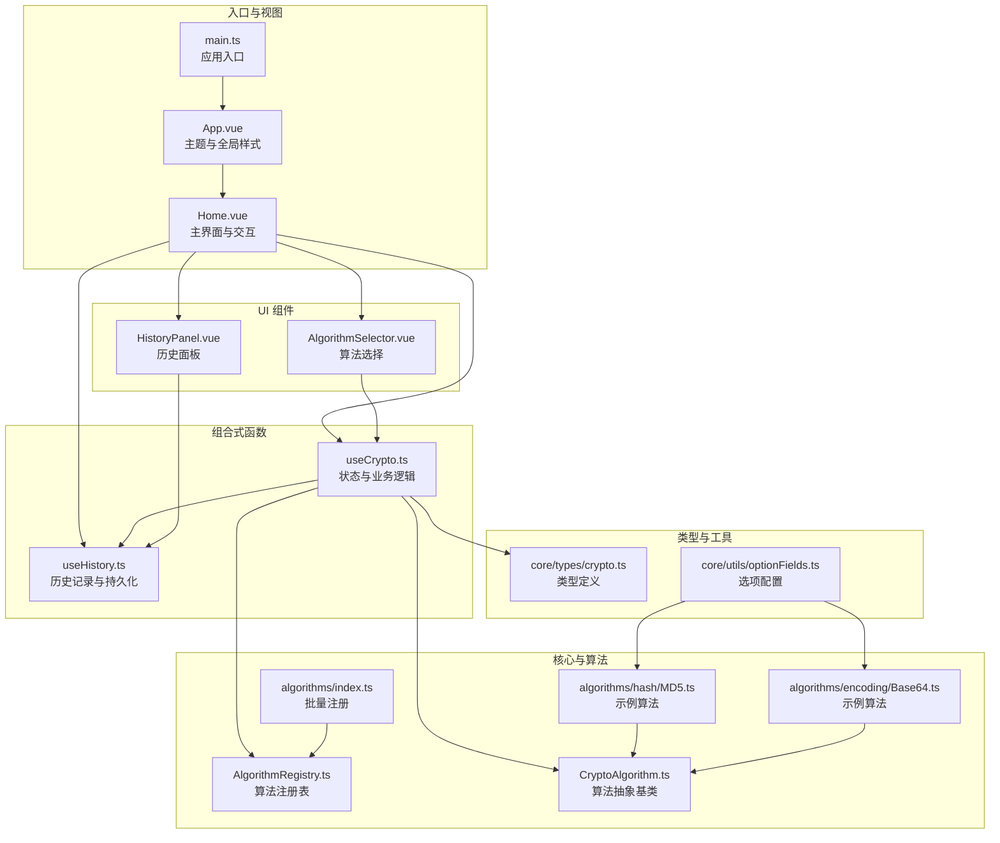
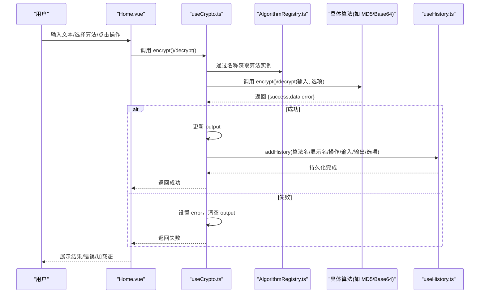
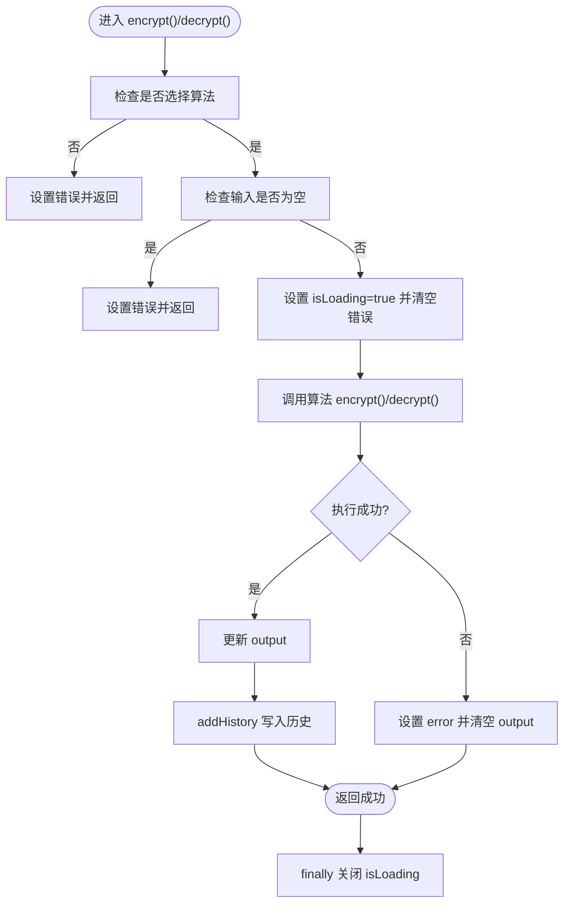
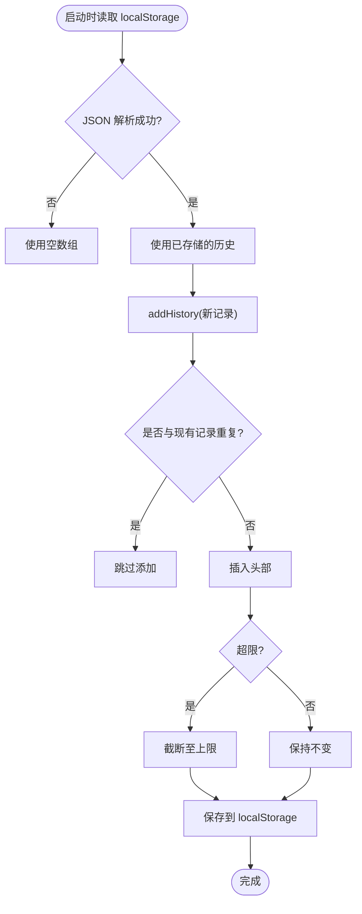
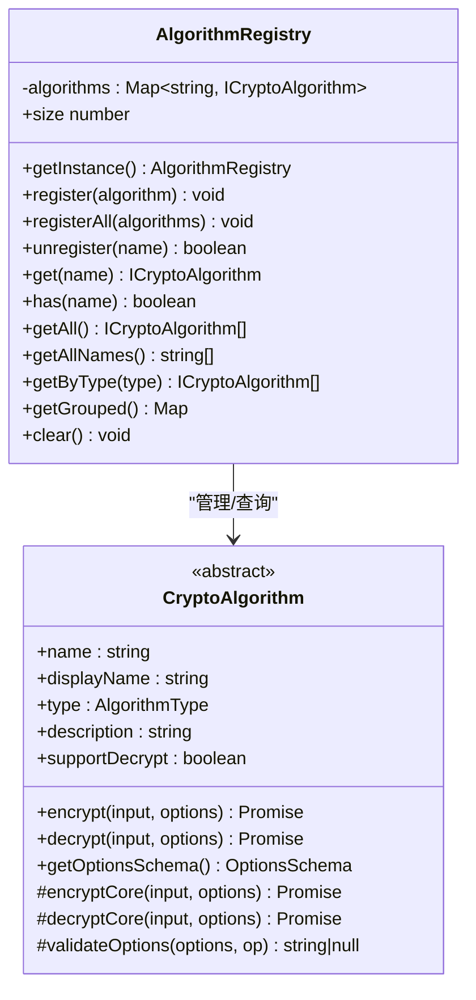
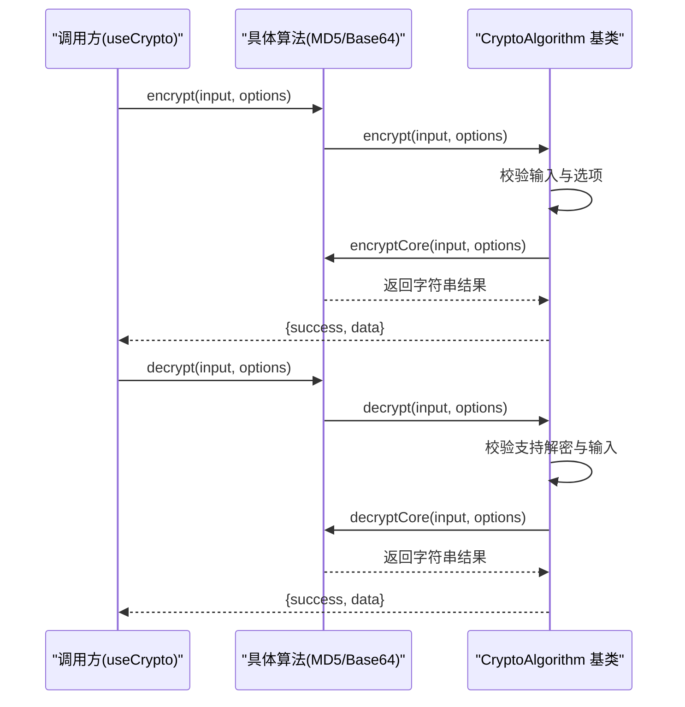
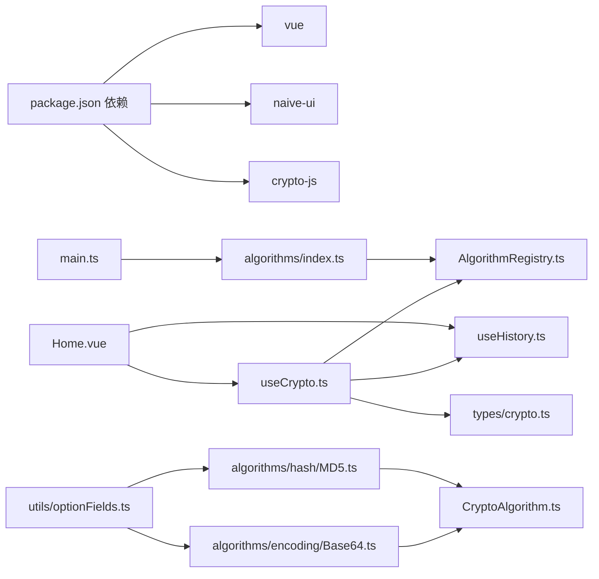

# 数据流架构

<cite>
**本文引用的文件**
- [src/main.ts](file://src/main.ts)
- [src/App.vue](file://src/App.vue)
- [src/views/Home.vue](file://src/views/Home.vue)
- [src/composables/useCrypto.ts](file://src/composables/useCrypto.ts)
- [src/composables/useHistory.ts](file://src/composables/useHistory.ts)
- [src/core/registry/AlgorithmRegistry.ts](file://src/core/registry/AlgorithmRegistry.ts)
- [src/algorithms/index.ts](file://src/algorithms/index.ts)
- [src/core/base/CryptoAlgorithm.ts](file://src/core/base/CryptoAlgorithm.ts)
- [src/core/types/crypto.ts](file://src/core/types/crypto.ts)
- [src/components/crypto/AlgorithmSelector.vue](file://src/components/crypto/AlgorithmSelector.vue)
- [src/components/history/HistoryPanel.vue](file://src/components/history/HistoryPanel.vue)
- [src/algorithms/hash/MD5.ts](file://src/algorithms/hash/MD5.ts)
- [src/algorithms/encoding/Base64.ts](file://src/algorithms/encoding/Base64.ts)
- [src/core/utils/optionFields.ts](file://src/core/utils/optionFields.ts)
- [package.json](file://package.json)
</cite>

## 目录
1. [引言](#引言)
2. [项目结构](#项目结构)
3. [核心组件](#核心组件)
4. [架构总览](#架构总览)
5. [详细组件分析](#详细组件分析)
6. [依赖关系分析](#依赖关系分析)
7. [性能考虑](#性能考虑)
8. [故障排查指南](#故障排查指南)
9. [结论](#结论)
10. [附录](#附录)

## 引言
本文件系统性梳理编码器项目的数据流架构，围绕“从用户输入到算法执行再到结果展示”的完整链路，深入解析以下关键点：
- useCrypto 组合式函数的状态管理与异步处理
- useHistory 的本地存储与历史记录机制
- AlgorithmRegistry 的算法注册与状态管理
- 响应式数据绑定、异步数据处理与错误传播
- 数据验证、缓存策略与性能优化建议
- 开发者实践与优化指导

## 项目结构
项目采用“视图层 + 组合式函数 + 核心算法 + 类型与工具”的分层组织方式，入口在 main.ts 中完成全局算法注册与应用挂载；Home 视图作为主界面承载交互；AlgorithmSelector 与 HistoryPanel 提供算法选择与历史记录能力；useCrypto 与 useHistory 提供跨组件共享状态与持久化。

图表来源
- [src/main.ts](file://src/main.ts#L1-L10)
- [src/App.vue](file://src/App.vue#L1-L33)
- [src/views/Home.vue](file://src/views/Home.vue#L1-L220)
- [src/composables/useCrypto.ts](file://src/composables/useCrypto.ts#L1-L217)
- [src/composables/useHistory.ts](file://src/composables/useHistory.ts#L1-L153)
- [src/core/registry/AlgorithmRegistry.ts](file://src/core/registry/AlgorithmRegistry.ts#L1-L114)
- [src/algorithms/index.ts](file://src/algorithms/index.ts#L1-L59)
- [src/core/base/CryptoAlgorithm.ts](file://src/core/base/CryptoAlgorithm.ts#L1-L165)
- [src/core/types/crypto.ts](file://src/core/types/crypto.ts#L1-L104)
- [src/components/crypto/AlgorithmSelector.vue](file://src/components/crypto/AlgorithmSelector.vue#L1-L63)
- [src/components/history/HistoryPanel.vue](file://src/components/history/HistoryPanel.vue#L1-L138)
- [src/algorithms/hash/MD5.ts](file://src/algorithms/hash/MD5.ts#L1-L28)
- [src/algorithms/encoding/Base64.ts](file://src/algorithms/encoding/Base64.ts#L1-L39)
- [src/core/utils/optionFields.ts](file://src/core/utils/optionFields.ts#L1-L137)

章节来源
- [src/main.ts](file://src/main.ts#L1-L10)
- [src/App.vue](file://src/App.vue#L1-L33)
- [src/views/Home.vue](file://src/views/Home.vue#L1-L220)

## 核心组件
- useCrypto：集中管理当前算法、输入输出、错误、加载状态、算法选项与分组列表；封装加密/解密、清空、交换、复制等操作，并在成功时写入历史。
- useHistory：维护历史记录数组，提供去重、截断、持久化至 localStorage、格式化时间与文本截断等能力。
- AlgorithmRegistry：单例注册表，负责算法注册、查询、分组与数量统计，为 useCrypto 提供算法元数据与动态选项。
- CryptoAlgorithm：算法抽象基类，统一 encrypt/decrypt 接口、选项校验、核心逻辑与常用工具方法。
- Home 视图：协调 UI 绑定、消息提示、操作按钮状态与历史恢复。
- AlgorithmSelector 与 HistoryPanel：分别承担算法选择与历史记录展示/交互。

章节来源
- [src/composables/useCrypto.ts](file://src/composables/useCrypto.ts#L1-L217)
- [src/composables/useHistory.ts](file://src/composables/useHistory.ts#L1-L153)
- [src/core/registry/AlgorithmRegistry.ts](file://src/core/registry/AlgorithmRegistry.ts#L1-L114)
- [src/core/base/CryptoAlgorithm.ts](file://src/core/base/CryptoAlgorithm.ts#L1-L165)
- [src/views/Home.vue](file://src/views/Home.vue#L1-L220)
- [src/components/crypto/AlgorithmSelector.vue](file://src/components/crypto/AlgorithmSelector.vue#L1-L63)
- [src/components/history/HistoryPanel.vue](file://src/components/history/HistoryPanel.vue#L1-L138)

## 架构总览
下图展示从用户输入到结果展示的端到端数据流，包括状态更新、异步调用、错误传播与持久化。

图表来源
- [src/views/Home.vue](file://src/views/Home.vue#L1-L220)
- [src/composables/useCrypto.ts](file://src/composables/useCrypto.ts#L74-L217)
- [src/core/registry/AlgorithmRegistry.ts](file://src/core/registry/AlgorithmRegistry.ts#L48-L52)
- [src/algorithms/hash/MD5.ts](file://src/algorithms/hash/MD5.ts#L13-L22)
- [src/algorithms/encoding/Base64.ts](file://src/algorithms/encoding/Base64.ts#L11-L30)
- [src/composables/useHistory.ts](file://src/composables/useHistory.ts#L44-L73)

## 详细组件分析

### useCrypto：状态管理与异步处理
- 状态与计算属性
  - currentAlgorithmName/input/output/error/isLoading/options：模块级响应式状态，供 Home 与组件双向绑定。
  - currentAlgorithm/optionsSchema/supportDecrypt/groupedAlgorithms：基于 registry 动态派生，确保算法变更时 UI 自动同步。
- 算法选择与选项重置
  - selectAlgorithm 切换算法时重置 options 为 schema 默认值，清空 output 与 error，避免脏状态污染。
- 加密/解密流程
  - 输入校验与异常捕获：若未选择算法或输入为空，立即设置 error 并返回；内部 try/catch 捕获异常，统一设置 error 并清空 output。
  - 加载态控制：在 try 前置 isLoading，在 finally 后关闭，保证 UI 体验一致。
  - 成功后写入历史：addHistory 记录算法名、显示名、操作类型、输入/输出与选项快照。
- 其他操作
  - clear/sort：清空输入输出错误；swap：交换输入输出并清空错误；copyOutput：安全地写入剪贴板并返回布尔结果。

图表来源
- [src/composables/useCrypto.ts](file://src/composables/useCrypto.ts#L78-L119)
- [src/composables/useCrypto.ts](file://src/composables/useCrypto.ts#L122-L168)
- [src/composables/useHistory.ts](file://src/composables/useHistory.ts#L44-L73)

章节来源
- [src/composables/useCrypto.ts](file://src/composables/useCrypto.ts#L1-L217)
- [src/views/Home.vue](file://src/views/Home.vue#L36-L92)

### useHistory：本地存储与历史记录
- 初始化与持久化
  - 应用启动时从 localStorage 读取历史记录，若解析失败则回退为空数组。
  - addHistory 在去重后插入头部，超过上限时截断至阈值；保存时优先完整保存，失败则降级为半量保存以释放空间。
- 去重与格式化
  - 基于算法名、操作类型、输入与输出完全一致进行去重判断。
  - formatTime 支持“刚刚/分钟前/今天/昨天/其他”人性化时间展示；truncateText 对长文本进行截断预览。
- 查询与删除
  - 提供按 id 查找、删除单条与清空全部的能力，并同步更新 localStorage。

图表来源
- [src/composables/useHistory.ts](file://src/composables/useHistory.ts#L8-L26)
- [src/composables/useHistory.ts](file://src/composables/useHistory.ts#L44-L73)
- [src/composables/useHistory.ts](file://src/composables/useHistory.ts#L101-L130)

章节来源
- [src/composables/useHistory.ts](file://src/composables/useHistory.ts#L1-L153)

### AlgorithmRegistry：算法注册与状态管理
- 单例模式
  - getInstance 确保全局仅有一个注册表实例，避免重复注册与状态分散。
- 注册与查询
  - register/registerAll/unregister：支持单个/批量注册与注销；has/get/getAll/getAllNames 提供灵活查询。
  - getByType/getGrouped：按类型过滤与分组，为 UI 选择器提供结构化数据。
- 与 useCrypto 的协作
  - useCrypto 通过 registry.get(currentAlgorithmName) 获取当前算法实例，再调用其 encrypt/decrypt；同时读取 getOptionsSchema 生成动态选项面板。

图表来源
- [src/core/registry/AlgorithmRegistry.ts](file://src/core/registry/AlgorithmRegistry.ts#L1-L114)
- [src/core/base/CryptoAlgorithm.ts](file://src/core/base/CryptoAlgorithm.ts#L1-L165)

章节来源
- [src/core/registry/AlgorithmRegistry.ts](file://src/core/registry/AlgorithmRegistry.ts#L1-L114)
- [src/algorithms/index.ts](file://src/algorithms/index.ts#L29-L54)

### CryptoAlgorithm 抽象基类与具体算法
- 统一接口
  - encrypt/decrypt 对外暴露 Promise 接口，内部先做输入与选项校验，再调用子类的 encryptCore/decryptCore。
- 选项与工具
  - getOptionsSchema 可由子类重写；内置 stringToArrayBuffer/arrayBufferToHex/arrayBufferToBase64 等常用工具。
- 示例算法
  - MD5：基于外部库生成哈希，支持 hex/base64 输出与大小写控制。
  - Base64：支持加解密，解密失败抛出错误由上层捕获。

图表来源
- [src/core/base/CryptoAlgorithm.ts](file://src/core/base/CryptoAlgorithm.ts#L23-L75)
- [src/algorithms/hash/MD5.ts](file://src/algorithms/hash/MD5.ts#L13-L22)
- [src/algorithms/encoding/Base64.ts](file://src/algorithms/encoding/Base64.ts#L19-L30)

章节来源
- [src/core/base/CryptoAlgorithm.ts](file://src/core/base/CryptoAlgorithm.ts#L1-L165)
- [src/algorithms/hash/MD5.ts](file://src/algorithms/hash/MD5.ts#L1-L28)
- [src/algorithms/encoding/Base64.ts](file://src/algorithms/encoding/Base64.ts#L1-L39)

### Home 视图：响应式绑定与交互编排
- 状态绑定
  - 使用 v-model 绑定 input/output，通过 computed 控制按钮可用性与 loading 状态。
- 操作流程
  - handleEncrypt/handleDecrypt：触发 useCrypto 的 encrypt/decrypt，成功后弹出消息提示。
  - handleSwap：交换输入输出，必要时自动切换操作类型。
  - handleRestoreHistory：从历史记录恢复算法、输入、输出与选项，并切换操作类型。
- 监听与联动
  - watch 监听算法名变化，若当前算法不支持解密则强制为加密模式。

章节来源
- [src/views/Home.vue](file://src/views/Home.vue#L1-L220)

### AlgorithmSelector 与 HistoryPanel：UI 与数据交互
- AlgorithmSelector
  - 基于 groupedAlgorithms 生成分组下拉菜单，选中后调用 selectAlgorithm 更新状态。
- HistoryPanel
  - 展示历史列表，支持恢复、删除与清空；通过 formatTime/truncateText 提升可读性。

章节来源
- [src/components/crypto/AlgorithmSelector.vue](file://src/components/crypto/AlgorithmSelector.vue#L1-L63)
- [src/components/history/HistoryPanel.vue](file://src/components/history/HistoryPanel.vue#L1-L138)

## 依赖关系分析
- 入口与挂载
  - main.ts 注册所有算法后创建并挂载应用。
- 组合式函数耦合
  - useCrypto 依赖 registry、useHistory 与类型定义；useHistory 依赖类型定义与浏览器存储 API。
- 算法扩展
  - algorithms/index.ts 通过 registry.register 注册各类算法，形成统一的算法生态。
- UI 与状态
  - Home 与组件通过 useCrypto/useHistory 提供的状态与方法进行双向绑定与事件驱动。

图表来源
- [package.json](file://package.json#L12-L25)
- [src/main.ts](file://src/main.ts#L1-L10)
- [src/algorithms/index.ts](file://src/algorithms/index.ts#L29-L54)
- [src/core/registry/AlgorithmRegistry.ts](file://src/core/registry/AlgorithmRegistry.ts#L1-L114)
- [src/views/Home.vue](file://src/views/Home.vue#L1-L220)
- [src/composables/useCrypto.ts](file://src/composables/useCrypto.ts#L1-L217)
- [src/composables/useHistory.ts](file://src/composables/useHistory.ts#L1-L153)
- [src/core/types/crypto.ts](file://src/core/types/crypto.ts#L1-L104)
- [src/algorithms/hash/MD5.ts](file://src/algorithms/hash/MD5.ts#L1-L28)
- [src/algorithms/encoding/Base64.ts](file://src/algorithms/encoding/Base64.ts#L1-L39)
- [src/core/utils/optionFields.ts](file://src/core/utils/optionFields.ts#L1-L137)

章节来源
- [package.json](file://package.json#L1-L27)
- [src/main.ts](file://src/main.ts#L1-L10)
- [src/algorithms/index.ts](file://src/algorithms/index.ts#L1-L59)

## 性能考虑
- 算法执行
  - 将耗时操作置于子类 encryptCore/decryptCore，避免在基类中引入阻塞逻辑；对大型输入可考虑分块处理与 Web Worker 化（建议）。
- 状态更新
  - useCrypto 中的 optionsSchema 与 groupedAlgorithms 为 computed，减少不必要的重复计算；避免在渲染路径中进行重型计算。
- 历史记录
  - addHistory 去重与截断策略降低存储压力；localStorage 写入失败时的降级保存保障稳定性。
- UI 交互
  - isLoading 严格在 finally 中关闭，防止 UI 锁定；按钮禁用与只读属性提升用户体验。
- 缓存策略
  - registry 作为单例缓存算法实例，避免重复创建；UI 层对复杂计算使用 computed 缓存结果。
- 优化建议
  - 对高频选项变更（如 hex 大小写）使用防抖；对历史记录分页或懒加载；对 Base64/Hex 转换使用原生 API 并避免中间对象拷贝。

## 故障排查指南
- 常见错误与定位
  - “请选择加密算法”：检查 AlgorithmSelector 是否正确初始化，以及 useCrypto.selectAlgorithm 是否被调用。
  - “请输入要加密的内容”：确认 Home.vue 的 v-model 绑定正常，input 非空。
  - “不支持解密操作”：确认所选算法的 supportDecrypt 标志，或切换到支持解密的算法。
  - “复制失败”：检查浏览器剪贴板权限与 HTTPS 环境。
- 错误传播机制
  - useCrypto 的 encrypt/decrypt 在 try/catch 中捕获异常，统一设置 error 并返回 {success:false,error}；上层 Home.vue 依据返回值显示消息。
- 历史记录问题
  - 若历史记录为空，检查 localStorage 权限与容量；若出现重复记录，确认去重逻辑是否生效。
- 算法选项校验
  - 若某些选项导致校验失败，检查子类 validateOptions 或 getOptionsSchema 的实现是否与实际输入匹配。

章节来源
- [src/composables/useCrypto.ts](file://src/composables/useCrypto.ts#L78-L119)
- [src/composables/useCrypto.ts](file://src/composables/useCrypto.ts#L122-L168)
- [src/composables/useHistory.ts](file://src/composables/useHistory.ts#L44-L73)

## 结论
本项目通过清晰的分层与组合式函数实现了高内聚、低耦合的数据流架构：useCrypto 负责状态与业务编排，useHistory 负责持久化与历史管理，AlgorithmRegistry 提供算法注册与查询能力，CryptoAlgorithm 抽象出统一的算法接口与工具。配合 Home 与 UI 组件，形成从用户输入到结果展示的完整闭环。建议在后续迭代中进一步引入 Web Worker、分页与缓存优化，以提升复杂场景下的性能与稳定性。

## 附录
- 类型与选项
  - AlgorithmType/AlgorithmTypeLabels 定义算法类型与标签；CryptoOptions/OptionsSchema 描述通用与特定算法的选项；OptionField 定义字段类型与禁用条件。
- 选项配置复用
  - optionFields.ts 提供输出格式、Hex 大小写、HMAC 密钥、对称密钥、IV、模式、填充、输入格式、RSA 公私钥等标准字段，便于算法快速复用。

章节来源
- [src/core/types/crypto.ts](file://src/core/types/crypto.ts#L1-L104)
- [src/core/utils/optionFields.ts](file://src/core/utils/optionFields.ts#L1-L137)