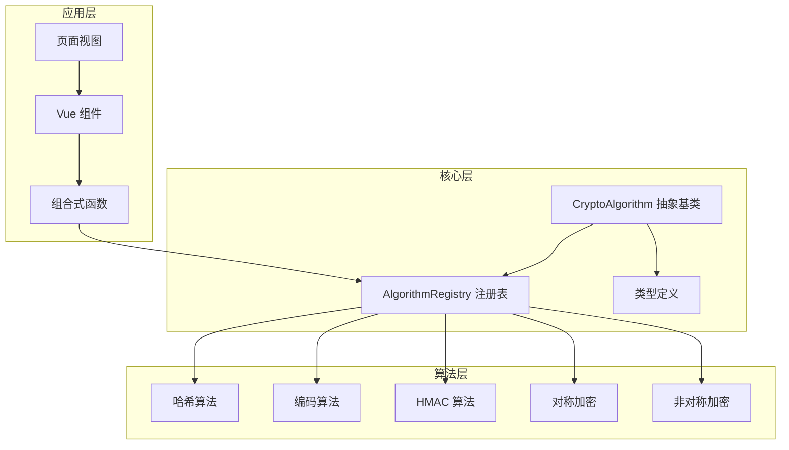
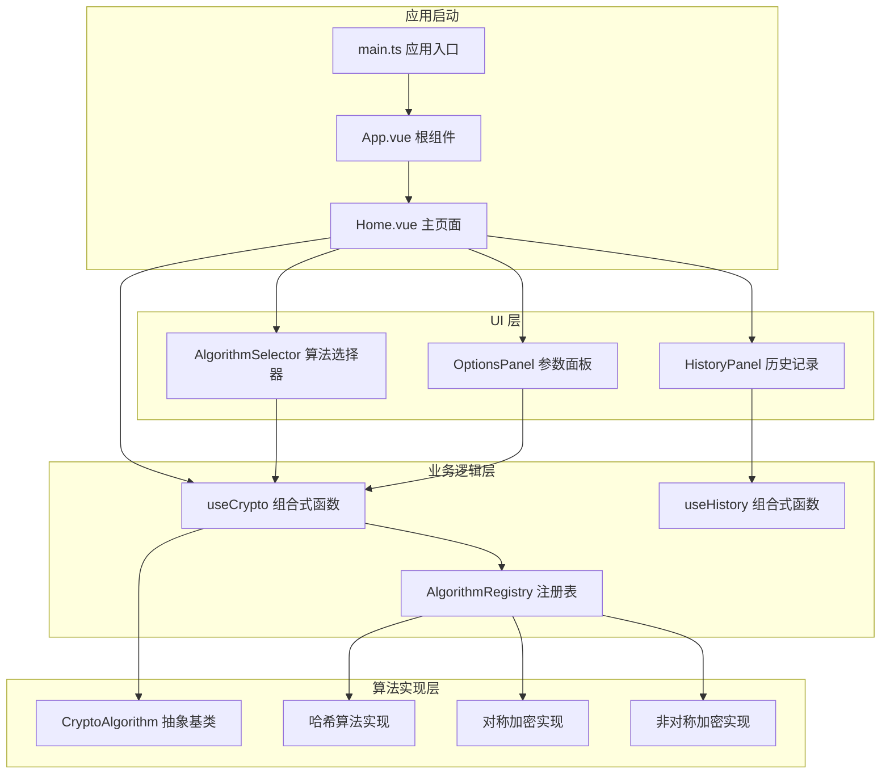
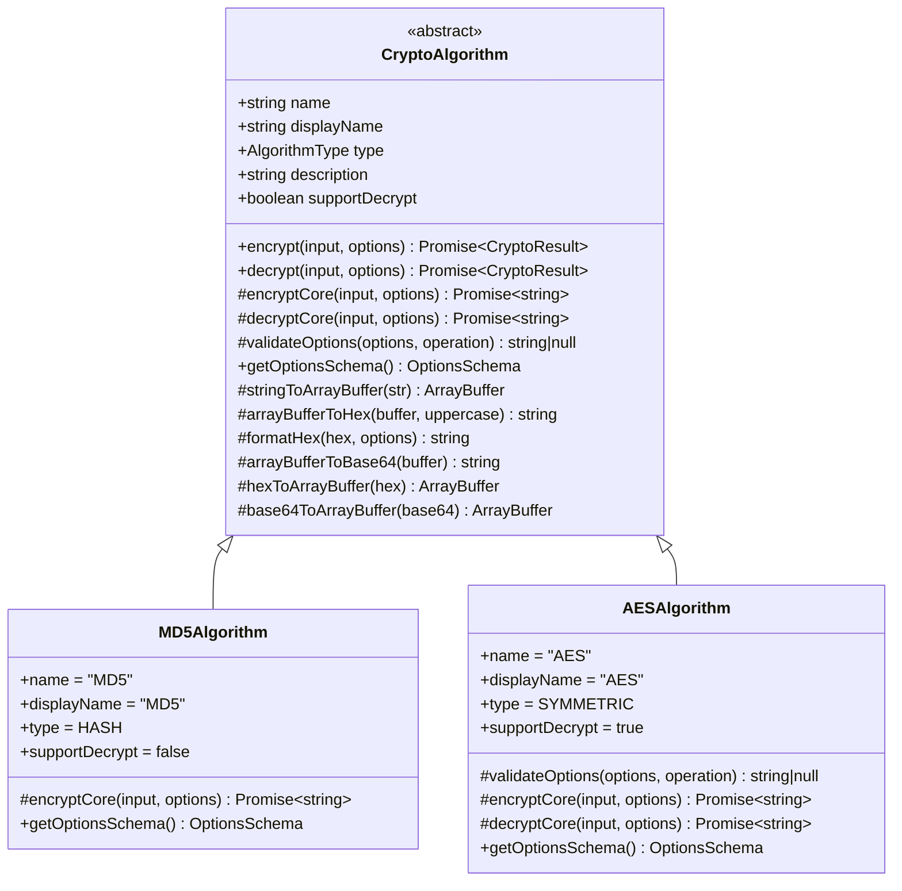
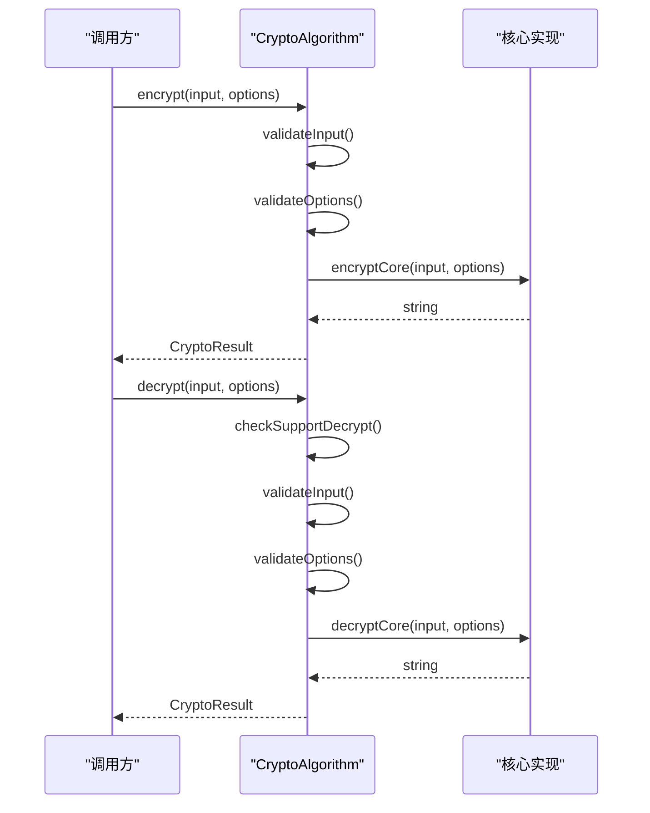
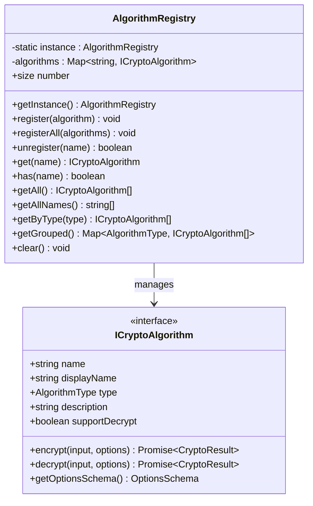
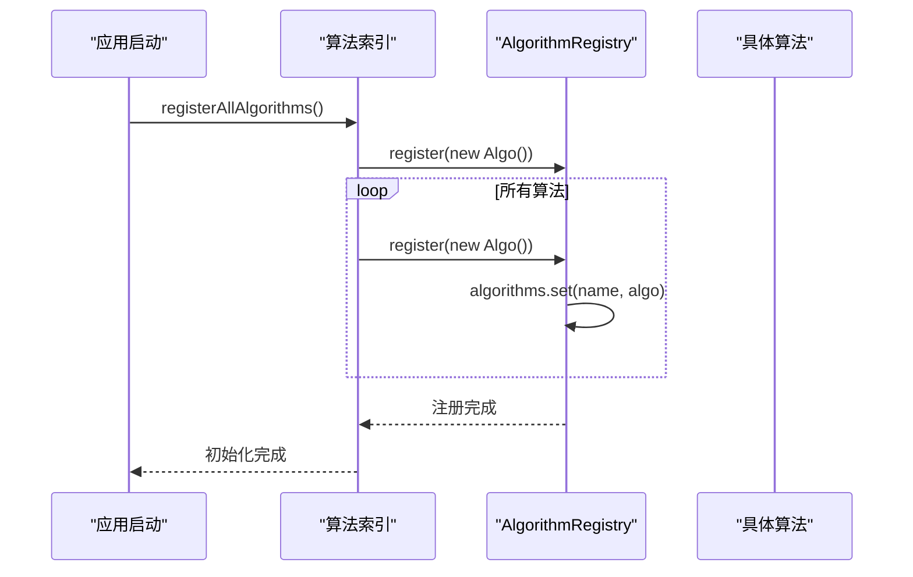
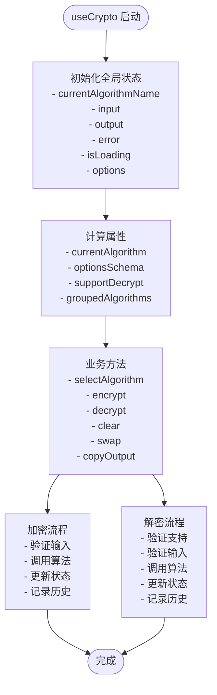
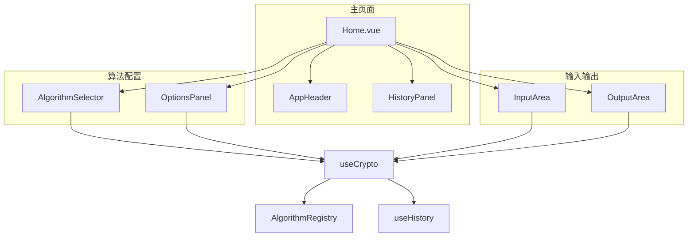
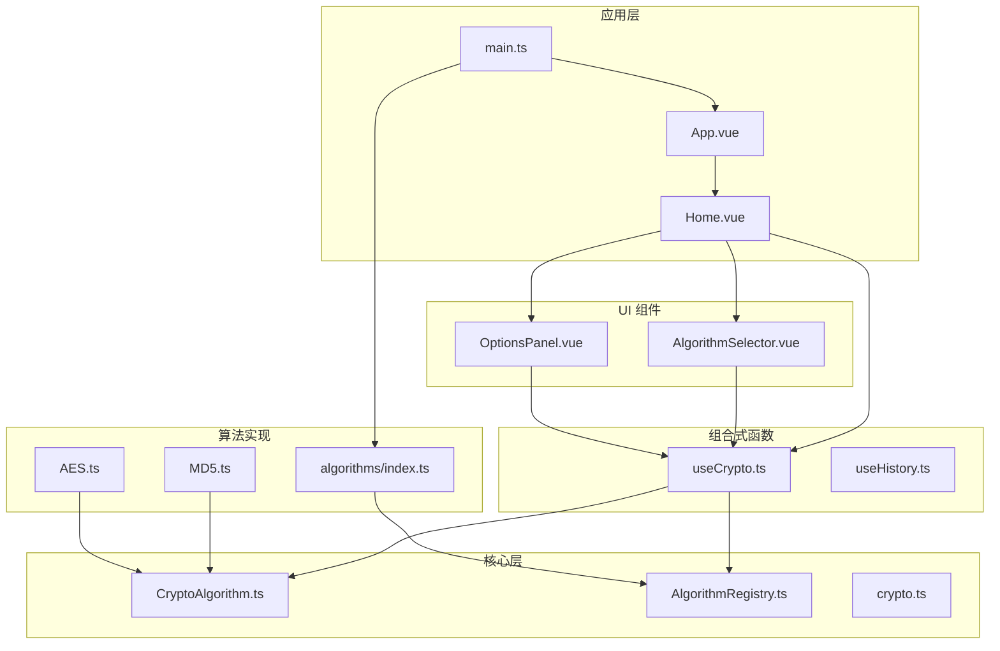

# 架构设计

<cite>
**本文档引用的文件**
- [CryptoAlgorithm.ts](file://src/core/base/CryptoAlgorithm.ts)
- [AlgorithmRegistry.ts](file://src/core/registry/AlgorithmRegistry.ts)
- [crypto.ts](file://src/core/types/crypto.ts)
- [index.ts](file://src/algorithms/index.ts)
- [main.ts](file://src/main.ts)
- [App.vue](file://src/App.vue)
- [Home.vue](file://src/views/Home.vue)
- [useCrypto.ts](file://src/composables/useCrypto.ts)
- [useHistory.ts](file://src/composables/useHistory.ts)
- [MD5.ts](file://src/algorithms/hash/MD5.ts)
- [AES.ts](file://src/algorithms/symmetric/AES.ts)
- [AlgorithmSelector.vue](file://src/components/crypto/AlgorithmSelector.vue)
- [OptionsPanel.vue](file://src/components/crypto/OptionsPanel.vue)
- [package.json](file://package.json)
</cite>

## 目录
1. [引言](#引言)
2. [项目结构](#项目结构)
3. [核心组件](#核心组件)
4. [架构总览](#架构总览)
5. [详细组件分析](#详细组件分析)
6. [依赖关系分析](#依赖关系分析)
7. [性能考虑](#性能考虑)
8. [故障排除指南](#故障排除指南)
9. [结论](#结论)

## 引言
本项目是一个基于 Vue 3 的加密算法演示工具，采用模块化架构设计，通过抽象基类统一算法接口，使用注册表管理算法集合，并通过组合式函数提供业务逻辑封装。系统支持多种加密算法类型（哈希、编码、HMAC、对称加密、非对称加密），并通过组件化界面提供用户交互。

## 项目结构
项目采用按功能域划分的目录结构，核心分为以下层次：
- core：核心基础设施（抽象基类、注册表、类型定义）
- algorithms：具体算法实现（按算法类型分组）
- components：Vue 组件（UI 层）
- composables：组合式函数（业务逻辑封装）
- views：页面视图
- public：静态资源

**图表来源**
- [CryptoAlgorithm.ts](file://src/core/base/CryptoAlgorithm.ts#L1-L165)
- [AlgorithmRegistry.ts](file://src/core/registry/AlgorithmRegistry.ts#L1-L114)
- [crypto.ts](file://src/core/types/crypto.ts#L1-L104)

**章节来源**
- [main.ts](file://src/main.ts#L1-L10)
- [App.vue](file://src/App.vue#L1-L33)

## 核心组件
系统的核心组件包括抽象基类、注册表、类型定义和组合式函数，这些组件共同构成了系统的架构基础。

### 抽象基类设计
CryptoAlgorithm 抽象基类提供了统一的算法接口规范，定义了加密和解密的标准流程，同时提供了丰富的辅助方法用于数据格式转换。

### 注册表机制
AlgorithmRegistry 实现了单例模式的算法注册表，负责算法的注册、查询、分类和管理，支持批量注册和按类型分组查询。

### 类型系统
crypto.ts 定义了完整的类型系统，包括算法类型枚举、选项接口、结果接口和选项字段定义，确保了类型安全和良好的开发体验。

**章节来源**
- [CryptoAlgorithm.ts](file://src/core/base/CryptoAlgorithm.ts#L13-L165)
- [AlgorithmRegistry.ts](file://src/core/registry/AlgorithmRegistry.ts#L7-L114)
- [crypto.ts](file://src/core/types/crypto.ts#L1-L104)

## 架构总览
系统采用分层架构设计，通过依赖注入和组合式函数实现关注点分离，确保了良好的可扩展性和维护性。

**图表来源**
- [main.ts](file://src/main.ts#L1-L10)
- [App.vue](file://src/App.vue#L1-L33)
- [Home.vue](file://src/views/Home.vue#L1-L220)
- [useCrypto.ts](file://src/composables/useCrypto.ts#L1-L217)
- [useHistory.ts](file://src/composables/useHistory.ts#L1-L153)
- [AlgorithmRegistry.ts](file://src/core/registry/AlgorithmRegistry.ts#L1-L114)

## 详细组件分析

### 抽象基类设计模式
CryptoAlgorithm 采用了模板方法设计模式，定义了加密/解密的标准流程，同时允许子类实现特定的核心逻辑。

**图表来源**
- [CryptoAlgorithm.ts](file://src/core/base/CryptoAlgorithm.ts#L13-L165)
- [MD5.ts](file://src/algorithms/hash/MD5.ts#L6-L28)
- [AES.ts](file://src/algorithms/symmetric/AES.ts#L5-L171)

#### 核心方法流程
加密/解密方法遵循统一的处理流程：输入验证 → 选项验证 → 核心处理 → 结果包装。

**图表来源**
- [CryptoAlgorithm.ts](file://src/core/base/CryptoAlgorithm.ts#L23-L75)

**章节来源**
- [CryptoAlgorithm.ts](file://src/core/base/CryptoAlgorithm.ts#L13-L165)

### 算法注册表机制
AlgorithmRegistry 实现了单例模式和工厂模式的结合，提供了算法的集中管理和动态发现能力。

**图表来源**
- [AlgorithmRegistry.ts](file://src/core/registry/AlgorithmRegistry.ts#L7-L114)
- [crypto.ts](file://src/core/types/crypto.ts#L74-L91)

#### 算法注册流程
系统在启动时通过算法索引文件批量注册所有可用算法，实现了零配置的自动发现机制。

**图表来源**
- [index.ts](file://src/algorithms/index.ts#L29-L54)
- [AlgorithmRegistry.ts](file://src/core/registry/AlgorithmRegistry.ts#L26-L38)

**章节来源**
- [AlgorithmRegistry.ts](file://src/core/registry/AlgorithmRegistry.ts#L7-L114)
- [index.ts](file://src/algorithms/index.ts#L1-L59)

### 组合式函数模式
useCrypto 和 useHistory 组合式函数提供了跨组件的状态共享和业务逻辑封装，体现了 Vue 3 组合式 API 的最佳实践。

**图表来源**
- [useCrypto.ts](file://src/composables/useCrypto.ts#L6-L217)

#### 状态管理模式
组合式函数通过响应式引用实现了模块级的共享状态，避免了组件间的复杂通信。

**章节来源**
- [useCrypto.ts](file://src/composables/useCrypto.ts#L1-L217)
- [useHistory.ts](file://src/composables/useHistory.ts#L1-L153)

### UI 组件架构
系统采用组件化设计，通过父子组件通信和事件传递实现功能解耦。

**图表来源**
- [Home.vue](file://src/views/Home.vue#L1-L220)
- [AlgorithmSelector.vue](file://src/components/crypto/AlgorithmSelector.vue#L1-L63)
- [OptionsPanel.vue](file://src/components/crypto/OptionsPanel.vue#L1-L129)

**章节来源**
- [Home.vue](file://src/views/Home.vue#L1-L220)
- [AlgorithmSelector.vue](file://src/components/crypto/AlgorithmSelector.vue#L1-L63)
- [OptionsPanel.vue](file://src/components/crypto/OptionsPanel.vue#L1-L129)

## 依赖关系分析

### 外部依赖
项目使用了现代化的前端技术栈，主要依赖包括：
- Vue 3：响应式框架和组合式 API
- Naive UI：高质量的 Vue 3 组件库
- CryptoJS：加密算法库
- Pinia：状态管理库

### 内部模块依赖
系统内部模块间遵循清晰的依赖层次，避免循环依赖：

**图表来源**
- [main.ts](file://src/main.ts#L1-L10)
- [App.vue](file://src/App.vue#L1-L33)
- [Home.vue](file://src/views/Home.vue#L1-L220)
- [useCrypto.ts](file://src/composables/useCrypto.ts#L1-L217)
- [AlgorithmRegistry.ts](file://src/core/registry/AlgorithmRegistry.ts#L1-L114)
- [CryptoAlgorithm.ts](file://src/core/base/CryptoAlgorithm.ts#L1-L165)
- [index.ts](file://src/algorithms/index.ts#L1-L59)

**章节来源**
- [package.json](file://package.json#L12-L25)

## 性能考虑
系统在设计时充分考虑了性能优化和用户体验：

### 算法执行优化
- 异步处理：所有算法操作都是异步的，避免阻塞主线程
- 输入验证：在算法执行前进行快速验证，减少无效计算
- 结果缓存：通过组合式函数的响应式系统避免不必要的重新渲染

### 内存管理
- 单例注册表：算法实例只创建一次，避免重复分配
- 状态管理：使用响应式引用而非深层拷贝，减少内存占用
- 历史记录限制：最多保留100条历史记录，防止内存泄漏

### 用户体验优化
- 加载状态：通过 isLoading 状态指示算法执行进度
- 错误处理：提供详细的错误信息和降级方案
- 自适应布局：支持响应式设计，适配不同屏幕尺寸

## 故障排除指南

### 常见问题诊断
1. **算法不可用**：检查算法是否正确注册到注册表中
2. **选项验证失败**：确认选项值符合算法要求（如密钥长度、IV 长度等）
3. **解密失败**：验证密钥、IV 和输入格式是否正确
4. **性能问题**：检查是否有大量历史记录导致内存占用过高

### 调试建议
- 使用浏览器开发者工具监控网络请求和算法执行时间
- 检查控制台中的错误信息和警告
- 验证算法返回的结果格式是否符合预期
- 确认本地存储功能正常工作

**章节来源**
- [CryptoAlgorithm.ts](file://src/core/base/CryptoAlgorithm.ts#L23-L75)
- [AES.ts](file://src/algorithms/symmetric/AES.ts#L12-L28)

## 结论
本项目展现了现代前端加密工具的设计理念和技术实现，通过抽象基类、注册表机制和组合式函数的有机结合，构建了一个高度模块化、可扩展的加密算法平台。系统架构清晰、职责分离明确，既保证了功能的完整性，又确保了良好的可维护性和扩展性。

设计原则包括：
- **开闭原则**：通过抽象基类和注册表机制支持新算法的无缝集成
- **单一职责**：每个组件和函数都有明确的职责边界
- **依赖倒置**：高层模块不依赖低层模块的具体实现
- **组合优于继承**：通过组合式函数实现功能复用

扩展性考虑：
- 新增算法只需继承抽象基类并实现必要方法
- 通过选项 Schema 系统支持灵活的参数配置
- 组件化设计便于界面定制和主题切换
- 组合式函数模式支持业务逻辑的模块化重构