# 算法架构设计

<cite>
**本文档引用的文件**
- [CryptoAlgorithm.ts](file://src/core/base/CryptoAlgorithm.ts)
- [AlgorithmRegistry.ts](file://src/core/registry/AlgorithmRegistry.ts)
- [crypto.ts](file://src/core/types/crypto.ts)
- [index.ts](file://src/algorithms/index.ts)
- [SHA256.ts](file://src/algorithms/hash/SHA256.ts)
- [AES.ts](file://src/algorithms/symmetric/AES.ts)
- [RSA.ts](file://src/algorithms/asymmetric/RSA.ts)
- [HMAC_SHA256.ts](file://src/algorithms/hmac/HMAC_SHA256.ts)
- [optionFields.ts](file://src/core/utils/optionFields.ts)
- [main.ts](file://src/main.ts)
</cite>

## 目录
1. [简介](#简介)
2. [项目结构](#项目结构)
3. [核心组件](#核心组件)
4. [架构概览](#架构概览)
5. [详细组件分析](#详细组件分析)
6. [依赖关系分析](#依赖关系分析)
7. [性能考虑](#性能考虑)
8. [故障排除指南](#故障排除指南)
9. [结论](#结论)
10. [附录](#附录)

## 简介

本项目是一个基于Web Crypto API构建的加密算法框架，采用面向对象的设计模式，提供了统一的算法抽象基类和灵活的注册机制。该架构支持多种类型的加密算法，包括哈希算法、对称加密、非对称加密、编码转换和HMAC等，为开发者提供了一个可扩展、可维护的加密算法平台。

## 项目结构

项目采用模块化的组织方式，主要分为以下几个核心层次：

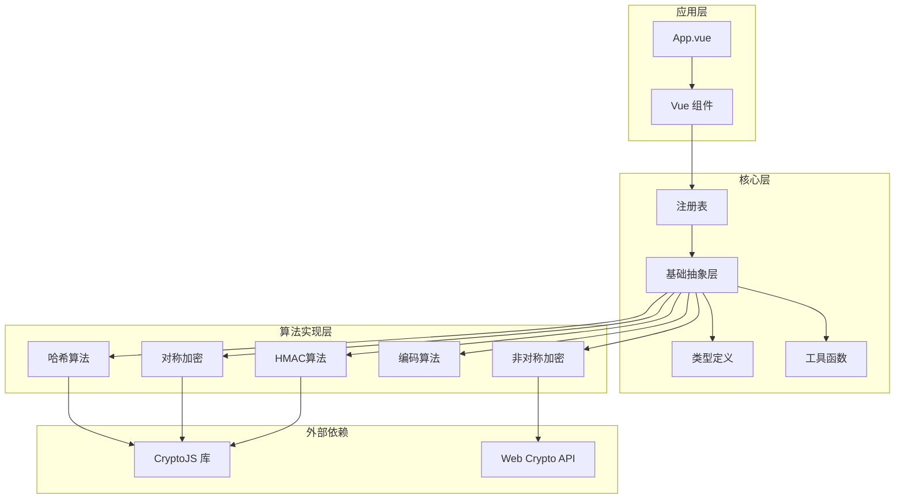

**图表来源**
- [main.ts](file://src/main.ts#L1-L10)
- [index.ts](file://src/algorithms/index.ts#L1-L59)

**章节来源**
- [main.ts](file://src/main.ts#L1-L10)
- [index.ts](file://src/algorithms/index.ts#L1-L59)

## 核心组件

### CryptoAlgorithm 抽象基类

CryptoAlgorithm是整个加密算法框架的核心抽象基类，定义了所有算法必须实现的标准接口和通用功能。

#### 核心接口设计

基类定义了以下核心接口：

- **算法元数据接口**：name、displayName、type、description、supportDecrypt
- **加密接口**：encrypt(input, options?) → Promise<CryptoResult>
- **解密接口**：decrypt(input, options?) → Promise<CryptoResult>
- **配置接口**：getOptionsSchema() → OptionsSchema

#### 错误处理机制

基类实现了完善的错误处理机制：

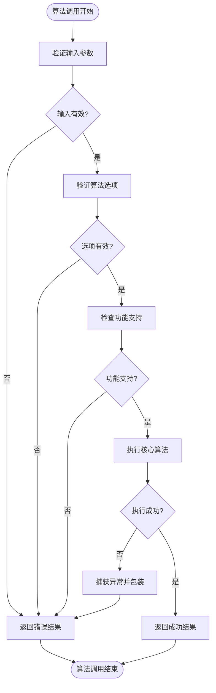

**图表来源**
- [CryptoAlgorithm.ts](file://src/core/base/CryptoAlgorithm.ts#L23-L75)

#### 辅助方法体系

基类提供了丰富的辅助方法：

- **数据转换**：stringToArrayBuffer、arrayBufferToHex、arrayBufferToBase64
- **格式化**：formatHex、hexToArrayBuffer、base64ToArrayBuffer
- **编码支持**：TextEncoder/TextDecoder API集成

**章节来源**
- [CryptoAlgorithm.ts](file://src/core/base/CryptoAlgorithm.ts#L1-L165)

### AlgorithmRegistry 单例模式

AlgorithmRegistry实现了算法注册表的单例模式，提供算法的集中管理功能。

#### 单例模式实现

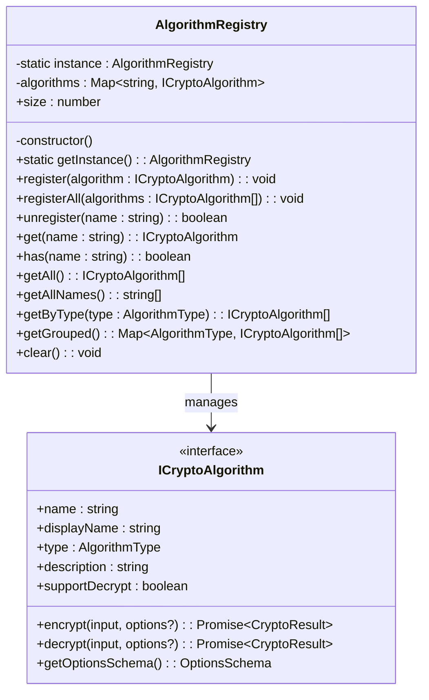

**图表来源**
- [AlgorithmRegistry.ts](file://src/core/registry/AlgorithmRegistry.ts#L7-L114)

#### 动态加载机制

注册表支持算法的动态注册和注销，提供了灵活的扩展能力：

- **批量注册**：registerAll()方法支持一次性注册多个算法
- **按类型查询**：getByType()和getGrouped()提供分类查询功能
- **运行时管理**：支持算法的动态添加和移除

**章节来源**
- [AlgorithmRegistry.ts](file://src/core/registry/AlgorithmRegistry.ts#L1-L114)

### 类型系统设计

#### 算法类型枚举

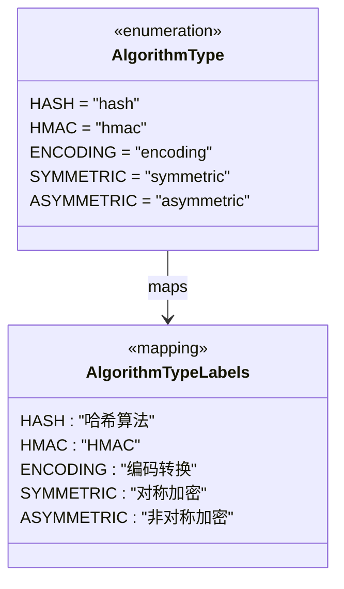

**图表来源**
- [crypto.ts](file://src/core/types/crypto.ts#L2-L17)

#### 选项模式和结果模式

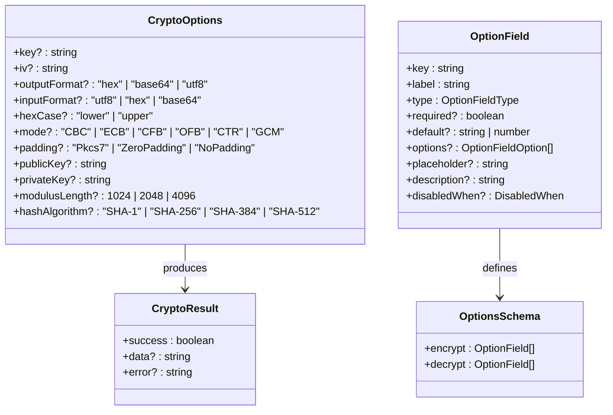

**图表来源**
- [crypto.ts](file://src/core/types/crypto.ts#L19-L104)

**章节来源**
- [crypto.ts](file://src/core/types/crypto.ts#L1-L104)

## 架构概览

系统采用分层架构设计，从底层到上层依次为：

```mermaid
graph TB
subgraph "表现层"
UI[用户界面组件]
Config[配置面板]
end
subgraph "业务逻辑层"
Controller[算法控制器]
Validator[参数验证器]
Formatter[数据格式化器]
end
subgraph "核心服务层"
BaseClass[CryptoAlgorithm 基类]
Registry[AlgorithmRegistry]
TypeSystem[类型系统]
end
subgraph "算法实现层"
HashAlgorithms[哈希算法]
SymmetricAlgorithms[对称算法]
AsymmetricAlgorithms[非对称算法]
EncodingAlgorithms[编码算法]
HMACAlgorithms[HMAC算法]
end
subgraph "基础设施层"
WebCrypto[Web Crypto API]
CryptoJS[CryptoJS 库]
BrowserAPI[浏览器原生 API]
end
UI --> Controller
Config --> Controller
Controller --> BaseClass
BaseClass --> Registry
BaseClass --> TypeSystem
BaseClass --> HashAlgorithms
BaseClass --> SymmetricAlgorithms
BaseClass --> AsymmetricAlgorithms
BaseClass --> EncodingAlgorithms
BaseClass --> HMACAlgorithms
HashAlgorithms --> WebCrypto
HashAlgorithms --> CryptoJS
SymmetricAlgorithms --> CryptoJS
AsymmetricAlgorithms --> WebCrypto
HMACAlgorithms --> CryptoJS
```

**图表来源**
- [main.ts](file://src/main.ts#L1-L10)
- [index.ts](file://src/algorithms/index.ts#L1-L59)

## 详细组件分析

### 哈希算法实现分析

以SHA256算法为例，展示算法实现的最佳实践：

#### 算法实现模式

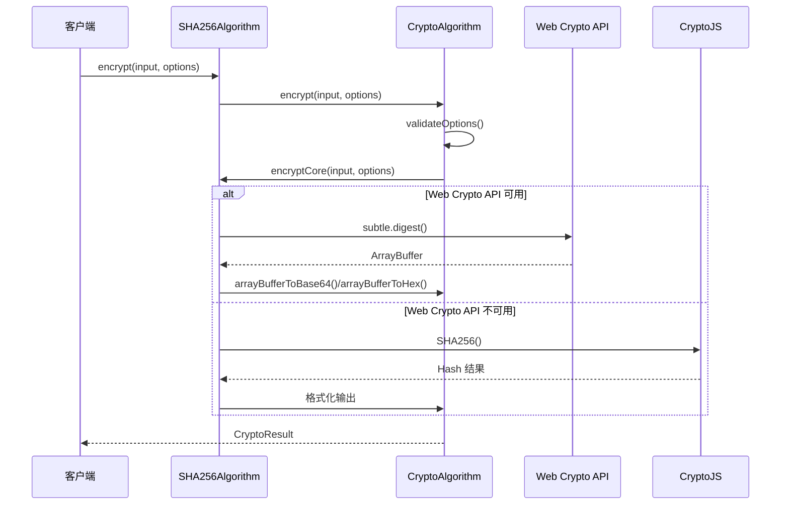

**图表来源**
- [SHA256.ts](file://src/algorithms/hash/SHA256.ts#L13-L39)
- [CryptoAlgorithm.ts](file://src/core/base/CryptoAlgorithm.ts#L23-L45)

#### 选项验证系统

AES算法展示了复杂的选项验证逻辑：

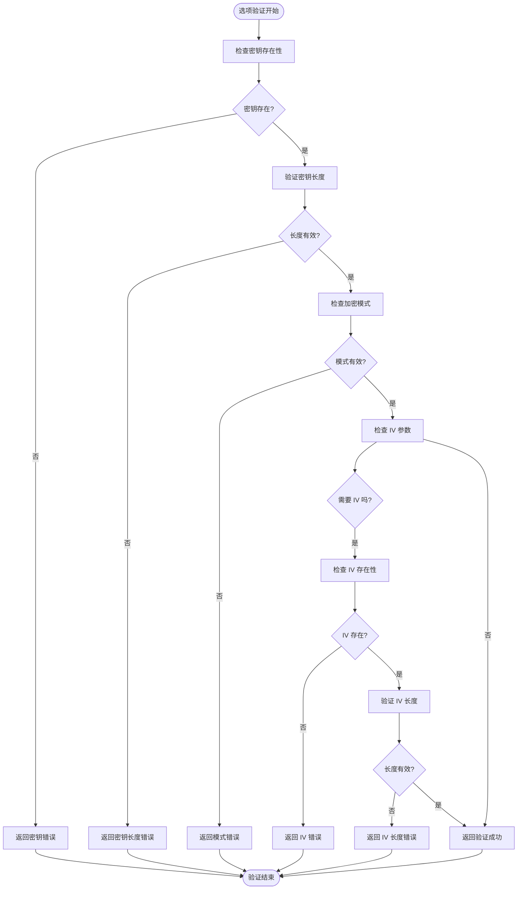

**图表来源**
- [AES.ts](file://src/algorithms/symmetric/AES.ts#L12-L28)

**章节来源**
- [SHA256.ts](file://src/algorithms/hash/SHA256.ts#L1-L45)
- [AES.ts](file://src/algorithms/symmetric/AES.ts#L1-L171)

### 非对称加密算法实现

RSA算法展示了非对称加密的复杂实现：

#### 密钥导入流程

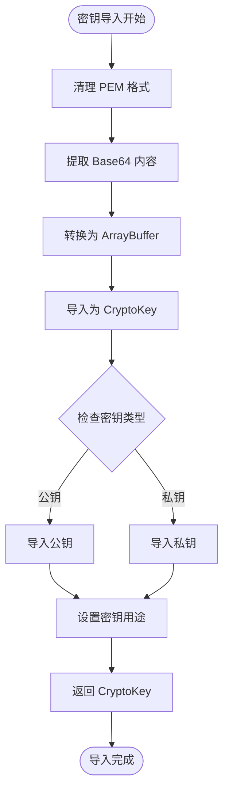

**图表来源**
- [RSA.ts](file://src/algorithms/asymmetric/RSA.ts#L59-L99)

**章节来源**
- [RSA.ts](file://src/algorithms/asymmetric/RSA.ts#L1-L166)

### HMAC 算法实现

HMAC_SHA256算法展示了消息认证码的实现模式：

#### HMAC 实现流程

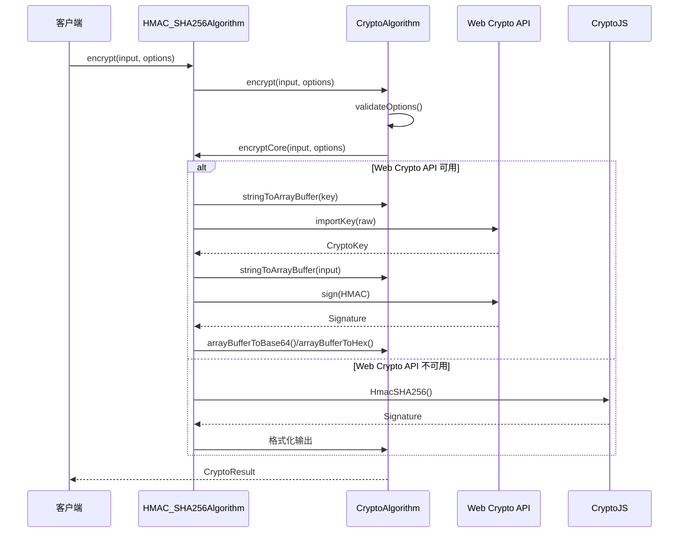

**图表来源**
- [HMAC_SHA256.ts](file://src/algorithms/hmac/HMAC_SHA256.ts#L20-L57)

**章节来源**
- [HMAC_SHA256.ts](file://src/algorithms/hmac/HMAC_SHA256.ts#L1-L63)

## 依赖关系分析

系统采用松耦合的设计，通过接口和抽象类实现模块间的解耦：

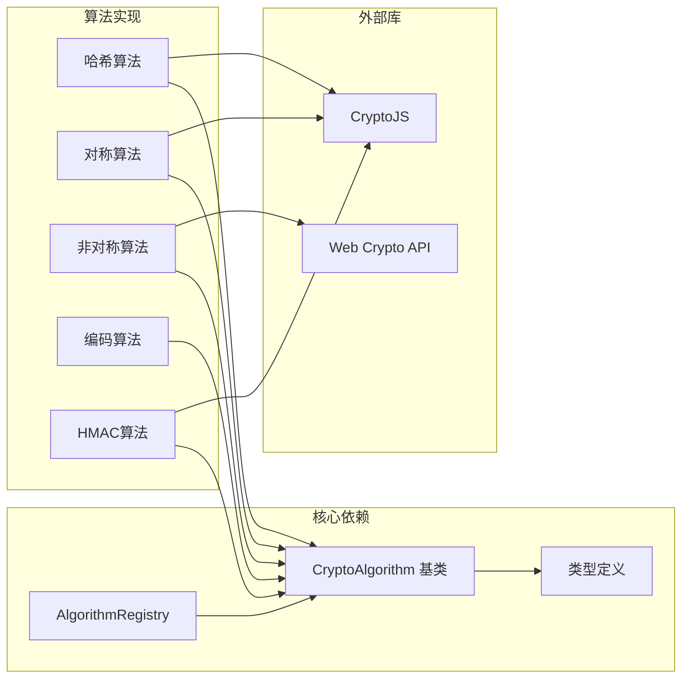

**图表来源**
- [CryptoAlgorithm.ts](file://src/core/base/CryptoAlgorithm.ts#L1-L8)
- [AlgorithmRegistry.ts](file://src/core/registry/AlgorithmRegistry.ts#L1)

### 算法生命周期管理

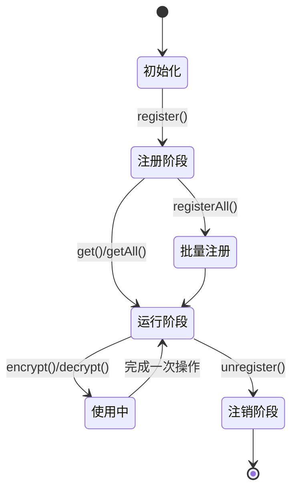

**图表来源**
- [AlgorithmRegistry.ts](file://src/core/registry/AlgorithmRegistry.ts#L26-L38)

**章节来源**
- [AlgorithmRegistry.ts](file://src/core/registry/AlgorithmRegistry.ts#L1-L114)

## 性能考虑

### Web Crypto API 优先策略

系统实现了智能的性能优化策略：

1. **优先使用 Web Crypto API**：在可用时优先使用浏览器原生加密功能
2. **降级机制**：当 Web Crypto API 不可用时自动降级到 CryptoJS
3. **缓存策略**：对常用的算法实例进行缓存

### 内存管理

- **ArrayBuffer 管理**：合理使用 ArrayBuffer 避免内存泄漏
- **字符串转换**：提供高效的字符串与二进制数据转换方法
- **异步处理**：所有加密操作都是异步的，避免阻塞主线程

### 并发控制

- **单例注册表**：确保算法实例的唯一性
- **线程安全**：算法操作都是纯函数式的，避免状态共享问题

## 故障排除指南

### 常见错误类型

1. **输入验证错误**：检查输入参数的有效性
2. **选项配置错误**：验证算法特定的配置要求
3. **功能支持错误**：确认算法是否支持所需的加密/解密操作
4. **外部依赖错误**：处理 Web Crypto API 或 CryptoJS 的兼容性问题

### 调试技巧

- **启用详细日志**：在开发环境中启用详细的错误信息
- **单元测试**：为每个算法实现单元测试
- **边界测试**：测试各种边界情况和异常输入

**章节来源**
- [CryptoAlgorithm.ts](file://src/core/base/CryptoAlgorithm.ts#L23-L75)

## 结论

该加密算法架构设计具有以下优势：

1. **高度可扩展**：通过抽象基类和接口设计，支持新算法的轻松添加
2. **强类型安全**：完整的 TypeScript 类型系统确保编译时的类型安全
3. **灵活的配置**：可配置的选项系统支持不同算法的特殊需求
4. **良好的性能**：智能的降级机制和优化策略确保最佳性能
5. **易于维护**：清晰的分层架构和模块化设计便于长期维护

该架构为开发者提供了一个强大而灵活的加密算法平台，既满足了现代Web应用的安全需求，又保持了良好的可扩展性和可维护性。

## 附录

### 算法扩展指南

#### 新增算法步骤

1. **创建算法类**：继承 CryptoAlgorithm 基类
2. **实现必需方法**：实现 encryptCore 和 decryptCore 方法
3. **配置选项**：实现 getOptionsSchema 方法
4. **注册算法**：在 algorithms/index.ts 中注册新算法
5. **编写测试**：为新算法编写单元测试

#### 最佳实践

- **错误处理**：始终在 encryptCore 和 decryptCore 中妥善处理异常
- **选项验证**：在 validateOptions 中验证所有必需参数
- **性能优化**：优先使用 Web Crypto API，必要时提供降级方案
- **文档编写**：为新算法编写详细的使用说明和参数文档

### 性能优化建议

1. **算法选择**：根据应用场景选择合适的算法类型
2. **参数优化**：合理配置算法参数以平衡安全性和性能
3. **缓存策略**：对频繁使用的算法实例进行缓存
4. **异步处理**：充分利用异步特性避免阻塞UI线程