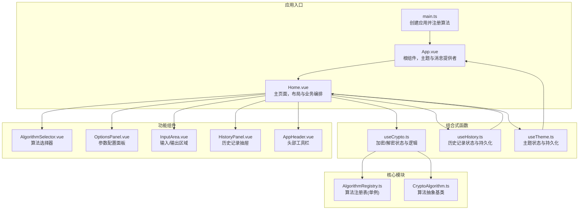
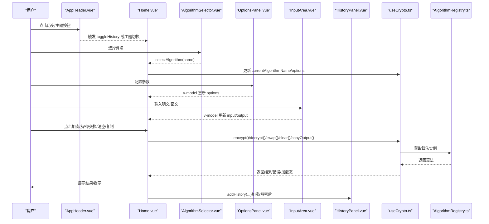
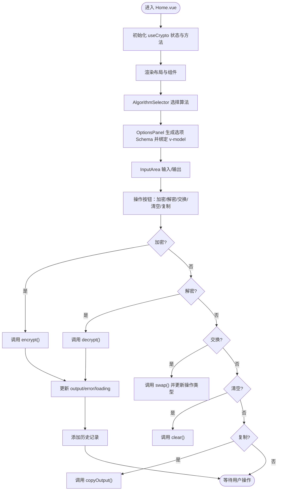
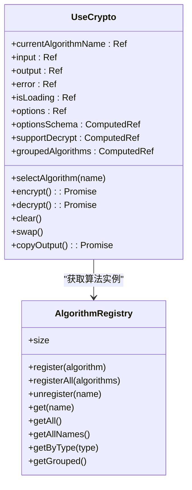
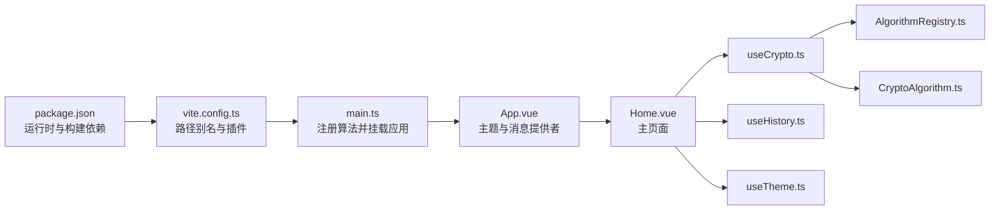

# 组件架构设计

<cite>
**本文引用的文件**
- [src/App.vue](file://src/App.vue)
- [src/views/Home.vue](file://src/views/Home.vue)
- [src/main.ts](file://src/main.ts)
- [src/composables/useCrypto.ts](file://src/composables/useCrypto.ts)
- [src/composables/useHistory.ts](file://src/composables/useHistory.ts)
- [src/composables/useTheme.ts](file://src/composables/useTheme.ts)
- [src/components/crypto/AlgorithmSelector.vue](file://src/components/crypto/AlgorithmSelector.vue)
- [src/components/crypto/InputArea.vue](file://src/components/crypto/InputArea.vue)
- [src/components/crypto/OptionsPanel.vue](file://src/components/crypto/OptionsPanel.vue)
- [src/components/history/HistoryPanel.vue](file://src/components/history/HistoryPanel.vue)
- [src/components/layout/AppHeader.vue](file://src/components/layout/AppHeader.vue)
- [src/core/registry/AlgorithmRegistry.ts](file://src/core/registry/AlgorithmRegistry.ts)
- [src/core/base/CryptoAlgorithm.ts](file://src/core/base/CryptoAlgorithm.ts)
- [package.json](file://package.json)
- [vite.config.ts](file://vite.config.ts)
</cite>

## 目录
1. [引言](#引言)
2. [项目结构](#项目结构)
3. [核心组件](#核心组件)
4. [架构总览](#架构总览)
5. [详细组件分析](#详细组件分析)
6. [依赖关系分析](#依赖关系分析)
7. [性能考虑](#性能考虑)
8. [故障排查指南](#故障排查指南)
9. [结论](#结论)
10. [附录](#附录)

## 引言
本文件面向开发者与架构师，系统化梳理基于 Vue 3 的组件化架构设计与实现模式。围绕根组件 App.vue 的布局设计、页面组件 Home.vue 的功能组织、功能组件的职责划分，深入解析组件间通信机制、数据流向与状态管理模式；总结组件复用策略、属性传递与事件处理最佳实践；并给出生命周期管理、性能优化与可维护性设计原则，帮助团队高效扩展与演进该加解密工具的前端架构。

## 项目结构
项目采用“视图层 + 组合式函数 + 功能组件 + 核心算法注册与基类”的分层组织方式：
- 视图层：App.vue 作为根组件，Home.vue 作为主页面，承载业务布局与交互。
- 组合式函数：useCrypto、useHistory、useTheme 提供跨组件的状态与行为封装。
- 功能组件：crypto 与 history 子模块内的组件负责具体 UI 与交互，如算法选择、输入输出、参数面板、历史面板等。
- 核心模块：AlgorithmRegistry 单例注册表统一管理算法；CryptoAlgorithm 抽象基类定义算法接口与通用能力。
- 构建与依赖：Vite 作为构建工具，Naive UI 提供 UI 基础，Pinia 作为状态管理（在本项目中通过组合式函数实现模块级共享状态）。

图表来源
- [src/main.ts](file://src/main.ts#L1-L10)
- [src/App.vue](file://src/App.vue#L1-L33)
- [src/views/Home.vue](file://src/views/Home.vue#L1-L220)
- [src/composables/useCrypto.ts](file://src/composables/useCrypto.ts#L1-L217)
- [src/composables/useHistory.ts](file://src/composables/useHistory.ts#L1-L153)
- [src/composables/useTheme.ts](file://src/composables/useTheme.ts#L1-L53)
- [src/components/crypto/AlgorithmSelector.vue](file://src/components/crypto/AlgorithmSelector.vue#L1-L63)
- [src/components/crypto/OptionsPanel.vue](file://src/components/crypto/OptionsPanel.vue#L1-L129)
- [src/components/crypto/InputArea.vue](file://src/components/crypto/InputArea.vue#L1-L70)
- [src/components/history/HistoryPanel.vue](file://src/components/history/HistoryPanel.vue#L1-L138)
- [src/components/layout/AppHeader.vue](file://src/components/layout/AppHeader.vue#L1-L78)
- [src/core/registry/AlgorithmRegistry.ts](file://src/core/registry/AlgorithmRegistry.ts#L1-L114)
- [src/core/base/CryptoAlgorithm.ts](file://src/core/base/CryptoAlgorithm.ts#L1-L165)

章节来源
- [src/main.ts](file://src/main.ts#L1-L10)
- [src/App.vue](file://src/App.vue#L1-L33)
- [src/views/Home.vue](file://src/views/Home.vue#L1-L220)
- [vite.config.ts](file://vite.config.ts#L1-L13)

## 核心组件
- 根组件 App.vue：集中注入主题与全局样式，包裹 Home 页面，提供 Naive UI 的主题与消息上下文。
- 页面组件 Home.vue：承担主布局与业务编排，协调算法选择、参数配置、输入输出、历史记录与操作按钮。
- 组合式函数：
  - useCrypto：模块级共享状态（算法、输入、输出、错误、加载态、选项），封装加密/解密、交换、清空、复制等核心逻辑，并与 useHistory 集成。
  - useHistory：历史记录的持久化（localStorage）、去重、截断与格式化。
  - useTheme：主题状态（深/浅）、系统跟随、持久化与 DOM 类名同步。
- 功能组件：AlgorithmSelector、OptionsPanel、InputArea、HistoryPanel、AppHeader 各司其职，通过 v-model 与事件进行双向通信。

章节来源
- [src/App.vue](file://src/App.vue#L1-L33)
- [src/views/Home.vue](file://src/views/Home.vue#L1-L220)
- [src/composables/useCrypto.ts](file://src/composables/useCrypto.ts#L1-L217)
- [src/composables/useHistory.ts](file://src/composables/useHistory.ts#L1-L153)
- [src/composables/useTheme.ts](file://src/composables/useTheme.ts#L1-L53)

## 架构总览
整体采用“组合式函数 + 功能组件 + 核心注册表”的架构：
- 数据流自上而下：App.vue 提供主题与消息上下文，Home.vue 通过 useCrypto 获取状态与方法，功能组件通过 props/v-model 与事件与 Home 交互。
- 状态管理：以组合式函数为核心，useCrypto/useHistory/useTheme 在模块内共享状态，避免 Pinia 的过度侵入，保持轻量与高内聚。
- 算法扩展：AlgorithmRegistry 单例注册表集中管理算法，CryptoAlgorithm 抽象基类统一接口，新增算法只需实现必要方法并通过注册表接入。

图表来源
- [src/components/layout/AppHeader.vue](file://src/components/layout/AppHeader.vue#L1-L78)
- [src/views/Home.vue](file://src/views/Home.vue#L1-L220)
- [src/components/crypto/AlgorithmSelector.vue](file://src/components/crypto/AlgorithmSelector.vue#L1-L63)
- [src/components/crypto/OptionsPanel.vue](file://src/components/crypto/OptionsPanel.vue#L1-L129)
- [src/components/crypto/InputArea.vue](file://src/components/crypto/InputArea.vue#L1-L70)
- [src/components/history/HistoryPanel.vue](file://src/components/history/HistoryPanel.vue#L1-L138)
- [src/composables/useCrypto.ts](file://src/composables/useCrypto.ts#L1-L217)
- [src/core/registry/AlgorithmRegistry.ts](file://src/core/registry/AlgorithmRegistry.ts#L1-L114)

## 详细组件分析

### 根组件 App.vue
- 设计理念：作为应用的“容器”，集中注入主题与全局样式，确保全局一致的主题与消息体验。
- 关键点：
  - 使用 Naive UI 的主题提供者与全局样式，保证组件树内主题一致性。
  - 通过组合式函数 useTheme 控制主题状态，影响 DOM 类名以适配全局样式。
  - 包裹 Home 页面，形成单一入口。

章节来源
- [src/App.vue](file://src/App.vue#L1-L33)
- [src/composables/useTheme.ts](file://src/composables/useTheme.ts#L1-L53)

### 页面组件 Home.vue
- 功能组织：
  - 顶部 Header：提供历史与主题切换入口。
  - 左侧：算法选择器与参数面板，支持按操作类型动态展示字段。
  - 右侧：输入区域、操作按钮（加密/解密/交换/清空）、错误提示、输出区域、复制按钮。
  - 底部/侧边：历史面板抽屉，支持恢复与删除。
- 数据流与控制：
  - 通过 useCrypto 获取算法、输入输出、错误、加载态、选项与方法。
  - 通过 watch 监听算法变化，自动重置操作类型。
  - 通过事件与 v-model 完成父子组件通信。

图表来源
- [src/views/Home.vue](file://src/views/Home.vue#L1-L220)
- [src/composables/useCrypto.ts](file://src/composables/useCrypto.ts#L1-L217)
- [src/composables/useHistory.ts](file://src/composables/useHistory.ts#L1-L153)

章节来源
- [src/views/Home.vue](file://src/views/Home.vue#L1-L220)

### 组合式函数 useCrypto
- 状态与计算属性：
  - currentAlgorithmName、input、output、error、isLoading、options、optionsSchema、supportDecrypt、groupedAlgorithms。
- 核心方法：
  - selectAlgorithm：切换算法并重置选项与输出。
  - encrypt/decrypt：执行算法并处理异常、更新输出与历史记录。
  - clear/swap/copyOutput：辅助操作。
- 与 AlgorithmRegistry 的协作：通过 registry.get 获取算法实例，调用算法的 encrypt/decrypt。
- 与 useHistory 的协作：每次成功操作后添加历史记录。

图表来源
- [src/composables/useCrypto.ts](file://src/composables/useCrypto.ts#L1-L217)
- [src/core/registry/AlgorithmRegistry.ts](file://src/core/registry/AlgorithmRegistry.ts#L1-L114)

章节来源
- [src/composables/useCrypto.ts](file://src/composables/useCrypto.ts#L1-L217)
- [src/core/registry/AlgorithmRegistry.ts](file://src/core/registry/AlgorithmRegistry.ts#L1-L114)

### 组合式函数 useHistory
- 功能：历史记录的增删改查、去重、截断、持久化与格式化。
- 关键点：
  - 本地存储键值与最大容量控制。
  - 自动去重：比较算法名、操作、输入、输出四要素。
  - 时间格式化与文本截断，提升用户体验。

章节来源
- [src/composables/useHistory.ts](file://src/composables/useHistory.ts#L1-L153)

### 组合式函数 useTheme
- 功能：主题状态、系统跟随、持久化与 DOM 类名同步。
- 关键点：
  - 通过 watch 监听主题变化，持久化到 localStorage 并更新 body 类名，便于全局样式生效。

章节来源
- [src/composables/useTheme.ts](file://src/composables/useTheme.ts#L1-L53)

### 功能组件

#### AlgorithmSelector.vue
- 职责：展示按类型分组的算法列表，支持搜索与描述展示，触发算法选择。
- 交互：通过 v-model 与事件与 Home 通信。

章节来源
- [src/components/crypto/AlgorithmSelector.vue](file://src/components/crypto/AlgorithmSelector.vue#L1-L63)

#### OptionsPanel.vue
- 职责：根据当前操作类型（加密/解密）动态渲染字段，支持条件禁用、默认值与密钥生成。
- 交互：v-model 更新 options，RSA 算法提供一键生成密钥对。

章节来源
- [src/components/crypto/OptionsPanel.vue](file://src/components/crypto/OptionsPanel.vue#L1-L129)

#### InputArea.vue
- 职责：输入/输出区域，支持字符统计、复制与清空。
- 交互：v-model 双向绑定，提供 clear 事件用于父组件响应。

章节来源
- [src/components/crypto/InputArea.vue](file://src/components/crypto/InputArea.vue#L1-L70)

#### HistoryPanel.vue
- 职责：右侧抽屉展示历史记录，支持恢复、删除与清空。
- 交互：通过事件向父组件传递 restore/update:show。

章节来源
- [src/components/history/HistoryPanel.vue](file://src/components/history/HistoryPanel.vue#L1-L138)

#### AppHeader.vue
- 职责：顶部导航栏，提供历史与主题切换入口。
- 交互：通过事件通知父组件切换历史面板。

章节来源
- [src/components/layout/AppHeader.vue](file://src/components/layout/AppHeader.vue#L1-L78)

### 核心模块

#### AlgorithmRegistry.ts
- 设计：单例注册表，集中管理算法注册、查询、分组与批量注册。
- 价值：为 useCrypto 提供统一的算法访问入口，便于扩展新算法。

章节来源
- [src/core/registry/AlgorithmRegistry.ts](file://src/core/registry/AlgorithmRegistry.ts#L1-L114)

#### CryptoAlgorithm.ts
- 设计：抽象基类，定义统一的 encrypt/decrypt 接口与通用工具方法（编码转换、Hex/Base64 等）。
- 价值：约束具体算法实现，统一错误处理与选项校验流程。

章节来源
- [src/core/base/CryptoAlgorithm.ts](file://src/core/base/CryptoAlgorithm.ts#L1-L165)

## 依赖关系分析
- 运行时依赖：Vue 3、Naive UI、crypto-js、Pinia、@vicons/ionicons5。
- 构建依赖：Vite、@vitejs/plugin-vue、TypeScript、vue-tsc。
- 项目内依赖：main.ts 注册所有算法；App.vue 提供主题与消息上下文；Home.vue 编排各组件；组合式函数提供跨组件共享状态；核心模块提供算法注册与抽象基类。

图表来源
- [package.json](file://package.json#L1-L27)
- [vite.config.ts](file://vite.config.ts#L1-L13)
- [src/main.ts](file://src/main.ts#L1-L10)
- [src/App.vue](file://src/App.vue#L1-L33)
- [src/views/Home.vue](file://src/views/Home.vue#L1-L220)
- [src/composables/useCrypto.ts](file://src/composables/useCrypto.ts#L1-L217)
- [src/composables/useHistory.ts](file://src/composables/useHistory.ts#L1-L153)
- [src/composables/useTheme.ts](file://src/composables/useTheme.ts#L1-L53)
- [src/core/registry/AlgorithmRegistry.ts](file://src/core/registry/AlgorithmRegistry.ts#L1-L114)
- [src/core/base/CryptoAlgorithm.ts](file://src/core/base/CryptoAlgorithm.ts#L1-L165)

章节来源
- [package.json](file://package.json#L1-L27)
- [vite.config.ts](file://vite.config.ts#L1-L13)
- [src/main.ts](file://src/main.ts#L1-L10)

## 性能考虑
- 状态粒度：useCrypto/useHistory/useTheme 采用模块级共享状态，避免不必要的响应式开销；仅在 Home.vue 中聚合使用，减少跨组件订阅链路。
- 渲染优化：组件内部使用 v-model 与事件，避免深层嵌套导致的重复渲染；HistoryPanel 使用抽屉形式，按需渲染。
- 算法调用：encrypt/decrypt 使用异步方法并在 finally 中关闭加载态，避免阻塞 UI。
- 本地存储：useHistory 对 localStorage 写入进行异常兜底与截断，避免存储溢出。
- 主题切换：useTheme 通过 DOM 类名切换，避免频繁重绘。

## 故障排查指南
- 算法未注册：若出现“请选择加密算法”或空算法实例，检查 main.ts 是否正确调用注册算法。
- 解密不可用：当算法不支持解密时会返回错误，确认算法的 supportDecrypt 标志。
- 复制失败：copyOutput 在异常时返回 false，检查浏览器剪贴板权限与 HTTPS 环境。
- 历史记录异常：localStorage 写入失败时会自动截断一半记录，检查存储配额与权限。
- 主题不同步：useTheme 依赖 watch 同步到 body 类名，确认 DOM 中存在对应类名。

章节来源
- [src/main.ts](file://src/main.ts#L1-L10)
- [src/composables/useCrypto.ts](file://src/composables/useCrypto.ts#L1-L217)
- [src/composables/useHistory.ts](file://src/composables/useHistory.ts#L1-L153)
- [src/composables/useTheme.ts](file://src/composables/useTheme.ts#L1-L53)

## 结论
该架构以 Vue 3 组合式函数为核心，结合功能组件与核心注册表，实现了清晰的职责分离与良好的可扩展性。通过模块级共享状态与事件驱动的组件通信，既保证了开发效率，也兼顾了性能与可维护性。建议在后续扩展中继续遵循“算法即插即用”的设计，完善算法基类的校验与格式化能力，并持续优化历史记录与主题切换的用户体验。

## 附录
- 开发与构建脚本：dev/build/preview/type-check。
- 路径别名：@ 指向 src，简化导入路径。

章节来源
- [package.json](file://package.json#L1-L27)
- [vite.config.ts](file://vite.config.ts#L1-L13)