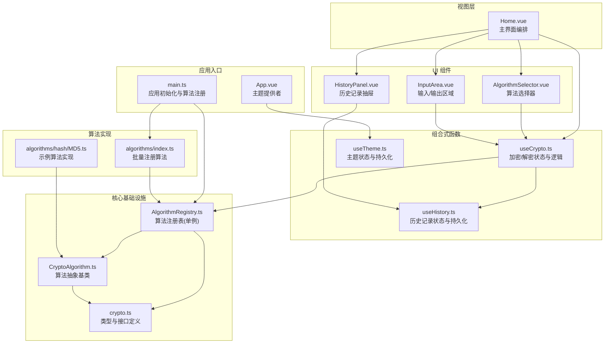
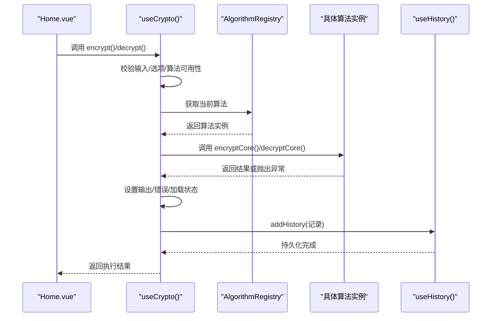
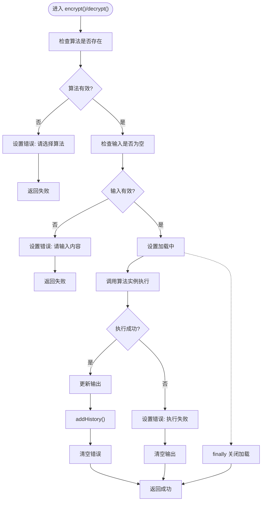
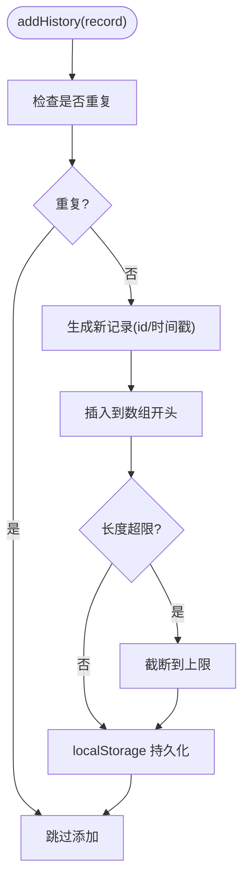
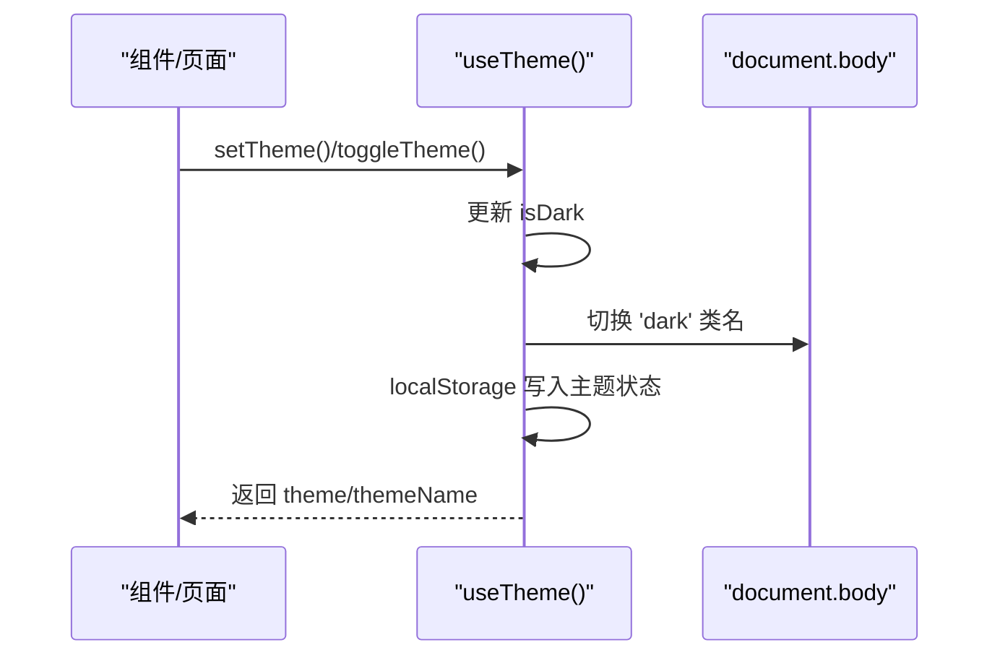
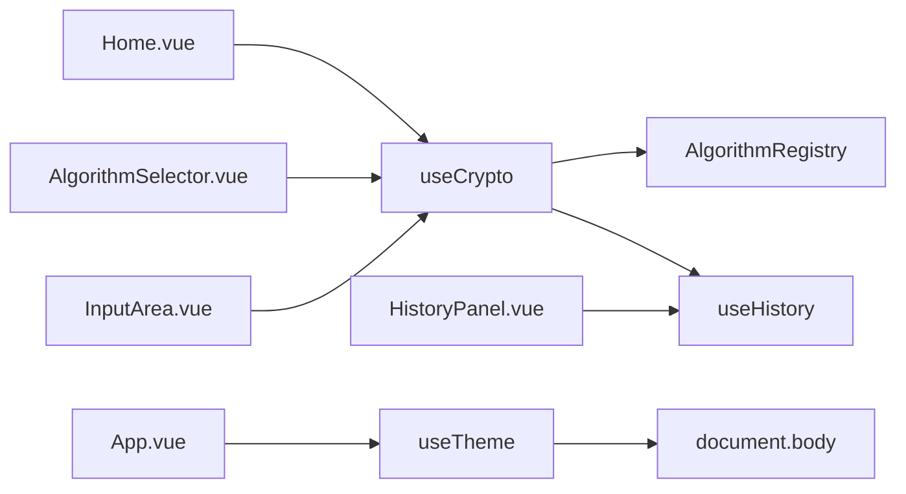
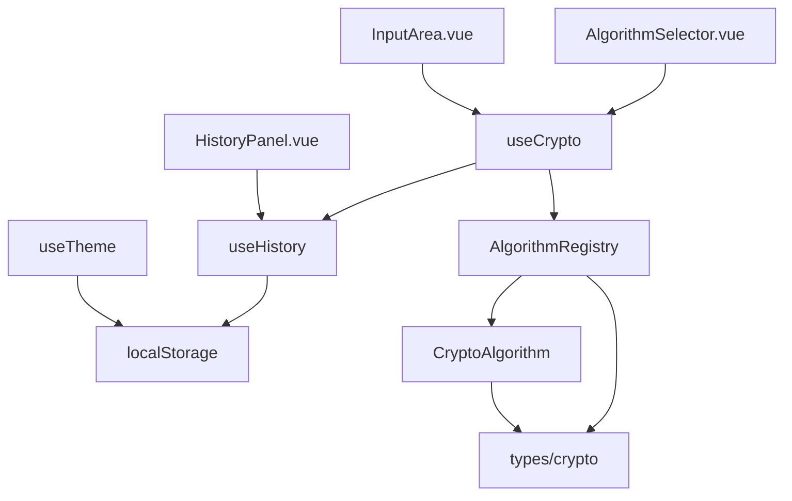

# 组合式函数架构

<cite>
**本文引用的文件**
- [src/composables/useCrypto.ts](file://src/composables/useCrypto.ts)
- [src/composables/useHistory.ts](file://src/composables/useHistory.ts)
- [src/composables/useTheme.ts](file://src/composables/useTheme.ts)
- [src/main.ts](file://src/main.ts)
- [src/App.vue](file://src/App.vue)
- [src/views/Home.vue](file://src/views/Home.vue)
- [src/components/crypto/InputArea.vue](file://src/components/crypto/InputArea.vue)
- [src/components/crypto/AlgorithmSelector.vue](file://src/components/crypto/AlgorithmSelector.vue)
- [src/components/history/HistoryPanel.vue](file://src/components/history/HistoryPanel.vue)
- [src/core/registry/AlgorithmRegistry.ts](file://src/core/registry/AlgorithmRegistry.ts)
- [src/core/types/crypto.ts](file://src/core/types/crypto.ts)
- [src/core/base/CryptoAlgorithm.ts](file://src/core/base/CryptoAlgorithm.ts)
- [src/algorithms/index.ts](file://src/algorithms/index.ts)
- [src/algorithms/hash/MD5.ts](file://src/algorithms/hash/MD5.ts)
- [package.json](file://package.json)
</cite>

## 目录
1. [引言](#引言)
2. [项目结构](#项目结构)
3. [核心组件](#核心组件)
4. [架构总览](#架构总览)
5. [详细组件分析](#详细组件分析)
6. [依赖关系分析](#依赖关系分析)
7. [性能考虑](#性能考虑)
8. [故障排除指南](#故障排除指南)
9. [结论](#结论)
10. [附录](#附录)

## 引言
本文件系统性梳理并解析该项目中基于 Vue 3 组合式函数的架构设计与实现要点，重点围绕 useCrypto、useHistory、useTheme 三大核心组合式函数展开，阐述其状态管理策略、业务逻辑封装、与组件的交互模式、响应式数据绑定与副作用管理，以及状态持久化、错误处理与性能优化方案。同时给出扩展机制、测试策略与最佳实践建议，帮助开发者高效地进行组合式函数开发与架构演进。

## 项目结构
项目采用“功能域+组合式函数”的组织方式，核心位于 src/composables，配合 src/core 提供算法注册、类型定义与基础抽象；组件层通过组合式函数暴露状态与方法，形成清晰的职责边界与可复用能力。

图表来源
- [src/main.ts](file://src/main.ts#L1-L10)
- [src/App.vue](file://src/App.vue#L1-L33)
- [src/views/Home.vue](file://src/views/Home.vue#L1-L220)
- [src/composables/useCrypto.ts](file://src/composables/useCrypto.ts#L1-L217)
- [src/composables/useHistory.ts](file://src/composables/useHistory.ts#L1-L153)
- [src/composables/useTheme.ts](file://src/composables/useTheme.ts#L1-L53)
- [src/core/registry/AlgorithmRegistry.ts](file://src/core/registry/AlgorithmRegistry.ts#L1-L114)
- [src/core/types/crypto.ts](file://src/core/types/crypto.ts#L1-L104)
- [src/core/base/CryptoAlgorithm.ts](file://src/core/base/CryptoAlgorithm.ts#L1-L165)
- [src/algorithms/index.ts](file://src/algorithms/index.ts#L1-L59)
- [src/algorithms/hash/MD5.ts](file://src/algorithms/hash/MD5.ts#L1-L28)
- [src/components/crypto/InputArea.vue](file://src/components/crypto/InputArea.vue#L1-L70)
- [src/components/crypto/AlgorithmSelector.vue](file://src/components/crypto/AlgorithmSelector.vue#L1-L63)
- [src/components/history/HistoryPanel.vue](file://src/components/history/HistoryPanel.vue#L1-L138)

章节来源
- [src/main.ts](file://src/main.ts#L1-L10)
- [src/App.vue](file://src/App.vue#L1-L33)
- [src/views/Home.vue](file://src/views/Home.vue#L1-L220)

## 核心组件
本节聚焦三大组合式函数：useCrypto、useHistory、useTheme 的职责划分、状态模型与交互契约。

- useCrypto：负责算法选择、输入输出、加解密执行、错误与加载状态管理，并与 useHistory 协作记录历史。
- useHistory：负责历史记录的内存状态、去重、截断、本地持久化与时间格式化等工具方法。
- useTheme：负责深浅色主题状态、主题切换与系统偏好同步，同时持久化到本地存储并在 DOM 上应用类名以驱动全局样式。

章节来源
- [src/composables/useCrypto.ts](file://src/composables/useCrypto.ts#L1-L217)
- [src/composables/useHistory.ts](file://src/composables/useHistory.ts#L1-L153)
- [src/composables/useTheme.ts](file://src/composables/useTheme.ts#L1-L53)

## 架构总览
该架构遵循“组合式函数 + 单例注册表 + 抽象基类 + 组件解耦”的设计原则：

- 单例注册表：AlgorithmRegistry 作为全局算法仓库，集中管理算法注册、查询与分组，避免组件直接依赖具体算法实现。
- 抽象基类：CryptoAlgorithm 规范算法的输入校验、选项校验、核心加解密流程与常用工具方法，降低具体算法实现复杂度。
- 组合式函数：以函数形式封装状态与行为，向组件暴露响应式状态与方法，便于复用与测试。
- 组件层：通过 v-model、事件与具名插槽与组合式函数协作，实现声明式的交互与状态绑定。

图表来源
- [src/views/Home.vue](file://src/views/Home.vue#L1-L220)
- [src/composables/useCrypto.ts](file://src/composables/useCrypto.ts#L74-L216)
- [src/core/registry/AlgorithmRegistry.ts](file://src/core/registry/AlgorithmRegistry.ts#L1-L114)
- [src/core/base/CryptoAlgorithm.ts](file://src/core/base/CryptoAlgorithm.ts#L1-L165)
- [src/composables/useHistory.ts](file://src/composables/useHistory.ts#L36-L152)

## 详细组件分析

### useCrypto 组合式函数
- 状态模型
  - 模块级共享状态：当前算法名、输入、输出、错误、加载状态、算法选项。
  - 计算属性：当前算法实例、选项 Schema、是否支持解密、按类型分组的算法列表。
- 核心方法
  - 选择算法：更新算法名并重置/填充默认选项，清空输出与错误。
  - 加密/解密：前置校验、设置加载状态、调用算法实例执行、捕获异常、更新输出与错误、添加历史记录、最终统一收尾。
  - 辅助方法：清空、交换输入输出、复制输出到剪贴板。
- 与 useHistory 的协作：每次成功执行后调用 addHistory 写入历史记录，确保历史与 UI 行为一致。
- 与 AlgorithmRegistry 的协作：通过 registry.get 获取当前算法实例，利用算法实例的 getOptionsSchema 动态渲染选项面板。

图表来源
- [src/composables/useCrypto.ts](file://src/composables/useCrypto.ts#L74-L216)

章节来源
- [src/composables/useCrypto.ts](file://src/composables/useCrypto.ts#L1-L217)
- [src/core/registry/AlgorithmRegistry.ts](file://src/core/registry/AlgorithmRegistry.ts#L1-L114)
- [src/core/types/crypto.ts](file://src/core/types/crypto.ts#L1-L104)

### useHistory 组合式函数
- 状态模型
  - 基于 ref 的内存数组，启动时从 localStorage 恢复历史记录。
- 核心能力
  - 去重添加：比较算法名、操作、输入、输出，避免重复记录。
  - 截断控制：超过上限时保留一半并回退到安全容量，保证性能与稳定性。
  - 持久化：统一保存到 localStorage，异常时自动降级修剪。
  - 查询与删除：按 id 查找、删除、清空。
  - 时间格式化与文本截断：人性化展示历史项。
- 与 useCrypto 的协作：在加密/解密成功后由 useCrypto 调用 addHistory，确保 UI 与持久化一致。

图表来源
- [src/composables/useHistory.ts](file://src/composables/useHistory.ts#L36-L152)

章节来源
- [src/composables/useHistory.ts](file://src/composables/useHistory.ts#L1-L153)

### useTheme 组合式函数
- 状态模型
  - 基于 ref 的 isDark，启动时从 localStorage 或系统偏好恢复。
- 核心能力
  - 主题计算：根据 isDark 返回 naive-ui 的 darkTheme 或空主题。
  - 主题切换：toggle/set 切换深浅色。
  - 副作用：监听 isDark 变化，持久化到 localStorage 并在 document.body 上切换类名，驱动全局样式。
- 与 App.vue 的协作：App.vue 使用 NConfigProvider 包裹，注入 theme 实现主题切换。

图表来源
- [src/composables/useTheme.ts](file://src/composables/useTheme.ts#L1-L53)
- [src/App.vue](file://src/App.vue#L1-L33)

章节来源
- [src/composables/useTheme.ts](file://src/composables/useTheme.ts#L1-L53)
- [src/App.vue](file://src/App.vue#L1-L33)

### 组件与组合式函数的交互模式
- Home.vue 作为主控制器，解构 useCrypto 的状态与方法，绑定到模板与按钮事件，实现加密/解密/交换/清空/复制等交互。
- AlgorithmSelector.vue 通过 useCrypto 的 groupedAlgorithms 与 selectAlgorithm 动态渲染算法分组与选择。
- InputArea.vue 通过 v-model 与双向绑定，承载输入/输出区域，支持复制与清空。
- HistoryPanel.vue 通过 useHistory 的历史记录与工具方法，提供抽屉式历史浏览、恢复与删除。

图表来源
- [src/views/Home.vue](file://src/views/Home.vue#L1-L220)
- [src/components/crypto/AlgorithmSelector.vue](file://src/components/crypto/AlgorithmSelector.vue#L1-L63)
- [src/components/crypto/InputArea.vue](file://src/components/crypto/InputArea.vue#L1-L70)
- [src/components/history/HistoryPanel.vue](file://src/components/history/HistoryPanel.vue#L1-L138)
- [src/composables/useCrypto.ts](file://src/composables/useCrypto.ts#L1-L217)
- [src/composables/useHistory.ts](file://src/composables/useHistory.ts#L1-L153)
- [src/composables/useTheme.ts](file://src/composables/useTheme.ts#L1-L53)
- [src/App.vue](file://src/App.vue#L1-L33)

章节来源
- [src/views/Home.vue](file://src/views/Home.vue#L1-L220)
- [src/components/crypto/AlgorithmSelector.vue](file://src/components/crypto/AlgorithmSelector.vue#L1-L63)
- [src/components/crypto/InputArea.vue](file://src/components/crypto/InputArea.vue#L1-L70)
- [src/components/history/HistoryPanel.vue](file://src/components/history/HistoryPanel.vue#L1-L138)

### 状态持久化与错误处理
- 状态持久化
  - useCrypto：通过 useHistory 将历史记录持久化到 localStorage，并在超出上限时自动修剪。
  - useTheme：将主题偏好持久化到 localStorage，并在 DOM 上设置类名以驱动全局样式。
- 错误处理
  - useCrypto：在 encrypt/decrypt 中捕获异常，设置错误信息并清空输出，最终统一关闭加载状态。
  - useHistory：在保存失败时自动降级修剪，避免损坏历史记录。
  - CryptoAlgorithm：在 encrypt/decrypt 中进行输入与选项校验，统一返回标准化结果对象。

章节来源
- [src/composables/useCrypto.ts](file://src/composables/useCrypto.ts#L74-L216)
- [src/composables/useHistory.ts](file://src/composables/useHistory.ts#L18-L26)
- [src/composables/useTheme.ts](file://src/composables/useTheme.ts#L39-L43)
- [src/core/base/CryptoAlgorithm.ts](file://src/core/base/CryptoAlgorithm.ts#L23-L75)

### 性能优化与扩展机制
- 性能优化
  - 计算属性缓存：useCrypto 中的 groupedAlgorithms、optionsSchema、supportDecrypt 等均通过 computed 缓存，减少重复计算。
  - 历史记录截断：useHistory 在容量超限时主动修剪，避免内存与存储压力。
  - 选项 Schema 驱动 UI：通过算法实例的 getOptionsSchema 动态渲染选项面板，避免硬编码，提升可维护性。
- 扩展机制
  - 算法注册：通过 AlgorithmRegistry 单例注册新算法，无需修改组合式函数与组件。
  - 抽象基类：新增算法只需继承 CryptoAlgorithm，实现核心加解密方法与可选的选项校验与 Schema。
  - 组合式函数：新增业务逻辑时，优先通过组合式函数封装，保持组件层简洁。

章节来源
- [src/composables/useCrypto.ts](file://src/composables/useCrypto.ts#L29-L54)
- [src/composables/useHistory.ts](file://src/composables/useHistory.ts#L66-L69)
- [src/core/registry/AlgorithmRegistry.ts](file://src/core/registry/AlgorithmRegistry.ts#L26-L38)
- [src/core/base/CryptoAlgorithm.ts](file://src/core/base/CryptoAlgorithm.ts#L77-L104)

## 依赖关系分析
- 组合式函数之间的依赖
  - useCrypto 依赖 useHistory 与 AlgorithmRegistry。
  - useHistory 与 useTheme 独立运作，分别依赖 localStorage 与系统偏好。
- 组件与组合式函数的依赖
  - Home.vue 依赖 useCrypto；AlgorithmSelector.vue 与 InputArea.vue 依赖 useCrypto；HistoryPanel.vue 依赖 useHistory。
- 核心基础设施
  - AlgorithmRegistry 依赖 ICryptoAlgorithm 接口与 AlgorithmType 枚举；CryptoAlgorithm 提供统一的加解密流程与工具方法。

图表来源
- [src/composables/useCrypto.ts](file://src/composables/useCrypto.ts#L1-L217)
- [src/composables/useHistory.ts](file://src/composables/useHistory.ts#L1-L153)
- [src/composables/useTheme.ts](file://src/composables/useTheme.ts#L1-L53)
- [src/core/registry/AlgorithmRegistry.ts](file://src/core/registry/AlgorithmRegistry.ts#L1-L114)
- [src/core/types/crypto.ts](file://src/core/types/crypto.ts#L1-L104)
- [src/core/base/CryptoAlgorithm.ts](file://src/core/base/CryptoAlgorithm.ts#L1-L165)

章节来源
- [src/composables/useCrypto.ts](file://src/composables/useCrypto.ts#L1-L217)
- [src/composables/useHistory.ts](file://src/composables/useHistory.ts#L1-L153)
- [src/composables/useTheme.ts](file://src/composables/useTheme.ts#L1-L53)
- [src/core/registry/AlgorithmRegistry.ts](file://src/core/registry/AlgorithmRegistry.ts#L1-L114)
- [src/core/types/crypto.ts](file://src/core/types/crypto.ts#L1-L104)
- [src/core/base/CryptoAlgorithm.ts](file://src/core/base/CryptoAlgorithm.ts#L1-L165)

## 性能考虑
- 响应式粒度：将状态拆分为细粒度的 ref/computed，避免不必要的重渲染。
- 计算属性缓存：对昂贵的派生数据（如分组算法列表）使用 computed 缓存。
- 本地存储降级：在存储异常时自动修剪，保障用户体验与数据完整性。
- 算法实现：通过 CryptoAlgorithm 的工具方法统一格式化与编码，减少重复逻辑与潜在错误。

## 故障排除指南
- 加密/解密失败
  - 检查算法是否正确注册与选择。
  - 查看错误状态是否被设置，确认输入与选项是否满足算法要求。
- 历史记录异常
  - 检查 localStorage 是否可用，必要时手动清理键值。
  - 观察是否出现重复记录，确认去重逻辑是否生效。
- 主题切换无效
  - 检查 useTheme 的副作用是否触发，确认 document.body 类名是否正确切换。
  - 确认 App.vue 的 NConfigProvider 是否正确注入 theme。

章节来源
- [src/composables/useCrypto.ts](file://src/composables/useCrypto.ts#L74-L216)
- [src/composables/useHistory.ts](file://src/composables/useHistory.ts#L18-L26)
- [src/composables/useTheme.ts](file://src/composables/useTheme.ts#L39-L43)
- [src/App.vue](file://src/App.vue#L10-L15)

## 结论
该组合式函数架构以模块级共享状态与计算属性为核心，结合单例注册表与抽象基类，实现了算法能力的高内聚低耦合、组件层的声明式交互与良好的可扩展性。通过本地存储与副作用管理，系统在易用性与性能之间取得平衡。建议在后续演进中持续完善测试覆盖、引入更细粒度的错误边界与日志上报，并探索将部分状态迁移至 Pinia 以增强跨组件共享与调试能力。

## 附录
- 测试策略建议
  - useCrypto：模拟 AlgorithmRegistry 返回不同算法实例，覆盖加密/解密成功/失败路径、选项校验、历史记录添加。
  - useHistory：构造多条历史记录，验证去重、截断、持久化与时间格式化。
  - useTheme：切换主题、系统偏好变化、DOM 类名变更与 localStorage 同步。
- 最佳实践
  - 将 UI 交互与业务逻辑分离，优先通过组合式函数封装。
  - 使用 TypeScript 严格类型约束，确保接口一致性。
  - 对外暴露只读计算属性与受控方法，避免直接修改内部状态。
  - 在组件层使用 v-model 与事件进行解耦交互，保持单一职责。