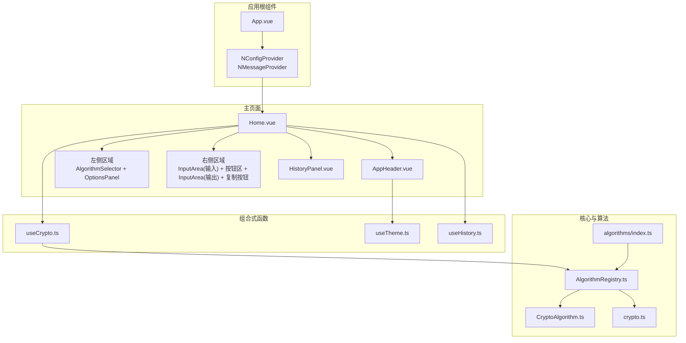
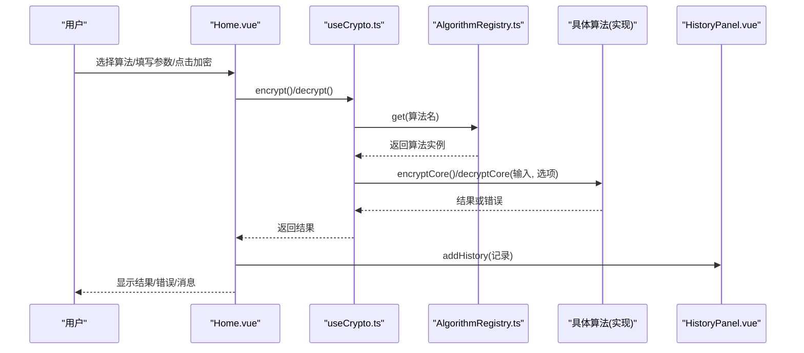
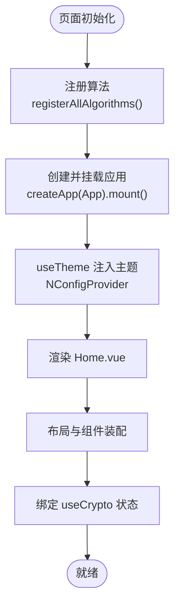
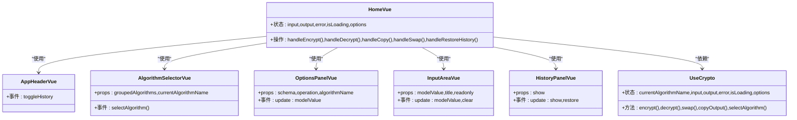
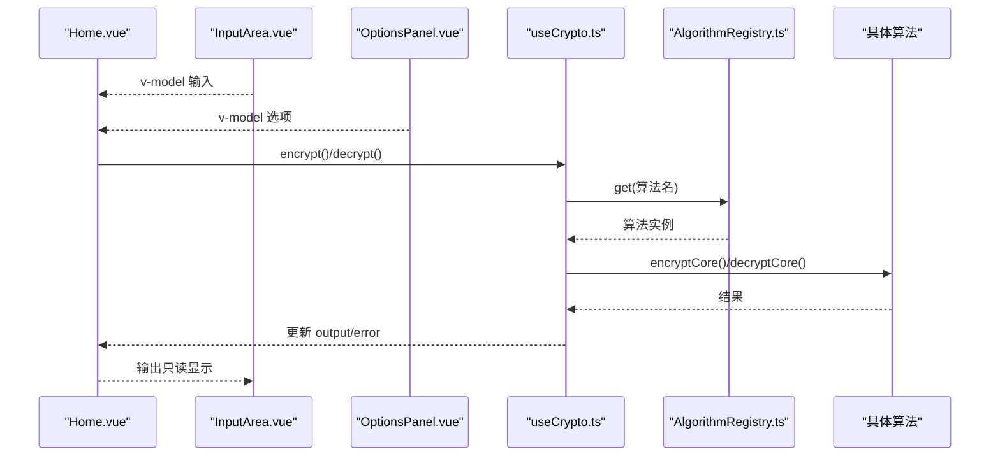
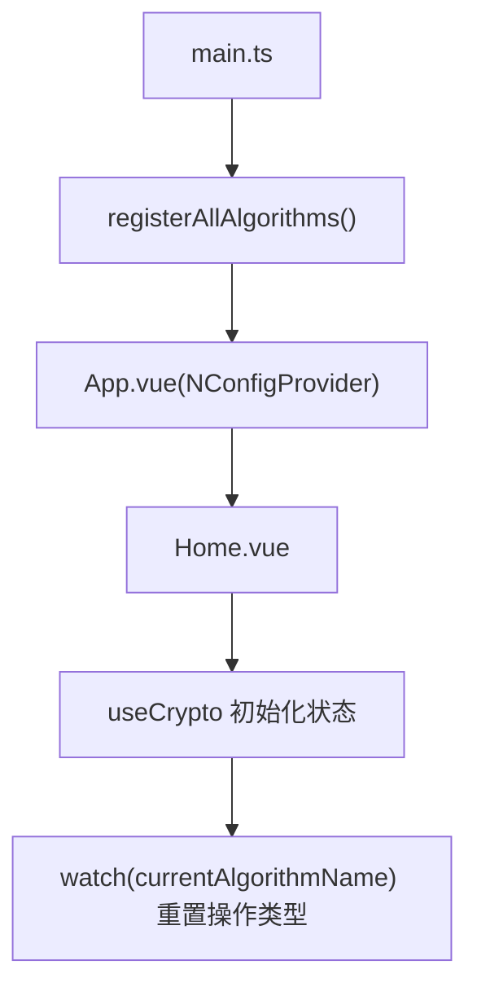
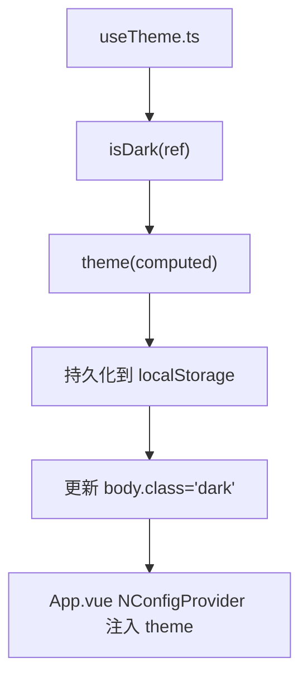
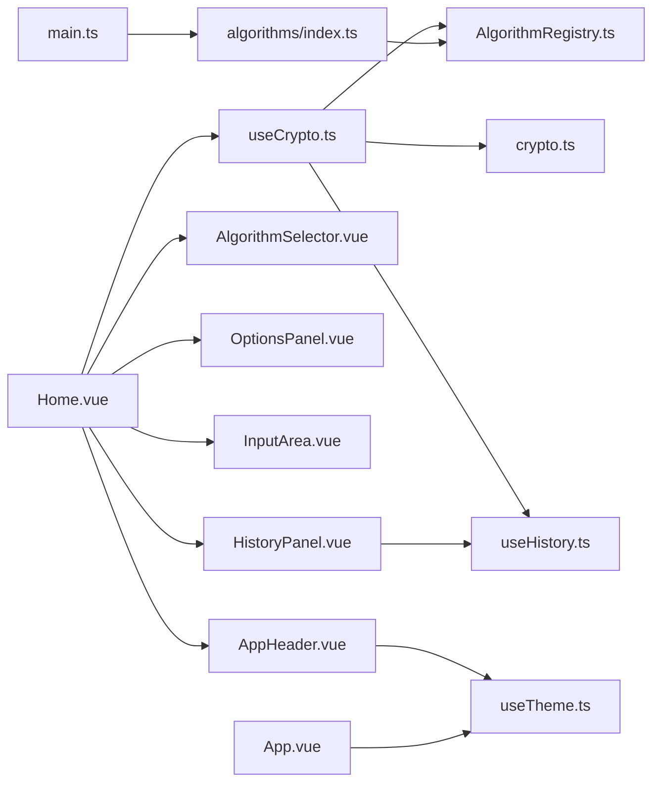

# 主页面视图

<cite>
**本文引用的文件**
- [Home.vue](file://src/views/Home.vue)
- [App.vue](file://src/App.vue)
- [main.ts](file://src/main.ts)
- [useTheme.ts](file://src/composables/useTheme.ts)
- [useCrypto.ts](file://src/composables/useCrypto.ts)
- [useHistory.ts](file://src/composables/useHistory.ts)
- [AppHeader.vue](file://src/components/layout/AppHeader.vue)
- [AlgorithmSelector.vue](file://src/components/crypto/AlgorithmSelector.vue)
- [InputArea.vue](file://src/components/crypto/InputArea.vue)
- [OptionsPanel.vue](file://src/components/crypto/OptionsPanel.vue)
- [HistoryPanel.vue](file://src/components/history/HistoryPanel.vue)
- [AlgorithmRegistry.ts](file://src/core/registry/AlgorithmRegistry.ts)
- [CryptoAlgorithm.ts](file://src/core/base/CryptoAlgorithm.ts)
- [crypto.ts](file://src/core/types/crypto.ts)
- [index.ts](file://src/algorithms/index.ts)
</cite>

## 目录
1. [简介](#简介)
2. [项目结构](#项目结构)
3. [核心组件](#核心组件)
4. [架构总览](#架构总览)
5. [详细组件分析](#详细组件分析)
6. [依赖关系分析](#依赖关系分析)
7. [性能考虑](#性能考虑)
8. [故障排除指南](#故障排除指南)
9. [结论](#结论)
10. [附录](#附录)

## 简介
本文件围绕 Home.vue 主页面视图组件进行深入解析，阐述其作为应用入口页面的设计架构与功能实现。文档涵盖页面整体布局结构、组件组织方式、数据流向、页面初始化流程、状态管理、用户交互处理、页面配置选项、主题切换机制以及响应式设计说明，并提供面向开发者的定制与扩展指南。

## 项目结构
Home.vue 位于 views 层，作为顶层视图承载应用主界面；其通过组合式函数 useCrypto 统一管理算法选择、输入输出、错误与加载状态；通过 useTheme 在 App.vue 中注入 Naive UI 主题；通过 useHistory 提供历史记录能力；右侧区域由 AlgorithmSelector、OptionsPanel、InputArea 等组件构成；顶部 AppHeader 提供头部导航与主题切换；右侧 HistoryPanel 以抽屉形式展示历史记录。

图表来源
- [App.vue](file://src/App.vue#L1-L16)
- [Home.vue](file://src/views/Home.vue#L1-L220)
- [useTheme.ts](file://src/composables/useTheme.ts#L1-L53)
- [useCrypto.ts](file://src/composables/useCrypto.ts#L1-L217)
- [useHistory.ts](file://src/composables/useHistory.ts#L1-L153)
- [AlgorithmRegistry.ts](file://src/core/registry/AlgorithmRegistry.ts#L1-L114)
- [CryptoAlgorithm.ts](file://src/core/base/CryptoAlgorithm.ts#L1-L165)
- [crypto.ts](file://src/core/types/crypto.ts#L1-L104)
- [index.ts](file://src/algorithms/index.ts#L1-L59)

章节来源
- [Home.vue](file://src/views/Home.vue#L1-L220)
- [App.vue](file://src/App.vue#L1-L33)
- [main.ts](file://src/main.ts#L1-L10)

## 核心组件
- Home.vue：主页面容器，负责布局、状态绑定、事件处理与消息提示；协调左侧算法选择与参数配置、右侧输入输出与操作按钮、顶部头部与右侧历史面板抽屉。
- AppHeader.vue：顶部导航，提供历史记录徽标与主题切换按钮，触发父组件 Home 的历史面板开关。
- AlgorithmSelector.vue：算法选择器，基于 useCrypto 的分组算法列表，支持过滤与描述展示。
- OptionsPanel.vue：参数配置面板，依据当前算法与操作（加密/解密）动态渲染选项字段，支持禁用条件、默认值与密钥对生成。
- InputArea.vue：输入输出卡片组件，支持字符计数、复制与清空，支持只读模式。
- HistoryPanel.vue：右侧抽屉式历史面板，支持查看、恢复、删除与清空历史记录。
- useCrypto.ts：核心状态与业务逻辑，统一管理算法、输入输出、错误、加载、选项与历史记录集成。
- useTheme.ts：主题状态与持久化，Naive UI 主题注入与系统跟随。
- useHistory.ts：历史记录状态与本地存储持久化，含去重、截断与时间格式化。
- AlgorithmRegistry.ts：算法注册表单例，提供算法注册、查询、分组与类型筛选。
- CryptoAlgorithm.ts：算法抽象基类，定义统一的加密/解密接口与辅助方法。
- crypto.ts：算法类型、选项、结果与历史记录等核心类型定义。
- algorithms/index.ts：集中注册所有内置算法。

章节来源
- [Home.vue](file://src/views/Home.vue#L1-L220)
- [AppHeader.vue](file://src/components/layout/AppHeader.vue#L1-L78)
- [AlgorithmSelector.vue](file://src/components/crypto/AlgorithmSelector.vue#L1-L63)
- [OptionsPanel.vue](file://src/components/crypto/OptionsPanel.vue#L1-L129)
- [InputArea.vue](file://src/components/crypto/InputArea.vue#L1-L70)
- [HistoryPanel.vue](file://src/components/history/HistoryPanel.vue#L1-L138)
- [useCrypto.ts](file://src/composables/useCrypto.ts#L1-L217)
- [useTheme.ts](file://src/composables/useTheme.ts#L1-L53)
- [useHistory.ts](file://src/composables/useHistory.ts#L1-L153)
- [AlgorithmRegistry.ts](file://src/core/registry/AlgorithmRegistry.ts#L1-L114)
- [CryptoAlgorithm.ts](file://src/core/base/CryptoAlgorithm.ts#L1-L165)
- [crypto.ts](file://src/core/types/crypto.ts#L1-L104)
- [index.ts](file://src/algorithms/index.ts#L1-L59)

## 架构总览
Home.vue 采用“视图层 + 组合式函数 + 核心模块”的分层架构：
- 视图层：Home.vue 作为主容器，组织布局与交互；各子组件承担职责边界清晰。
- 组合式函数：useCrypto 统一暴露状态与方法；useTheme 与 useHistory 提供主题与历史记录能力。
- 核心模块：AlgorithmRegistry 管理算法注册与分组；CryptoAlgorithm 定义算法抽象；crypto.ts 定义类型体系；algorithms/index.ts 注册内置算法。

图表来源
- [Home.vue](file://src/views/Home.vue#L37-L52)
- [useCrypto.ts](file://src/composables/useCrypto.ts#L78-L168)
- [AlgorithmRegistry.ts](file://src/core/registry/AlgorithmRegistry.ts#L50-L52)
- [HistoryPanel.vue](file://src/components/history/HistoryPanel.vue#L30-L33)

## 详细组件分析

### Home.vue 页面架构与数据流
- 布局结构：使用 Naive UI 的 NLayout/NLayoutContent/NGrid/NGi 构建响应式两列布局；左侧为算法与参数配置，右侧为输入输出与操作按钮。
- 状态绑定：通过 useCrypto 暴露的响应式状态（输入、输出、错误、加载、选项、算法名、是否支持解密）直接绑定到子组件与模板。
- 用户交互：
  - 加密/解密：调用 useCrypto.encrypt()/decrypt() 并根据返回结果弹出消息提示。
  - 交换输入输出：调用 swap() 并在满足条件时自动切换操作类型。
  - 复制输出：调用 copyOutput() 并反馈成功/失败。
  - 清空：清空输入输出与错误。
  - 历史恢复：从 HistoryPanel 接收 restore 事件后，回填算法、输入、输出与选项，并更新操作类型。
- 初始化流程：应用启动时在 main.ts 中注册所有算法，随后创建并挂载 App，在 App 中注入主题与全局样式，最终渲染 Home。

图表来源
- [main.ts](file://src/main.ts#L1-L10)
- [App.vue](file://src/App.vue#L1-L16)
- [Home.vue](file://src/views/Home.vue#L1-L93)

章节来源
- [Home.vue](file://src/views/Home.vue#L1-L220)
- [main.ts](file://src/main.ts#L1-L10)
- [App.vue](file://src/App.vue#L1-L33)

### 组件组织与职责划分
- AppHeader.vue：提供头部标题、历史徽章与主题切换按钮，向父组件发出 toggleHistory 事件。
- AlgorithmSelector.vue：基于 useCrypto.groupedAlgorithms 生成分组下拉选项，选择后调用 useCrypto.selectAlgorithm。
- OptionsPanel.vue：根据当前操作（encrypt 或 decrypt）与算法 schema 动态渲染表单项，支持禁用条件与密钥对生成。
- InputArea.vue：封装输入/输出卡片，提供字符计数、复制与清空能力，支持只读模式。
- HistoryPanel.vue：右侧抽屉，展示历史记录列表，支持恢复、删除与清空。

图表来源
- [Home.vue](file://src/views/Home.vue#L1-L220)
- [AppHeader.vue](file://src/components/layout/AppHeader.vue#L1-L78)
- [AlgorithmSelector.vue](file://src/components/crypto/AlgorithmSelector.vue#L1-L63)
- [OptionsPanel.vue](file://src/components/crypto/OptionsPanel.vue#L1-L129)
- [InputArea.vue](file://src/components/crypto/InputArea.vue#L1-L70)
- [HistoryPanel.vue](file://src/components/history/HistoryPanel.vue#L1-L138)
- [useCrypto.ts](file://src/composables/useCrypto.ts#L1-L217)

章节来源
- [Home.vue](file://src/views/Home.vue#L1-L220)
- [AppHeader.vue](file://src/components/layout/AppHeader.vue#L1-L78)
- [AlgorithmSelector.vue](file://src/components/crypto/AlgorithmSelector.vue#L1-L63)
- [OptionsPanel.vue](file://src/components/crypto/OptionsPanel.vue#L1-L129)
- [InputArea.vue](file://src/components/crypto/InputArea.vue#L1-L70)
- [HistoryPanel.vue](file://src/components/history/HistoryPanel.vue#L1-L138)

### 数据流向与状态管理
- 状态来源：useCrypto.ts 内部 ref/computed 管理核心状态；AlgorithmRegistry.ts 提供算法查询；useHistory.ts 管理历史记录持久化。
- 流向路径：用户在 Home.vue 的 InputArea.vue 中输入内容，选择算法与参数，点击加密/解密后，Home.vue 调用 useCrypto.encrypt()/decrypt()，内部通过 AlgorithmRegistry 查找算法并执行，得到结果后更新 output 并添加到历史记录；同时 Home.vue 根据返回结果弹出消息提示。
- 响应式更新：useCrypto 暴露的响应式状态直接驱动模板渲染与子组件联动（如 OptionsPanel 根据 schema 渲染字段）。

图表来源
- [Home.vue](file://src/views/Home.vue#L19-L34)
- [InputArea.vue](file://src/components/crypto/InputArea.vue#L18-L21)
- [OptionsPanel.vue](file://src/components/crypto/OptionsPanel.vue#L41-L46)
- [useCrypto.ts](file://src/composables/useCrypto.ts#L78-L168)
- [AlgorithmRegistry.ts](file://src/core/registry/AlgorithmRegistry.ts#L50-L52)

章节来源
- [useCrypto.ts](file://src/composables/useCrypto.ts#L1-L217)
- [AlgorithmRegistry.ts](file://src/core/registry/AlgorithmRegistry.ts#L1-L114)
- [Home.vue](file://src/views/Home.vue#L1-L220)

### 页面初始化流程
- 应用入口：main.ts 在挂载前调用 registerAllAlgorithms() 完成算法注册。
- 根组件：App.vue 使用 NConfigProvider 注入 useTheme 返回的主题，再包裹 Home。
- 主页面：Home.vue 通过 useCrypto 获取初始状态（默认算法、输入输出、错误、加载、选项），并监听算法变化以重置操作类型。

图表来源
- [main.ts](file://src/main.ts#L1-L10)
- [App.vue](file://src/App.vue#L1-L16)
- [Home.vue](file://src/views/Home.vue#L88-L92)
- [useCrypto.ts](file://src/composables/useCrypto.ts#L57-L72)

章节来源
- [main.ts](file://src/main.ts#L1-L10)
- [App.vue](file://src/App.vue#L1-L33)
- [Home.vue](file://src/views/Home.vue#L1-L220)

### 主题切换机制
- 状态来源：useTheme.ts 维护 isDark/ref，computed theme 返回 Naive UI 的 darkTheme 或空主题；默认跟随系统深色模式。
- 持久化：通过 localStorage 存储主题偏好，并在变更时更新 document.body 的类名以便全局样式生效。
- 注入：App.vue 使用 NConfigProvider 将 theme 注入到整个应用树。

图表来源
- [useTheme.ts](file://src/composables/useTheme.ts#L1-L53)
- [App.vue](file://src/App.vue#L1-L16)

章节来源
- [useTheme.ts](file://src/composables/useTheme.ts#L1-L53)
- [App.vue](file://src/App.vue#L1-L33)

### 响应式设计说明
- 布局：使用 NGrid 与 NGi 的 :span 与 :md 断点控制两列布局；在小屏设备上自动堆叠。
- 间距：通过 :x-gap/:y-gap 控制网格间距，保证不同屏幕下的可读性。
- 卡片与按钮：使用 NSpace 控制垂直间距与换行，确保按钮在窄屏下自适应换行。

章节来源
- [Home.vue](file://src/views/Home.vue#L101-L193)

### 页面配置选项与扩展指南
- 算法选择：AlgorithmSelector.vue 基于 useCrypto.groupedAlgorithms 自动呈现所有已注册算法，支持过滤与描述展示。
- 参数配置：OptionsPanel.vue 根据算法的 OptionsSchema 动态渲染表单项，支持禁用条件、默认值与密钥对生成（RSA/RSA2）。
- 扩展新算法：
  1) 实现 ICryptoAlgorithm 接口或继承 CryptoAlgorithm 抽象基类。
  2) 在 algorithms/index.ts 中注册新算法实例。
  3) 如需参数配置，实现 getOptionsSchema() 返回 encrypt/decrypt 字段定义。
  4) 如需支持解密，将 supportDecrypt 设为 true。
- 扩展新选项字段：
  1) 在 crypto.ts 的 OptionField 中定义字段类型与校验规则。
  2) 在算法的 getOptionsSchema() 中声明字段。
  3) 在 OptionsPanel.vue 中根据字段类型渲染对应控件。
- 自定义历史记录：
  1) 使用 useHistory.addHistory() 添加记录。
  2) 可通过 formatTime/truncateText 等辅助方法优化展示。

章节来源
- [AlgorithmSelector.vue](file://src/components/crypto/AlgorithmSelector.vue#L1-L63)
- [OptionsPanel.vue](file://src/components/crypto/OptionsPanel.vue#L1-L129)
- [index.ts](file://src/algorithms/index.ts#L1-L59)
- [CryptoAlgorithm.ts](file://src/core/base/CryptoAlgorithm.ts#L1-L165)
- [crypto.ts](file://src/core/types/crypto.ts#L1-L104)
- [useHistory.ts](file://src/composables/useHistory.ts#L44-L73)

## 依赖关系分析
- Home.vue 依赖 useCrypto、AppHeader、AlgorithmSelector、OptionsPanel、InputArea、HistoryPanel。
- useCrypto 依赖 AlgorithmRegistry、useHistory、crypto 类型与算法实例。
- AppHeader 依赖 useTheme、useHistory。
- HistoryPanel 依赖 useHistory。
- App.vue 依赖 useTheme 并注入 Naive UI Provider。
- main.ts 依赖 algorithms/index.ts 进行算法注册。

图表来源
- [Home.vue](file://src/views/Home.vue#L1-L220)
- [useCrypto.ts](file://src/composables/useCrypto.ts#L1-L217)
- [AlgorithmRegistry.ts](file://src/core/registry/AlgorithmRegistry.ts#L1-L114)
- [crypto.ts](file://src/core/types/crypto.ts#L1-L104)
- [useHistory.ts](file://src/composables/useHistory.ts#L1-L153)
- [AppHeader.vue](file://src/components/layout/AppHeader.vue#L1-L78)
- [App.vue](file://src/App.vue#L1-L33)
- [main.ts](file://src/main.ts#L1-L10)
- [index.ts](file://src/algorithms/index.ts#L1-L59)

章节来源
- [Home.vue](file://src/views/Home.vue#L1-L220)
- [useCrypto.ts](file://src/composables/useCrypto.ts#L1-L217)
- [AlgorithmRegistry.ts](file://src/core/registry/AlgorithmRegistry.ts#L1-L114)
- [App.vue](file://src/App.vue#L1-L33)
- [main.ts](file://src/main.ts#L1-L10)

## 性能考虑
- 算法调用异步化：encrypt/decrypt 使用 async/await，避免阻塞 UI；isLoading 控制按钮加载态，减少重复触发。
- 选项渲染按需：OptionsPanel 根据 operation 与 schema 渲染，避免不必要的 DOM。
- 历史记录上限：useHistory 限制最大条目并自动截断，防止内存膨胀。
- 本地存储降级：当存储异常时自动清理并截断历史，保障稳定性。
- 响应式粒度：useCrypto 将状态拆分为多个 ref/computed，提升更新效率与可维护性。

## 故障排除指南
- 加密/解密失败：
  - 检查算法是否正确选择与输入是否为空。
  - 查看 useCrypto 返回的 error 并在 Home.vue 的 NAlert 中展示。
- 复制失败：
  - handleCopy() 会根据返回值弹出成功/失败消息；若失败，检查浏览器剪贴板权限与安全上下文。
- 交换输入输出无效：
  - 确认输出非空；检查 swap() 是否被调用。
- 主题切换未生效：
  - 检查 useTheme 的 isDark 与 theme 是否正确；确认 App.vue 已注入 NConfigProvider。
- 历史记录异常：
  - 检查 localStorage 权限与容量；useHistory 会在异常时自动降级清理。

章节来源
- [Home.vue](file://src/views/Home.vue#L37-L62)
- [useCrypto.ts](file://src/composables/useCrypto.ts#L78-L168)
- [useHistory.ts](file://src/composables/useHistory.ts#L18-L26)
- [useTheme.ts](file://src/composables/useTheme.ts#L39-L43)

## 结论
Home.vue 通过清晰的组件边界与组合式函数抽象，实现了算法选择、参数配置、输入输出与历史记录的完整闭环。配合 AlgorithmRegistry 的算法注册与分组、useTheme 的主题注入与持久化、useHistory 的本地存储策略，形成了高内聚、低耦合的主页面架构。开发者可基于现有类型与接口快速扩展新算法与参数，同时保持一致的用户体验与性能表现。

## 附录
- 快速定位参考：
  - 页面初始化：[main.ts](file://src/main.ts#L1-L10)、[App.vue](file://src/App.vue#L1-L16)、[Home.vue](file://src/views/Home.vue#L1-L93)
  - 状态与逻辑：[useCrypto.ts](file://src/composables/useCrypto.ts#L1-L217)
  - 主题：[useTheme.ts](file://src/composables/useTheme.ts#L1-L53)
  - 历史记录：[useHistory.ts](file://src/composables/useHistory.ts#L1-L153)
  - 算法注册：[index.ts](file://src/algorithms/index.ts#L1-L59)
  - 类型定义：[crypto.ts](file://src/core/types/crypto.ts#L1-L104)
  - 抽象基类：[CryptoAlgorithm.ts](file://src/core/base/CryptoAlgorithm.ts#L1-L165)
  - 注册表：[AlgorithmRegistry.ts](file://src/core/registry/AlgorithmRegistry.ts#L1-L114)