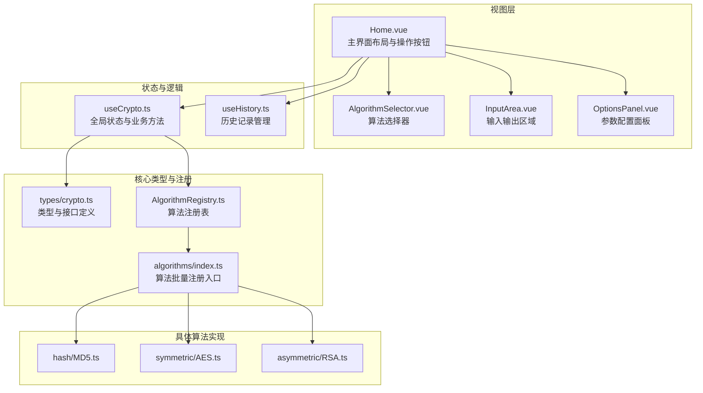
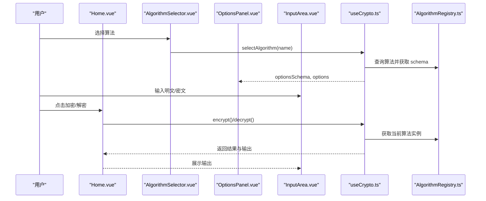
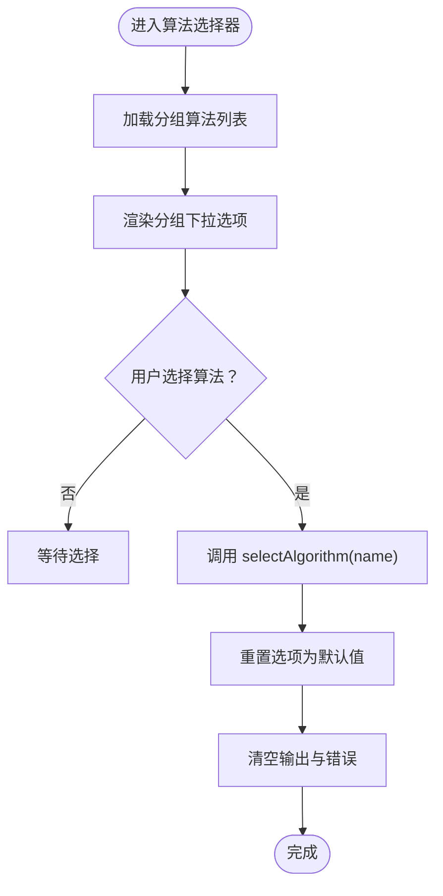
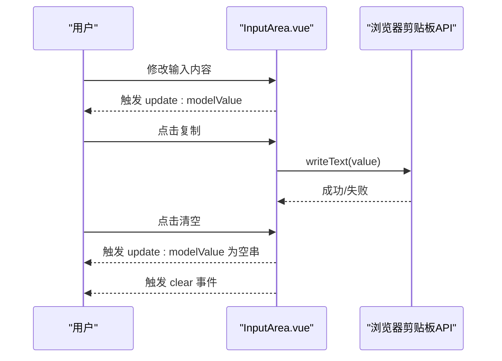
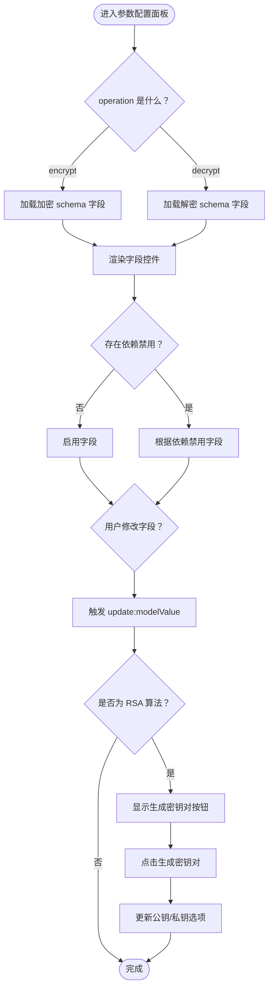
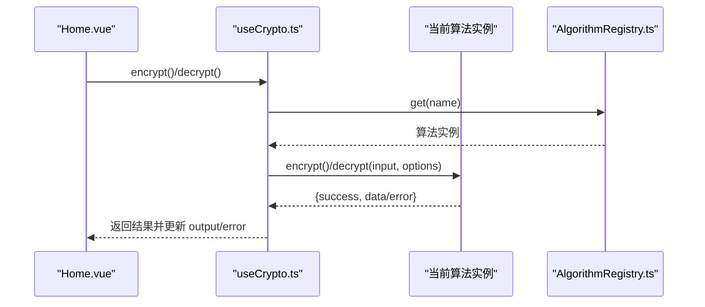
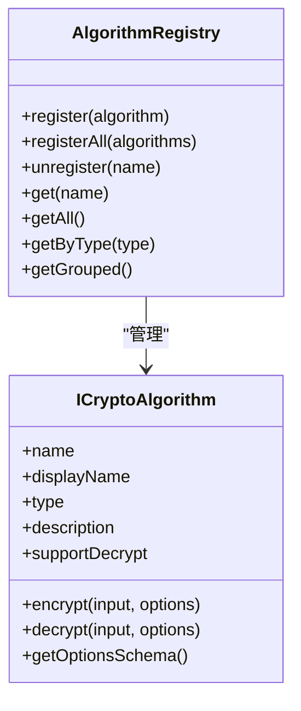
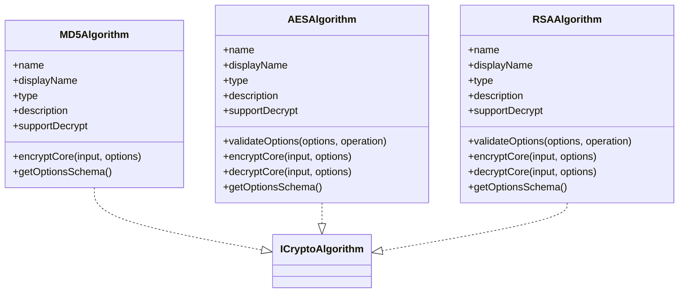
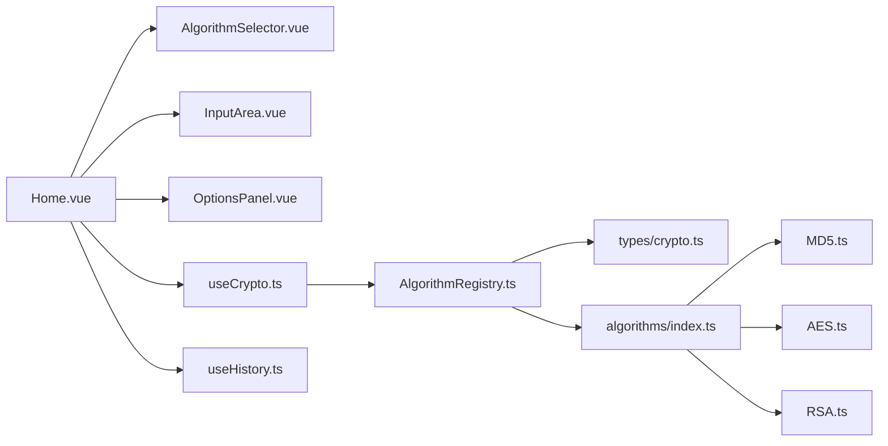

# 加密功能组件

<cite>
**本文档引用的文件**
- [src/components/crypto/AlgorithmSelector.vue](file://src/components/crypto/AlgorithmSelector.vue)
- [src/components/crypto/InputArea.vue](file://src/components/crypto/InputArea.vue)
- [src/components/crypto/OptionsPanel.vue](file://src/components/crypto/OptionsPanel.vue)
- [src/composables/useCrypto.ts](file://src/composables/useCrypto.ts)
- [src/core/registry/AlgorithmRegistry.ts](file://src/core/registry/AlgorithmRegistry.ts)
- [src/core/types/crypto.ts](file://src/core/types/crypto.ts)
- [src/algorithms/index.ts](file://src/algorithms/index.ts)
- [src/views/Home.vue](file://src/views/Home.vue)
- [src/main.ts](file://src/main.ts)
- [src/algorithms/hash/MD5.ts](file://src/algorithms/hash/MD5.ts)
- [src/algorithms/symmetric/AES.ts](file://src/algorithms/symmetric/AES.ts)
- [src/algorithms/asymmetric/RSA.ts](file://src/algorithms/asymmetric/RSA.ts)
- [src/composables/useHistory.ts](file://src/composables/useHistory.ts)
</cite>

## 目录
1. [简介](#简介)
2. [项目结构](#项目结构)
3. [核心组件](#核心组件)
4. [架构总览](#架构总览)
5. [详细组件分析](#详细组件分析)
6. [依赖关系分析](#依赖关系分析)
7. [性能考虑](#性能考虑)
8. [故障排除指南](#故障排除指南)
9. [结论](#结论)
10. [附录](#附录)

## 简介
本文件面向“加密功能组件群”，系统性阐述算法选择器、输入输出区域与参数配置面板三大核心组件的设计理念、实现细节与交互机制。文档重点说明：
- 各组件的功能职责与数据绑定机制
- 事件处理流程与用户交互模式
- 组件间通信方式、状态同步机制与错误处理策略
- 组件属性配置、样式定制与扩展使用指南

## 项目结构
加密功能组件群围绕 Vue 3 + Naive UI 的前端架构构建，采用组合式 API 管理全局状态，通过算法注册表统一管理算法族，并在视图层以组件化方式组织交互。

**图表来源**
- [src/views/Home.vue](file://src/views/Home.vue#L1-L220)
- [src/components/crypto/AlgorithmSelector.vue](file://src/components/crypto/AlgorithmSelector.vue#L1-L63)
- [src/components/crypto/InputArea.vue](file://src/components/crypto/InputArea.vue#L1-L70)
- [src/components/crypto/OptionsPanel.vue](file://src/components/crypto/OptionsPanel.vue#L1-L129)
- [src/composables/useCrypto.ts](file://src/composables/useCrypto.ts#L1-L217)
- [src/composables/useHistory.ts](file://src/composables/useHistory.ts#L1-L153)
- [src/core/registry/AlgorithmRegistry.ts](file://src/core/registry/AlgorithmRegistry.ts#L1-L114)
- [src/core/types/crypto.ts](file://src/core/types/crypto.ts#L1-L104)
- [src/algorithms/index.ts](file://src/algorithms/index.ts#L1-L59)
- [src/algorithms/hash/MD5.ts](file://src/algorithms/hash/MD5.ts#L1-L28)
- [src/algorithms/symmetric/AES.ts](file://src/algorithms/symmetric/AES.ts#L1-L171)
- [src/algorithms/asymmetric/RSA.ts](file://src/algorithms/asymmetric/RSA.ts#L1-L166)

**章节来源**
- [src/views/Home.vue](file://src/views/Home.vue#L1-L220)
- [src/main.ts](file://src/main.ts#L1-L10)

## 核心组件
- 算法选择器（AlgorithmSelector）
  - 职责：展示按类型分组的算法列表，支持过滤搜索；显示当前算法能力标签与描述；触发算法切换。
  - 数据绑定：基于 useCrypto 提供的 groupedAlgorithms 与 currentAlgorithmName。
  - 事件：选择算法后调用 selectAlgorithm 更新当前算法并重置选项。
- 输入输出区域（InputArea）
  - 职责：提供可清空的多行文本输入/只读输出区域；字符计数；一键复制到剪贴板；清空回调。
  - 数据绑定：v-model 双向绑定 input/output；支持只读模式。
  - 事件：复制、清空、字符计数。
- 参数配置面板（OptionsPanel）
  - 职责：根据当前操作（加密/解密）动态渲染选项字段；支持文本、多行文本、下拉选择；RSA 密钥生成；字段依赖禁用控制。
  - 数据绑定：v-model 双向绑定 CryptoOptions；根据 operation 切换 schema。
  - 事件：字段更新、RSA 密钥生成。

**章节来源**
- [src/components/crypto/AlgorithmSelector.vue](file://src/components/crypto/AlgorithmSelector.vue#L1-L63)
- [src/components/crypto/InputArea.vue](file://src/components/crypto/InputArea.vue#L1-L70)
- [src/components/crypto/OptionsPanel.vue](file://src/components/crypto/OptionsPanel.vue#L1-L129)
- [src/composables/useCrypto.ts](file://src/composables/useCrypto.ts#L1-L217)

## 架构总览
加密功能组件群遵循“视图组件 + 组合式状态 + 算法注册表”的分层设计。Home.vue 作为顶层容器协调三大组件与全局状态，useCrypto 提供统一的状态与业务方法，AlgorithmRegistry 管理算法注册与分组，具体算法实现遵循统一基类规范。

**图表来源**
- [src/views/Home.vue](file://src/views/Home.vue#L1-L220)
- [src/components/crypto/AlgorithmSelector.vue](file://src/components/crypto/AlgorithmSelector.vue#L1-L63)
- [src/components/crypto/OptionsPanel.vue](file://src/components/crypto/OptionsPanel.vue#L1-L129)
- [src/components/crypto/InputArea.vue](file://src/components/crypto/InputArea.vue#L1-L70)
- [src/composables/useCrypto.ts](file://src/composables/useCrypto.ts#L1-L217)
- [src/core/registry/AlgorithmRegistry.ts](file://src/core/registry/AlgorithmRegistry.ts#L1-L114)

## 详细组件分析

### 算法选择器（AlgorithmSelector）
- 设计要点
  - 使用分组选项展示算法，便于按类型浏览。
  - 动态显示当前算法支持解密与否的标签与描述。
  - 与 useCrypto 协作，确保选中算法后重置选项并清空输出/错误。
- 数据流
  - 输入：currentAlgorithmName、groupedAlgorithms。
  - 输出：触发 selectAlgorithm。
- 交互模式
  - 支持过滤搜索；点击后立即生效并触发状态更新。

**图表来源**
- [src/components/crypto/AlgorithmSelector.vue](file://src/components/crypto/AlgorithmSelector.vue#L1-L63)
- [src/composables/useCrypto.ts](file://src/composables/useCrypto.ts#L56-L72)

**章节来源**
- [src/components/crypto/AlgorithmSelector.vue](file://src/components/crypto/AlgorithmSelector.vue#L1-L63)
- [src/composables/useCrypto.ts](file://src/composables/useCrypto.ts#L1-L217)

### 输入输出区域（InputArea）
- 设计要点
  - 支持只读输出区域与可编辑输入区域。
  - 内置字符计数、复制到剪贴板、清空功能。
  - 通过 v-model 实现双向绑定，支持外部清空事件。
- 数据流
  - 输入：modelValue、readonly、title、placeholder。
  - 输出：update:modelValue、clear。
- 交互模式
  - 点击复制按钮复制当前内容；点击清空按钮清空并触发 clear。

**图表来源**
- [src/components/crypto/InputArea.vue](file://src/components/crypto/InputArea.vue#L1-L70)

**章节来源**
- [src/components/crypto/InputArea.vue](file://src/components/crypto/InputArea.vue#L1-L70)

### 参数配置面板（OptionsPanel）
- 设计要点
  - 根据 operation（encrypt/decrypt）动态渲染不同字段集合。
  - 支持字段依赖禁用（disabledWhen），提升用户体验。
  - 针对 RSA 算法提供一键生成密钥对的能力。
- 数据流
  - 输入：modelValue、schema、operation、algorithmName。
  - 输出：update:modelValue。
- 交互模式
  - 用户修改任一字段即触发 update:modelValue；RSA 时显示“生成密钥对”按钮。

**图表来源**
- [src/components/crypto/OptionsPanel.vue](file://src/components/crypto/OptionsPanel.vue#L1-L129)

**章节来源**
- [src/components/crypto/OptionsPanel.vue](file://src/components/crypto/OptionsPanel.vue#L1-L129)

### 状态与业务逻辑（useCrypto）
- 设计要点
  - 单例模块级状态：currentAlgorithmName、input、output、error、isLoading、options。
  - 提供 encrypt/decrypt/clear/swap/copyOutput 等核心方法。
  - 与 AlgorithmRegistry 协作，按算法类型分组展示，支持默认选项重置。
- 数据流
  - 输入：算法名、输入文本、选项。
  - 输出：结果数据、错误信息、历史记录。
- 错误处理
  - 对空输入、不支持的操作、算法异常进行统一错误捕获与提示。

**图表来源**
- [src/composables/useCrypto.ts](file://src/composables/useCrypto.ts#L74-L194)
- [src/core/registry/AlgorithmRegistry.ts](file://src/core/registry/AlgorithmRegistry.ts#L48-L52)

**章节来源**
- [src/composables/useCrypto.ts](file://src/composables/useCrypto.ts#L1-L217)

### 算法注册与类型体系
- AlgorithmRegistry
  - 单例注册表，提供注册、注销、查询、分组等能力。
- 类型与接口
  - 定义 AlgorithmType、CryptoOptions、OptionsSchema、ICryptoAlgorithm 等核心类型。
- 算法批量注册
  - algorithms/index.ts 统一导入并注册所有算法。

**图表来源**
- [src/core/registry/AlgorithmRegistry.ts](file://src/core/registry/AlgorithmRegistry.ts#L1-L114)
- [src/core/types/crypto.ts](file://src/core/types/crypto.ts#L74-L91)

**章节来源**
- [src/core/registry/AlgorithmRegistry.ts](file://src/core/registry/AlgorithmRegistry.ts#L1-L114)
- [src/core/types/crypto.ts](file://src/core/types/crypto.ts#L1-L104)
- [src/algorithms/index.ts](file://src/algorithms/index.ts#L1-L59)

### 典型算法实现示例
- MD5（哈希）
  - 通过 CryptoJS 计算哈希，支持 hex/base64 输出格式。
- AES（对称加密）
  - 支持多种模式与填充；校验密钥长度与 IV；区分加密/解密输入格式。
- RSA（非对称加密）
  - 使用 WebCrypto API 进行密钥导入与加解密；提供密钥对生成辅助函数。

**图表来源**
- [src/algorithms/hash/MD5.ts](file://src/algorithms/hash/MD5.ts#L1-L28)
- [src/algorithms/symmetric/AES.ts](file://src/algorithms/symmetric/AES.ts#L1-L171)
- [src/algorithms/asymmetric/RSA.ts](file://src/algorithms/asymmetric/RSA.ts#L1-L166)

**章节来源**
- [src/algorithms/hash/MD5.ts](file://src/algorithms/hash/MD5.ts#L1-L28)
- [src/algorithms/symmetric/AES.ts](file://src/algorithms/symmetric/AES.ts#L1-L171)
- [src/algorithms/asymmetric/RSA.ts](file://src/algorithms/asymmetric/RSA.ts#L1-L166)

## 依赖关系分析
- 组件耦合
  - Home.vue 作为协调者，依赖三大组件与 useCrypto/useHistory。
  - 三大组件均依赖 useCrypto 提供的状态与方法。
- 外部依赖
  - Naive UI 提供 UI 控件与主题能力。
  - CryptoJS 用于哈希与对称加密算法。
  - 浏览器 WebCrypto API 用于非对称加密与密钥生成。
- 算法扩展
  - 新增算法只需实现 ICryptoAlgorithm 接口并通过 algorithms/index.ts 注册。

**图表来源**
- [src/views/Home.vue](file://src/views/Home.vue#L1-L220)
- [src/components/crypto/AlgorithmSelector.vue](file://src/components/crypto/AlgorithmSelector.vue#L1-L63)
- [src/components/crypto/InputArea.vue](file://src/components/crypto/InputArea.vue#L1-L70)
- [src/components/crypto/OptionsPanel.vue](file://src/components/crypto/OptionsPanel.vue#L1-L129)
- [src/composables/useCrypto.ts](file://src/composables/useCrypto.ts#L1-L217)
- [src/composables/useHistory.ts](file://src/composables/useHistory.ts#L1-L153)
- [src/core/registry/AlgorithmRegistry.ts](file://src/core/registry/AlgorithmRegistry.ts#L1-L114)
- [src/core/types/crypto.ts](file://src/core/types/crypto.ts#L1-L104)
- [src/algorithms/index.ts](file://src/algorithms/index.ts#L1-L59)
- [src/algorithms/hash/MD5.ts](file://src/algorithms/hash/MD5.ts#L1-L28)
- [src/algorithms/symmetric/AES.ts](file://src/algorithms/symmetric/AES.ts#L1-L171)
- [src/algorithms/asymmetric/RSA.ts](file://src/algorithms/asymmetric/RSA.ts#L1-L166)

**章节来源**
- [src/views/Home.vue](file://src/views/Home.vue#L1-L220)
- [src/composables/useCrypto.ts](file://src/composables/useCrypto.ts#L1-L217)
- [src/core/registry/AlgorithmRegistry.ts](file://src/core/registry/AlgorithmRegistry.ts#L1-L114)

## 性能考虑
- 算法计算
  - 哈希与对称加密通常较快；RSA 等非对称算法在大文本上耗时较高，建议限制输入长度或异步处理。
- UI 渲染
  - 大文本输入/输出时，使用等宽字体与自动行高有助于阅读体验，但可能影响滚动性能；可通过虚拟滚动优化长文本场景。
- 状态更新
  - useCrypto 中的计算属性与响应式状态避免不必要的重渲染；建议在高频输入场景中节流/防抖相关事件。
- 存储与历史
  - 历史记录持久化于 localStorage，注意容量上限与序列化开销；当前实现具备自动截断策略。

[本节为通用指导，无需特定文件来源]

## 故障排除指南
- 常见问题与处理
  - 算法不可用：确认算法已在 algorithms/index.ts 中注册，且 AlgorithmRegistry 中存在该算法。
  - 选项缺失导致失败：检查 OptionsPanel 的字段是否必填，尤其是密钥、IV、公钥/私钥等。
  - 复制失败：浏览器剪贴板权限或安全上下文限制可能导致失败，组件内部已静默处理。
  - 解密报错：核对输入格式（hex/base64）、密钥与 IV 是否匹配，非对称算法需提供正确的 PEM 密钥。
- 调试建议
  - 在 useCrypto 的 encrypt/decrypt 中查看 error 状态与返回结果。
  - 使用浏览器开发者工具观察 localStorage 中的历史记录是否正常写入。

**章节来源**
- [src/composables/useCrypto.ts](file://src/composables/useCrypto.ts#L78-L119)
- [src/components/crypto/InputArea.vue](file://src/components/crypto/InputArea.vue#L25-L32)
- [src/algorithms/symmetric/AES.ts](file://src/algorithms/symmetric/AES.ts#L12-L28)
- [src/algorithms/asymmetric/RSA.ts](file://src/algorithms/asymmetric/RSA.ts#L11-L19)
- [src/composables/useHistory.ts](file://src/composables/useHistory.ts#L18-L26)

## 结论
加密功能组件群通过清晰的分层设计与标准化接口，实现了算法选择、参数配置与输入输出的高效协同。组件间通过 useCrypto 提供的统一状态与方法进行通信，配合 AlgorithmRegistry 的算法注册与分组能力，既保证了易用性，也为后续扩展提供了良好基础。建议在实际部署中关注浏览器兼容性、性能与安全性边界，并结合业务需求对 UI 与交互进行进一步定制。

[本节为总结性内容，无需特定文件来源]

## 附录

### 组件属性配置与样式定制
- AlgorithmSelector
  - 属性：无（依赖 useCrypto 提供的数据）。
  - 样式：卡片标题、描述文本、标签颜色等可通过 scoped 样式覆盖。
- InputArea
  - 属性：modelValue、title、placeholder、readonly。
  - 样式：等宽字体、字符计数样式、按钮尺寸与图标。
- OptionsPanel
  - 属性：modelValue、schema、operation、algorithmName。
  - 样式：表单项标签位置、控件尺寸、描述文本样式。

**章节来源**
- [src/components/crypto/AlgorithmSelector.vue](file://src/components/crypto/AlgorithmSelector.vue#L27-L63)
- [src/components/crypto/InputArea.vue](file://src/components/crypto/InputArea.vue#L40-L70)
- [src/components/crypto/OptionsPanel.vue](file://src/components/crypto/OptionsPanel.vue#L73-L129)

### 扩展使用指南
- 新增算法步骤
  - 实现 ICryptoAlgorithm 接口，提供名称、显示名、类型、描述、支持解密标志、加密/解密核心逻辑与选项 schema。
  - 在 algorithms/index.ts 中注册新算法实例。
  - 如需默认选项重置，确保 getOptionsSchema 返回的字段包含 default。
- 自定义选项字段
  - 在算法的 getOptionsSchema 中定义字段类型（text/textarea/select/number）、占位符、描述与依赖禁用规则。
  - 如需动态禁用，使用 disabledWhen 指定依赖字段与允许值列表。
- 历史记录集成
  - 使用 useHistory 提供的方法持久化与管理历史记录；注意最大容量与去重策略。

**章节来源**
- [src/core/types/crypto.ts](file://src/core/types/crypto.ts#L47-L71)
- [src/algorithms/index.ts](file://src/algorithms/index.ts#L28-L54)
- [src/composables/useHistory.ts](file://src/composables/useHistory.ts#L44-L73)