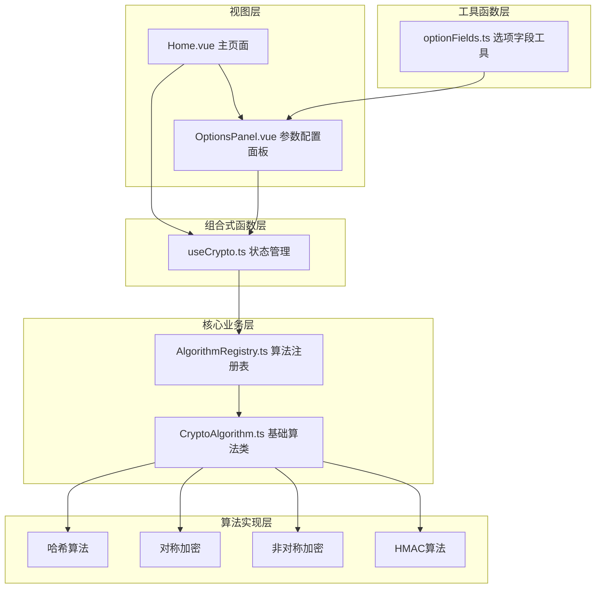
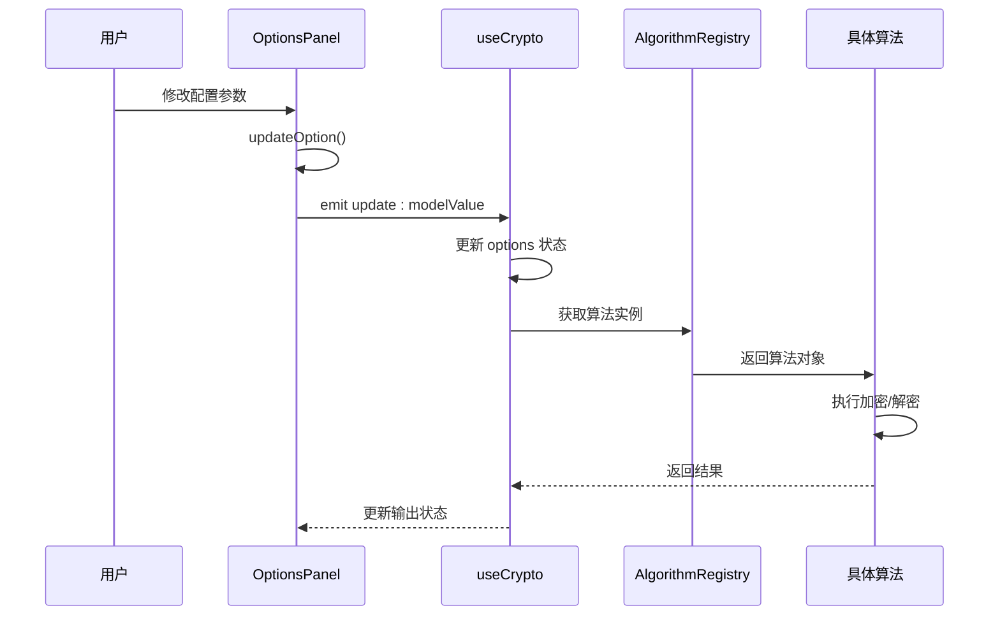
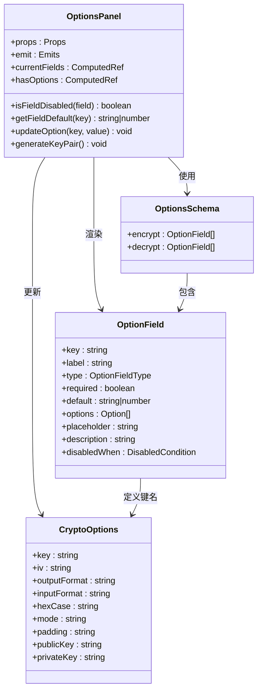
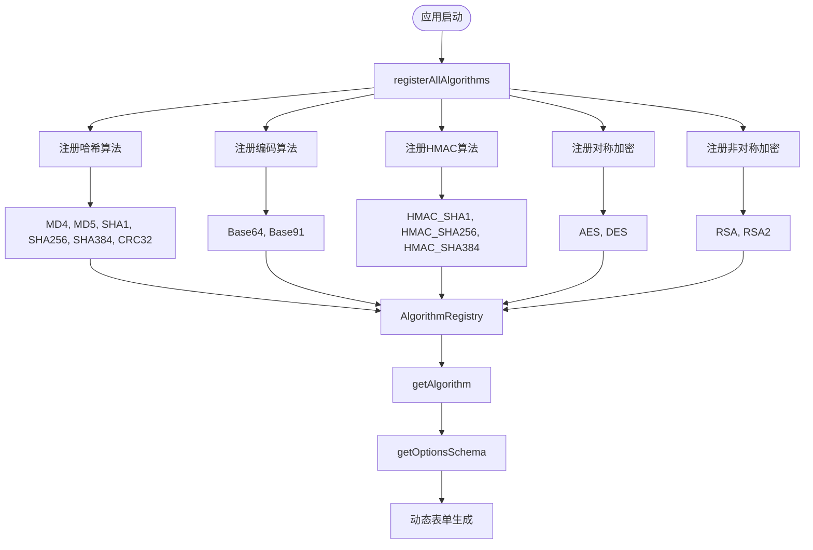
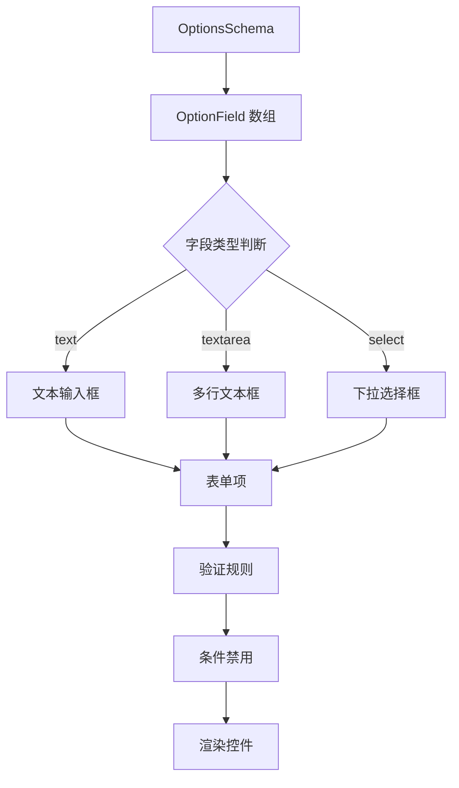
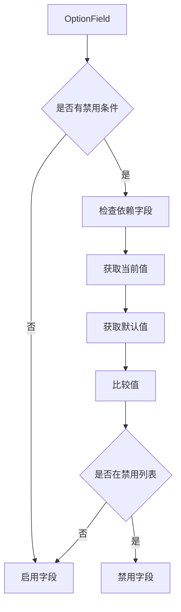
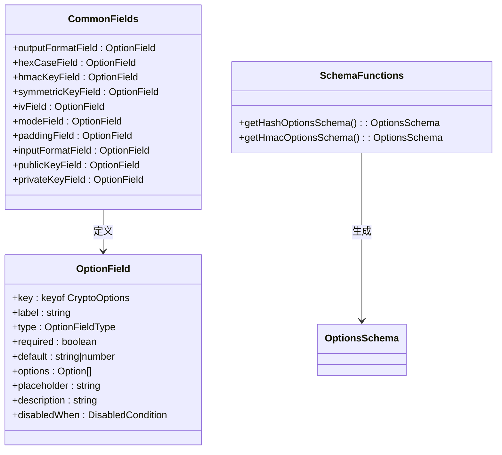
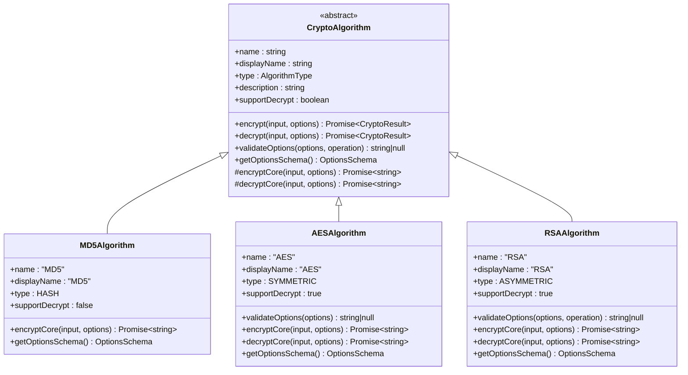
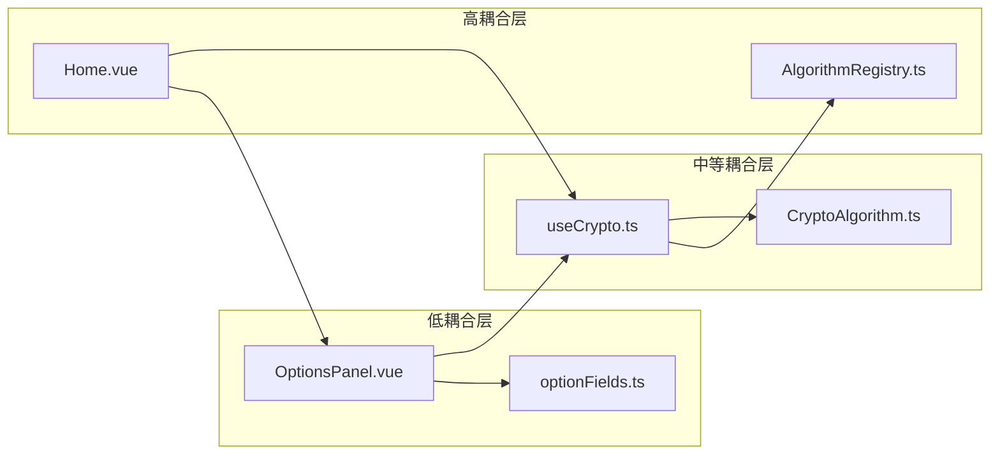

# 参数配置面板组件

<cite>
**本文档引用的文件**
- [OptionsPanel.vue](file://src/components/crypto/OptionsPanel.vue)
- [optionFields.ts](file://src/core/utils/optionFields.ts)
- [useCrypto.ts](file://src/composables/useCrypto.ts)
- [crypto.ts](file://src/core/types/crypto.ts)
- [AlgorithmRegistry.ts](file://src/core/registry/AlgorithmRegistry.ts)
- [CryptoAlgorithm.ts](file://src/core/base/CryptoAlgorithm.ts)
- [Home.vue](file://src/views/Home.vue)
- [AES.ts](file://src/algorithms/symmetric/AES.ts)
- [MD5.ts](file://src/algorithms/hash/MD5.ts)
- [HMAC_SHA256.ts](file://src/algorithms/hmac/HMAC_SHA256.ts)
- [RSA.ts](file://src/algorithms/asymmetric/RSA.ts)
- [algorithms/index.ts](file://src/algorithms/index.ts)
</cite>

## 目录
1. [简介](#简介)
2. [项目结构](#项目结构)
3. [核心组件](#核心组件)
4. [架构概览](#架构概览)
5. [详细组件分析](#详细组件分析)
6. [依赖关系分析](#依赖关系分析)
7. [性能考虑](#性能考虑)
8. [故障排除指南](#故障排除指南)
9. [结论](#结论)

## 简介

参数配置面板组件（OptionsPanel.vue）是加密算法工具箱中的关键UI组件，负责动态生成和管理各种加密算法的配置界面。该组件通过算法注册表和选项字段工具函数，实现了高度模块化的参数配置系统，支持多种加密算法的动态表单生成、实时参数验证和智能控件映射。

## 项目结构

该项目采用模块化架构设计，主要分为以下几个核心层次：

**图表来源**
- [Home.vue](file://src/views/Home.vue#L1-L220)
- [OptionsPanel.vue](file://src/components/crypto/OptionsPanel.vue#L1-L129)
- [useCrypto.ts](file://src/composables/useCrypto.ts#L1-L217)

**章节来源**
- [Home.vue](file://src/views/Home.vue#L1-L220)
- [OptionsPanel.vue](file://src/components/crypto/OptionsPanel.vue#L1-L129)

## 核心组件

### OptionsPanel 组件架构

OptionsPanel 组件是一个基于 Vue 3 Composition API 的响应式组件，具有以下核心特性：

- **动态表单生成**：根据算法的 OptionsSchema 动态渲染表单控件
- **智能控件映射**：将 OptionField 类型映射到相应的 UI 控件
- **实时参数验证**：支持字段间的依赖验证和条件禁用
- **密钥生成功能**：为 RSA 等非对称算法提供一键密钥生成

### 数据流架构

**图表来源**
- [OptionsPanel.vue](file://src/components/crypto/OptionsPanel.vue#L41-L46)
- [useCrypto.ts](file://src/composables/useCrypto.ts#L78-L119)

**章节来源**
- [OptionsPanel.vue](file://src/components/crypto/OptionsPanel.vue#L1-L129)
- [useCrypto.ts](file://src/composables/useCrypto.ts#L1-L217)

## 架构概览

### 组件交互关系

**图表来源**
- [OptionsPanel.vue](file://src/components/crypto/OptionsPanel.vue#L9-L18)
- [crypto.ts](file://src/core/types/crypto.ts#L51-L71)

### 算法注册与发现机制

**图表来源**
- [algorithms/index.ts](file://src/algorithms/index.ts#L29-L54)
- [AlgorithmRegistry.ts](file://src/core/registry/AlgorithmRegistry.ts#L26-L38)

**章节来源**
- [algorithms/index.ts](file://src/algorithms/index.ts#L1-L59)
- [AlgorithmRegistry.ts](file://src/core/registry/AlgorithmRegistry.ts#L1-L114)

## 详细组件分析

### OptionsPanel 组件详解

#### 组件属性与事件

OptionsPanel 组件通过 props 接收以下关键参数：

| 属性名 | 类型 | 必需 | 描述 |
|--------|------|------|------|
| modelValue | CryptoOptions | 是 | 当前算法的配置选项对象 |
| schema | OptionsSchema | 是 | 算法的选项配置模式 |
| operation | 'encrypt' \| 'decrypt' | 是 | 当前操作类型 |
| algorithmName | string | 否 | 当前算法名称 |

#### 动态表单生成机制

组件的核心功能是根据 OptionsSchema 动态生成表单控件：

**图表来源**
- [OptionsPanel.vue](file://src/components/crypto/OptionsPanel.vue#L84-L126)

#### 表单控件类型映射

组件支持四种主要的表单控件类型：

| 控件类型 | 对应 UI 组件 | 用途 | 示例 |
|----------|-------------|------|------|
| text | NInput | 单行文本输入 | 密钥、密码等 |
| textarea | NInput(type='textarea') | 多行文本输入 | 公钥、私钥、长文本 |
| select | NSelect | 下拉选择 | 输出格式、加密模式 |
| number | NInput(type='number') | 数字输入 | 密钥长度、模数长度 |

#### 条件禁用机制

组件实现了智能的字段禁用逻辑，基于 `disabledWhen` 配置：

**图表来源**
- [OptionsPanel.vue](file://src/components/crypto/OptionsPanel.vue#L27-L33)

**章节来源**
- [OptionsPanel.vue](file://src/components/crypto/OptionsPanel.vue#L1-L129)

### optionFields 工具函数

#### 字段定义规范

optionFields 工具函数提供了标准化的选项字段定义，确保不同算法间的一致性：

**图表来源**
- [optionFields.ts](file://src/core/utils/optionFields.ts#L8-L137)

#### 字段复用策略

工具函数通过工厂函数模式实现字段的动态生成：

| 字段类型 | 工厂函数 | 参数 | 特殊用途 |
|----------|---------|------|----------|
| 对称密钥 | symmetricKeyField | keyLength: string | 支持不同密钥长度的提示 |
| IV 字段 | ivField | length: number | 动态设置 IV 长度提示 |
| 加密模式 | modeField | modes: string[] | 支持算法特定的模式集合 |

**章节来源**
- [optionFields.ts](file://src/core/utils/optionFields.ts#L1-L137)

### 算法集成模式

#### 基础算法类继承体系

所有具体算法都继承自 CryptoAlgorithm 基类，实现了统一的接口规范：

**图表来源**
- [CryptoAlgorithm.ts](file://src/core/base/CryptoAlgorithm.ts#L13-L165)
- [MD5.ts](file://src/algorithms/hash/MD5.ts#L6-L27)
- [AES.ts](file://src/algorithms/symmetric/AES.ts#L5-L171)
- [RSA.ts](file://src/algorithms/asymmetric/RSA.ts#L4-L125)

#### 算法选项配置

每个算法通过 `getOptionsSchema()` 方法返回其特定的配置需求：

| 算法类型 | 支持的操作 | 选项字段 | 特殊验证 |
|----------|------------|----------|----------|
| 哈希算法 | 仅加密 | 输出格式、Hex 大小写 | 基于输出格式的条件禁用 |
| HMAC | 仅加密 | 密钥、输出格式、Hex 大小写 | 必须提供密钥 |
| 对称加密 | 加密/解密 | 密钥、IV、模式、填充、输出格式 | 密钥长度验证、模式依赖验证 |
| 非对称加密 | 加密/解密 | 公钥/私钥、模数长度 | 公钥/私钥格式验证 |

**章节来源**
- [CryptoAlgorithm.ts](file://src/core/base/CryptoAlgorithm.ts#L77-L104)
- [MD5.ts](file://src/algorithms/hash/MD5.ts#L24-L26)
- [AES.ts](file://src/algorithms/symmetric/AES.ts#L98-L170)
- [RSA.ts](file://src/algorithms/asymmetric/RSA.ts#L101-L124)

## 依赖关系分析

### 组件耦合度分析

**图表来源**
- [OptionsPanel.vue](file://src/components/crypto/OptionsPanel.vue#L1-L129)
- [useCrypto.ts](file://src/composables/useCrypto.ts#L1-L217)

### 关键依赖关系

1. **OptionsPanel ↔ useCrypto**: 通过 v-model 双向绑定实现数据同步
2. **useCrypto ↔ AlgorithmRegistry**: 通过注册表获取算法实例
3. **AlgorithmRegistry ↔ CryptoAlgorithm**: 通过继承关系实现算法统一接口
4. **OptionFields ↔ OptionsPanel**: 通过标准化字段定义实现动态表单

**章节来源**
- [OptionsPanel.vue](file://src/components/crypto/OptionsPanel.vue#L1-L129)
- [useCrypto.ts](file://src/composables/useCrypto.ts#L1-L217)
- [AlgorithmRegistry.ts](file://src/core/registry/AlgorithmRegistry.ts#L1-L114)

## 性能考虑

### 渲染优化策略

1. **计算属性缓存**: 使用 `computed` 缓存动态表单数据
2. **条件渲染**: 仅在存在选项或支持 RSA 时渲染密钥生成按钮
3. **懒加载**: 算法实例通过注册表按需获取

### 内存管理

1. **单例模式**: AlgorithmRegistry 使用单例模式避免重复实例化
2. **状态集中管理**: useCrypto 提供全局状态，减少组件间通信开销

### 异步处理

1. **密钥生成异步**: RSA 密钥生成使用异步操作，避免阻塞 UI
2. **算法执行异步**: 所有加密解密操作都是异步的

## 故障排除指南

### 常见问题及解决方案

#### 表单控件不显示

**症状**: 选项配置面板空白或部分字段不显示

**可能原因**:
1. OptionsSchema 未正确配置
2. 算法实例未正确注册到注册表
3. 字段类型不支持

**解决方法**:
1. 检查算法的 `getOptionsSchema()` 方法
2. 确认算法已在 `registerAllAlgorithms()` 中注册
3. 验证 OptionField 的 type 字段值

#### 字段禁用逻辑失效

**症状**: 条件禁用字段无法正确禁用

**可能原因**:
1. `disabledWhen` 配置错误
2. 依赖字段值获取失败
3. 默认值处理逻辑问题

**解决方法**:
1. 检查 `disabledWhen.field` 是否指向正确的字段键
2. 验证 `disabledWhen.values` 数组包含正确的禁用值
3. 确认 `getFieldDefault()` 函数正常工作

#### 参数验证失败

**症状**: 修改参数后出现验证错误

**可能原因**:
1. 算法特定的验证规则
2. 选项字段的 required 属性
3. 条件验证逻辑

**解决方法**:
1. 检查算法的 `validateOptions()` 方法
2. 确认必填字段已填写
3. 验证条件验证逻辑的正确性

**章节来源**
- [OptionsPanel.vue](file://src/components/crypto/OptionsPanel.vue#L27-L33)
- [CryptoAlgorithm.ts](file://src/core/base/CryptoAlgorithm.ts#L92-L94)

## 结论

OptionsPanel 组件通过精心设计的架构实现了高度模块化和可扩展的参数配置系统。其核心优势包括：

1. **动态表单生成**: 通过 OptionsSchema 实现算法无关的表单渲染
2. **智能控件映射**: 自动将字段类型映射到合适的 UI 控件
3. **条件验证机制**: 支持复杂的字段间依赖关系
4. **标准化工具函数**: 通过 optionFields 提供一致的字段定义规范
5. **松耦合设计**: 组件间通过清晰的接口进行通信

该组件为加密算法工具箱提供了强大的配置能力，支持未来新增算法的无缝集成，是构建复杂加密应用的理想选择。