# 算法选择器组件

<cite>
**本文档引用的文件**
- [AlgorithmSelector.vue](file://src/components/crypto/AlgorithmSelector.vue)
- [useCrypto.ts](file://src/composables/useCrypto.ts)
- [AlgorithmRegistry.ts](file://src/core/registry/AlgorithmRegistry.ts)
- [CryptoAlgorithm.ts](file://src/core/base/CryptoAlgorithm.ts)
- [crypto.ts](file://src/core/types/crypto.ts)
- [MD5.ts](file://src/algorithms/hash/MD5.ts)
- [AES.ts](file://src/algorithms/symmetric/AES.ts)
- [index.ts](file://src/algorithms/index.ts)
- [Home.vue](file://src/views/Home.vue)
- [main.ts](file://src/main.ts)
</cite>

## 目录
1. [简介](#简介)
2. [项目结构](#项目结构)
3. [核心组件](#核心组件)
4. [架构概览](#架构概览)
5. [详细组件分析](#详细组件分析)
6. [依赖关系分析](#依赖关系分析)
7. [性能考虑](#性能考虑)
8. [故障排除指南](#故障排除指南)
9. [结论](#结论)
10. [附录](#附录)

## 简介

算法选择器组件（AlgorithmSelector.vue）是加密工具应用中的核心UI组件，负责为用户提供直观的算法选择界面。该组件基于Vue 3 Composition API和Naive UI框架构建，实现了算法分组展示、下拉选择器数据绑定、算法信息展示和用户交互处理等完整功能。

组件通过useCrypto组合式函数与底层算法系统进行深度集成，提供了完整的算法选择、配置和执行工作流。它不仅展示了算法的基本信息，还能够动态显示算法的详细描述和支持能力，为用户提供丰富的上下文信息。

## 项目结构

该项目采用模块化的架构设计，将不同类型的加密算法按照功能进行组织，形成了清晰的层次结构：

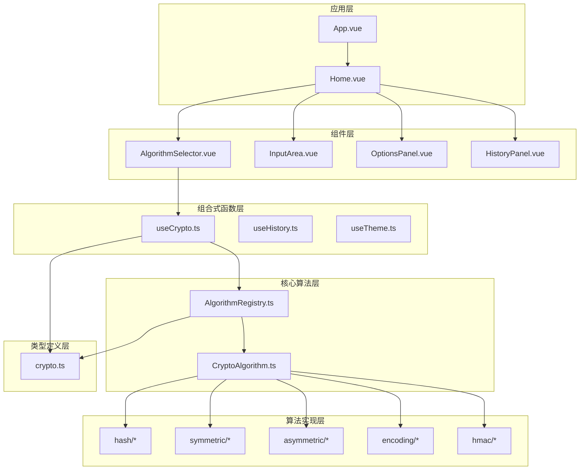

**图表来源**
- [AlgorithmSelector.vue](file://src/components/crypto/AlgorithmSelector.vue#L1-L63)
- [useCrypto.ts](file://src/composables/useCrypto.ts#L1-L217)
- [AlgorithmRegistry.ts](file://src/core/registry/AlgorithmRegistry.ts#L1-L114)

**章节来源**
- [main.ts](file://src/main.ts#L1-L10)
- [Home.vue](file://src/views/Home.vue#L1-L220)

## 核心组件

算法选择器组件是整个加密工具的核心入口点，它承担着以下关键职责：

### 组件架构特点

1. **响应式数据绑定**：通过Vue 3的Composition API实现双向数据绑定
2. **算法分组展示**：将不同类型的算法按照预定义顺序进行分组显示
3. **Naive UI集成**：充分利用Naive UI的NSelect组件提供优秀的用户体验
4. **实时状态同步**：与useCrypto组合式函数保持实时状态同步

### 数据流设计

组件内部的数据流遵循单向数据流原则，确保了状态管理的一致性和可预测性：

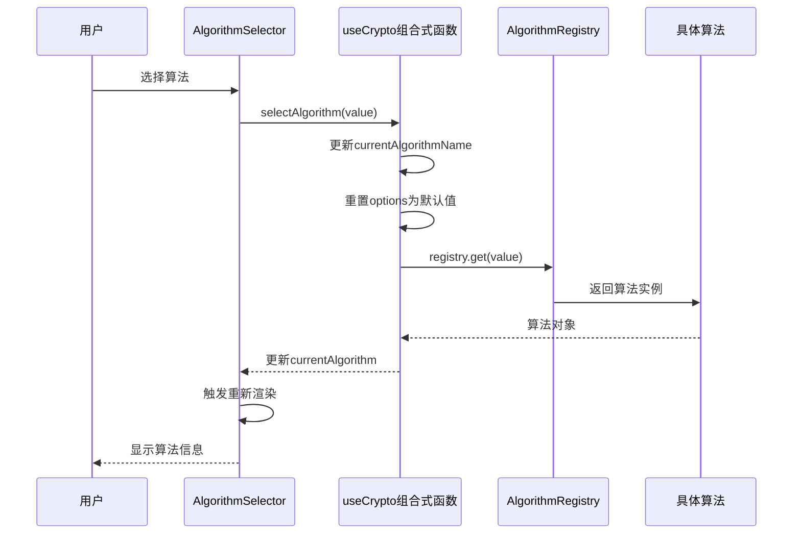

**图表来源**
- [AlgorithmSelector.vue](file://src/components/crypto/AlgorithmSelector.vue#L22-L24)
- [useCrypto.ts](file://src/composables/useCrypto.ts#L57-L72)

**章节来源**
- [AlgorithmSelector.vue](file://src/components/crypto/AlgorithmSelector.vue#L1-L63)
- [useCrypto.ts](file://src/composables/useCrypto.ts#L1-L217)

## 架构概览

算法选择器组件的架构设计体现了现代前端开发的最佳实践，通过清晰的分层和职责分离实现了高度的模块化和可维护性。

### 整体架构设计

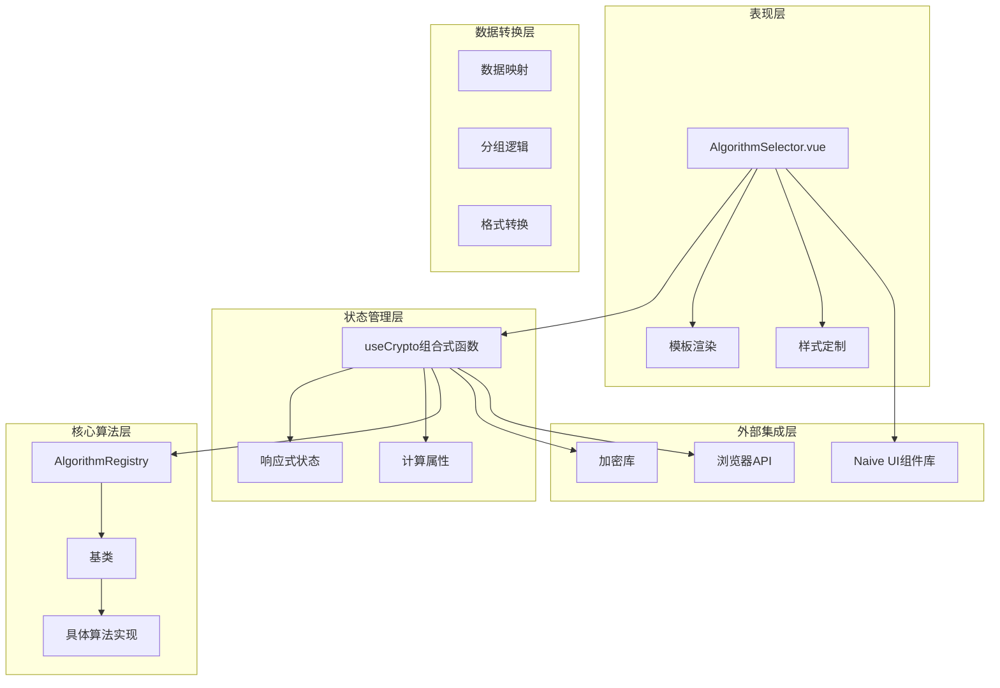

**图表来源**
- [AlgorithmSelector.vue](file://src/components/crypto/AlgorithmSelector.vue#L1-L63)
- [useCrypto.ts](file://src/composables/useCrypto.ts#L1-L217)
- [AlgorithmRegistry.ts](file://src/core/registry/AlgorithmRegistry.ts#L1-L114)

### 算法分组策略

组件实现了智能的算法分组机制，按照预定义的优先级顺序对算法进行分类展示：

| 分组类型 | 优先级 | 算法示例 | 展示标签 |
|---------|--------|----------|----------|
| 哈希算法 | 1 | MD5, SHA1, SHA256 | 哈希算法 |
| HMAC | 2 | HMAC-SHA1, HMAC-SHA256 | HMAC |
| 编码转换 | 3 | Base64, Base91 | 编码转换 |
| 对称加密 | 4 | AES, DES | 对称加密 |
| 非对称加密 | 5 | RSA, RSA2 | 非对称加密 |

这种分组策略确保了用户能够快速找到所需的算法类型，同时遵循了密码学领域的常见分类标准。

**章节来源**
- [useCrypto.ts](file://src/composables/useCrypto.ts#L30-L54)
- [crypto.ts](file://src/core/types/crypto.ts#L1-L104)

## 详细组件分析

### AlgorithmSelector.vue 组件详解

AlgorithmSelector.vue是一个高度模块化的组件，实现了完整的算法选择功能。让我们深入分析其各个组成部分。

#### 组件结构分析

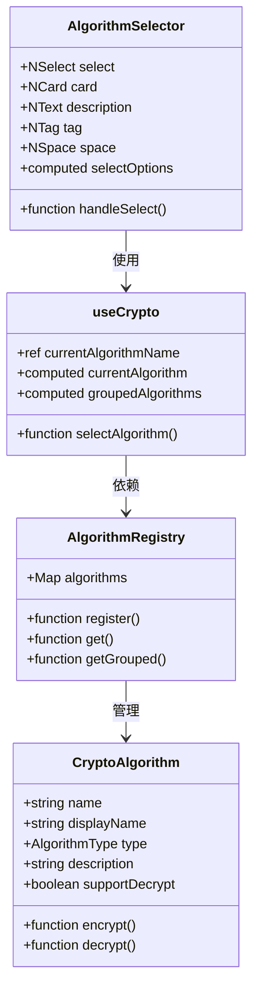

**图表来源**
- [AlgorithmSelector.vue](file://src/components/crypto/AlgorithmSelector.vue#L1-L63)
- [useCrypto.ts](file://src/composables/useCrypto.ts#L1-L217)
- [AlgorithmRegistry.ts](file://src/core/registry/AlgorithmRegistry.ts#L1-L114)
- [CryptoAlgorithm.ts](file://src/core/base/CryptoAlgorithm.ts#L1-L165)

#### 数据绑定机制

组件通过Vue 3的响应式系统实现了多层次的数据绑定：

1. **双向绑定**：`:value="currentAlgorithmName"` 实现了选中值的双向绑定
2. **计算属性**：`selectOptions` 计算属性实现了数据的动态转换
3. **事件监听**：`@update:value="handleSelect"` 处理用户选择事件

#### 算法分组展示机制

算法分组展示是组件的核心功能之一，其实现逻辑如下：

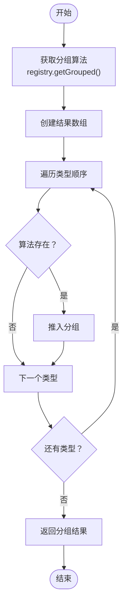

**图表来源**
- [useCrypto.ts](file://src/composables/useCrypto.ts#L29-L54)

#### 下拉选择器数据绑定

Naive UI的NSelect组件提供了强大的数据绑定能力，组件通过以下方式实现数据绑定：

1. **选项格式转换**：将算法注册表中的算法数据转换为NSelect期望的格式
2. **分组选项**：支持多层级的分组选项展示
3. **动态更新**：当算法注册表发生变化时，选项会自动更新

#### 算法信息展示逻辑

组件实现了智能的算法信息展示逻辑，包括：

1. **支持能力标签**：根据算法是否支持解密显示不同的标签颜色
2. **描述信息**：显示算法的详细描述信息
3. **状态同步**：与useCrypto组合式函数保持实时状态同步

#### 用户交互处理流程

用户交互处理流程体现了良好的用户体验设计：

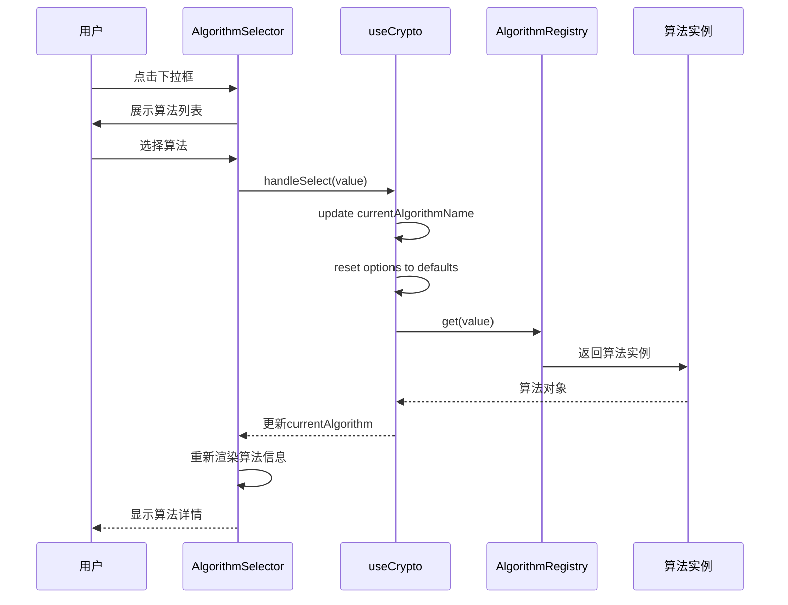

**图表来源**
- [AlgorithmSelector.vue](file://src/components/crypto/AlgorithmSelector.vue#L22-L24)
- [useCrypto.ts](file://src/composables/useCrypto.ts#L57-L72)

**章节来源**
- [AlgorithmSelector.vue](file://src/components/crypto/AlgorithmSelector.vue#L1-L63)
- [useCrypto.ts](file://src/composables/useCrypto.ts#L1-L217)

### useCrypto 组合式函数分析

useCrypto组合式函数是整个应用的状态管理中心，为算法选择器组件提供了强大的数据支持。

#### 状态管理架构

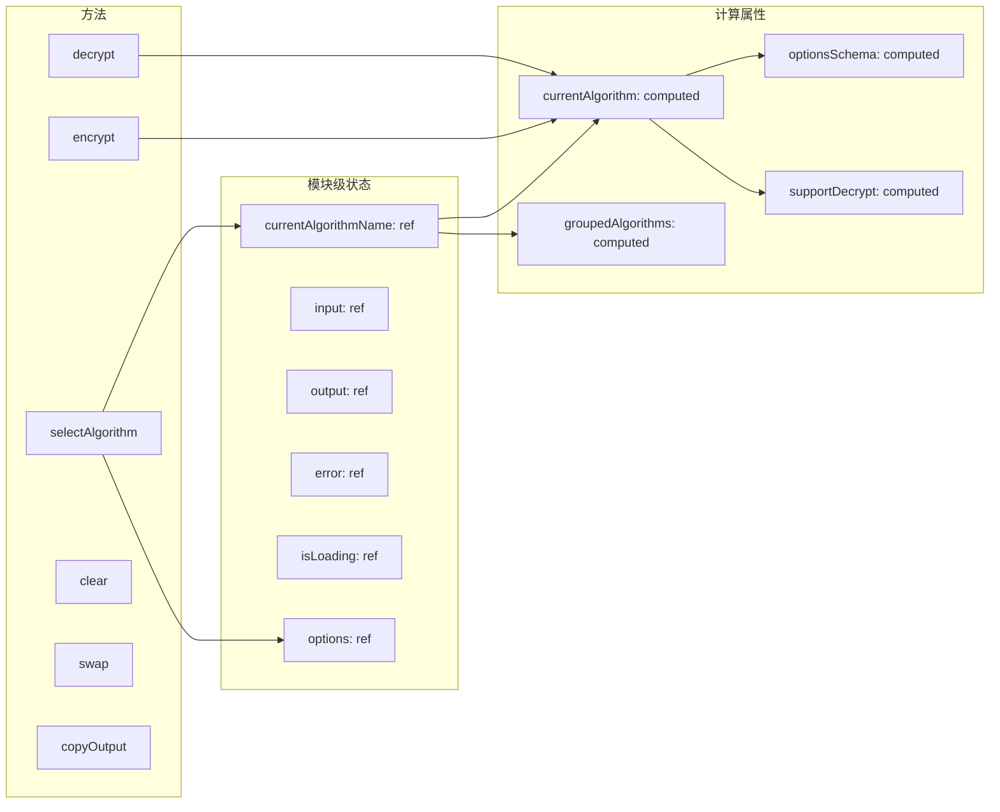

**图表来源**
- [useCrypto.ts](file://src/composables/useCrypto.ts#L1-L217)

#### 算法选择流程

算法选择流程是useCrypto函数的核心功能之一，实现了完整的算法切换机制：

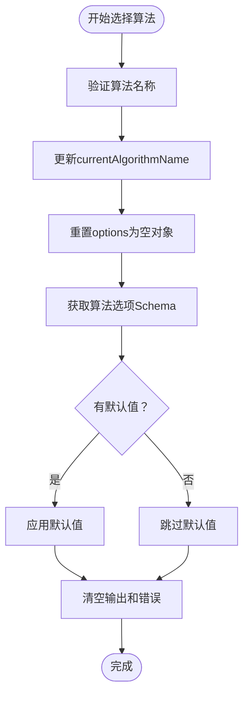

**图表来源**
- [useCrypto.ts](file://src/composables/useCrypto.ts#L57-L72)

#### 加密解密操作

useCrypto函数提供了完整的加密解密操作支持，包括错误处理和状态管理：

**章节来源**
- [useCrypto.ts](file://src/composables/useCrypto.ts#L74-L217)

### 算法注册表系统

AlgorithmRegistry类实现了单例模式的算法注册表系统，为整个应用提供了统一的算法管理服务。

#### 注册表设计模式

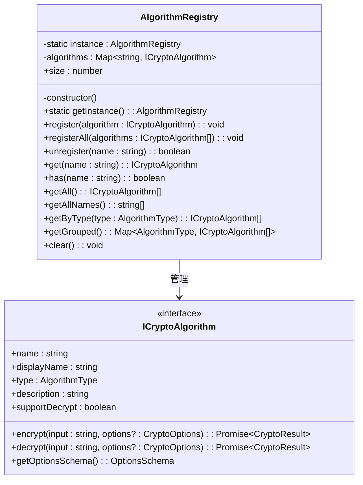

**图表来源**
- [AlgorithmRegistry.ts](file://src/core/registry/AlgorithmRegistry.ts#L1-L114)
- [crypto.ts](file://src/core/types/crypto.ts#L74-L91)

#### 算法分组实现

算法分组功能是注册表的核心特性之一，实现了按算法类型的智能分组：

**章节来源**
- [AlgorithmRegistry.ts](file://src/core/registry/AlgorithmRegistry.ts#L82-L95)

### 具体算法实现示例

为了更好地理解算法选择器的工作原理，我们分析几个具体的算法实现。

#### 哈希算法示例

MD5算法展示了简单哈希算法的实现模式：

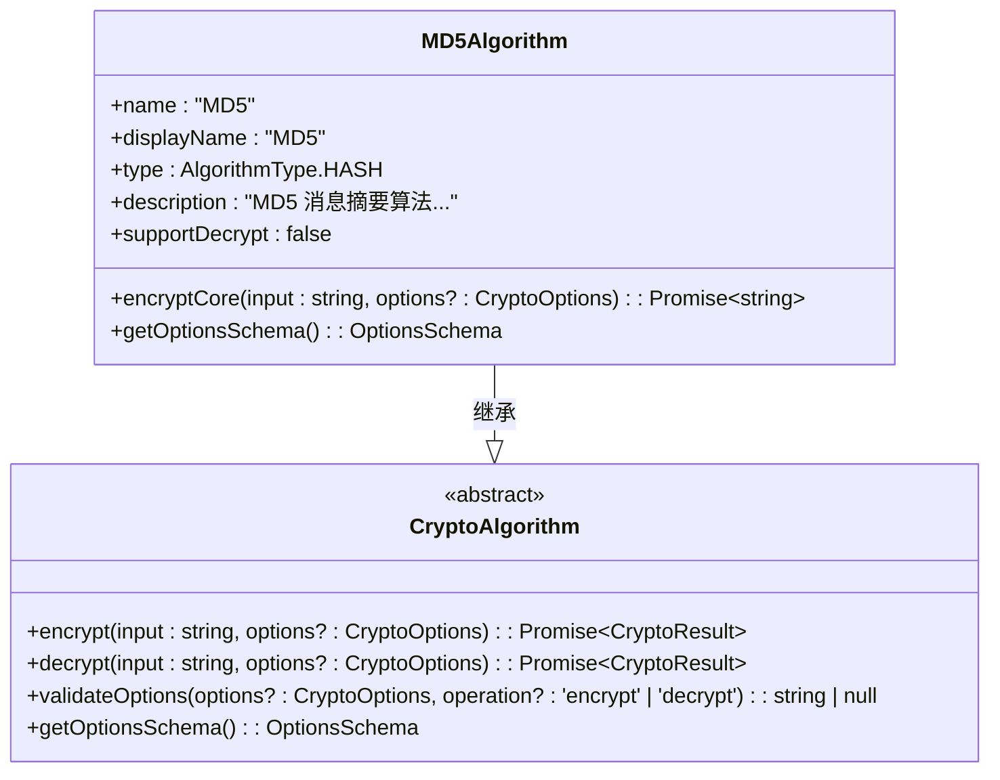

**图表来源**
- [MD5.ts](file://src/algorithms/hash/MD5.ts#L1-L28)
- [CryptoAlgorithm.ts](file://src/core/base/CryptoAlgorithm.ts#L1-L165)

#### 对称加密算法示例

AES算法展示了复杂对称加密算法的实现模式：

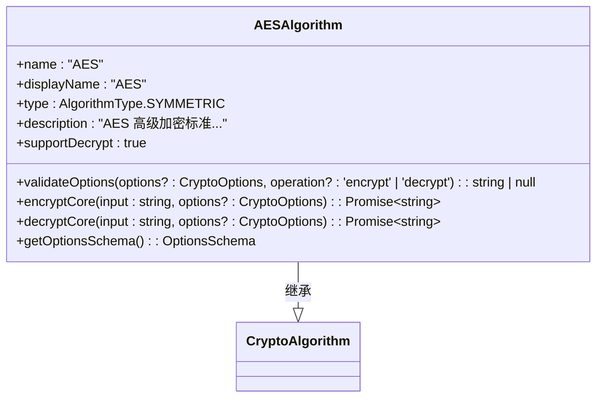

**图表来源**
- [AES.ts](file://src/algorithms/symmetric/AES.ts#L1-L171)
- [CryptoAlgorithm.ts](file://src/core/base/CryptoAlgorithm.ts#L1-L165)

**章节来源**
- [MD5.ts](file://src/algorithms/hash/MD5.ts#L1-L28)
- [AES.ts](file://src/algorithms/symmetric/AES.ts#L1-L171)

## 依赖关系分析

算法选择器组件的依赖关系体现了清晰的分层架构和模块化设计。

### 外部依赖

组件主要依赖于以下外部库和框架：

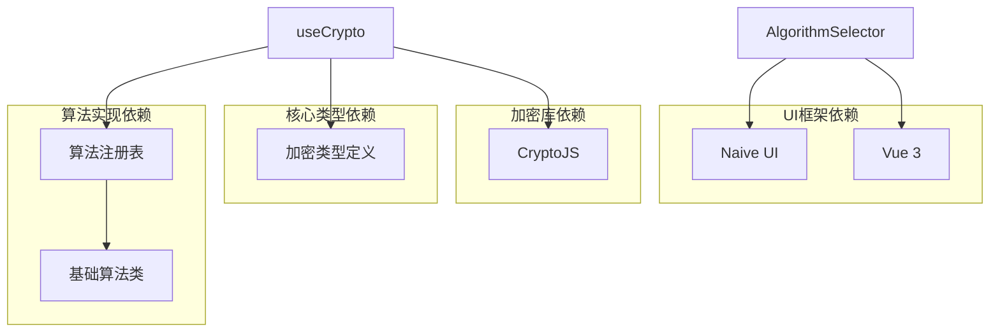

**图表来源**
- [AlgorithmSelector.vue](file://src/components/crypto/AlgorithmSelector.vue#L1-L63)
- [useCrypto.ts](file://src/composables/useCrypto.ts#L1-L217)

### 内部依赖关系

组件内部的依赖关系展现了良好的模块化设计：

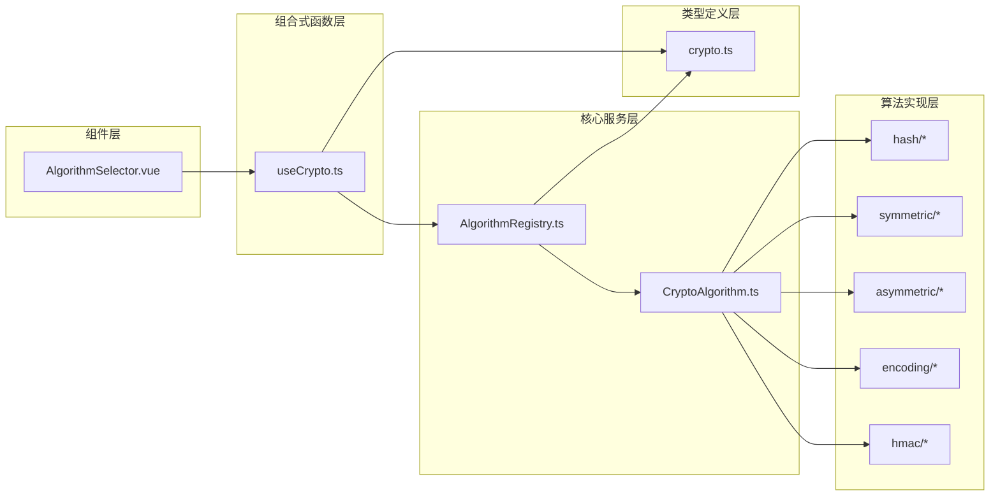

**图表来源**
- [AlgorithmSelector.vue](file://src/components/crypto/AlgorithmSelector.vue#L1-L63)
- [useCrypto.ts](file://src/composables/useCrypto.ts#L1-L217)
- [AlgorithmRegistry.ts](file://src/core/registry/AlgorithmRegistry.ts#L1-L114)

### 循环依赖检测

经过分析，组件之间不存在循环依赖关系，所有依赖都是单向的，符合模块化设计的最佳实践。

**章节来源**
- [AlgorithmSelector.vue](file://src/components/crypto/AlgorithmSelector.vue#L1-L63)
- [useCrypto.ts](file://src/composables/useCrypto.ts#L1-L217)
- [AlgorithmRegistry.ts](file://src/core/registry/AlgorithmRegistry.ts#L1-L114)

## 性能考虑

算法选择器组件在设计时充分考虑了性能优化，采用了多种策略来确保良好的用户体验。

### 响应式性能优化

1. **计算属性缓存**：使用Vue 3的计算属性实现智能缓存，避免不必要的重新计算
2. **懒加载策略**：算法信息只在需要时才进行转换和渲染
3. **事件防抖**：对于频繁触发的用户操作进行适当的防抖处理

### 内存管理

1. **单例模式**：AlgorithmRegistry使用单例模式避免重复实例化
2. **引用管理**：合理管理算法实例的生命周期，避免内存泄漏
3. **状态清理**：在算法切换时及时清理相关的状态和缓存

### 渲染优化

1. **虚拟滚动**：对于大量算法的情况，可以考虑实现虚拟滚动
2. **按需渲染**：只渲染当前可见的算法分组
3. **组件复用**：通过合理的组件设计实现更好的复用性

## 故障排除指南

在使用算法选择器组件时，可能会遇到各种问题。以下是常见问题的诊断和解决方法。

### 常见问题及解决方案

#### 算法无法显示

**问题描述**：算法选择器中没有显示任何算法选项

**可能原因**：
1. 算法未正确注册到AlgorithmRegistry
2. 算法注册过程出现异常
3. 算法类型定义不正确

**解决步骤**：
1. 检查算法注册是否在应用启动时执行
2. 验证算法类的继承关系
3. 确认算法名称的唯一性

#### 算法选择无效

**问题描述**：选择了算法但界面没有更新

**可能原因**：
1. 数据绑定出现问题
2. 状态更新逻辑错误
3. 计算属性缓存问题

**解决步骤**：
1. 检查`currentAlgorithmName`的双向绑定
2. 验证`selectAlgorithm`函数的调用链
3. 确认计算属性的依赖关系

#### 算法信息显示异常

**问题描述**：算法描述或标签显示不正确

**可能原因**：
1. 算法实例的属性设置错误
2. 标签颜色逻辑问题
3. 描述信息格式问题

**解决步骤**：
1. 检查算法实例的`description`和`supportDecrypt`属性
2. 验证标签颜色的判断逻辑
3. 确认描述信息的格式化

### 调试技巧

1. **使用Vue DevTools**：监控组件的状态变化和性能指标
2. **启用严格模式**：在开发环境中启用Vue的严格模式
3. **日志记录**：在关键位置添加适当的日志输出
4. **单元测试**：为关键功能编写单元测试

**章节来源**
- [useCrypto.ts](file://src/composables/useCrypto.ts#L74-L217)
- [AlgorithmSelector.vue](file://src/components/crypto/AlgorithmSelector.vue#L1-L63)

## 结论

算法选择器组件（AlgorithmSelector.vue）是一个设计精良、功能完整的加密算法选择界面。通过深入分析，我们可以看到该组件在以下几个方面表现出色：

### 设计优势

1. **模块化架构**：清晰的分层设计使得组件易于维护和扩展
2. **响应式设计**：充分利用Vue 3的响应式系统提供了流畅的用户体验
3. **类型安全**：完整的TypeScript类型定义确保了代码的健壮性
4. **可扩展性**：灵活的架构设计支持新算法的轻松集成

### 技术亮点

1. **智能分组**：按照密码学领域标准对算法进行分类展示
2. **实时同步**：与useCrypto组合式函数保持完美的状态同步
3. **Naive UI集成**：充分利用Naive UI的强大功能
4. **错误处理**：完善的错误处理机制确保了系统的稳定性

### 改进建议

1. **性能优化**：可以考虑实现虚拟滚动以支持大量算法的情况
2. **国际化支持**：增加多语言支持以扩大用户群体
3. **主题定制**：提供更多样式的定制选项
4. **无障碍访问**：增强无障碍访问功能

该组件为整个加密工具应用奠定了坚实的基础，其设计理念和实现方式值得其他类似项目借鉴和学习。

## 附录

### 组件属性配置

算法选择器组件支持以下配置选项：

| 属性名 | 类型 | 默认值 | 描述 |
|--------|------|--------|------|
| value | string | 'MD5' | 当前选中的算法名称 |
| options | Array | [] | 下拉选项数组 |
| placeholder | string | '请选择加密算法' | 占位符文本 |
| filterable | boolean | true | 是否启用过滤功能 |
| size | 'small' \| 'medium' \| 'large' | 'small' | 组件尺寸 |

### 样式定制选项

组件提供了丰富的样式定制选项：

1. **卡片样式**：可以通过CSS变量定制卡片的外观
2. **字体样式**：支持自定义字体大小和颜色
3. **间距控制**：通过CSS Grid实现灵活的布局控制
4. **响应式设计**：支持不同屏幕尺寸的自适应

### 扩展使用指南

#### 自定义算法集成

要添加新的算法到选择器中：

1. 创建算法类并继承`CryptoAlgorithm`基类
2. 在`src/algorithms/index.ts`中注册新算法
3. 确保算法类实现必要的接口方法
4. 测试算法的完整功能

#### 主题定制

可以通过以下方式定制组件主题：

1. 修改CSS变量来自定义颜色方案
2. 使用CSS类覆盖默认样式
3. 通过内联样式实现动态定制
4. 利用CSS Modules实现组件级样式隔离

#### 事件处理

组件支持以下事件：

1. `update:value`：算法选择变更事件
2. `focus`：组件获得焦点事件
3. `blur`：组件失去焦点事件
4. `change`：算法变更完成事件

**章节来源**
- [AlgorithmSelector.vue](file://src/components/crypto/AlgorithmSelector.vue#L27-L48)
- [useCrypto.ts](file://src/composables/useCrypto.ts#L196-L215)