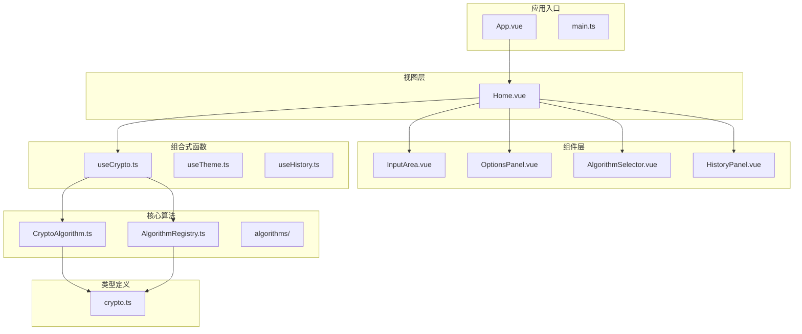
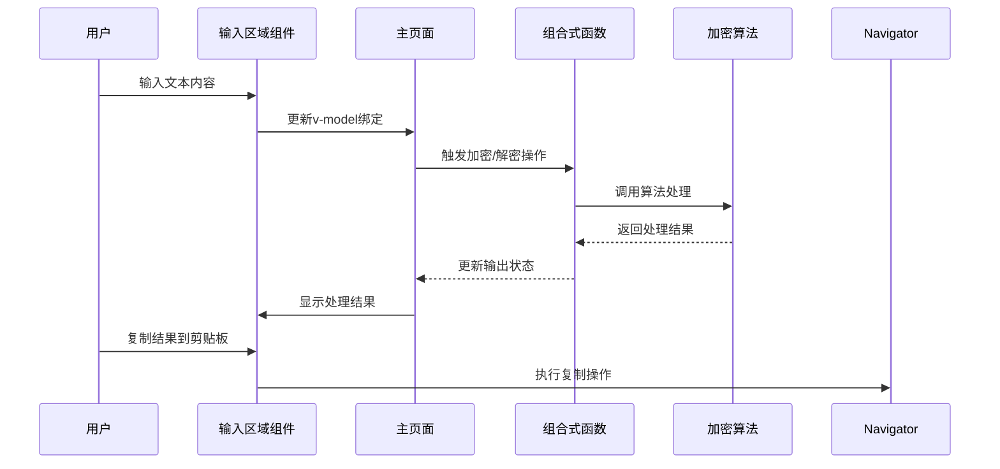
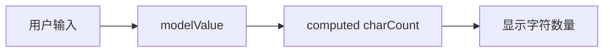
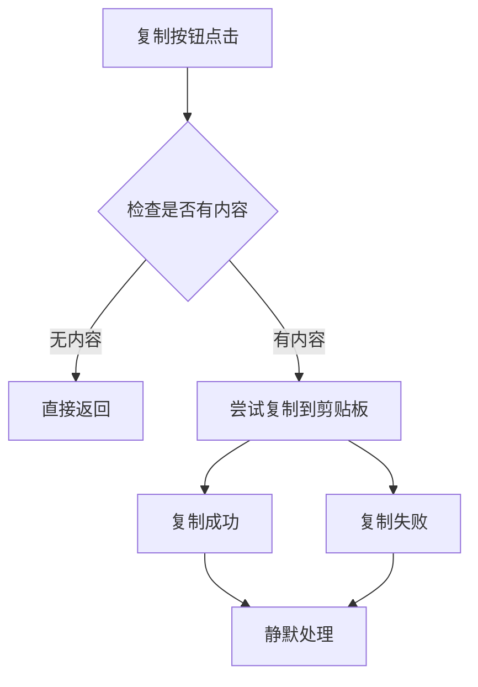
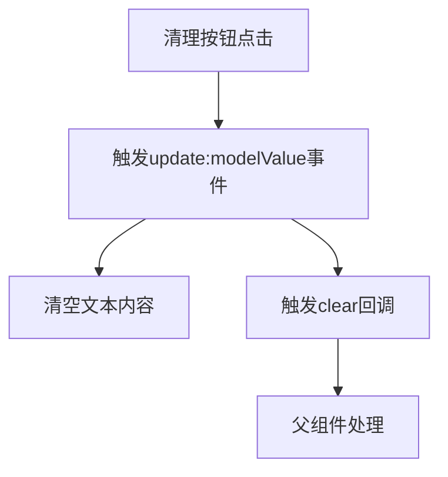
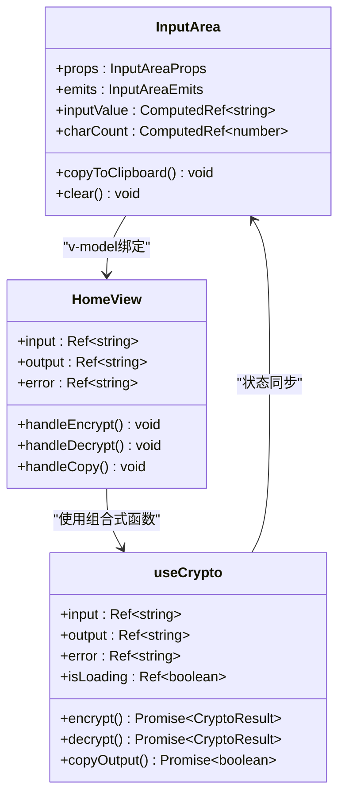
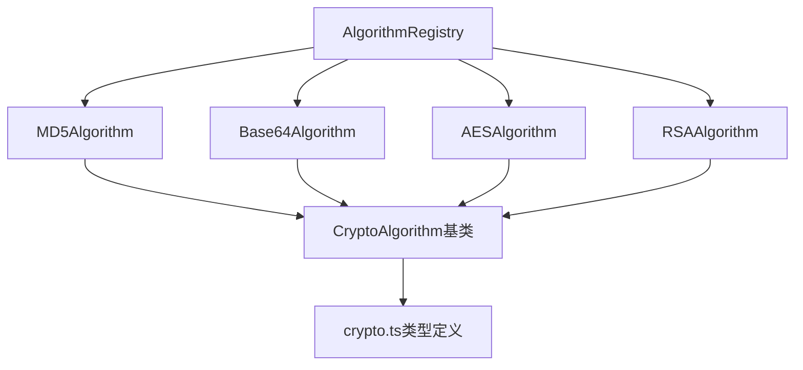
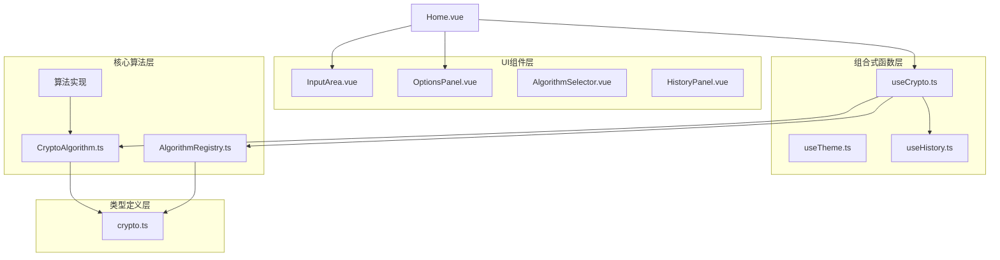

# 输入输出区域组件

<cite>
**本文档引用的文件**
- [InputArea.vue](file://src/components/crypto/InputArea.vue)
- [useCrypto.ts](file://src/composables/useCrypto.ts)
- [Home.vue](file://src/views/Home.vue)
- [OptionsPanel.vue](file://src/components/crypto/OptionsPanel.vue)
- [CryptoAlgorithm.ts](file://src/core/base/CryptoAlgorithm.ts)
- [AlgorithmRegistry.ts](file://src/core/registry/AlgorithmRegistry.ts)
- [crypto.ts](file://src/core/types/crypto.ts)
- [MD5.ts](file://src/algorithms/hash/MD5.ts)
- [Base64.ts](file://src/algorithms/encoding/Base64.ts)
- [App.vue](file://src/App.vue)
- [main.ts](file://src/main.ts)
</cite>

## 目录
1. [简介](#简介)
2. [项目结构](#项目结构)
3. [核心组件](#核心组件)
4. [架构概览](#架构概览)
5. [详细组件分析](#详细组件分析)
6. [依赖关系分析](#依赖关系分析)
7. [性能考虑](#性能考虑)
8. [故障排除指南](#故障排除指南)
9. [结论](#结论)

## 简介

输入输出区域组件(InputArea.vue)是加密工具应用中的核心UI组件，负责处理用户输入和显示加密/解密结果。该组件实现了完整的双向数据绑定机制、实时字符计数、文本复制功能和清理操作，为用户提供直观的加密工具界面。

## 项目结构

该项目采用模块化的Vue 3 + TypeScript架构，主要目录结构如下：



**图表来源**
- [App.vue](file://src/App.vue#L1-L33)
- [main.ts](file://src/main.ts#L1-L10)
- [Home.vue](file://src/views/Home.vue#L1-L220)

**章节来源**
- [App.vue](file://src/App.vue#L1-L33)
- [main.ts](file://src/main.ts#L1-L10)

## 核心组件

输入输出区域组件是整个加密工具的核心交互界面，具有以下关键特性：

### 组件功能特性
- **双向数据绑定**: 支持v-model双向绑定，实现输入输出的实时同步
- **实时字符统计**: 自动计算并显示文本字符数量
- **文本复制功能**: 一键复制结果到系统剪贴板
- **清理操作**: 支持清空输入输出内容
- **只读模式**: 输出区域支持只读显示
- **响应式设计**: 基于Naive UI组件库构建

### 数据流架构
组件通过Vue 3的computed属性实现响应式数据绑定，确保输入输出状态的实时更新。

**章节来源**
- [InputArea.vue](file://src/components/crypto/InputArea.vue#L1-L70)

## 架构概览

输入输出区域组件在整个应用架构中扮演着关键角色，连接用户界面与加密算法处理层：



**图表来源**
- [Home.vue](file://src/views/Home.vue#L19-L92)
- [useCrypto.ts](file://src/composables/useCrypto.ts#L74-L216)
- [InputArea.vue](file://src/components/crypto/InputArea.vue#L18-L37)

## 详细组件分析

### InputArea.vue 组件详解

#### 组件属性定义
组件通过props接收外部传入的配置参数：

| 属性名 | 类型 | 默认值 | 必需 | 描述 |
|--------|------|--------|------|------|
| modelValue | string | - | 是 | 绑定的文本值 |
| title | string | '输入' | 否 | 卡片标题 |
| placeholder | string | '请输入内容...' | 否 | 占位符文本 |
| readonly | boolean | false | 否 | 是否只读模式 |

#### 双向数据绑定机制
组件使用Vue 3的computed属性实现响应式绑定：

```mermaid
flowchart TD
Props[外部props.modelValue] --> Computed[computed属性]
Computed --> Getter[get: 返回props.modelValue]
Computed --> Setter[set: 触发update:modelValue事件]
Setter --> Emit[emit('update:modelValue', value)]
Emit --> Parent[父组件更新]
Parent --> Props
```

**图表来源**
- [InputArea.vue](file://src/components/crypto/InputArea.vue#L18-L21)

#### 实时字符计数功能
组件通过计算属性实时跟踪输入文本长度：



**图表来源**
- [InputArea.vue](file://src/components/crypto/InputArea.vue#L23-L23)

#### 文本复制功能实现
组件集成了现代浏览器的Clipboard API进行安全的文本复制：



**图表来源**
- [InputArea.vue](file://src/components/crypto/InputArea.vue#L25-L32)

#### 清理操作机制
清理功能通过触发自定义事件实现：



**图表来源**
- [InputArea.vue](file://src/components/crypto/InputArea.vue#L34-L37)

### 与加密业务逻辑的集成

#### 组合式函数useCrypto的协作
输入输出区域组件与useCrypto组合式函数紧密协作：



**图表来源**
- [InputArea.vue](file://src/components/crypto/InputArea.vue#L6-L16)
- [useCrypto.ts](file://src/composables/useCrypto.ts#L1-L217)
- [Home.vue](file://src/views/Home.vue#L19-L34)

#### 算法注册与管理
系统通过AlgorithmRegistry统一管理所有加密算法：



**图表来源**
- [AlgorithmRegistry.ts](file://src/core/registry/AlgorithmRegistry.ts#L1-L114)
- [CryptoAlgorithm.ts](file://src/core/base/CryptoAlgorithm.ts#L1-L165)
- [MD5.ts](file://src/algorithms/hash/MD5.ts#L1-L28)
- [Base64.ts](file://src/algorithms/encoding/Base64.ts#L1-L39)

**章节来源**
- [InputArea.vue](file://src/components/crypto/InputArea.vue#L1-L70)
- [useCrypto.ts](file://src/composables/useCrypto.ts#L74-L216)
- [Home.vue](file://src/views/Home.vue#L19-L92)

## 依赖关系分析

### 组件间依赖关系



**图表来源**
- [Home.vue](file://src/views/Home.vue#L1-L220)
- [InputArea.vue](file://src/components/crypto/InputArea.vue#L1-L70)
- [OptionsPanel.vue](file://src/components/crypto/OptionsPanel.vue#L1-L129)
- [useCrypto.ts](file://src/composables/useCrypto.ts#L1-L217)

### 外部依赖分析

组件依赖的主要外部库和框架：

| 依赖项 | 版本 | 用途 | 重要性 |
|--------|------|------|--------|
| Vue 3 | ^3.2.0 | 响应式框架 | 核心 |
| Naive UI | ^2.32.0 | UI组件库 | 核心 |
| TypeScript | ^4.0.0 | 类型系统 | 核心 |
| CryptoJS | ^4.1.1 | 加密算法库 | 核心 |

**章节来源**
- [InputArea.vue](file://src/components/crypto/InputArea.vue#L1-L2)
- [Home.vue](file://src/views/Home.vue#L1-L15)

## 性能考虑

### 内存优化策略
- 使用computed属性避免不必要的重新渲染
- 通过v-model实现双向绑定减少DOM操作
- 合理的组件拆分降低单个组件的复杂度

### 运行时性能
- Clipboard API异步调用避免阻塞主线程
- 条件渲染确保只有在需要时才执行复制操作
- 字符计数计算使用轻量级的计算属性

### 可扩展性设计
- 组件接口设计支持未来功能扩展
- 算法注册机制便于添加新算法
- 组合式函数分离关注点提高代码复用性

## 故障排除指南

### 常见问题及解决方案

#### 复制功能失效
**问题**: 点击复制按钮无反应
**可能原因**:
- 浏览器不支持Clipboard API
- HTTPS环境限制
- 权限不足

**解决方案**:
- 检查浏览器兼容性
- 确保在HTTPS环境下运行
- 提供降级方案或用户提示

#### 输入验证问题
**问题**: 输入验证规则不生效
**可能原因**:
- 算法实现中的验证逻辑缺失
- 选项配置不当

**解决方案**:
- 检查算法基类的验证方法
- 确认选项Schema定义正确

#### 性能问题
**问题**: 大文本输入时响应缓慢
**可能原因**:
- 计算属性过于复杂
- DOM渲染压力过大

**解决方案**:
- 优化计算属性逻辑
- 考虑虚拟滚动或分页显示

**章节来源**
- [InputArea.vue](file://src/components/crypto/InputArea.vue#L25-L32)
- [CryptoAlgorithm.ts](file://src/core/base/CryptoAlgorithm.ts#L23-L75)

## 结论

输入输出区域组件作为加密工具应用的核心界面组件，展现了现代前端开发的最佳实践。通过精心设计的架构和清晰的职责分离，该组件不仅提供了优秀的用户体验，还具备良好的可维护性和扩展性。

组件的主要优势包括：
- **简洁的API设计**: 通过props和emits实现清晰的接口
- **响应式数据绑定**: 利用Vue 3的computed属性实现高效的数据同步
- **完善的错误处理**: 包容性的错误处理机制提升用户体验
- **模块化架构**: 与组合式函数和算法系统的良好集成

未来可以考虑的功能增强方向：
- 添加输入内容的格式验证
- 实现撤销/重做功能
- 增强键盘快捷键支持
- 优化大文本处理性能