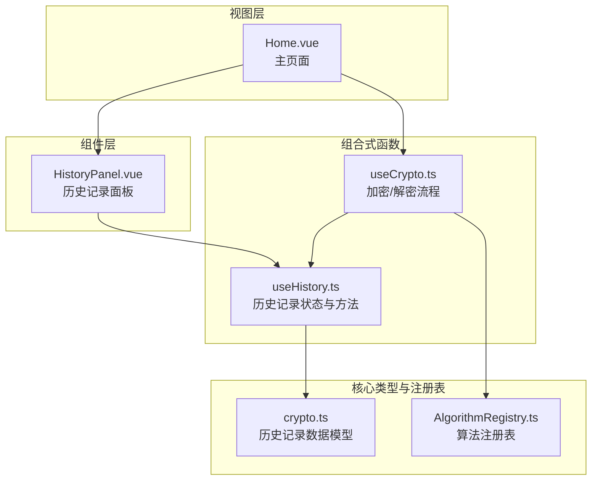
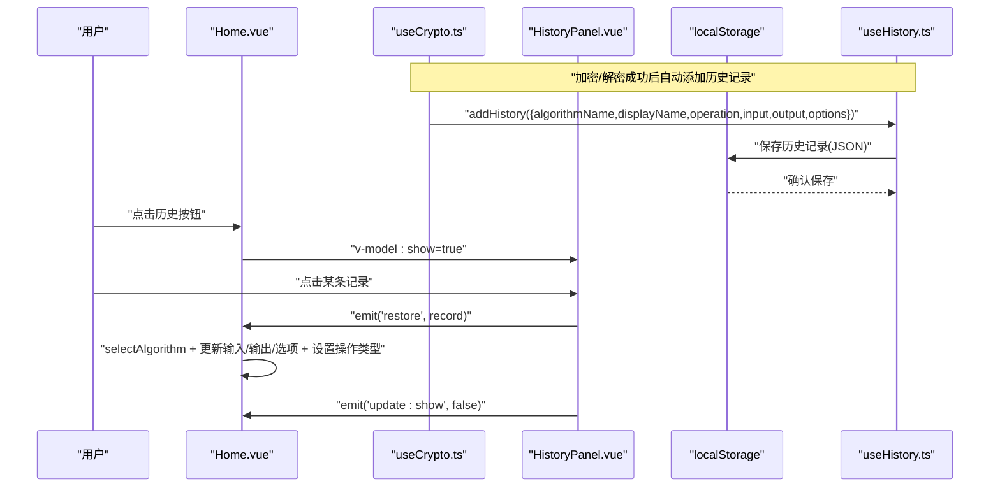
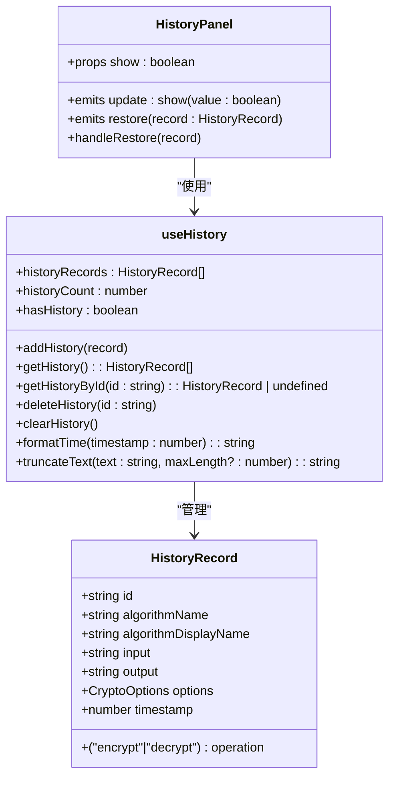
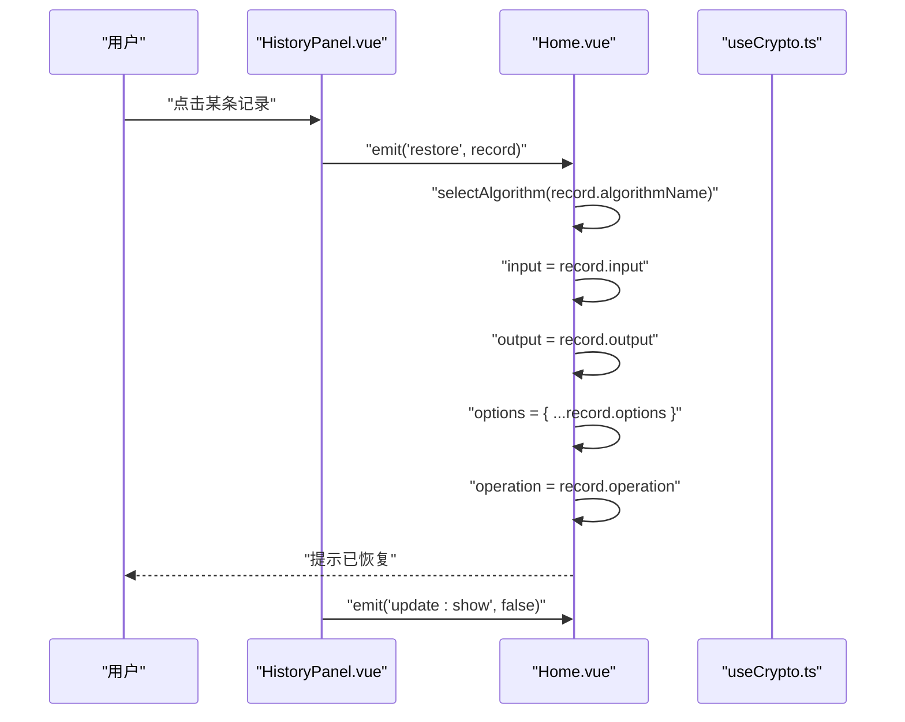
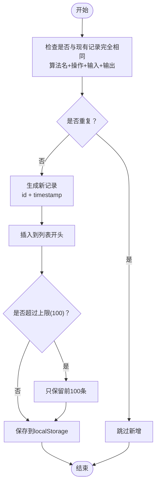
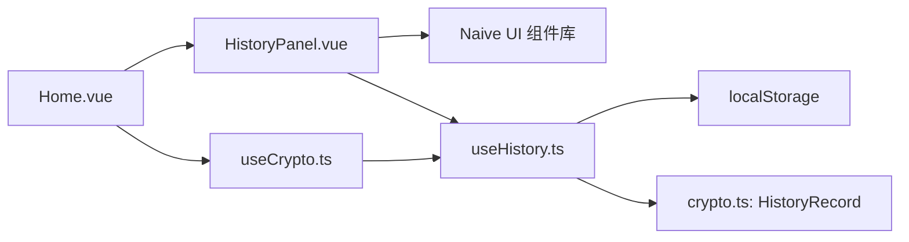

# 历史记录面板

<cite>
**本文档引用的文件**
- [HistoryPanel.vue](file://src/components/history/HistoryPanel.vue)
- [useHistory.ts](file://src/composables/useHistory.ts)
- [crypto.ts](file://src/core/types/crypto.ts)
- [Home.vue](file://src/views/Home.vue)
- [useCrypto.ts](file://src/composables/useCrypto.ts)
- [AlgorithmRegistry.ts](file://src/core/registry/AlgorithmRegistry.ts)
</cite>

## 目录
1. [简介](#简介)
2. [项目结构](#项目结构)
3. [核心组件](#核心组件)
4. [架构总览](#架构总览)
5. [详细组件分析](#详细组件分析)
6. [依赖关系分析](#依赖关系分析)
7. [性能考虑](#性能考虑)
8. [故障排除指南](#故障排除指南)
9. [结论](#结论)
10. [附录](#附录)

## 简介
本文件面向开发者与产品人员，系统性阐述历史记录面板组件的设计架构与实现细节。该组件负责在应用右侧以抽屉形式展示用户的加密/解密历史记录，支持浏览、删除单条记录、清空全部记录以及从历史记录快速恢复到界面状态。组件通过组合式函数管理本地持久化的历史数据，并与主页面进行事件通信以完成“恢复”操作。

## 项目结构
历史记录面板位于组件层的 history 目录下，配合可复用的组合式函数实现状态与业务逻辑，数据模型定义于核心类型模块中，最终由主页集成使用。

图表来源
- [HistoryPanel.vue](file://src/components/history/HistoryPanel.vue#L1-L138)
- [useHistory.ts](file://src/composables/useHistory.ts#L1-L153)
- [crypto.ts](file://src/core/types/crypto.ts#L93-L104)
- [Home.vue](file://src/views/Home.vue#L1-L220)
- [useCrypto.ts](file://src/composables/useCrypto.ts#L1-L217)
- [AlgorithmRegistry.ts](file://src/core/registry/AlgorithmRegistry.ts#L1-L114)

章节来源
- [HistoryPanel.vue](file://src/components/history/HistoryPanel.vue#L1-L138)
- [useHistory.ts](file://src/composables/useHistory.ts#L1-L153)
- [crypto.ts](file://src/core/types/crypto.ts#L93-L104)
- [Home.vue](file://src/views/Home.vue#L1-L220)
- [useCrypto.ts](file://src/composables/useCrypto.ts#L1-L217)
- [AlgorithmRegistry.ts](file://src/core/registry/AlgorithmRegistry.ts#L1-L114)

## 核心组件
- 组件名称：HistoryPanel.vue
- 组件职责：
  - 展示历史记录抽屉（右侧滑出）
  - 提供清空全部历史记录的确认操作
  - 列表项点击触发“恢复”事件
  - 单条记录删除按钮
  - 记录预览（输入/输出文本截断显示）
  - 时间格式化与文本截断工具
- 数据来源：useHistory 组合式函数提供的历史记录列表与工具方法
- 交互方式：通过事件向父组件传递“恢复”和“更新显示状态”信号

章节来源
- [HistoryPanel.vue](file://src/components/history/HistoryPanel.vue#L1-L138)
- [useHistory.ts](file://src/composables/useHistory.ts#L36-L152)

## 架构总览
历史记录功能采用“组件 + 组合式函数 + 类型定义”的分层设计：
- 视图层：HistoryPanel.vue 使用 Naive UI 抽屉、列表等组件渲染
- 逻辑层：useHistory.ts 管理历史记录状态、持久化、去重、格式化与截断
- 数据层：crypto.ts 定义 HistoryRecord 结构；localStorage 作为持久化介质
- 集成层：Home.vue 通过事件与 HistoryPanel 通信，调用 useCrypto 的 addHistory 自动记录

图表来源
- [Home.vue](file://src/views/Home.vue#L75-L85)
- [useCrypto.ts](file://src/composables/useCrypto.ts#L97-L105)
- [useHistory.ts](file://src/composables/useHistory.ts#L44-L73)
- [HistoryPanel.vue](file://src/components/history/HistoryPanel.vue#L30-L33)

## 详细组件分析

### 历史记录数据模型
- 关键字段
  - id：字符串，唯一标识
  - algorithmName：字符串，算法内部名称
  - algorithmDisplayName：字符串，算法显示名称
  - operation：枚举值，'encrypt' 或 'decrypt'
  - input：字符串，输入内容
  - output：字符串，输出内容
  - options：可选，加密选项快照
  - timestamp：数字，毫秒级时间戳
- 设计要点
  - 通过 options 快照记录当时使用的参数，便于恢复
  - 采用时间戳便于排序与格式化

章节来源
- [crypto.ts](file://src/core/types/crypto.ts#L93-L104)

### 历史记录存储机制
- 持久化介质：浏览器 localStorage
- 键名：固定常量，避免冲突
- 读取策略：解析 JSON 字符串，异常时返回空数组
- 写入策略：JSON 序列化后写入；若写入异常则回退为保留一半容量的记录集
- 去重策略：比较算法名、操作类型、输入、输出四要素，完全一致则跳过新增
- 数量限制：最大 100 条，超出时仅保留最新 100 条
- 初始化：组件挂载时从 localStorage 读取并注入响应式状态

章节来源
- [useHistory.ts](file://src/composables/useHistory.ts#L4-L26)
- [useHistory.ts](file://src/composables/useHistory.ts#L44-L73)
- [useHistory.ts](file://src/composables/useHistory.ts#L34)

### 展示逻辑与交互
- 抽屉宽度：400 像素，右侧滑出
- 头部区域：标题“历史记录”，右侧清空按钮（带确认弹窗）
- 列表为空时显示“暂无历史记录”
- 列表项布局：
  - 头部：算法名 + 操作标签（加密/解密）
  - 描述：格式化的时间
  - 预览：输入/输出文本截断显示
  - 后缀：删除按钮（点击阻止冒泡，避免误触列表项点击）
- 交互行为：
  - 点击列表项：触发 restore 事件并关闭抽屉
  - 点击删除按钮：删除对应记录并持久化
  - 点击清空：弹出确认对话框，确认后清空并移除本地存储

章节来源
- [HistoryPanel.vue](file://src/components/history/HistoryPanel.vue#L37-L112)
- [HistoryPanel.vue](file://src/components/history/HistoryPanel.vue#L63-L110)
- [HistoryPanel.vue](file://src/components/history/HistoryPanel.vue#L28-L33)

### 时间格式化与文本截断
- 时间格式化：根据与当前时间差，分别返回“刚刚”、“X分钟前”、“今天 HH:mm”、“昨天 HH:mm”或“M/D HH:mm”
- 文本截断：默认截断长度 50，可传入自定义长度，超过则追加省略号

章节来源
- [useHistory.ts](file://src/composables/useHistory.ts#L100-L136)

### 与主页面的集成
- Home.vue 中通过 v-model:show 控制抽屉显隐
- 监听算法变化时重置操作类型（若不支持解密则强制为加密）
- 接收 restore 事件后：
  - 选择算法
  - 设置输入/输出
  - 若存在 options，则合并到当前选项
  - 设置操作类型（encrypt 或 decrypt）
- 加密/解密成功后，useCrypto.ts 调用 useHistory 的 addHistory 自动记录

章节来源
- [Home.vue](file://src/views/Home.vue#L16-L34)
- [Home.vue](file://src/views/Home.vue#L75-L85)
- [useCrypto.ts](file://src/composables/useCrypto.ts#L97-L105)
- [useCrypto.ts](file://src/composables/useCrypto.ts#L146-L154)

### 组件类图（代码级）

图表来源
- [HistoryPanel.vue](file://src/components/history/HistoryPanel.vue#L19-L33)
- [useHistory.ts](file://src/composables/useHistory.ts#L36-L152)
- [crypto.ts](file://src/core/types/crypto.ts#L93-L104)

### 恢复流程时序图

图表来源
- [HistoryPanel.vue](file://src/components/history/HistoryPanel.vue#L30-L33)
- [Home.vue](file://src/views/Home.vue#L75-L85)

### 历史记录添加流程（去重与截断）流程图

图表来源
- [useHistory.ts](file://src/composables/useHistory.ts#L44-L73)
- [useHistory.ts](file://src/composables/useHistory.ts#L67-L69)
- [useHistory.ts](file://src/composables/useHistory.ts#L18-L26)

## 依赖关系分析
- 组件依赖
  - HistoryPanel.vue 依赖 Naive UI 组件（抽屉、列表、标签、按钮、空间、空状态、确认弹窗、文本）
  - HistoryPanel.vue 依赖 useHistory 组合式函数
  - HistoryPanel.vue 依赖 HistoryRecord 类型
- 业务依赖
  - useCrypto.ts 在加密/解密成功后调用 addHistory 自动记录
  - Home.vue 通过事件接收恢复请求并更新界面状态
- 数据依赖
  - useHistory.ts 依赖 localStorage 进行持久化
  - useHistory.ts 依赖 crypto.ts 的 HistoryRecord 类型

图表来源
- [HistoryPanel.vue](file://src/components/history/HistoryPanel.vue#L1-L18)
- [useHistory.ts](file://src/composables/useHistory.ts#L1-L34)
- [crypto.ts](file://src/core/types/crypto.ts#L93-L104)
- [useCrypto.ts](file://src/composables/useCrypto.ts#L75-L105)
- [Home.vue](file://src/views/Home.vue#L1-L20)

章节来源
- [HistoryPanel.vue](file://src/components/history/HistoryPanel.vue#L1-L18)
- [useHistory.ts](file://src/composables/useHistory.ts#L1-L34)
- [crypto.ts](file://src/core/types/crypto.ts#L93-L104)
- [useCrypto.ts](file://src/composables/useCrypto.ts#L75-L105)
- [Home.vue](file://src/views/Home.vue#L1-L20)

## 性能考虑
- 渲染性能
  - 列表项使用 v-for + key（id），避免不必要的重排
  - 列表项点击与删除按钮点击均阻止事件冒泡，减少不必要的事件处理
- 存储性能
  - localStorage 读写为同步操作，但数据量小（最多 100 条），影响有限
  - 写入失败时自动回退为半数容量，避免异常导致数据丢失
- 计算性能
  - 时间格式化与文本截断均为轻量计算，按需调用
  - 去重比较仅在新增时执行，复杂度 O(n)
- 内存占用
  - 历史记录为纯文本，单条记录体积较小；上限 100 条，内存占用可控

## 故障排除指南
- 历史记录无法保存
  - 检查浏览器是否禁用 localStorage
  - 查看控制台是否有 JSON 解析/序列化异常
  - 确认未超过存储配额
- 历史记录显示为空
  - 确认 addHistory 是否被调用（加密/解密成功后会自动记录）
  - 检查 localStorage 中键名是否正确
- 删除无效
  - 确认传入的 id 是否正确
  - 检查事件冒泡是否被阻止（删除按钮已阻止冒泡）
- 清空确认弹窗无效
  - 确认 hasHistory 计算属性是否正确
  - 检查 Naive UI 版本兼容性

章节来源
- [useHistory.ts](file://src/composables/useHistory.ts#L8-L15)
- [useHistory.ts](file://src/composables/useHistory.ts#L18-L26)
- [HistoryPanel.vue](file://src/components/history/HistoryPanel.vue#L47-L57)

## 结论
历史记录面板通过清晰的职责划分与简洁的交互设计，实现了对用户操作历史的可靠记录与便捷恢复。其基于 localStorage 的持久化策略简单可靠，结合去重与容量限制，兼顾了实用性与性能。组件与主页面的事件通信设计使得“恢复”体验自然流畅，适合在多算法场景下复用与扩展。

## 附录

### 组件配置参数与事件
- 属性
  - show: boolean，控制抽屉显示/隐藏
- 事件
  - update:show(value: boolean)，用于双向绑定控制抽屉显隐
  - restore(record: HistoryRecord)，用于通知父组件恢复历史记录

章节来源
- [HistoryPanel.vue](file://src/components/history/HistoryPanel.vue#L19-L26)

### 样式定制建议
- 抽屉宽度：可通过 props 或外部容器调整宽度
- 列表项样式：可针对 .record-preview 和 .preview-item 进行自定义
- 标签颜色：操作标签（加密/解密）的颜色可根据业务需要调整
- 文本截断长度：truncateText 支持自定义长度，可在模板中传参

章节来源
- [HistoryPanel.vue](file://src/components/history/HistoryPanel.vue#L37-L41)
- [HistoryPanel.vue](file://src/components/history/HistoryPanel.vue#L125-L136)
- [useHistory.ts](file://src/composables/useHistory.ts#L132-L136)

### 扩展与定制方案
- 搜索与过滤
  - 在 useHistory 中增加过滤函数，按算法名、操作类型、时间范围、输入/输出关键字过滤
  - 在 HistoryPanel 中增加搜索输入框与过滤逻辑
- 批量管理
  - 增加全选/反选与批量删除功能
  - 增加导出/导入历史记录（JSON/CSV）
- 高级展示
  - 增加“最近一次”、“今日统计”等快捷摘要
  - 支持按日期分组展示
- 性能优化
  - 列表虚拟滚动（当历史记录数量增长时）
  - 异步加载与懒加载
- 用户体验
  - 增加“一键复制全部历史”功能
  - 支持键盘快捷键（如 Esc 关闭抽屉）