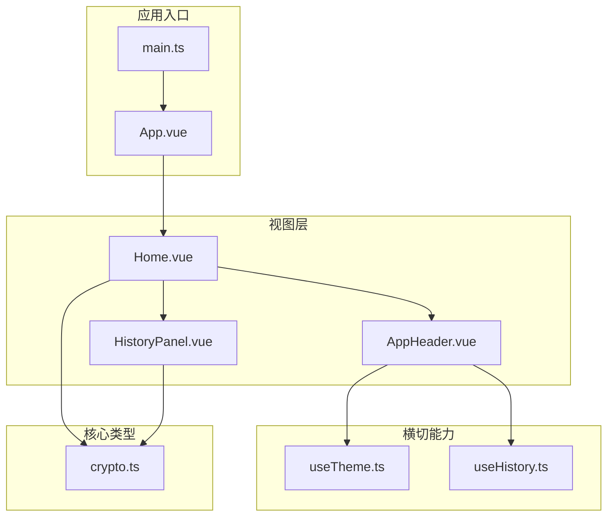
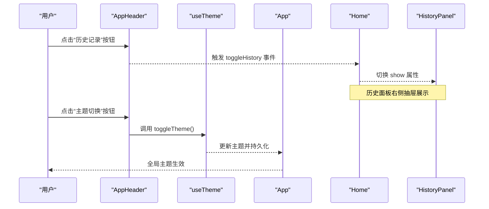
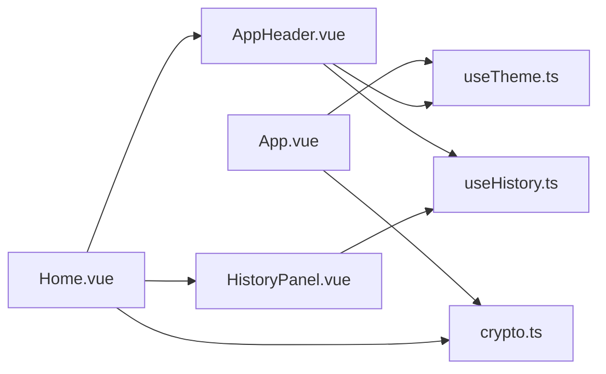

# 布局组件

<cite>
**本文引用的文件**
- [AppHeader.vue](file://src/components/layout/AppHeader.vue)
- [useTheme.ts](file://src/composables/useTheme.ts)
- [useHistory.ts](file://src/composables/useHistory.ts)
- [App.vue](file://src/App.vue)
- [Home.vue](file://src/views/Home.vue)
- [HistoryPanel.vue](file://src/components/history/HistoryPanel.vue)
- [crypto.ts](file://src/core/types/crypto.ts)
- [index.ts](file://src/algorithms/index.ts)
- [main.ts](file://src/main.ts)
- [package.json](file://package.json)
- [vite.config.ts](file://vite.config.ts)
</cite>

## 目录
1. [简介](#简介)
2. [项目结构](#项目结构)
3. [核心组件](#核心组件)
4. [架构总览](#架构总览)
5. [详细组件分析](#详细组件分析)
6. [依赖关系分析](#依赖关系分析)
7. [性能考量](#性能考量)
8. [故障排查指南](#故障排查指南)
9. [结论](#结论)
10. [附录](#附录)

## 简介
本文件聚焦于应用头部组件的设计与实现，系统阐述其导航结构、主题切换、响应式布局与用户界面定制能力，并提供视觉设计规范、交互行为与可访问性支持说明。同时给出组件属性配置、样式覆盖与品牌定制的完整指南，以及面向开发者的扩展与二次开发建议。

## 项目结构
该应用采用基于 Vue 3 + Naive UI 的前端架构，布局组件位于组件层，通过组合式函数提供主题与历史记录等横切能力，视图层负责整体页面布局与业务逻辑编排。

图表来源
- [main.ts](file://src/main.ts#L1-L10)
- [App.vue](file://src/App.vue#L1-L33)
- [Home.vue](file://src/views/Home.vue#L1-L220)
- [AppHeader.vue](file://src/components/layout/AppHeader.vue#L1-L78)
- [HistoryPanel.vue](file://src/components/history/HistoryPanel.vue#L1-L138)
- [useTheme.ts](file://src/composables/useTheme.ts#L1-L53)
- [useHistory.ts](file://src/composables/useHistory.ts#L1-L153)
- [crypto.ts](file://src/core/types/crypto.ts#L1-L104)

章节来源
- [main.ts](file://src/main.ts#L1-L10)
- [App.vue](file://src/App.vue#L1-L33)
- [Home.vue](file://src/views/Home.vue#L1-L220)

## 核心组件
- 应用头部组件：提供品牌标识、历史记录入口与主题切换入口，统一承载顶部导航与控制区。
- 主题组合式函数：管理深浅色主题状态、持久化与全局主题注入。
- 历史记录组合式函数：管理历史记录的增删改查、去重、截断与本地存储。
- 视图容器：组织页面布局、绑定头部与侧边历史面板，并处理交互事件。

章节来源
- [AppHeader.vue](file://src/components/layout/AppHeader.vue#L1-L78)
- [useTheme.ts](file://src/composables/useTheme.ts#L1-L53)
- [useHistory.ts](file://src/composables/useHistory.ts#L1-L153)
- [Home.vue](file://src/views/Home.vue#L1-L220)

## 架构总览
头部组件作为视图容器的子组件，通过事件与组合式函数协作，实现主题切换与历史面板的开合控制；应用根组件负责全局主题注入与全局样式提供。

图表来源
- [AppHeader.vue](file://src/components/layout/AppHeader.vue#L1-L78)
- [useTheme.ts](file://src/composables/useTheme.ts#L1-L53)
- [App.vue](file://src/App.vue#L1-L33)
- [Home.vue](file://src/views/Home.vue#L1-L220)
- [HistoryPanel.vue](file://src/components/history/HistoryPanel.vue#L1-L138)

## 详细组件分析

### 应用头部组件（AppHeader）
- 组件职责
  - 品牌标识：包含图标与名称，用于品牌识别与导航回退。
  - 历史记录入口：通过徽章显示历史数量，点击打开右侧历史面板。
  - 主题切换入口：根据当前主题显示太阳/月亮图标，点击切换深浅色。
  - 响应式布局：在移动端与桌面端保持一致的间距与对齐方式。
- 交互行为
  - 历史记录按钮：悬停提示“历史记录”，点击触发父组件事件以切换历史面板显示状态。
  - 主题切换按钮：悬停提示“切换到深色模式/浅色模式”，点击调用主题切换函数。
- 可访问性支持
  - 使用语义化的按钮与提示组件，确保键盘可达与屏幕阅读器友好。
  - 提示文案明确表达操作意图，避免仅依赖图标传达信息。
- 视觉设计规范
  - 高度与内边距：固定高度与左右内边距，保证在不同分辨率下的一致性。
  - 字体与字号：品牌文字采用较大字号与中等字重，强调品牌感。
  - 图标尺寸：品牌图标与操作图标分别设置合适尺寸，确保可读性。
- 样式覆盖与品牌定制
  - 支持通过作用域样式或全局样式覆盖默认尺寸、颜色与字体。
  - 建议在应用根组件注入全局样式，确保主题切换时的视觉一致性。
- 扩展与二次开发
  - 可新增菜单项或下拉菜单，但需保持与现有布局的协调。
  - 可引入国际化支持，将提示文案与品牌名称本地化。
  - 可增加多语言切换、用户头像与设置入口等扩展点。

章节来源
- [AppHeader.vue](file://src/components/layout/AppHeader.vue#L1-L78)

### 主题切换（useTheme）
- 设计理念
  - 以组合式函数封装主题状态与持久化，降低耦合并提升复用性。
  - 默认跟随系统主题，允许用户手动切换并持久化到本地存储。
  - 通过全局主题注入 Naive UI，实现全站主题一致。
- 实现要点
  - 状态管理：使用响应式引用维护深浅色状态，计算属性派生 Naive UI 主题对象。
  - 持久化：监听状态变化，将主题偏好写入本地存储，并更新 body 类名以供全局样式使用。
  - 默认策略：若未设置主题偏好，则跟随系统深色模式。
- 性能与可靠性
  - 监听器在初始化时立即执行，确保首次渲染即正确应用主题。
  - 本地存储异常时不会阻塞应用启动，具备降级容错能力。
- 可访问性与可用性
  - 通过 body 类名与颜色方案联动，满足高对比度与色盲友好需求。
  - 提供明确的主题名称与切换提示，便于用户理解当前状态。

章节来源
- [useTheme.ts](file://src/composables/useTheme.ts#L1-L53)
- [App.vue](file://src/App.vue#L1-L33)

### 历史记录（useHistory）
- 设计理念
  - 以组合式函数集中管理历史记录的增删改查、去重与截断，保障数据一致性与性能。
  - 本地存储持久化，支持跨会话恢复最近操作。
- 实现要点
  - 数据模型：历史记录包含算法名称、操作类型、输入输出、选项与时间戳等关键字段。
  - 去重策略：基于算法、操作、输入与输出四要素判断重复，避免冗余记录。
  - 截断机制：超过最大容量时自动截断至一半，防止存储溢出。
  - 时间格式化：提供人性化的时间显示，如“刚刚”、“X分钟前”、“今天/昨天”等。
- 性能与可靠性
  - 本地存储读写采用异步策略，失败时进行安全降级与数据修复。
  - 计算属性缓存历史数量与存在性，减少不必要的渲染。
- 可访问性与可用性
  - 历史面板提供清空确认与逐条删除，避免误操作。
  - 预览文本支持截断，兼顾信息完整性与可读性。

章节来源
- [useHistory.ts](file://src/composables/useHistory.ts#L1-L153)
- [crypto.ts](file://src/core/types/crypto.ts#L93-L104)

### 视图容器与交互编排（Home）
- 页面布局
  - 采用网格布局，左侧为算法选择与参数配置，右侧为输入输出区域与操作按钮。
  - 内容区域采用卡片与间距，确保信息层次清晰。
- 事件编排
  - 头部组件通过事件通知容器切换历史面板显示状态。
  - 容器负责历史记录恢复、算法切换、输入输出交换与复制等业务逻辑。
- 响应式设计
  - 在小屏设备上，左侧与右侧区域堆叠显示，保证内容可读性。
  - 按钮与卡片在窄屏下自动换行，避免拥挤。

章节来源
- [Home.vue](file://src/views/Home.vue#L1-L220)

### 历史面板（HistoryPanel）
- 功能特性
  - 右侧抽屉式展示历史列表，支持逐条恢复与删除。
  - 提供清空全部历史的确认对话框，避免误删。
  - 时间格式化与预览文本截断，提升浏览效率。
- 交互行为
  - 点击历史项触发恢复事件并关闭抽屉。
  - 右侧操作按钮仅在对应项上可见，避免干扰主列表。
- 可访问性
  - 使用语义化列表与按钮，支持键盘导航与屏幕阅读器。
  - 确认对话框提供明确的操作反馈。

章节来源
- [HistoryPanel.vue](file://src/components/history/HistoryPanel.vue#L1-L138)

## 依赖关系分析
- 组件依赖
  - AppHeader 依赖 useTheme 与 useHistory，通过事件与状态驱动交互。
  - Home 依赖 AppHeader 与 HistoryPanel，并通过组合式函数协调业务逻辑。
  - App 依赖 useTheme 进行全局主题注入。
- 外部依赖
  - Naive UI 提供布局、按钮、抽屉、消息等 UI 组件。
  - @vicons/ionicons5 提供图标资源。
  - 本地存储用于主题与历史记录持久化。
- 潜在风险
  - 本地存储异常可能导致主题或历史记录不可用，需做好降级处理。
  - 大量历史记录可能影响渲染性能，需结合截断与懒加载优化。

图表来源
- [App.vue](file://src/App.vue#L1-L33)
- [Home.vue](file://src/views/Home.vue#L1-L220)
- [AppHeader.vue](file://src/components/layout/AppHeader.vue#L1-L78)
- [HistoryPanel.vue](file://src/components/history/HistoryPanel.vue#L1-L138)
- [useTheme.ts](file://src/composables/useTheme.ts#L1-L53)
- [useHistory.ts](file://src/composables/useHistory.ts#L1-L153)
- [crypto.ts](file://src/core/types/crypto.ts#L1-L104)

章节来源
- [package.json](file://package.json#L12-L25)
- [vite.config.ts](file://vite.config.ts#L1-L13)

## 性能考量
- 主题切换
  - 通过计算属性派生主题对象，避免频繁重建主题实例。
  - 本地存储写入采用节流策略，减少频繁 IO。
- 历史记录
  - 去重与截断在内存中完成，避免频繁读写本地存储。
  - 列表渲染使用虚拟滚动或分页策略，可进一步优化长列表性能。
- 响应式布局
  - 使用媒体查询与栅格系统，确保在不同设备上的渲染性能。
- 资源加载
  - 图标按需加载，避免一次性加载过多资源。

## 故障排查指南
- 主题不生效
  - 检查本地存储键值是否被篡改，必要时清除后重试。
  - 确认全局主题注入是否正确，检查根组件主题对象。
- 历史记录丢失
  - 检查本地存储容量与权限，必要时清理浏览器缓存。
  - 关注截断逻辑，确认是否因容量上限导致部分记录被移除。
- 图标显示异常
  - 确认图标库版本与导入路径正确，检查网络资源加载情况。
- 响应式布局异常
  - 检查媒体查询断点与容器宽度，确保在目标设备上正常显示。

## 结论
应用头部组件通过简洁的结构与明确的职责，有效支撑了主题切换与历史记录管理两大核心功能。配合组合式函数与视图容器的协同，实现了良好的用户体验与可维护性。建议在后续迭代中进一步增强可访问性、国际化与性能优化，以满足更广泛的使用场景。

## 附录

### 组件属性与事件
- AppHeader
  - 事件：toggleHistory（无参数）
  - 插槽：无
  - 属性：无
- HistoryPanel
  - 属性：show（布尔）
  - 事件：update:show（布尔）、restore（历史记录）
  - 插槽：无

章节来源
- [AppHeader.vue](file://src/components/layout/AppHeader.vue#L10-L12)
- [HistoryPanel.vue](file://src/components/history/HistoryPanel.vue#L19-L26)

### 样式覆盖与品牌定制指南
- 品牌标识
  - 修改品牌图标与名称，确保在不同主题下的可读性。
- 主题适配
  - 通过全局类名与 CSS 变量覆盖 Naive UI 的默认样式。
  - 保持深浅色模式下的对比度与可读性。
- 响应式适配
  - 在小屏设备上调整内边距与字号，确保信息层级清晰。
- 可访问性
  - 为交互元素提供焦点样式与键盘导航支持。
  - 为图标与按钮提供替代文本或提示文案。

### 扩展与二次开发方案
- 新增导航项
  - 在头部区域添加新的按钮或下拉菜单，注意与现有布局的协调。
- 国际化支持
  - 引入 i18n，将提示文案与品牌名称本地化。
- 用户中心
  - 增加用户头像与设置入口，提供个性化定制选项。
- 算法扩展
  - 通过算法注册机制新增算法，确保历史记录与 UI 适配。