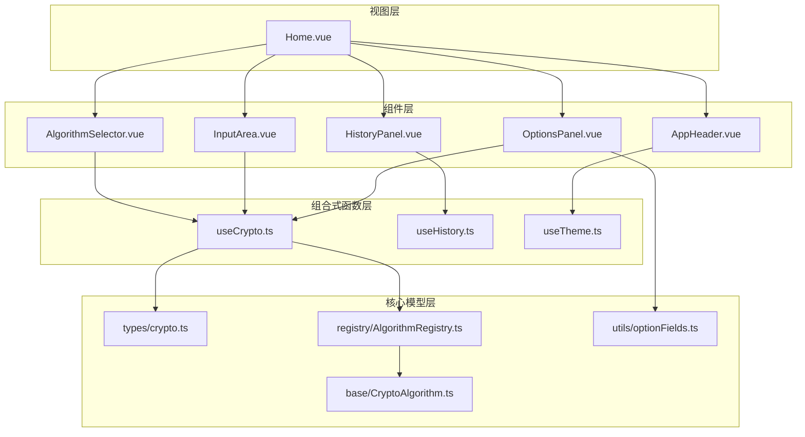
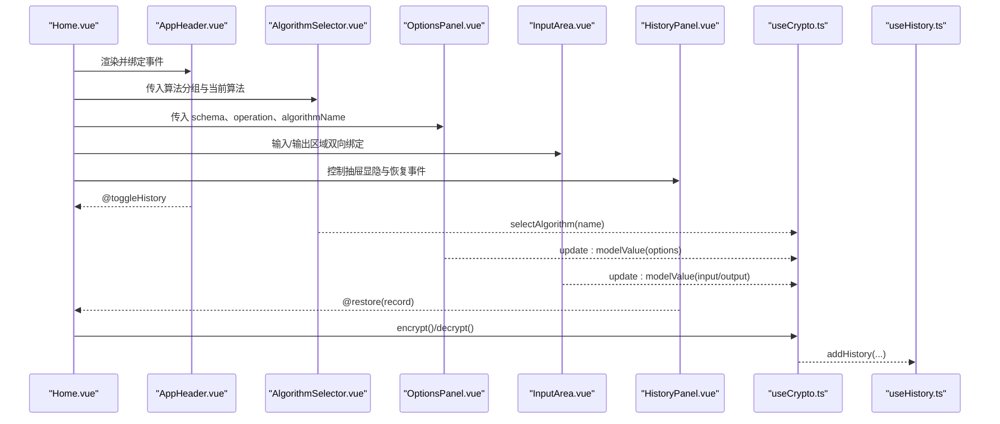
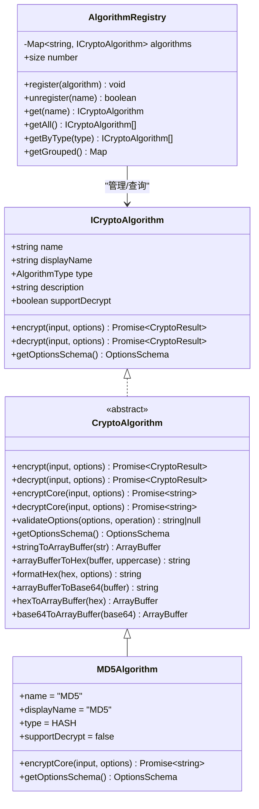

# 用户界面组件

<cite>
**本文引用的文件**
- [src/views/Home.vue](file://src/views/Home.vue)
- [src/components/layout/AppHeader.vue](file://src/components/layout/AppHeader.vue)
- [src/components/crypto/AlgorithmSelector.vue](file://src/components/crypto/AlgorithmSelector.vue)
- [src/components/crypto/InputArea.vue](file://src/components/crypto/InputArea.vue)
- [src/components/crypto/OptionsPanel.vue](file://src/components/crypto/OptionsPanel.vue)
- [src/components/history/HistoryPanel.vue](file://src/components/history/HistoryPanel.vue)
- [src/composables/useCrypto.ts](file://src/composables/useCrypto.ts)
- [src/composables/useHistory.ts](file://src/composables/useHistory.ts)
- [src/composables/useTheme.ts](file://src/composables/useTheme.ts)
- [src/core/types/crypto.ts](file://src/core/types/crypto.ts)
- [src/core/registry/AlgorithmRegistry.ts](file://src/core/registry/AlgorithmRegistry.ts)
- [src/core/base/CryptoAlgorithm.ts](file://src/core/base/CryptoAlgorithm.ts)
- [src/core/utils/optionFields.ts](file://src/core/utils/optionFields.ts)
- [src/algorithms/index.ts](file://src/algorithms/index.ts)
- [src/algorithms/hash/MD5.ts](file://src/algorithms/hash/MD5.ts)
</cite>

## 目录
1. [简介](#简介)
2. [项目结构](#项目结构)
3. [核心组件](#核心组件)
4. [架构总览](#架构总览)
5. [组件详解](#组件详解)
6. [依赖关系分析](#依赖关系分析)
7. [性能与可用性](#性能与可用性)
8. [故障排查指南](#故障排查指南)
9. [结论](#结论)
10. [附录](#附录)

## 简介
本文件面向UI开发者，系统梳理编码器应用的Vue组件体系，涵盖主页面布局、算法选择器、输入输出区域、参数配置面板、历史记录面板以及应用头部等核心组件。文档详细说明各组件的属性、事件、插槽与样式定制要点，并提供组合使用示例与响应式设计说明，帮助快速集成与扩展。

## 项目结构
该应用采用“视图层 + 组件层 + 组合式函数层 + 核心模型层”的分层组织方式：
- 视图层：Home.vue作为主页面容器，协调头部、算法选择、参数面板、输入输出区与历史面板。
- 组件层：布局组件（AppHeader）、加密组件（AlgorithmSelector、InputArea、OptionsPanel）、历史面板（HistoryPanel）。
- 组合式函数层：useCrypto、useHistory、useTheme 提供跨组件的状态与业务逻辑共享。
- 核心模型层：类型定义、算法注册表、算法基类与选项字段工具。

图表来源
- [src/views/Home.vue](file://src/views/Home.vue#L1-L220)
- [src/components/layout/AppHeader.vue](file://src/components/layout/AppHeader.vue#L1-L78)
- [src/components/crypto/AlgorithmSelector.vue](file://src/components/crypto/AlgorithmSelector.vue#L1-L63)
- [src/components/crypto/InputArea.vue](file://src/components/crypto/InputArea.vue#L1-L70)
- [src/components/crypto/OptionsPanel.vue](file://src/components/crypto/OptionsPanel.vue#L1-L129)
- [src/components/history/HistoryPanel.vue](file://src/components/history/HistoryPanel.vue#L1-L138)
- [src/composables/useCrypto.ts](file://src/composables/useCrypto.ts#L1-L217)
- [src/composables/useHistory.ts](file://src/composables/useHistory.ts#L1-L153)
- [src/composables/useTheme.ts](file://src/composables/useTheme.ts#L1-L53)
- [src/core/types/crypto.ts](file://src/core/types/crypto.ts#L1-L104)
- [src/core/registry/AlgorithmRegistry.ts](file://src/core/registry/AlgorithmRegistry.ts#L1-L114)
- [src/core/base/CryptoAlgorithm.ts](file://src/core/base/CryptoAlgorithm.ts#L1-L165)
- [src/core/utils/optionFields.ts](file://src/core/utils/optionFields.ts#L1-L137)

章节来源
- [src/views/Home.vue](file://src/views/Home.vue#L1-L220)
- [src/components/layout/AppHeader.vue](file://src/components/layout/AppHeader.vue#L1-L78)
- [src/components/crypto/AlgorithmSelector.vue](file://src/components/crypto/AlgorithmSelector.vue#L1-L63)
- [src/components/crypto/InputArea.vue](file://src/components/crypto/InputArea.vue#L1-L70)
- [src/components/crypto/OptionsPanel.vue](file://src/components/crypto/OptionsPanel.vue#L1-L129)
- [src/components/history/HistoryPanel.vue](file://src/components/history/HistoryPanel.vue#L1-L138)
- [src/composables/useCrypto.ts](file://src/composables/useCrypto.ts#L1-L217)
- [src/composables/useHistory.ts](file://src/composables/useHistory.ts#L1-L153)
- [src/composables/useTheme.ts](file://src/composables/useTheme.ts#L1-L53)
- [src/core/types/crypto.ts](file://src/core/types/crypto.ts#L1-L104)
- [src/core/registry/AlgorithmRegistry.ts](file://src/core/registry/AlgorithmRegistry.ts#L1-L114)
- [src/core/base/CryptoAlgorithm.ts](file://src/core/base/CryptoAlgorithm.ts#L1-L165)
- [src/core/utils/optionFields.ts](file://src/core/utils/optionFields.ts#L1-L137)

## 核心组件
- 应用头部 AppHeader：提供主题切换与历史记录入口，携带徽章计数与气泡提示。
- 算法选择器 AlgorithmSelector：基于 Naive UI Select 的分组下拉，展示算法类型与描述，支持选择后显示算法能力标签。
- 输入输出区域 InputArea：双端输入卡片，支持字符计数、复制到剪贴板、清空；输入端可只读。
- 参数配置面板 OptionsPanel：动态表单，依据算法选项 Schema 渲染不同类型的输入控件，支持字段联动与禁用。
- 历史记录面板 HistoryPanel：右侧抽屉，展示历史记录列表，支持删除与一键清空，点击恢复到主界面。

章节来源
- [src/components/layout/AppHeader.vue](file://src/components/layout/AppHeader.vue#L1-L78)
- [src/components/crypto/AlgorithmSelector.vue](file://src/components/crypto/AlgorithmSelector.vue#L1-L63)
- [src/components/crypto/InputArea.vue](file://src/components/crypto/InputArea.vue#L1-L70)
- [src/components/crypto/OptionsPanel.vue](file://src/components/crypto/OptionsPanel.vue#L1-L129)
- [src/components/history/HistoryPanel.vue](file://src/components/history/HistoryPanel.vue#L1-L138)

## 架构总览
组件与组合式函数的交互关系如下：

图表来源
- [src/views/Home.vue](file://src/views/Home.vue#L1-L220)
- [src/components/layout/AppHeader.vue](file://src/components/layout/AppHeader.vue#L1-L78)
- [src/components/crypto/AlgorithmSelector.vue](file://src/components/crypto/AlgorithmSelector.vue#L1-L63)
- [src/components/crypto/OptionsPanel.vue](file://src/components/crypto/OptionsPanel.vue#L1-L129)
- [src/components/crypto/InputArea.vue](file://src/components/crypto/InputArea.vue#L1-L70)
- [src/components/history/HistoryPanel.vue](file://src/components/history/HistoryPanel.vue#L1-L138)
- [src/composables/useCrypto.ts](file://src/composables/useCrypto.ts#L1-L217)
- [src/composables/useHistory.ts](file://src/composables/useHistory.ts#L1-L153)

## 组件详解

### 应用头部 AppHeader
- 功能
  - 展示应用 Logo 与标题
  - 历史记录入口：带徽章计数，点击触发父组件切换抽屉显隐
  - 主题切换：深浅色互切，持久化到本地存储
- 属性
  - 无
- 事件
  - @toggleHistory：通知父组件切换历史面板
- 插槽
  - 无
- 样式定制
  - 通过 scoped 样式覆盖 .app-header、.header-content、.logo 等类名
- 使用建议
  - 在父组件中监听 @toggleHistory 并维护 showHistory 状态
  - 结合 useTheme 的 isDark 与 themeName 实现自定义文案或图标

章节来源
- [src/components/layout/AppHeader.vue](file://src/components/layout/AppHeader.vue#L1-L78)
- [src/composables/useTheme.ts](file://src/composables/useTheme.ts#L1-L53)
- [src/composables/useHistory.ts](file://src/composables/useHistory.ts#L1-L153)

### 算法选择器 AlgorithmSelector
- 功能
  - 基于算法注册表的分组下拉选择
  - 展示当前选中算法的能力标签（支持解密/仅加密）与描述
- 属性
  - 无（内部通过 useCrypto 获取状态）
- 事件
  - 无（内部处理选择后调用 useCrypto.selectAlgorithm）
- 插槽
  - 无
- 样式定制
  - 卡片标题、描述文本、标签颜色可通过 scoped 样式调整
- 使用建议
  - 与 OptionsPanel 同步使用，确保 schema 与当前算法一致
  - 与 Home.vue 的 currentAlgorithmName 保持一致

章节来源
- [src/components/crypto/AlgorithmSelector.vue](file://src/components/crypto/AlgorithmSelector.vue#L1-L63)
- [src/composables/useCrypto.ts](file://src/composables/useCrypto.ts#L1-L217)
- [src/core/registry/AlgorithmRegistry.ts](file://src/core/registry/AlgorithmRegistry.ts#L1-L114)

### 输入输出区域 InputArea
- 功能
  - 输入/输出文本域，支持字符计数、复制到剪贴板、清空
  - 支持只读模式
- 属性
  - modelValue: string（v-model）
  - title?: string（卡片标题，默认“输入”或“输出”）
  - placeholder?: string（占位提示）
  - readonly?: boolean（是否只读）
- 事件
  - @update:modelValue：双向绑定更新
  - @clear：清空时触发
- 插槽
  - #header-extra：卡片右上角扩展区域（如复制、清空按钮）
- 样式定制
  - 卡片尺寸、字体（等宽）、行数范围等可通过属性与 scoped 样式控制
- 使用建议
  - 输出区域建议 readonly=true
  - 结合 useCrypto 的 copyOutput 进行统一复制行为

章节来源
- [src/components/crypto/InputArea.vue](file://src/components/crypto/InputArea.vue#L1-L70)
- [src/composables/useCrypto.ts](file://src/composables/useCrypto.ts#L1-L217)

### 参数配置面板 OptionsPanel
- 功能
  - 根据算法的 OptionsSchema 动态渲染表单项
  - 支持文本、多行文本、下拉选择等控件
  - 支持字段间联动禁用（disabledWhen）
  - 针对 RSA/RSA2 提供“生成密钥对”快捷按钮
- 属性
  - modelValue: CryptoOptions（v-model）
  - schema: OptionsSchema（算法选项 Schema）
  - operation: 'encrypt' | 'decrypt'
  - algorithmName?: string（用于识别 RSA 系列）
- 事件
  - @update:modelValue：选项变更时向外抛出
- 插槽
  - #header-extra：在 RSA 场景下插入“生成密钥对”按钮
- 样式定制
  - 表单尺寸、标签位置、控件样式可通过 Naive UI 属性与 scoped 样式微调
- 使用建议
  - 与 useCrypto 的 options 与 optionsSchema 同步
  - 注意 disabledWhen 的依赖字段与默认值处理

章节来源
- [src/components/crypto/OptionsPanel.vue](file://src/components/crypto/OptionsPanel.vue#L1-L129)
- [src/core/types/crypto.ts](file://src/core/types/crypto.ts#L1-L104)
- [src/core/utils/optionFields.ts](file://src/core/utils/optionFields.ts#L1-L137)
- [src/composables/useCrypto.ts](file://src/composables/useCrypto.ts#L1-L217)

### 历史记录面板 HistoryPanel
- 功能
  - 右侧抽屉展示历史记录，支持逐条删除与一键清空
  - 点击记录恢复到主界面（算法、输入、输出、选项、操作类型）
- 属性
  - show: boolean（v-model:show）
- 事件
  - @update:show：抽屉显隐变化
  - @restore：点击某条记录时触发
- 插槽
  - 无
- 样式定制
  - 抽屉宽度、列表项预览样式可通过 scoped 样式调整
- 使用建议
  - 与 useHistory 的 addHistory 自动集成
  - 清空操作需二次确认，避免误删

章节来源
- [src/components/history/HistoryPanel.vue](file://src/components/history/HistoryPanel.vue#L1-L138)
- [src/composables/useHistory.ts](file://src/composables/useHistory.ts#L1-L153)
- [src/core/types/crypto.ts](file://src/core/types/crypto.ts#L1-L104)

### 主页面 Home.vue
- 功能
  - 布局：顶部 AppHeader + 中部两栏（左侧算法+参数，右侧输入输出+操作按钮）
  - 业务：封装加密/解密/交换/清空/复制等操作，统一消息提示
  - 状态：维护 operation（encrypt/decrypt）、showHistory、useCrypto 状态
- 关键交互
  - 选择算法后重置选项并清空输出/错误
  - 支持解密时自动切换操作类型
  - 从历史恢复时同步算法、输入、输出、选项与操作类型
- 响应式设计
  - 使用 Naive UI Grid 在移动端自适应分栏
- 使用建议
  - 在父组件中监听 @toggle-history 与 @restore，管理抽屉与恢复流程

章节来源
- [src/views/Home.vue](file://src/views/Home.vue#L1-L220)
- [src/composables/useCrypto.ts](file://src/composables/useCrypto.ts#L1-L217)
- [src/composables/useHistory.ts](file://src/composables/useHistory.ts#L1-L153)

## 依赖关系分析

图表来源
- [src/core/base/CryptoAlgorithm.ts](file://src/core/base/CryptoAlgorithm.ts#L1-L165)
- [src/core/registry/AlgorithmRegistry.ts](file://src/core/registry/AlgorithmRegistry.ts#L1-L114)
- [src/algorithms/hash/MD5.ts](file://src/algorithms/hash/MD5.ts#L1-L28)
- [src/core/types/crypto.ts](file://src/core/types/crypto.ts#L1-L104)

章节来源
- [src/core/base/CryptoAlgorithm.ts](file://src/core/base/CryptoAlgorithm.ts#L1-L165)
- [src/core/registry/AlgorithmRegistry.ts](file://src/core/registry/AlgorithmRegistry.ts#L1-L114)
- [src/algorithms/hash/MD5.ts](file://src/algorithms/hash/MD5.ts#L1-L28)
- [src/core/types/crypto.ts](file://src/core/types/crypto.ts#L1-L104)

## 性能与可用性
- 性能
  - 算法选择与选项重置：useCrypto 在切换算法时重置选项并清空输出/错误，避免无效状态累积
  - 选项联动：disabledWhen 仅在必要时计算，减少不必要的渲染
  - 历史记录：localStorage 存储，超过上限自动截断，降低存储压力
- 可用性
  - 输入输出区域提供复制与清空操作，提升交互效率
  - 算法选择器显示算法能力标签，帮助用户理解功能边界
  - 历史记录抽屉支持一键清空与逐条删除，便于管理

[本节为通用指导，无需列出具体文件来源]

## 故障排查指南
- 无法解密
  - 现象：点击解密按钮报错“算法不支持解密”
  - 排查：检查 AlgorithmSelector 中算法 supportDecrypt 标签；确认当前算法确实支持 decrypt
- 输入为空
  - 现象：加密/解密时报“请输入内容”
  - 排查：确认 InputArea 的 modelValue 已正确绑定；检查 Home.vue 的输入校验逻辑
- 选项不可用
  - 现象：某些选项在特定条件下被禁用
  - 排查：检查 OptionsPanel 的 disabledWhen 条件与依赖字段默认值
- 历史记录异常
  - 现象：历史记录未持久化或数量异常
  - 排查：确认 localStorage 正常；useHistory 的 addHistory 去重与截断逻辑

章节来源
- [src/composables/useCrypto.ts](file://src/composables/useCrypto.ts#L1-L217)
- [src/components/crypto/OptionsPanel.vue](file://src/components/crypto/OptionsPanel.vue#L1-L129)
- [src/composables/useHistory.ts](file://src/composables/useHistory.ts#L1-L153)

## 结论
该组件体系以清晰的分层与组合式函数为核心，实现了算法选择、参数配置、输入输出与历史记录的完整闭环。通过标准化的算法接口与选项 Schema，组件具备良好的可扩展性与可维护性。建议在新增算法时遵循 CryptoAlgorithm 抽象类与 AlgorithmRegistry 的注册规范，并复用 optionFields 工具生成标准选项，确保 UI 与业务的一致性。

[本节为总结性内容，无需列出具体文件来源]

## 附录

### 组件属性与事件速查
- AppHeader
  - 属性：无
  - 事件：@toggleHistory
- AlgorithmSelector
  - 属性：无
  - 事件：无
- InputArea
  - 属性：modelValue, title, placeholder, readonly
  - 事件：@update:modelValue, @clear
- OptionsPanel
  - 属性：modelValue, schema, operation, algorithmName
  - 事件：@update:modelValue
- HistoryPanel
  - 属性：show
  - 事件：@update:show, @restore

章节来源
- [src/components/layout/AppHeader.vue](file://src/components/layout/AppHeader.vue#L1-L78)
- [src/components/crypto/AlgorithmSelector.vue](file://src/components/crypto/AlgorithmSelector.vue#L1-L63)
- [src/components/crypto/InputArea.vue](file://src/components/crypto/InputArea.vue#L1-L70)
- [src/components/crypto/OptionsPanel.vue](file://src/components/crypto/OptionsPanel.vue#L1-L129)
- [src/components/history/HistoryPanel.vue](file://src/components/history/HistoryPanel.vue#L1-L138)

### 组合使用示例（步骤说明）
- 基础组合
  - 在 Home.vue 中引入 AppHeader、AlgorithmSelector、OptionsPanel、InputArea、HistoryPanel
  - 通过 useCrypto 提供的状态与方法驱动各组件
- 与主题/历史联动
  - AppHeader 通过 @toggleHistory 切换 HistoryPanel 的 show
  - useTheme 与 useHistory 提供主题与历史数据
- 算法扩展
  - 新增算法类继承 CryptoAlgorithm，注册到 AlgorithmRegistry
  - 通过 optionFields 定义标准选项，或在算法类中重写 getOptionsSchema

章节来源
- [src/views/Home.vue](file://src/views/Home.vue#L1-L220)
- [src/algorithms/index.ts](file://src/algorithms/index.ts#L1-L59)
- [src/core/registry/AlgorithmRegistry.ts](file://src/core/registry/AlgorithmRegistry.ts#L1-L114)
- [src/core/base/CryptoAlgorithm.ts](file://src/core/base/CryptoAlgorithm.ts#L1-L165)
- [src/core/utils/optionFields.ts](file://src/core/utils/optionFields.ts#L1-L137)
- [src/composables/useTheme.ts](file://src/composables/useTheme.ts#L1-L53)
- [src/composables/useHistory.ts](file://src/composables/useHistory.ts#L1-L153)