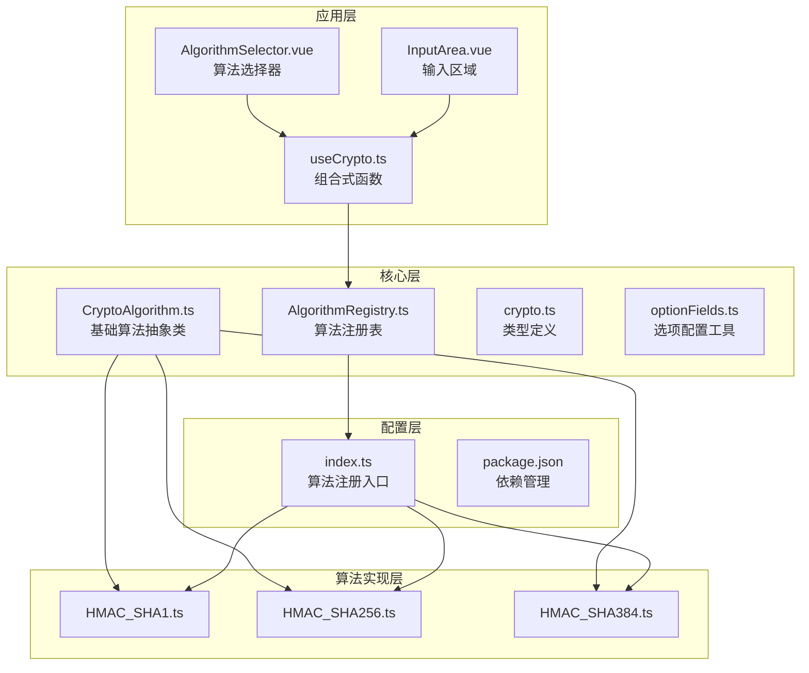
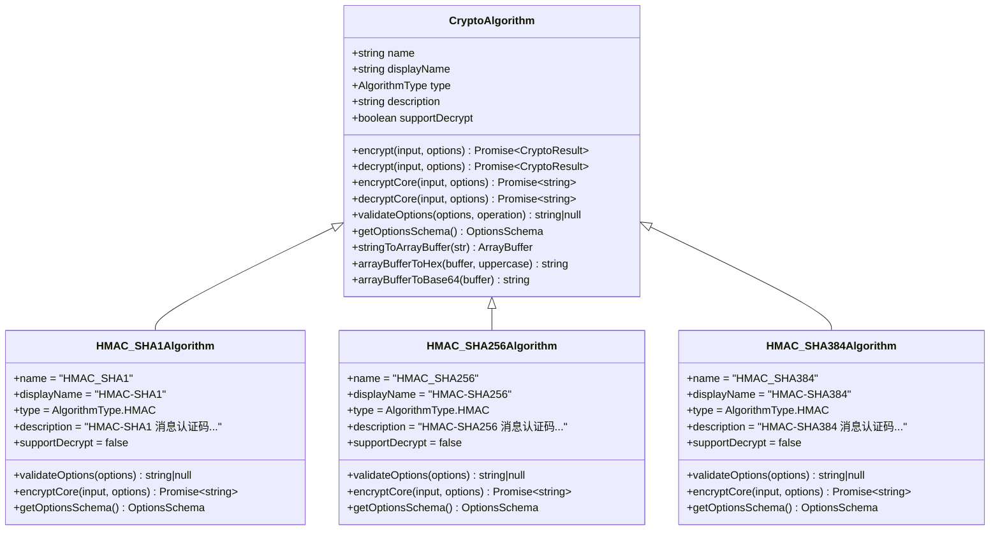
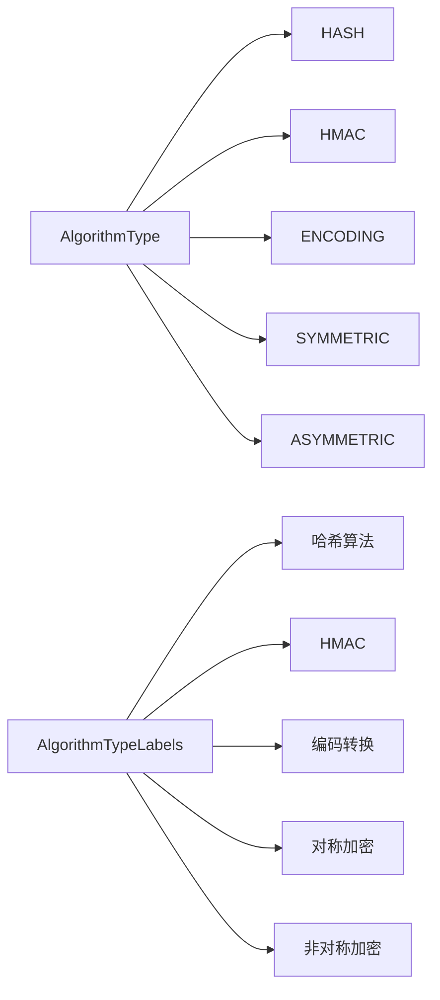
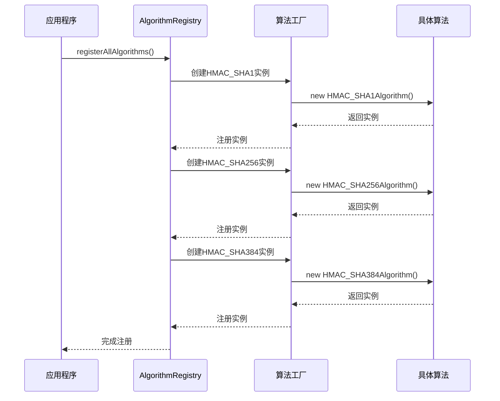
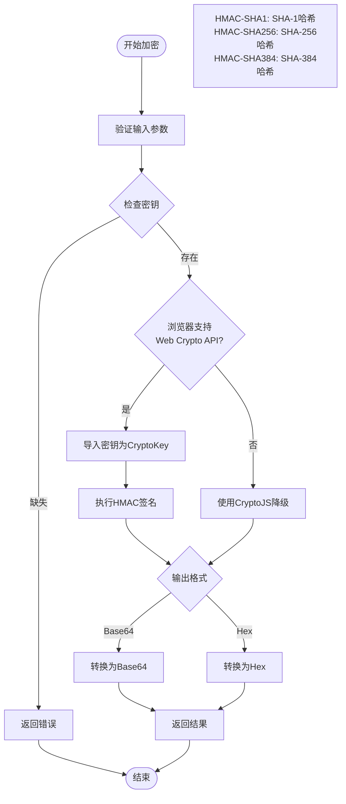
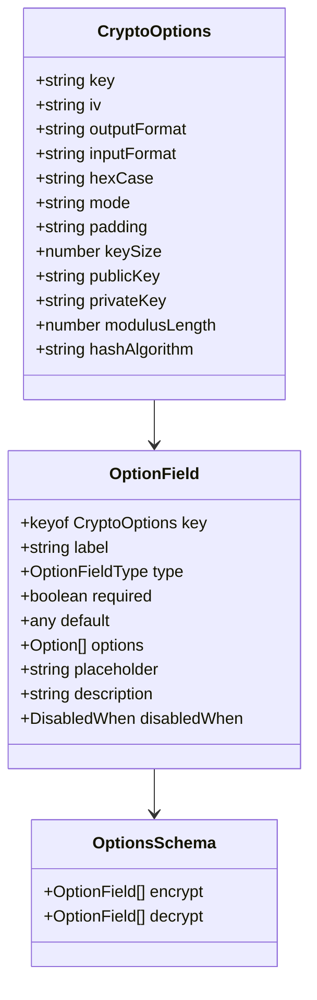
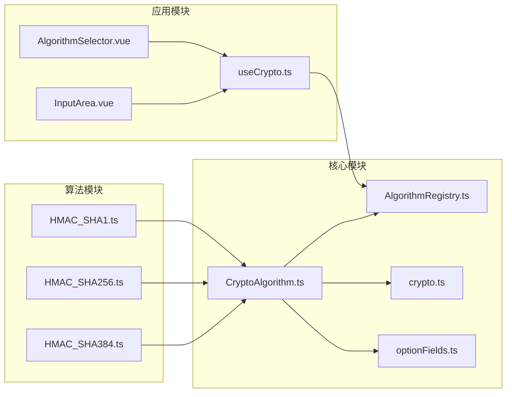
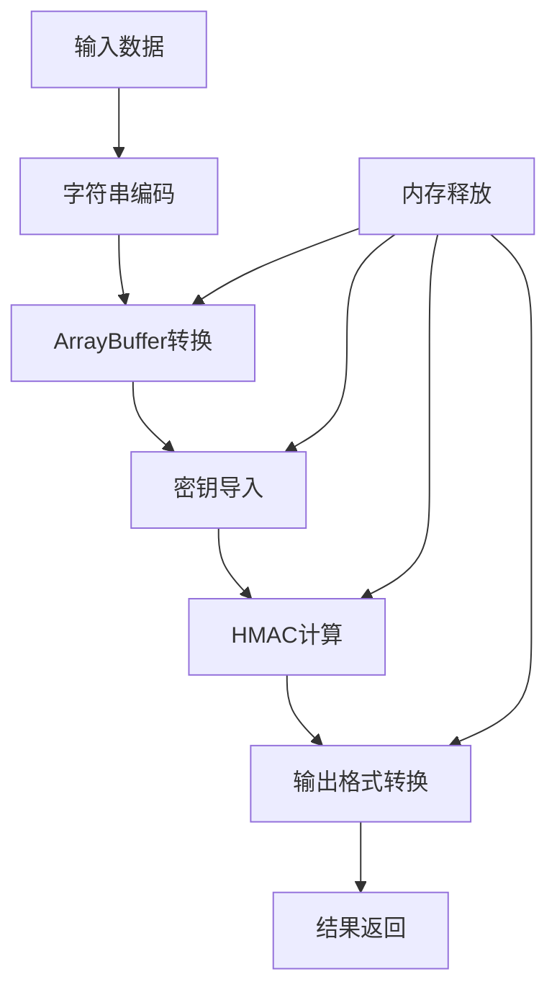
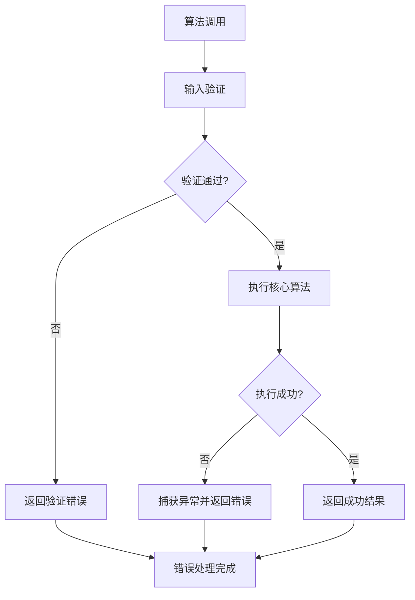

# HMAC算法模块

<cite>
**本文档引用的文件**
- [HMAC_SHA1.ts](file://src/algorithms/hmac/HMAC_SHA1.ts)
- [HMAC_SHA256.ts](file://src/algorithms/hmac/HMAC_SHA256.ts)
- [HMAC_SHA384.ts](file://src/algorithms/hmac/HMAC_SHA384.ts)
- [CryptoAlgorithm.ts](file://src/core/base/CryptoAlgorithm.ts)
- [crypto.ts](file://src/core/types/crypto.ts)
- [optionFields.ts](file://src/core/utils/optionFields.ts)
- [useCrypto.ts](file://src/composables/useCrypto.ts)
- [AlgorithmRegistry.ts](file://src/core/registry/AlgorithmRegistry.ts)
- [index.ts](file://src/algorithms/index.ts)
- [AlgorithmSelector.vue](file://src/components/crypto/AlgorithmSelector.vue)
- [InputArea.vue](file://src/components/crypto/InputArea.vue)
- [package.json](file://package.json)
</cite>

## 目录
1. [简介](#简介)
2. [项目结构](#项目结构)
3. [核心组件](#核心组件)
4. [架构概览](#架构概览)
5. [详细组件分析](#详细组件分析)
6. [依赖关系分析](#依赖关系分析)
7. [性能考虑](#性能考虑)
8. [故障排除指南](#故障排除指南)
9. [结论](#结论)
10. [附录](#附录)

## 简介

HMAC（基于哈希的消息认证码）是一种基于密码学的消息认证码，它结合了对称密钥和哈希函数来确保消息的完整性和真实性。本项目实现了三种HMAC变体：HMAC-SHA1、HMAC-SHA256和HMAC-SHA384，为Web应用提供了强大的数据完整性保护功能。

HMAC算法通过双重哈希机制确保：
- **完整性验证**：检测数据是否被篡改
- **真实性验证**：确认消息来自可信源
- **抗篡改能力**：防止中间人攻击

## 项目结构

该项目采用模块化的架构设计，将不同的加密算法按照功能进行分层组织：



**图表来源**
- [CryptoAlgorithm.ts](file://src/core/base/CryptoAlgorithm.ts#L1-L165)
- [AlgorithmRegistry.ts](file://src/core/registry/AlgorithmRegistry.ts#L1-L114)
- [index.ts](file://src/algorithms/index.ts#L1-L59)

**章节来源**
- [index.ts](file://src/algorithms/index.ts#L1-L59)
- [package.json](file://package.json#L1-L27)

## 核心组件

### CryptoAlgorithm 抽象基类

所有HMAC算法都继承自统一的抽象基类，该基类提供了标准化的接口和通用功能：



**图表来源**
- [CryptoAlgorithm.ts](file://src/core/base/CryptoAlgorithm.ts#L13-L165)
- [HMAC_SHA1.ts](file://src/algorithms/hmac/HMAC_SHA1.ts#L6-L62)
- [HMAC_SHA256.ts](file://src/algorithms/hmac/HMAC_SHA256.ts#L6-L62)
- [HMAC_SHA384.ts](file://src/algorithms/hmac/HMAC_SHA384.ts#L6-L62)

### 算法类型系统

项目使用强类型的枚举来区分不同类型的算法：



**图表来源**
- [crypto.ts](file://src/core/types/crypto.ts#L2-L17)

**章节来源**
- [CryptoAlgorithm.ts](file://src/core/base/CryptoAlgorithm.ts#L1-L165)
- [crypto.ts](file://src/core/types/crypto.ts#L1-L104)

## 架构概览

### 算法注册与发现机制

系统采用注册表模式来管理所有可用的算法：



**图表来源**
- [index.ts](file://src/algorithms/index.ts#L29-L54)
- [AlgorithmRegistry.ts](file://src/core/registry/AlgorithmRegistry.ts#L26-L31)

### 加密流程

HMAC算法的加密过程遵循标准的双层哈希模式：



**图表来源**
- [HMAC_SHA1.ts](file://src/algorithms/hmac/HMAC_SHA1.ts#L20-L57)
- [HMAC_SHA256.ts](file://src/algorithms/hmac/HMAC_SHA256.ts#L20-L57)
- [HMAC_SHA384.ts](file://src/algorithms/hmac/HMAC_SHA384.ts#L20-L57)

**章节来源**
- [index.ts](file://src/algorithms/index.ts#L29-L54)
- [AlgorithmRegistry.ts](file://src/core/registry/AlgorithmRegistry.ts#L1-L114)

## 详细组件分析

### HMAC_SHA1 实现

HMAC-SHA1是三种实现中最简单的版本，使用SHA-1作为底层哈希函数：

#### 核心特性
- **安全性等级**：中等（SHA-1已不再推荐用于新应用）
- **性能表现**：最佳性能（SHA-1计算速度最快）
- **输出长度**：160位（40个十六进制字符）

#### 实现特点
- 支持Web Crypto API的原生HMAC-SHA1
- 自动降级到CryptoJS库
- 支持Base64和Hex两种输出格式
- 可选的大写Hex输出

**章节来源**
- [HMAC_SHA1.ts](file://src/algorithms/hmac/HMAC_SHA1.ts#L1-L63)

### HMAC_SHA256 实现

HMAC-SHA256是推荐使用的实现，平衡了安全性和性能：

#### 核心特性
- **安全性等级**：高（SHA-256是当前标准）
- **性能表现**：良好（SHA-256比SHA-1慢约20-30%）
- **输出长度**：256位（64个十六进制字符）

#### 实现特点
- 使用SHA-256作为底层哈希函数
- 完整的Web Crypto API支持
- 标准的HMAC-SHA256实现
- 兼容性最佳

**章节来源**
- [HMAC_SHA256.ts](file://src/algorithms/hmac/HMAC_SHA256.ts#L1-L63)

### HMAC_SHA384 实现

HMAC-SHA384提供最高的安全级别，适用于高安全需求场景：

#### 核心特性
- **安全性等级**：最高（SHA-384提供更强的安全保证）
- **性能表现**：较慢（SHA-384比SHA-256慢约15-25%）
- **输出长度**：384位（96个十六进制字符）

#### 实现特点
- 使用SHA-384作为底层哈希函数
- 支持完整的Web Crypto API功能
- 最高的碰撞抗性
- 适合高安全要求的应用

**章节来源**
- [HMAC_SHA384.ts](file://src/algorithms/hmac/HMAC_SHA384.ts#L1-L63)

### 选项配置系统

每个HMAC算法都支持统一的选项配置：



**图表来源**
- [crypto.ts](file://src/core/types/crypto.ts#L20-L38)
- [optionFields.ts](file://src/core/utils/optionFields.ts#L51-L71)

**章节来源**
- [optionFields.ts](file://src/core/utils/optionFields.ts#L1-L137)
- [crypto.ts](file://src/core/types/crypto.ts#L19-L104)

## 依赖关系分析

### 外部依赖

项目使用以下关键外部依赖：

```mermaid
graph TB
subgraph "核心依赖"
A[Vue 3.5.13<br/>前端框架]
B[Naive UI 2.40.1<br/>UI组件库]
C[Pinia 2.3.0<br/>状态管理]
end
subgraph "加密依赖"
D[CryptoJS 4.2.0<br/>JavaScript加密库]
E[Web Crypto API<br/>浏览器原生API]
end
subgraph "开发依赖"
F[TypeScript 5.6.2<br/>类型检查]
G[Vite 6.0.5<br/>构建工具]
H[@types/crypto-js<br/>类型定义]
end
A --> B
A --> C
D --> E
```

**图表来源**
- [package.json](file://package.json#L12-L25)

### 内部模块依赖



**图表来源**
- [HMAC_SHA1.ts](file://src/algorithms/hmac/HMAC_SHA1.ts#L1-L5)
- [CryptoAlgorithm.ts](file://src/core/base/CryptoAlgorithm.ts#L1-L8)
- [useCrypto.ts](file://src/composables/useCrypto.ts#L1-L5)

**章节来源**
- [package.json](file://package.json#L1-L27)

## 性能考虑

### 算法性能对比

| 算法类型 | 输出长度 | 性能排名 | 推荐用途 |
|---------|---------|---------|---------|
| HMAC-SHA1 | 160位 | ⭐⭐⭐⭐ | 低安全需求，性能优先 |
| HMAC-SHA256 | 256位 | ⭐⭐⭐⭐⭐ | 标准应用，平衡安全与性能 |
| HMAC-SHA384 | 384位 | ⭐⭐⭐ | 高安全需求，严格审计 |

### 性能优化策略

1. **Web Crypto API优先**：现代浏览器支持原生HMAC，性能最佳
2. **降级策略**：自动回退到CryptoJS库确保兼容性
3. **内存管理**：及时释放ArrayBuffer和字符串资源
4. **缓存策略**：避免重复的密钥导入操作

### 内存使用分析



## 故障排除指南

### 常见问题及解决方案

#### 1. 浏览器兼容性问题

**问题**：某些旧版浏览器不支持Web Crypto API
**解决方案**：系统会自动降级到CryptoJS库

#### 2. 密钥格式错误

**问题**：密钥格式不符合预期
**解决方案**：确保密钥为UTF-8编码的字符串

#### 3. 输出格式异常

**问题**：Base64或Hex输出不符合预期
**解决方案**：检查`outputFormat`和`hexCase`选项设置

#### 4. 性能问题

**问题**：大量HMAC计算导致性能下降
**解决方案**：使用Web Crypto API或考虑缓存策略

### 错误处理机制



**章节来源**
- [CryptoAlgorithm.ts](file://src/core/base/CryptoAlgorithm.ts#L23-L75)
- [HMAC_SHA1.ts](file://src/algorithms/hmac/HMAC_SHA1.ts#L13-L18)

## 结论

本HMAC算法模块提供了完整的消息认证码解决方案，具有以下优势：

1. **标准化实现**：遵循HMAC标准，确保互操作性
2. **多算法支持**：提供三种不同安全级别的实现
3. **现代技术栈**：充分利用Web Crypto API和现代浏览器特性
4. **优雅降级**：确保在各种环境下的兼容性
5. **类型安全**：完整的TypeScript类型定义
6. **用户友好**：直观的UI界面和配置选项

对于大多数应用场景，推荐使用HMAC-SHA256；对于需要更高安全性的场景，可以选择HMAC-SHA384；而对于性能优先的场景，HMAC-SHA1仍然是可行的选择。

## 附录

### 使用示例

#### 基本使用流程

1. 选择HMAC算法（HMAC-SHA1/SMA-SHA256/HMAC-SHA384）
2. 设置密钥（必需参数）
3. 选择输出格式（Hex/Base64）
4. 执行加密操作
5. 验证结果的完整性

#### 安全最佳实践

1. **密钥管理**：使用足够长度的随机密钥
2. **传输安全**：通过HTTPS传输敏感数据
3. **存储安全**：安全地存储和管理密钥
4. **定期轮换**：定期更换HMAC密钥
5. **监控日志**：记录和监控HMAC使用情况

#### 应用场景

1. **API认证**：验证API请求的完整性和真实性
2. **数字签名**：确保文档和消息的不可否认性
3. **数据完整性**：检测数据传输过程中的篡改
4. **会话管理**：验证用户会话的有效性
5. **配置文件保护**：防止配置文件被恶意修改