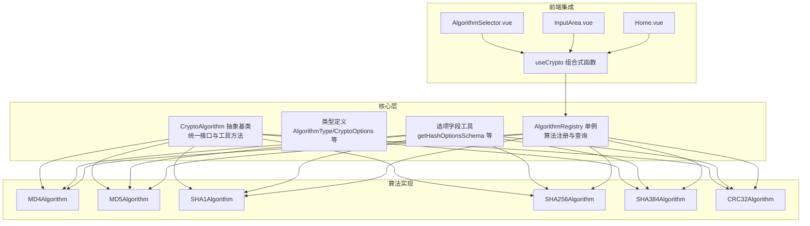
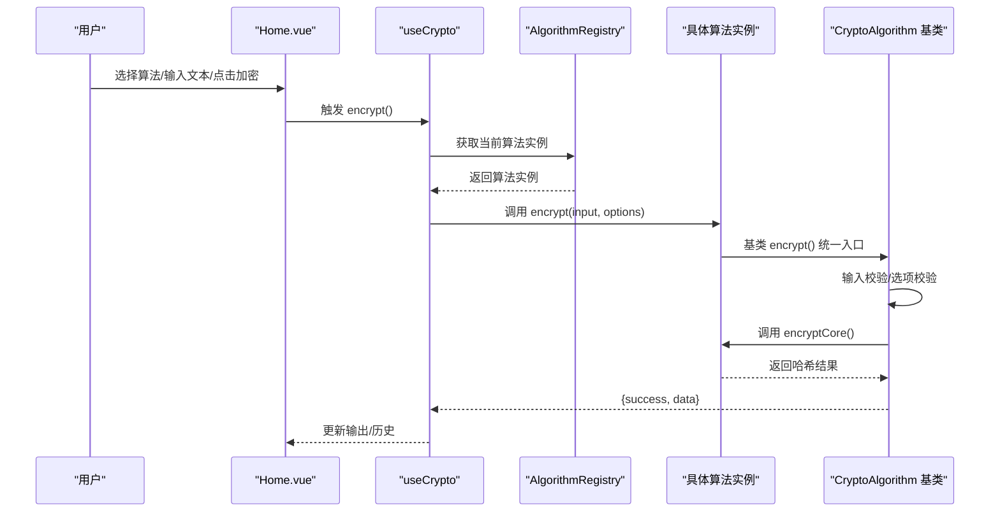
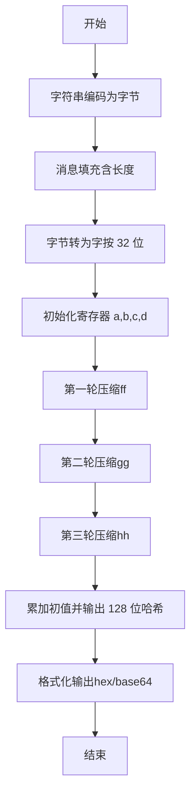
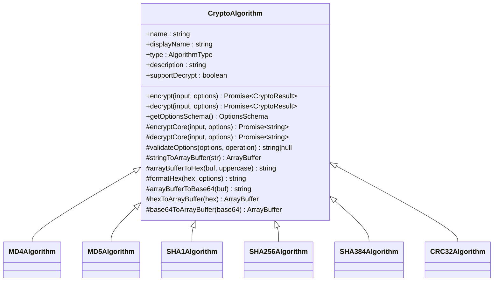
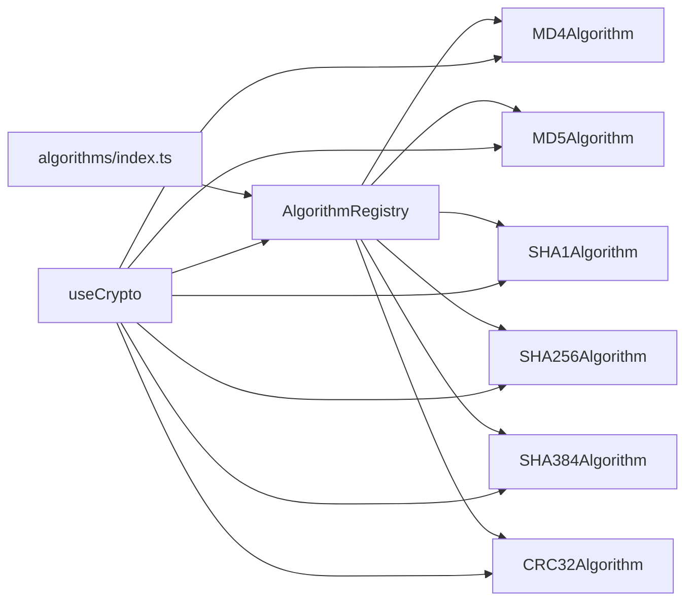

# 哈希算法模块

<cite>
**本文引用的文件**
- [src/algorithms/hash/MD4.ts](file://src/algorithms/hash/MD4.ts)
- [src/algorithms/hash/MD5.ts](file://src/algorithms/hash/MD5.ts)
- [src/algorithms/hash/SHA1.ts](file://src/algorithms/hash/SHA1.ts)
- [src/algorithms/hash/SHA256.ts](file://src/algorithms/hash/SHA256.ts)
- [src/algorithms/hash/SHA384.ts](file://src/algorithms/hash/SHA384.ts)
- [src/algorithms/hash/CRC32.ts](file://src/algorithms/hash/CRC32.ts)
- [src/core/base/CryptoAlgorithm.ts](file://src/core/base/CryptoAlgorithm.ts)
- [src/core/types/crypto.ts](file://src/core/types/crypto.ts)
- [src/core/utils/optionFields.ts](file://src/core/utils/optionFields.ts)
- [src/algorithms/index.ts](file://src/algorithms/index.ts)
- [src/core/registry/AlgorithmRegistry.ts](file://src/core/registry/AlgorithmRegistry.ts)
- [src/composables/useCrypto.ts](file://src/composables/useCrypto.ts)
- [src/components/crypto/AlgorithmSelector.vue](file://src/components/crypto/AlgorithmSelector.vue)
- [src/components/crypto/InputArea.vue](file://src/components/crypto/InputArea.vue)
- [src/views/Home.vue](file://src/views/Home.vue)
- [package.json](file://package.json)
</cite>

## 目录
1. [简介](#简介)
2. [项目结构](#项目结构)
3. [核心组件](#核心组件)
4. [架构总览](#架构总览)
5. [详细组件分析](#详细组件分析)
6. [依赖关系分析](#依赖关系分析)
7. [性能考虑](#性能考虑)
8. [故障排查指南](#故障排查指南)
9. [结论](#结论)
10. [附录](#附录)

## 简介
本文件系统性梳理哈希算法模块的设计与实现，覆盖 MD4、MD5、SHA-1、SHA-256、SHA-384 与 CRC32 等算法。文档从架构设计、数据流、处理逻辑、安全与性能特征、参数配置、使用示例、常见问题与最佳实践等方面进行深入解析，帮助开发者正确选择与使用哈希算法。

## 项目结构
哈希算法模块位于 src/algorithms/hash 下，每个算法均继承统一的抽象基类，遵循一致的对外接口与选项体系；通过注册表集中管理与暴露；前端通过组合式函数与组件完成用户交互与调用。

图表来源
- [src/core/base/CryptoAlgorithm.ts](file://src/core/base/CryptoAlgorithm.ts#L13-L164)
- [src/core/utils/optionFields.ts](file://src/core/utils/optionFields.ts#L119-L126)
- [src/core/registry/AlgorithmRegistry.ts](file://src/core/registry/AlgorithmRegistry.ts#L7-L110)
- [src/algorithms/hash/MD4.ts](file://src/algorithms/hash/MD4.ts#L5-L25)
- [src/algorithms/hash/MD5.ts](file://src/algorithms/hash/MD5.ts#L6-L26)
- [src/algorithms/hash/SHA1.ts](file://src/algorithms/hash/SHA1.ts#L6-L43)
- [src/algorithms/hash/SHA256.ts](file://src/algorithms/hash/SHA256.ts#L6-L43)
- [src/algorithms/hash/SHA384.ts](file://src/algorithms/hash/SHA384.ts#L6-L43)
- [src/algorithms/hash/CRC32.ts](file://src/algorithms/hash/CRC32.ts#L5-L55)
- [src/composables/useCrypto.ts](file://src/composables/useCrypto.ts#L74-L216)
- [src/components/crypto/AlgorithmSelector.vue](file://src/components/crypto/AlgorithmSelector.vue#L1-L63)
- [src/components/crypto/InputArea.vue](file://src/components/crypto/InputArea.vue#L1-L70)
- [src/views/Home.vue](file://src/views/Home.vue#L1-L220)

章节来源
- [src/algorithms/index.ts](file://src/algorithms/index.ts#L29-L54)
- [src/core/registry/AlgorithmRegistry.ts](file://src/core/registry/AlgorithmRegistry.ts#L7-L110)
- [src/core/base/CryptoAlgorithm.ts](file://src/core/base/CryptoAlgorithm.ts#L13-L164)
- [src/core/utils/optionFields.ts](file://src/core/utils/optionFields.ts#L119-L126)

## 核心组件
- 抽象基类 CryptoAlgorithm：提供统一的 encrypt/decrypt 接口、选项校验、常用工具方法（字符串/数组缓冲区互转、Hex/Base64 格式化等），并封装错误处理与返回结构。
- 选项体系：通过 getHashOptionsSchema 提供输出格式（hex/base64）与 Hex 大小写（lower/upper）等通用选项，适配所有哈希算法。
- 注册表 AlgorithmRegistry：单例管理算法注册、查询、分组与批量注册，便于前端动态展示与调用。
- 前端集成 useCrypto：集中管理当前算法、输入输出、选项、历史记录与操作流程，屏蔽底层细节。
- 算法实现：MD4、MD5、SHA-1、SHA-256、SHA-384、CRC32 各自实现核心加密逻辑，并复用基类工具与选项。

章节来源
- [src/core/base/CryptoAlgorithm.ts](file://src/core/base/CryptoAlgorithm.ts#L23-L87)
- [src/core/utils/optionFields.ts](file://src/core/utils/optionFields.ts#L119-L126)
- [src/core/registry/AlgorithmRegistry.ts](file://src/core/registry/AlgorithmRegistry.ts#L26-L95)
- [src/composables/useCrypto.ts](file://src/composables/useCrypto.ts#L74-L216)

## 架构总览
下图展示从前端到算法实现的整体调用链路与关键节点：

图表来源
- [src/views/Home.vue](file://src/views/Home.vue#L36-L52)
- [src/composables/useCrypto.ts](file://src/composables/useCrypto.ts#L78-L119)
- [src/core/registry/AlgorithmRegistry.ts](file://src/core/registry/AlgorithmRegistry.ts#L50-L52)
- [src/core/base/CryptoAlgorithm.ts](file://src/core/base/CryptoAlgorithm.ts#L23-L45)

## 详细组件分析

### MD4 算法
- 实现要点
  - 自定义实现 MD4 核心逻辑，包含消息预处理（填充、长度附加）、四轮压缩函数（ff/gg/hh）、字节序与加法溢出处理。
  - 支持输出格式为 hex 或 base64；hex 默认小写，可通过选项控制大小写。
- 输入输出
  - 输入：字符串（内部编码为字节序列）
  - 输出：十六进制或 Base64 字符串
- 安全性与性能
  - 安全性：MD4 已被证明存在碰撞漏洞，不应用于安全敏感场景。
  - 性能：纯 JS 实现，适合轻量场景；如需更高性能可考虑 WebAssembly 或原生实现。
- 使用建议
  - 仅用于兼容性需求或非安全场景；若需安全哈希，请选用 SHA-256/384。

图表来源
- [src/algorithms/hash/MD4.ts](file://src/algorithms/hash/MD4.ts#L36-L110)
- [src/algorithms/hash/MD4.ts](file://src/algorithms/hash/MD4.ts#L112-L157)

章节来源
- [src/algorithms/hash/MD4.ts](file://src/algorithms/hash/MD4.ts#L5-L25)
- [src/algorithms/hash/MD4.ts](file://src/algorithms/hash/MD4.ts#L36-L110)
- [src/core/base/CryptoAlgorithm.ts](file://src/core/base/CryptoAlgorithm.ts#L128-L130)

### MD5 算法
- 实现要点
  - 基于第三方库 crypto-js 计算 MD5，支持 hex/base64 输出与大小写控制。
- 输入输出
  - 输入：字符串
  - 输出：十六进制或 Base64 字符串
- 安全性与性能
  - 安全性：存在已知碰撞攻击，不适合安全用途。
  - 性能：依赖 crypto-js，浏览器端性能稳定。
- 使用建议
  - 仅用于非安全场景（如快速校验、缓存键等）；安全场景请使用 SHA-256/384。

章节来源
- [src/algorithms/hash/MD5.ts](file://src/algorithms/hash/MD5.ts#L6-L27)
- [src/core/utils/optionFields.ts](file://src/core/utils/optionFields.ts#L119-L126)

### SHA-1 算法
- 实现要点
  - 优先使用浏览器 Web Crypto API（window.crypto.subtle.digest），失败时降级到 crypto-js。
  - 支持 hex/base64 输出与大小写控制。
- 输入输出
  - 输入：字符串
  - 输出：十六进制或 Base64 字符串
- 安全性与性能
  - 安全性：已被攻破，不推荐用于安全场景。
  - 性能：Web Crypto API 在现代浏览器上通常更快；降级路径保证兼容性。
- 使用建议
  - 仅用于遗留系统或非安全场景；安全场景请使用 SHA-256/384。

章节来源
- [src/algorithms/hash/SHA1.ts](file://src/algorithms/hash/SHA1.ts#L6-L43)
- [src/core/base/CryptoAlgorithm.ts](file://src/core/base/CryptoAlgorithm.ts#L117-L123)

### SHA-256 算法
- 实现要点
  - 优先使用 Web Crypto API，失败时降级到 crypto-js。
  - 支持 hex/base64 输出与大小写控制。
- 输入输出
  - 输入：字符串
  - 输出：十六进制或 Base64 字符串
- 安全性与性能
  - 安全性：目前未发现有效碰撞攻击，广泛用于安全场景。
  - 性能：Web Crypto API 性能优异；降级路径确保可用性。
- 使用建议
  - 一般安全场景首选；对性能要求极高时可评估硬件加速。

章节来源
- [src/algorithms/hash/SHA256.ts](file://src/algorithms/hash/SHA256.ts#L6-L43)
- [src/core/base/CryptoAlgorithm.ts](file://src/core/base/CryptoAlgorithm.ts#L117-L123)

### SHA-384 算法
- 实现要点
  - 优先使用 Web Crypto API，失败时降级到 crypto-js。
  - 支持 hex/base64 输出与大小写控制。
- 输入输出
  - 输入：字符串
  - 输出：十六进制或 Base64 字符串
- 安全性与性能
  - 安全性：抗碰撞能力更强，适用于高安全要求场景。
  - 性能：Web Crypto API 性能优异；降级路径确保可用性。
- 使用建议
  - 对安全性要求高的场景（如证书、签名、密钥派生）优先选择。

章节来源
- [src/algorithms/hash/SHA384.ts](file://src/algorithms/hash/SHA384.ts#L6-L43)
- [src/core/base/CryptoAlgorithm.ts](file://src/core/base/CryptoAlgorithm.ts#L117-L123)

### CRC32 算法
- 实现要点
  - 自定义实现 CRC32 表驱动算法，使用标准多项式。
  - 支持 hex/base64 输出与大小写控制。
- 输入输出
  - 输入：字符串
  - 输出：十六进制或 Base64 字符串
- 安全性与性能
  - 安全性：仅用于完整性校验，不具备抗碰撞能力，不适合作为安全哈希。
  - 性能：表驱动优化，速度较快，适合大数据量的快速校验。
- 使用建议
  - 适用于文件下载校验、网络传输校验等非安全场景。

章节来源
- [src/algorithms/hash/CRC32.ts](file://src/algorithms/hash/CRC32.ts#L5-L55)
- [src/core/utils/optionFields.ts](file://src/core/utils/optionFields.ts#L119-L126)

### 类关系与继承

图表来源
- [src/core/base/CryptoAlgorithm.ts](file://src/core/base/CryptoAlgorithm.ts#L13-L164)
- [src/algorithms/hash/MD4.ts](file://src/algorithms/hash/MD4.ts#L5-L25)
- [src/algorithms/hash/MD5.ts](file://src/algorithms/hash/MD5.ts#L6-L27)
- [src/algorithms/hash/SHA1.ts](file://src/algorithms/hash/SHA1.ts#L6-L43)
- [src/algorithms/hash/SHA256.ts](file://src/algorithms/hash/SHA256.ts#L6-L43)
- [src/algorithms/hash/SHA384.ts](file://src/algorithms/hash/SHA384.ts#L6-L43)
- [src/algorithms/hash/CRC32.ts](file://src/algorithms/hash/CRC32.ts#L5-L55)

## 依赖关系分析
- 算法注册与导出
  - 通过 algorithms/index.ts 将各算法实例注册到 AlgorithmRegistry，并集中导出以便应用启动时一次性加载。
- 运行时依赖
  - 浏览器端优先使用 Web Crypto API；若不可用则回退至 crypto-js。
  - CRC32 为纯 JS 实现，无需外部依赖。
- 前端集成
  - useCrypto 作为状态与业务逻辑中心，依赖 AlgorithmRegistry 获取算法实例。
  - 组件层通过组合式函数与算法实例交互，保持视图与逻辑分离。

图表来源
- [src/algorithms/index.ts](file://src/algorithms/index.ts#L29-L54)
- [src/core/registry/AlgorithmRegistry.ts](file://src/core/registry/AlgorithmRegistry.ts#L26-L52)
- [src/composables/useCrypto.ts](file://src/composables/useCrypto.ts#L14-L22)

章节来源
- [src/algorithms/index.ts](file://src/algorithms/index.ts#L29-L54)
- [package.json](file://package.json#L12-L17)

## 性能考虑
- Web Crypto API 优先策略
  - SHA-1/256/384 在可用时优先使用浏览器内置实现，通常比第三方库更快更可靠。
- 第三方库回退
  - crypto-js 在部分环境（如旧浏览器或受限环境）仍可保证功能可用。
- CRC32
  - 表驱动实现具备较高效率，适合大量数据的快速校验。
- 通用建议
  - 在生产环境中优先启用 Web Crypto API；对 MD4/MD5/CRC32 等仅用于非安全场景时，注意其性能与安全边界。

[本节为通用性能讨论，不直接分析具体文件]

## 故障排查指南
- 常见错误与定位
  - 输入为空：基类 encrypt/decrypt 对空输入进行校验并返回错误信息。
  - 不支持解密：哈希算法不支持解密，会返回相应提示。
  - Web Crypto API 异常：SHA-1/256/384 在异常时自动降级到 crypto-js。
  - 输出格式异常：确认 options 中 outputFormat 与 hexCase 设置是否符合预期。
- 建议排查步骤
  - 检查浏览器环境是否支持 window.crypto.subtle。
  - 确认算法选项 schema 与传入 options 匹配。
  - 查看 useCrypto 返回的错误信息并结合日志定位。
- 相关实现参考
  - 基类统一错误处理与返回结构。
  - SHA 系列算法的降级逻辑。
  - CRC32 的自定义实现与输出格式处理。

章节来源
- [src/core/base/CryptoAlgorithm.ts](file://src/core/base/CryptoAlgorithm.ts#L23-L45)
- [src/core/base/CryptoAlgorithm.ts](file://src/core/base/CryptoAlgorithm.ts#L50-L75)
- [src/algorithms/hash/SHA1.ts](file://src/algorithms/hash/SHA1.ts#L17-L30)
- [src/algorithms/hash/SHA256.ts](file://src/algorithms/hash/SHA256.ts#L17-L30)
- [src/algorithms/hash/SHA384.ts](file://src/algorithms/hash/SHA384.ts#L17-L30)
- [src/algorithms/hash/CRC32.ts](file://src/algorithms/hash/CRC32.ts#L29-L51)

## 结论
该哈希算法模块采用统一抽象基类与注册表机制，实现了 MD4、MD5、SHA-1、SHA-256、SHA-384 与 CRC32 的标准化封装。通过 Web Crypto API 优先策略与第三方库回退，兼顾了性能与兼容性。前端通过组合式函数与组件完成用户交互，形成清晰的职责划分。对于安全场景，建议优先选择 SHA-256/384；对于非安全场景（如快速校验、兼容性），MD5/MD4/CRC32 可满足需求但需明确其安全边界。

[本节为总结性内容，不直接分析具体文件]

## 附录

### 算法选择指南
- 安全性优先
  - SHA-256：通用安全场景首选
  - SHA-384：高安全要求场景
- 兼容性/快速校验
  - MD5/MD4：仅限非安全场景
  - CRC32：完整性校验（非安全）

### 参数配置说明
- 通用选项
  - outputFormat：输出格式（hex/base64）
  - hexCase：Hex 大小写（lower/upper，仅在输出格式为 hex 时生效）
- 选项 Schema 来源
  - getHashOptionsSchema 提供上述通用字段

章节来源
- [src/core/utils/optionFields.ts](file://src/core/utils/optionFields.ts#L119-L126)
- [src/core/types/crypto.ts](file://src/core/types/crypto.ts#L20-L38)

### 实际使用示例（路径指引）
- 选择算法与输入
  - 前端组件：AlgorithmSelector.vue、InputArea.vue
  - 业务逻辑：useCrypto.ts
- 执行加密
  - Home.vue 中的 handleEncrypt 调用 useCrypto.encrypt
- 查看结果与历史
  - Home.vue 展示输出与复制按钮；历史记录由 useHistory 管理并在 useCrypto 中集成

章节来源
- [src/components/crypto/AlgorithmSelector.vue](file://src/components/crypto/AlgorithmSelector.vue#L1-L63)
- [src/components/crypto/InputArea.vue](file://src/components/crypto/InputArea.vue#L1-L70)
- [src/views/Home.vue](file://src/views/Home.vue#L36-L52)
- [src/composables/useCrypto.ts](file://src/composables/useCrypto.ts#L78-L119)

### 安全威胁与防护
- 哈希碰撞
  - MD4/MD5 已被攻破，SHA-1 存在实用级碰撞；建议使用 SHA-256/384。
- 哈希洪水（Hash-flooding）与彩虹表
  - 建议配合盐值（salt）与自适应哈希（如 bcrypt/scrypt/argon2）用于密码存储；本模块未包含这些算法。
- 传输与存储
  - 对于敏感数据，建议在传输层使用 TLS，在存储层使用强哈希与盐值策略。

[本节为概念性安全指导，不直接分析具体文件]

### 性能对比（示意）
- SHA-256/384：Web Crypto API 优先，性能优异
- MD5/MD4：第三方库实现，性能稳定
- CRC32：表驱动实现，速度快，适合大文件校验

[本节为通用性能讨论，不直接分析具体文件]