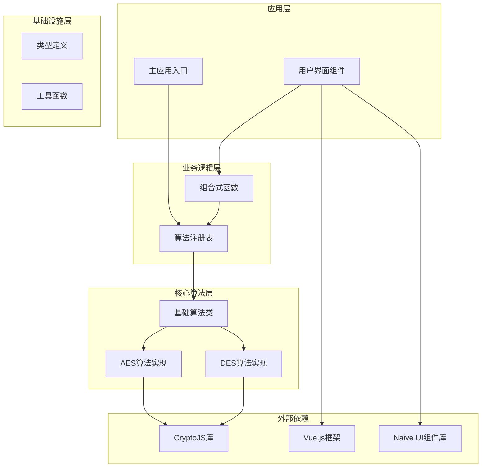
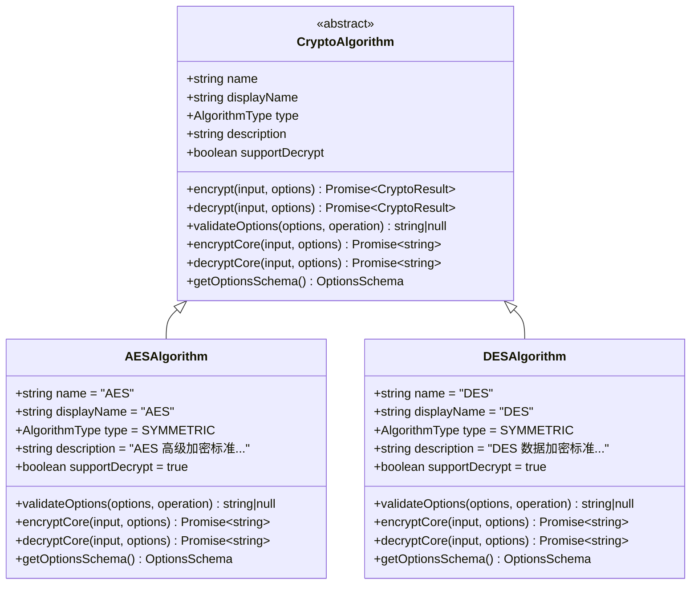
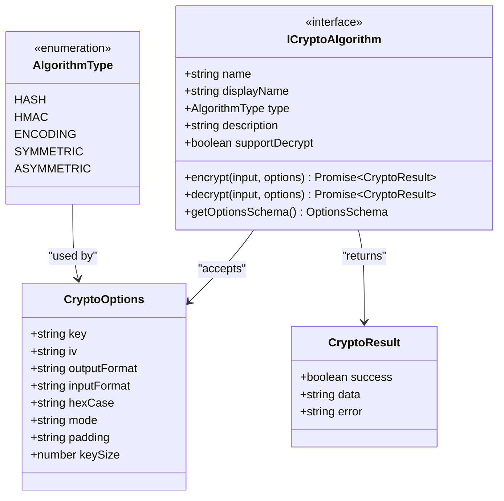
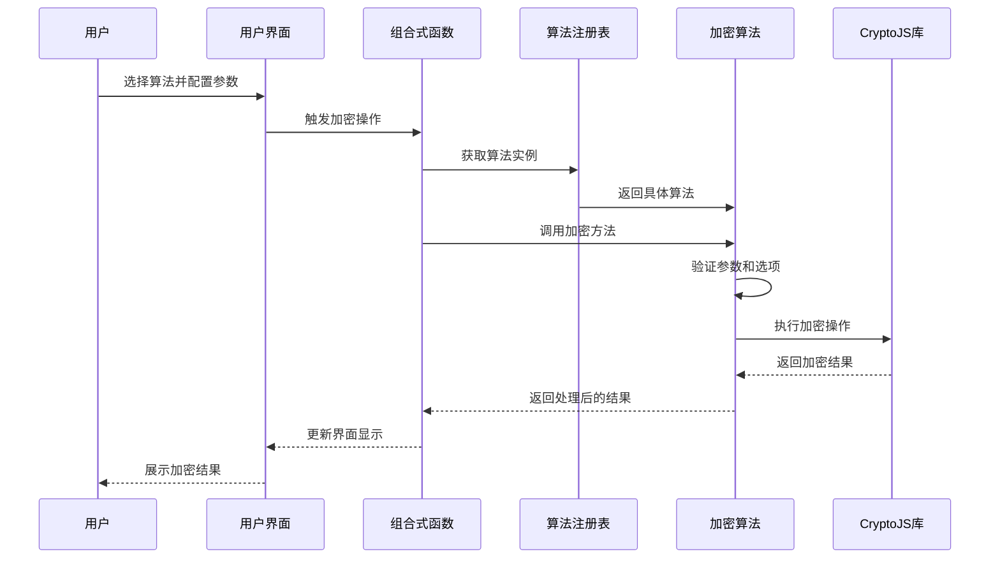
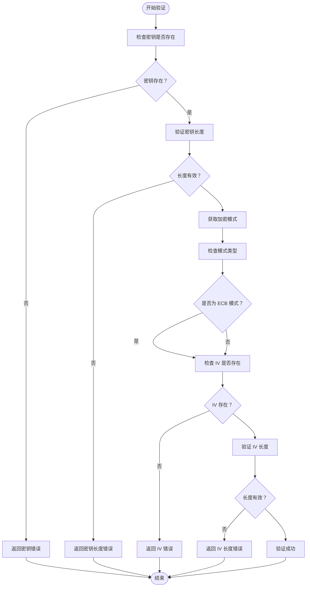
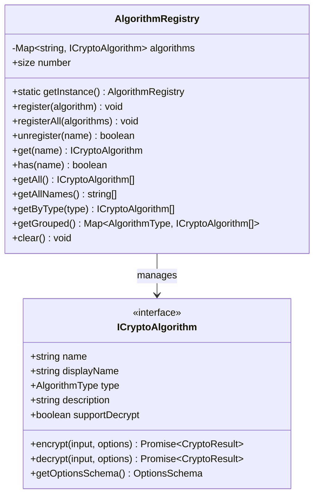
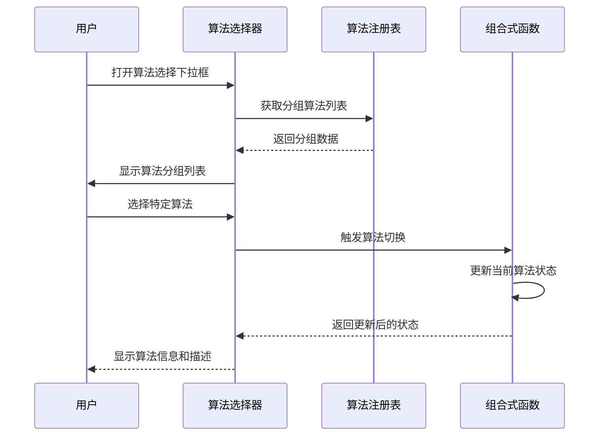
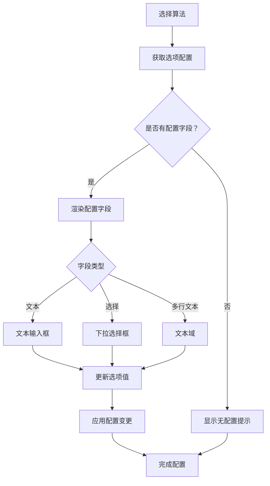
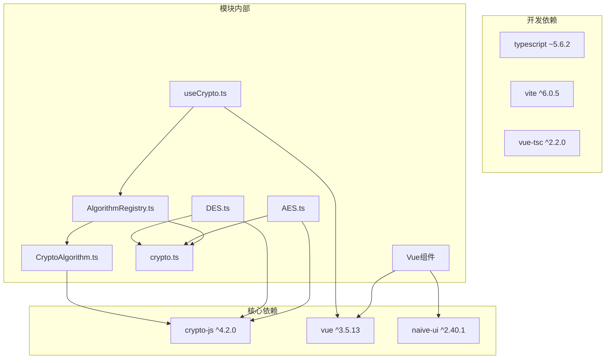
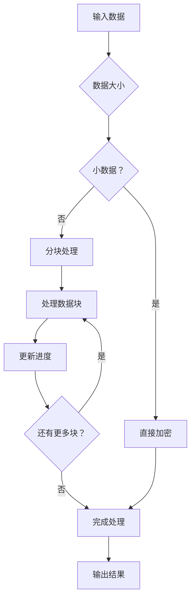

# 对称加密模块

<cite>
**本文档引用的文件**
- [AES.ts](file://src/algorithms/symmetric/AES.ts)
- [DES.ts](file://src/algorithms/symmetric/DES.ts)
- [CryptoAlgorithm.ts](file://src/core/base/CryptoAlgorithm.ts)
- [crypto.ts](file://src/core/types/crypto.ts)
- [useCrypto.ts](file://src/composables/useCrypto.ts)
- [AlgorithmRegistry.ts](file://src/core/registry/AlgorithmRegistry.ts)
- [index.ts](file://src/algorithms/index.ts)
- [AlgorithmSelector.vue](file://src/components/crypto/AlgorithmSelector.vue)
- [InputArea.vue](file://src/components/crypto/InputArea.vue)
- [OptionsPanel.vue](file://src/components/crypto/OptionsPanel.vue)
- [main.ts](file://src/main.ts)
- [package.json](file://package.json)
</cite>

## 目录
1. [简介](#简介)
2. [项目结构](#项目结构)
3. [核心组件](#核心组件)
4. [架构概览](#架构概览)
5. [详细组件分析](#详细组件分析)
6. [依赖关系分析](#依赖关系分析)
7. [性能考虑](#性能考虑)
8. [故障排除指南](#故障排除指南)
9. [结论](#结论)

## 简介

对称加密模块是一个基于 Vue 3 和 TypeScript 构建的加密工具库，专注于提供 AES 和 DES 两种对称加密算法的安全实现。该模块采用模块化设计，支持多种加密模式和填充方案，为文件加密、通信加密和数据保护提供完整的解决方案。

该模块的核心特点包括：
- 支持 AES-128/192/256 和 DES 加密算法
- 提供 ECB、CBC、CFB、OFB、CTR 等多种加密模式
- 支持 PKCS7、ZeroPadding、NoPadding 等填充方案
- 完整的密钥管理和初始化向量处理
- 用户友好的 Web 界面集成
- 类型安全的 TypeScript 实现

## 项目结构

对称加密模块采用清晰的分层架构，主要分为以下几个层次：

**图表来源**
- [main.ts](file://src/main.ts#L1-L10)
- [AlgorithmRegistry.ts](file://src/core/registry/AlgorithmRegistry.ts#L1-L114)
- [CryptoAlgorithm.ts](file://src/core/base/CryptoAlgorithm.ts#L1-L165)

**章节来源**
- [main.ts](file://src/main.ts#L1-L10)
- [index.ts](file://src/algorithms/index.ts#L1-L59)

## 核心组件

对称加密模块的核心由以下关键组件构成：

### 算法基类系统

所有对称加密算法都继承自统一的基类，提供一致的接口和错误处理机制：

**图表来源**
- [CryptoAlgorithm.ts](file://src/core/base/CryptoAlgorithm.ts#L13-L165)
- [AES.ts](file://src/algorithms/symmetric/AES.ts#L5-L171)
- [DES.ts](file://src/algorithms/symmetric/DES.ts#L5-L168)

### 类型系统

模块采用强类型设计，确保编译时的安全性：

**图表来源**
- [crypto.ts](file://src/core/types/crypto.ts#L1-L104)

**章节来源**
- [CryptoAlgorithm.ts](file://src/core/base/CryptoAlgorithm.ts#L1-L165)
- [crypto.ts](file://src/core/types/crypto.ts#L1-L104)

## 架构概览

对称加密模块采用模块化的架构设计，通过注册表模式管理所有算法，提供统一的接口给上层应用使用。

**图表来源**
- [useCrypto.ts](file://src/composables/useCrypto.ts#L78-L119)
- [AlgorithmRegistry.ts](file://src/core/registry/AlgorithmRegistry.ts#L50-L52)
- [AES.ts](file://src/algorithms/symmetric/AES.ts#L30-L47)

## 详细组件分析

### AES 对称加密算法

AES（Advanced Encryption Standard）是模块中最核心的对称加密算法，支持 128/192/256 位密钥长度。

#### 算法特性

AES 算法具有以下关键特性：
- **密钥长度**：支持 16、24、32 字节（128、192、256 位）
- **块大小**：16 字节
- **支持模式**：CBC、ECB、CFB、OFB、CTR
- **填充方案**：PKCS7、ZeroPadding、NoPadding
- **输出格式**：Base64、Hex

#### 参数验证机制

**图表来源**
- [AES.ts](file://src/algorithms/symmetric/AES.ts#L12-L28)

#### 加密流程

AES 加密过程包含以下步骤：

1. **密钥处理**：将 UTF-8 编码的密钥转换为 CryptoJS 内部格式
2. **模式选择**：根据配置选择合适的加密模式
3. **填充设置**：配置相应的填充方案
4. **执行加密**：调用 CryptoJS.AES.encrypt 进行加密
5. **格式转换**：根据输出格式要求进行转换

#### 选项配置

AES 算法支持以下配置选项：

| 选项键 | 类型 | 默认值 | 描述 |
|--------|------|--------|------|
| key | string | 必填 | 密钥字符串（16/24/32 字节） |
| iv | string | 可选 | 初始化向量（16 字节） |
| mode | string | CBC | 加密模式（CBC/ECB/CFB/OFB/CTR） |
| padding | string | Pkcs7 | 填充方案（Pkcs7/ZeroPadding/NoPadding） |
| outputFormat | string | base64 | 输出格式（base64/hex） |

**章节来源**
- [AES.ts](file://src/algorithms/symmetric/AES.ts#L1-L171)

### DES 对称加密算法

DES（Data Encryption Standard）是较老的对称加密算法，现已不推荐用于高安全性场景。

#### 算法特性

DES 算法的关键特性：
- **密钥长度**：固定 8 字节（56 位有效密钥）
- **块大小**：8 字节
- **支持模式**：CBC、ECB、CFB、OFB
- **填充方案**：PKCS7、ZeroPadding、NoPadding
- **输出格式**：Base64、Hex

#### 安全性考虑

DES 算法由于其较短的密钥长度，在现代密码学中已被认为不够安全，主要用于兼容性目的或教学演示。

**章节来源**
- [DES.ts](file://src/algorithms/symmetric/DES.ts#L1-L168)

### 算法注册表系统

算法注册表采用单例模式，负责管理所有加密算法的生命周期：

**图表来源**
- [AlgorithmRegistry.ts](file://src/core/registry/AlgorithmRegistry.ts#L7-L114)

**章节来源**
- [AlgorithmRegistry.ts](file://src/core/registry/AlgorithmRegistry.ts#L1-L114)

### 用户界面组件

模块提供了完整的用户界面组件，支持直观的操作体验：

#### 算法选择器

算法选择器组件提供分组的算法列表，支持搜索和过滤功能：

**图表来源**
- [AlgorithmSelector.vue](file://src/components/crypto/AlgorithmSelector.vue#L9-L24)

#### 参数面板

参数面板根据所选算法动态生成配置选项：

**图表来源**
- [OptionsPanel.vue](file://src/components/crypto/OptionsPanel.vue#L20-L46)

**章节来源**
- [AlgorithmSelector.vue](file://src/components/crypto/AlgorithmSelector.vue#L1-L63)
- [InputArea.vue](file://src/components/crypto/InputArea.vue#L1-L70)
- [OptionsPanel.vue](file://src/components/crypto/OptionsPanel.vue#L1-L129)

## 依赖关系分析

对称加密模块的依赖关系清晰明确，遵循单一职责原则：

**图表来源**
- [package.json](file://package.json#L12-L26)
- [index.ts](file://src/algorithms/index.ts#L1-L59)

**章节来源**
- [package.json](file://package.json#L1-L27)

## 性能考虑

### 加密算法性能对比

在对称加密算法的选择中，需要考虑以下性能因素：

#### AES vs DES 性能特征

| 特性 | AES | DES |
|------|-----|-----|
| 密钥长度 | 128/192/256 位 | 56 位 |
| 块大小 | 128 位 | 64 位 |
| 加密速度 | 较快 | 较慢 |
| 安全性 | 高 | 低 |
| 推荐用途 | 生产环境 | 兼容性需求 |

#### 模式性能影响

不同加密模式对性能的影响：

1. **CBC 模式**：需要初始化向量，安全性高，性能适中
2. **ECB 模式**：简单快速，但安全性差，不推荐生产使用
3. **CFB/OFB 模式**：流加密，适合流数据传输
4. **CTR 模式**：并行处理能力强，性能优秀

### 内存和计算优化

## 故障排除指南

### 常见错误及解决方案

#### 密钥相关错误

| 错误类型 | 错误信息 | 可能原因 | 解决方案 |
|----------|----------|----------|----------|
| 密钥为空 | "请输入密钥" | 未提供密钥 | 确保提供有效的密钥字符串 |
| 密钥长度错误 | "密钥长度必须为 16、24 或 32 字节" | AES 密钥长度不符合要求 | 使用正确的密钥长度（16/24/32 字节） |
| DES 密钥错误 | "密钥长度必须为 8 字节" | DES 密钥长度不正确 | 确保 DES 密钥为 8 字节 |

#### 模式和 IV 相关错误

| 错误类型 | 错误信息 | 可能原因 | 解决方案 |
|----------|----------|----------|----------|
| IV 缺失 | "{mode} 模式需要提供 IV" | 使用 CBC/CFB/OFB/CTR 模式但未提供 IV | 为这些模式提供 16 字节的 IV |
| IV 长度错误 | "IV 长度必须为 16 字节" | IV 长度不正确 | 确保 IV 为 16 字节（对于 AES）或 8 字节（对于 DES） |
| ECB 模式错误 | "ECB 模式不需要 IV" | 在 ECB 模式下提供了 IV | 移除 ECB 模式下的 IV 配置 |

#### 解密相关错误

| 错误类型 | 错误信息 | 可能原因 | 解决方案 |
|----------|----------|----------|----------|
| 解密失败 | "解密失败，请检查密钥和 IV 是否正确" | 密钥或 IV 不正确 | 验证密钥和 IV 的正确性 |
| 格式错误 | "输入格式不正确" | 输入格式与配置不匹配 | 确保输入格式与 inputFormat 配置一致 |

### 调试建议

1. **启用详细日志**：在开发环境中启用详细的错误日志
2. **验证参数**：使用 `validateOptions` 方法验证所有参数
3. **测试小数据**：先用小数据测试算法正确性
4. **检查依赖版本**：确保使用的 CryptoJS 版本兼容

**章节来源**
- [AES.ts](file://src/algorithms/symmetric/AES.ts#L12-L28)
- [DES.ts](file://src/algorithms/symmetric/DES.ts#L12-L27)
- [CryptoAlgorithm.ts](file://src/core/base/CryptoAlgorithm.ts#L23-L75)

## 结论

对称加密模块提供了一个完整、类型安全且易于使用的加密解决方案。通过模块化的架构设计，该模块能够：

### 主要优势

1. **类型安全**：完整的 TypeScript 类型定义确保编译时安全性
2. **灵活配置**：支持多种加密模式和填充方案
3. **用户友好**：提供直观的 Web 界面和丰富的配置选项
4. **扩展性强**：基于注册表的设计便于添加新的加密算法
5. **错误处理**：完善的错误处理和验证机制

### 应用场景

该模块适用于以下场景：
- **文件加密**：支持大文件的分块加密处理
- **通信加密**：为网络通信提供端到端加密
- **数据保护**：保护敏感数据的存储和传输
- **系统集成**：作为后端服务的加密组件

### 安全建议

1. **密钥管理**：使用安全的密钥生成和存储机制
2. **模式选择**：优先使用 CBC 或 CTR 模式，避免 ECB 模式
3. **IV 使用**：为每个加密操作生成唯一的初始化向量
4. **定期更新**：定期更新加密算法和依赖库版本

通过对称加密模块，开发者可以快速集成安全的加密功能，同时保持代码的可维护性和扩展性。