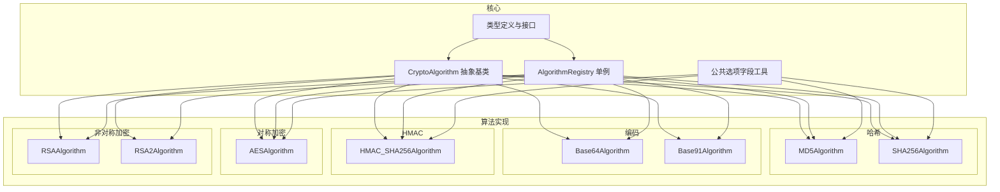
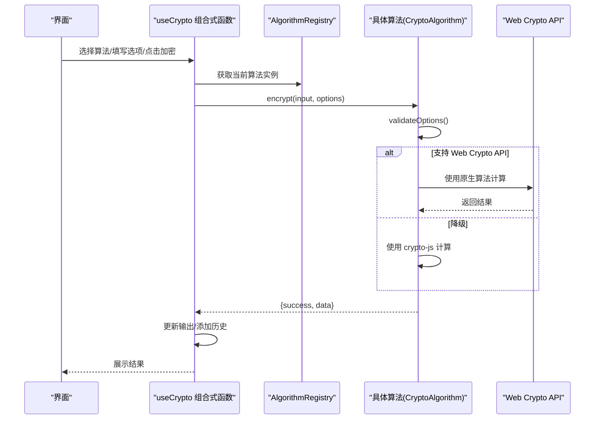
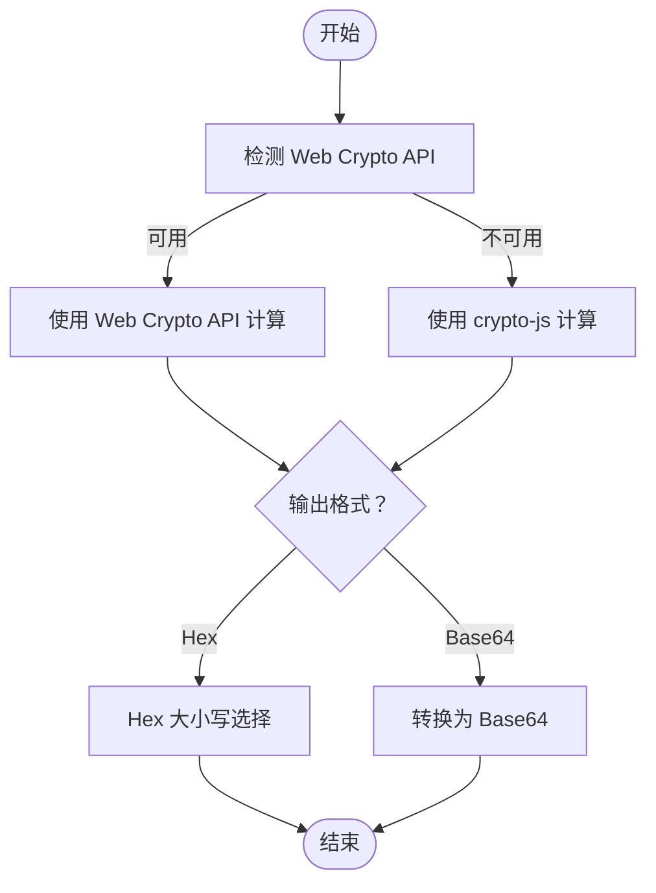
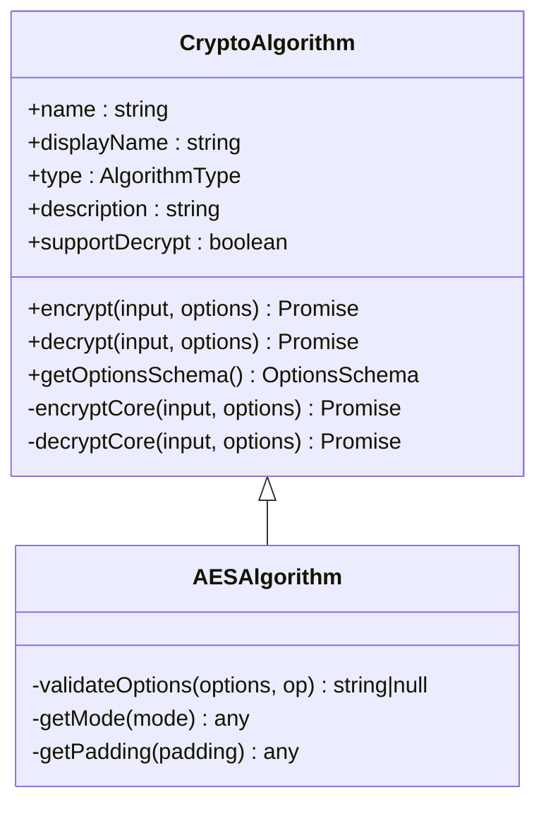
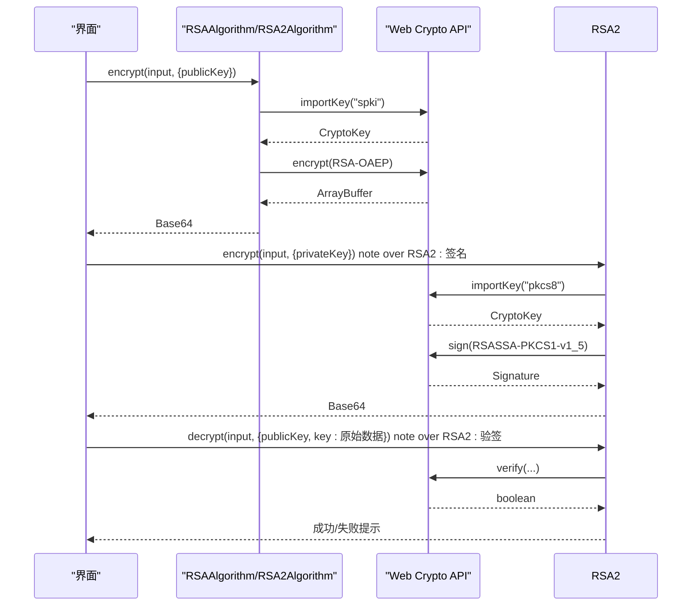
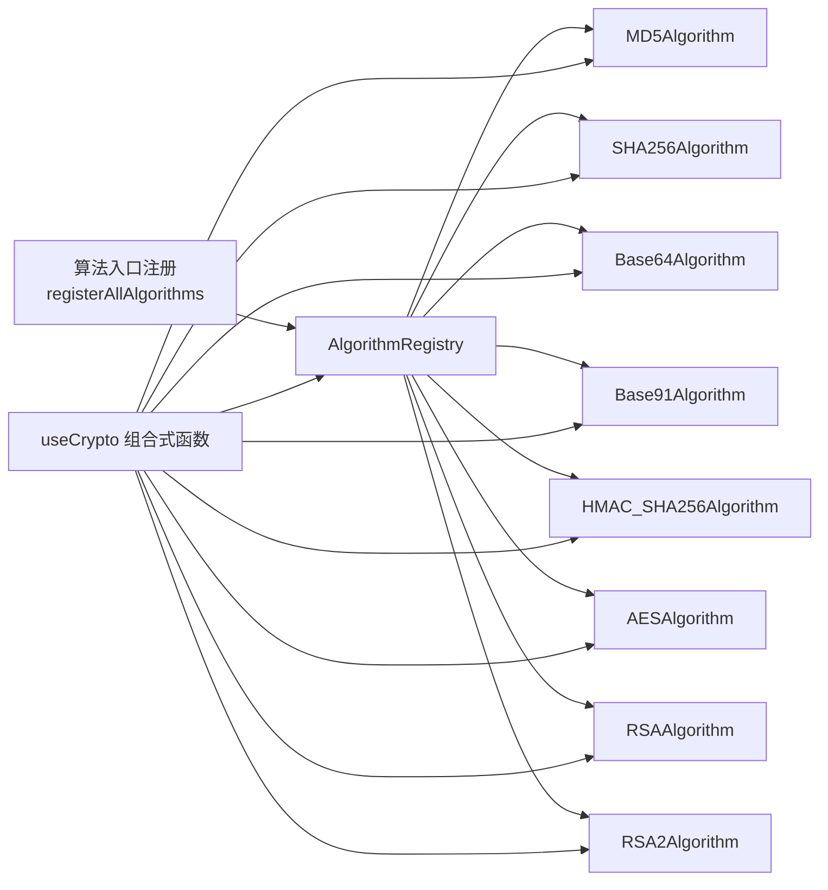

# 算法模块

<cite>
**本文引用的文件**
- [src/algorithms/index.ts](file://src/algorithms/index.ts)
- [src/core/base/CryptoAlgorithm.ts](file://src/core/base/CryptoAlgorithm.ts)
- [src/core/registry/AlgorithmRegistry.ts](file://src/core/registry/AlgorithmRegistry.ts)
- [src/core/types/crypto.ts](file://src/core/types/crypto.ts)
- [src/composables/useCrypto.ts](file://src/composables/useCrypto.ts)
- [src/core/utils/optionFields.ts](file://src/core/utils/optionFields.ts)
- [src/algorithms/hash/MD5.ts](file://src/algorithms/hash/MD5.ts)
- [src/algorithms/hash/SHA256.ts](file://src/algorithms/hash/SHA256.ts)
- [src/algorithms/encoding/Base64.ts](file://src/algorithms/encoding/Base64.ts)
- [src/algorithms/encoding/Base91.ts](file://src/algorithms/encoding/Base91.ts)
- [src/algorithms/symmetric/AES.ts](file://src/algorithms/symmetric/AES.ts)
- [src/algorithms/asymmetric/RSA.ts](file://src/algorithms/asymmetric/RSA.ts)
- [src/algorithms/asymmetric/RSA2.ts](file://src/algorithms/asymmetric/RSA2.ts)
- [src/algorithms/hmac/HMAC_SHA256.ts](file://src/algorithms/hmac/HMAC_SHA256.ts)
- [package.json](file://package.json)
</cite>

## 目录
1. [简介](#简介)
2. [项目结构](#项目结构)
3. [核心组件](#核心组件)
4. [架构总览](#架构总览)
5. [详细组件分析](#详细组件分析)
6. [依赖关系分析](#依赖关系分析)
7. [性能考虑](#性能考虑)
8. [故障排查指南](#故障排查指南)
9. [结论](#结论)
10. [附录](#附录)

## 简介
本文件系统性梳理编码器项目中的算法模块，覆盖哈希算法、编码转换、HMAC、对称加密与非对称加密五大类算法。文档从架构设计、组件关系、数据流与处理逻辑入手，结合各算法的实现原理、使用方法、性能特点与安全考量，给出算法选择指南、参数配置说明与实际应用示例，帮助用户在不同场景下做出合理决策。

## 项目结构
算法模块采用“按功能域分层 + 抽象基类 + 注册表”的组织方式：
- 核心抽象与类型：统一的算法抽象基类、算法类型枚举、选项与结果接口、注册表单例
- 算法实现：按类别划分目录，每个算法实现继承抽象基类并提供具体逻辑
- 组合与展示：通过组合式函数统一管理当前算法、选项、输入输出与历史记录

图表来源
- [src/core/base/CryptoAlgorithm.ts](file://src/core/base/CryptoAlgorithm.ts#L1-L165)
- [src/core/registry/AlgorithmRegistry.ts](file://src/core/registry/AlgorithmRegistry.ts#L1-L114)
- [src/core/types/crypto.ts](file://src/core/types/crypto.ts#L1-L104)
- [src/core/utils/optionFields.ts](file://src/core/utils/optionFields.ts#L1-L137)
- [src/algorithms/hash/MD5.ts](file://src/algorithms/hash/MD5.ts#L1-L28)
- [src/algorithms/hash/SHA256.ts](file://src/algorithms/hash/SHA256.ts#L1-L45)
- [src/algorithms/encoding/Base64.ts](file://src/algorithms/encoding/Base64.ts#L1-L39)
- [src/algorithms/encoding/Base91.ts](file://src/algorithms/encoding/Base91.ts#L1-L97)
- [src/algorithms/hmac/HMAC_SHA256.ts](file://src/algorithms/hmac/HMAC_SHA256.ts#L1-L63)
- [src/algorithms/symmetric/AES.ts](file://src/algorithms/symmetric/AES.ts#L1-L171)
- [src/algorithms/asymmetric/RSA.ts](file://src/algorithms/asymmetric/RSA.ts#L1-L166)
- [src/algorithms/asymmetric/RSA2.ts](file://src/algorithms/asymmetric/RSA2.ts#L1-L183)

章节来源
- [src/algorithms/index.ts](file://src/algorithms/index.ts#L1-L59)
- [src/core/base/CryptoAlgorithm.ts](file://src/core/base/CryptoAlgorithm.ts#L1-L165)
- [src/core/registry/AlgorithmRegistry.ts](file://src/core/registry/AlgorithmRegistry.ts#L1-L114)
- [src/core/types/crypto.ts](file://src/core/types/crypto.ts#L1-L104)
- [src/core/utils/optionFields.ts](file://src/core/utils/optionFields.ts#L1-L137)

## 核心组件
- 抽象基类：统一加密/解密流程、输入校验、选项校验、常用数据格式转换（UTF-8、Hex、Base64）
- 注册表：单例管理算法注册、查询、分组与批量注册
- 类型系统：算法类型枚举、选项接口、结果接口、选项字段定义与 Schema
- 组合式函数：集中管理当前算法、选项 Schema、输入输出、历史记录与操作

章节来源
- [src/core/base/CryptoAlgorithm.ts](file://src/core/base/CryptoAlgorithm.ts#L1-L165)
- [src/core/registry/AlgorithmRegistry.ts](file://src/core/registry/AlgorithmRegistry.ts#L1-L114)
- [src/core/types/crypto.ts](file://src/core/types/crypto.ts#L1-L104)
- [src/composables/useCrypto.ts](file://src/composables/useCrypto.ts#L1-L217)

## 架构总览
算法模块遵循“面向对象 + 接口契约 + 可插拔注册”的设计。所有算法均继承自统一基类，通过注册表集中管理；前端通过组合式函数选择算法、设置选项并执行加解密；选项 Schema 由公共工具生成，确保一致性与可扩展性。

图表来源
- [src/composables/useCrypto.ts](file://src/composables/useCrypto.ts#L74-L119)
- [src/core/registry/AlgorithmRegistry.ts](file://src/core/registry/AlgorithmRegistry.ts#L48-L52)
- [src/core/base/CryptoAlgorithm.ts](file://src/core/base/CryptoAlgorithm.ts#L23-L75)
- [src/algorithms/hash/SHA256.ts](file://src/algorithms/hash/SHA256.ts#L17-L30)
- [src/algorithms/hmac/HMAC_SHA256.ts](file://src/algorithms/hmac/HMAC_SHA256.ts#L25-L48)

## 详细组件分析

### 哈希算法
- MD5Algorithm
  - 特点：固定输出 128 位，支持 Hex/Base64 输出，Hex 大小写可选
  - 适用：兼容性需求或非安全场景；不建议用于密码存储或完整性保护
  - 参数：输出格式、Hex 大小写
- SHA256Algorithm
  - 特点：优先使用 Web Crypto API，失败时降级至 crypto-js；输出 256 位
  - 适用：一般完整性校验、数字摘要、作为 HMAC 密钥源
  - 参数：输出格式、Hex 大小写

图表来源
- [src/algorithms/hash/SHA256.ts](file://src/algorithms/hash/SHA256.ts#L17-L39)
- [src/core/base/CryptoAlgorithm.ts](file://src/core/base/CryptoAlgorithm.ts#L117-L140)

章节来源
- [src/algorithms/hash/MD5.ts](file://src/algorithms/hash/MD5.ts#L1-L28)
- [src/algorithms/hash/SHA256.ts](file://src/algorithms/hash/SHA256.ts#L1-L45)
- [src/core/utils/optionFields.ts](file://src/core/utils/optionFields.ts#L8-L34)

### 编码转换
- Base64Algorithm
  - 特点：双向可逆，支持 Unicode 正确编码/解码
  - 适用：网络传输、嵌入文本等场景
  - 参数：无专用参数
- Base91Algorithm
  - 特点：相比 Base64 效率更高，适合二进制到文本的高效转换
  - 适用：带宽敏感或需要更紧凑表示的场景
  - 参数：无专用参数

章节来源
- [src/algorithms/encoding/Base64.ts](file://src/algorithms/encoding/Base64.ts#L1-L39)
- [src/algorithms/encoding/Base91.ts](file://src/algorithms/encoding/Base91.ts#L1-L97)

### HMAC
- HMAC_SHA256Algorithm
  - 特点：基于 SHA-256 的消息认证码，优先使用 Web Crypto API，支持 Hex/Base64 输出
  - 适用：消息完整性与真实性校验、API 签名、会话令牌校验
  - 参数：密钥、输出格式、Hex 大小写

章节来源
- [src/algorithms/hmac/HMAC_SHA256.ts](file://src/algorithms/hmac/HMAC_SHA256.ts#L1-L63)
- [src/core/utils/optionFields.ts](file://src/core/utils/optionFields.ts#L36-L43)
- [src/core/utils/optionFields.ts](file://src/core/utils/optionFields.ts#L129-L136)

### 对称加密
- AESAlgorithm
  - 特点：支持 CBC/ECB/CFB/OFB/CTR 模式与 PKCS7/零填充/无填充；密钥长度 16/24/32 字节
  - 适用：大量数据加密、文件加密、数据库字段加密
  - 参数：密钥、IV、模式、填充、输出格式（加密）/输入格式（解密）

图表来源
- [src/core/base/CryptoAlgorithm.ts](file://src/core/base/CryptoAlgorithm.ts#L13-L87)
- [src/algorithms/symmetric/AES.ts](file://src/algorithms/symmetric/AES.ts#L5-L96)

章节来源
- [src/algorithms/symmetric/AES.ts](file://src/algorithms/symmetric/AES.ts#L1-L171)
- [src/core/utils/optionFields.ts](file://src/core/utils/optionFields.ts#L45-L62)
- [src/core/utils/optionFields.ts](file://src/core/utils/optionFields.ts#L64-L84)
- [src/core/utils/optionFields.ts](file://src/core/utils/optionFields.ts#L86-L96)

### 非对称加密
- RSAAlgorithm
  - 特点：RSA-OAEP 加/解密，使用 SPKI/PKCS#8 导入密钥，支持 Base64 输出
  - 适用：加密小量数据、密钥交换封装、安全传输
  - 参数：公钥/私钥（PEM）、输出格式
- RSA2Algorithm
  - 特点：RSASSA-PKCS1-v1_5 签名与验签；“解密”实为验签
  - 适用：数字签名与验签、证书链验证
  - 参数：私钥/公钥（PEM）、原始数据（验签时使用）

图表来源
- [src/algorithms/asymmetric/RSA.ts](file://src/algorithms/asymmetric/RSA.ts#L21-L57)
- [src/algorithms/asymmetric/RSA2.ts](file://src/algorithms/asymmetric/RSA2.ts#L21-L66)

章节来源
- [src/algorithms/asymmetric/RSA.ts](file://src/algorithms/asymmetric/RSA.ts#L1-L166)
- [src/algorithms/asymmetric/RSA2.ts](file://src/algorithms/asymmetric/RSA2.ts#L1-L183)

## 依赖关系分析
- 算法注册与发现：通过注册表集中管理，支持按类型分组与批量注册
- 选项 Schema：通过公共工具生成，保证一致性与可维护性
- 外部库：crypto-js 提供兼容实现，Web Crypto API 提供原生高性能路径
- 前端集成：组合式函数统一调度算法调用与历史记录

图表来源
- [src/algorithms/index.ts](file://src/algorithms/index.ts#L29-L54)
- [src/core/registry/AlgorithmRegistry.ts](file://src/core/registry/AlgorithmRegistry.ts#L26-L31)
- [src/composables/useCrypto.ts](file://src/composables/useCrypto.ts#L14-L22)

章节来源
- [src/algorithms/index.ts](file://src/algorithms/index.ts#L1-L59)
- [src/core/registry/AlgorithmRegistry.ts](file://src/core/registry/AlgorithmRegistry.ts#L1-L114)
- [src/composables/useCrypto.ts](file://src/composables/useCrypto.ts#L1-L217)
- [package.json](file://package.json#L12-L25)

## 性能考虑
- 优先使用 Web Crypto API：在可用时优先走浏览器原生实现，具备更好的性能与安全性
- 降级策略：当原生不可用时自动回退到 crypto-js，保证功能可用
- 输出格式选择：Base64 便于网络传输，Hex 便于调试与对比；注意大小写与填充开销
- 对称加密：合理选择模式与填充；CBC/CTR 等模式需正确提供 IV；避免 ECB 模式
- 非对称加密：密钥长度越大越安全但性能越低；签名与验签使用专用算法族

## 故障排查指南
- 输入为空：所有算法在 encrypt/decrypt 前都会进行输入校验，确保输入非空
- 不支持解密：部分算法（如哈希、HMAC）不支持解密，调用会返回明确错误
- 选项校验失败：
  - AES：密钥长度必须为 16/24/32；CBC/CFB/OFB/CTR 模式需提供 16 字节 IV
  - HMAC：必须提供密钥
  - RSA/RSA2：加密需公钥，解密（验签）需私钥（PEM 格式）
- 输出/输入格式不匹配：解密时需与加密时的输出格式一致
- 浏览器环境限制：某些算法依赖 Web Crypto API，若不可用会触发降级逻辑

章节来源
- [src/core/base/CryptoAlgorithm.ts](file://src/core/base/CryptoAlgorithm.ts#L23-L75)
- [src/algorithms/symmetric/AES.ts](file://src/algorithms/symmetric/AES.ts#L12-L28)
- [src/algorithms/hmac/HMAC_SHA256.ts](file://src/algorithms/hmac/HMAC_SHA256.ts#L13-L18)
- [src/algorithms/asymmetric/RSA.ts](file://src/algorithms/asymmetric/RSA.ts#L11-L19)
- [src/algorithms/asymmetric/RSA2.ts](file://src/algorithms/asymmetric/RSA2.ts#L11-L19)

## 结论
该算法模块以统一抽象与注册机制为核心，覆盖哈希、编码、HMAC、对称与非对称五大类算法，既满足通用需求又兼顾性能与安全性。通过清晰的选项 Schema 与完善的错误处理，用户可在不同场景下快速选择合适算法并正确配置参数。

## 附录

### 算法选择指南
- 哈希
  - 需要兼容性或非安全用途：MD5
  - 一般完整性校验/签名材料：SHA-256
- 编码转换
  - 通用文本嵌入：Base64
  - 高效二进制到文本：Base91
- HMAC
  - 消息完整性与真实性校验：HMAC-SHA256
- 对称加密
  - 大量数据加密：AES（推荐 CBC/CTR 模式，提供正确 IV）
- 非对称加密
  - 小量数据加密/密钥封装：RSA（RSA-OAEP）
  - 数字签名与验签：RSA2（RSASSA-PKCS1-v1_5）

### 参数配置速查
- 通用
  - outputFormat：hex/base64
  - inputFormat：base64/hex（解密）
  - hexCase：lower/upper（仅在 hex 输出时生效）
- 对称加密（AES）
  - key：16/24/32 字节
  - iv：16 字节（除 ECB 外）
  - mode：CBC/ECB/CFB/OFB/CTR
  - padding：Pkcs7/ZeroPadding/NoPadding
- HMAC
  - key：任意字符串
- 非对称（RSA/RSA2）
  - publicKey/privateKey：PEM 格式（SPKI/PKCS#8）
  - RSA2 验签需提供原始数据（通过 key 字段传入）

### 实际应用示例（步骤说明）
- 使用 SHA-256 校验文件完整性
  - 选择算法：SHA-256
  - 选项：输出格式 hex，Hex 大小写 lower
  - 执行：encrypt(待校验内容)，得到摘要并与目标对比
- 使用 AES 加密敏感文本
  - 选择算法：AES
  - 选项：密钥（16/24/32 字节），IV（16 字节），模式 CBC，填充 Pkcs7，输出格式 base64
  - 执行：encrypt(明文)
  - 解密：decrypt(密文)，输入格式选择 base64
- 使用 HMAC-SHA256 保护 API 请求
  - 选择算法：HMAC-SHA256
  - 选项：密钥（服务端共享），输出格式 hex
  - 执行：encrypt(请求体)，将生成的签名附加到请求头
- 使用 RSA 加密小数据
  - 选择算法：RSA
  - 选项：公钥（PEM），输出格式 base64
  - 执行：encrypt(小量数据)
- 使用 RSA2 进行签名与验签
  - 选择算法：RSA2
  - 签名：私钥（PEM），执行 encrypt(原文)，得到签名
  - 验签：公钥（PEM），执行 decrypt(签名, { key: 原文 })

章节来源
- [src/core/types/crypto.ts](file://src/core/types/crypto.ts#L19-L38)
- [src/core/utils/optionFields.ts](file://src/core/utils/optionFields.ts#L8-L34)
- [src/core/utils/optionFields.ts](file://src/core/utils/optionFields.ts#L45-L96)
- [src/algorithms/hash/SHA256.ts](file://src/algorithms/hash/SHA256.ts#L13-L39)
- [src/algorithms/symmetric/AES.ts](file://src/algorithms/symmetric/AES.ts#L30-L78)
- [src/algorithms/hmac/HMAC_SHA256.ts](file://src/algorithms/hmac/HMAC_SHA256.ts#L20-L57)
- [src/algorithms/asymmetric/RSA.ts](file://src/algorithms/asymmetric/RSA.ts#L21-L57)
- [src/algorithms/asymmetric/RSA2.ts](file://src/algorithms/asymmetric/RSA2.ts#L21-L66)