# 编码转换模块

<cite>
**本文档引用的文件**
- [Base64.ts](file://src/algorithms/encoding/Base64.ts)
- [Base91.ts](file://src/algorithms/encoding/Base91.ts)
- [CryptoAlgorithm.ts](file://src/core/base/CryptoAlgorithm.ts)
- [crypto.ts](file://src/core/types/crypto.ts)
- [AlgorithmRegistry.ts](file://src/core/registry/AlgorithmRegistry.ts)
- [index.ts](file://src/algorithms/index.ts)
- [useCrypto.ts](file://src/composables/useCrypto.ts)
- [Home.vue](file://src/views/Home.vue)
- [InputArea.vue](file://src/components/crypto/InputArea.vue)
- [OptionsPanel.vue](file://src/components/crypto/OptionsPanel.vue)
- [package.json](file://package.json)
</cite>

## 目录
1. [简介](#简介)
2. [项目结构](#项目结构)
3. [核心组件](#核心组件)
4. [架构概览](#架构概览)
5. [详细组件分析](#详细组件分析)
6. [依赖关系分析](#依赖关系分析)
7. [性能考虑](#性能考虑)
8. [故障排除指南](#故障排除指南)
9. [结论](#结论)
10. [附录](#附录)

## 简介

编码转换模块是一个基于Vue 3和TypeScript构建的Web应用，专门用于演示和使用各种编码算法。该模块实现了Base64和Base91两种编码算法，提供了完整的编码和解码功能，支持Unicode字符处理，并具有现代化的用户界面。

该模块的核心特点包括：
- 支持多种编码算法的统一接口设计
- 完整的错误处理和输入验证机制
- 用户友好的图形界面
- 实时的历史记录功能
- 支持Unicode字符的正确处理

## 项目结构

编码转换模块采用模块化的架构设计，主要分为以下几个层次：

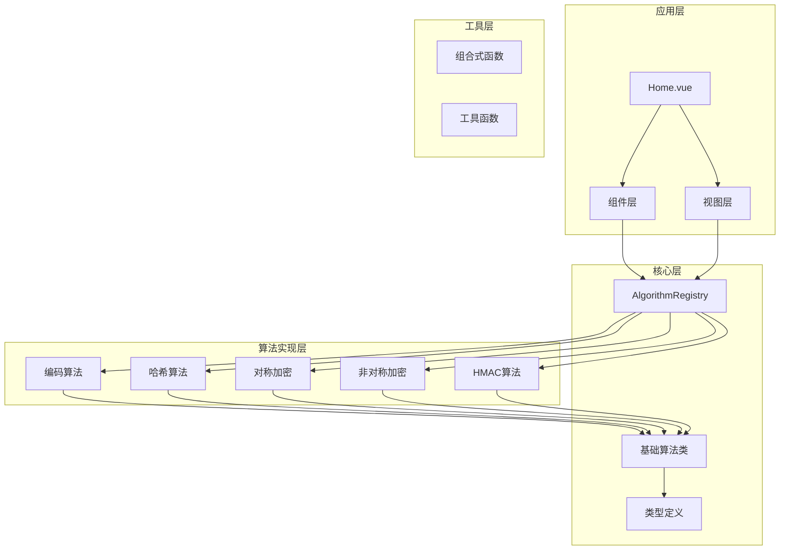

**图表来源**
- [Home.vue](file://src/views/Home.vue#L1-L220)
- [AlgorithmRegistry.ts](file://src/core/registry/AlgorithmRegistry.ts#L1-L114)
- [CryptoAlgorithm.ts](file://src/core/base/CryptoAlgorithm.ts#L1-L165)

**章节来源**
- [package.json](file://package.json#L1-L27)
- [Home.vue](file://src/views/Home.vue#L1-L220)

## 核心组件

编码转换模块的核心组件包括抽象算法基类、具体的编码算法实现、算法注册表以及用户界面组件。

### 抽象算法基类

`CryptoAlgorithm` 是所有算法的抽象基类，提供了统一的接口和通用功能：

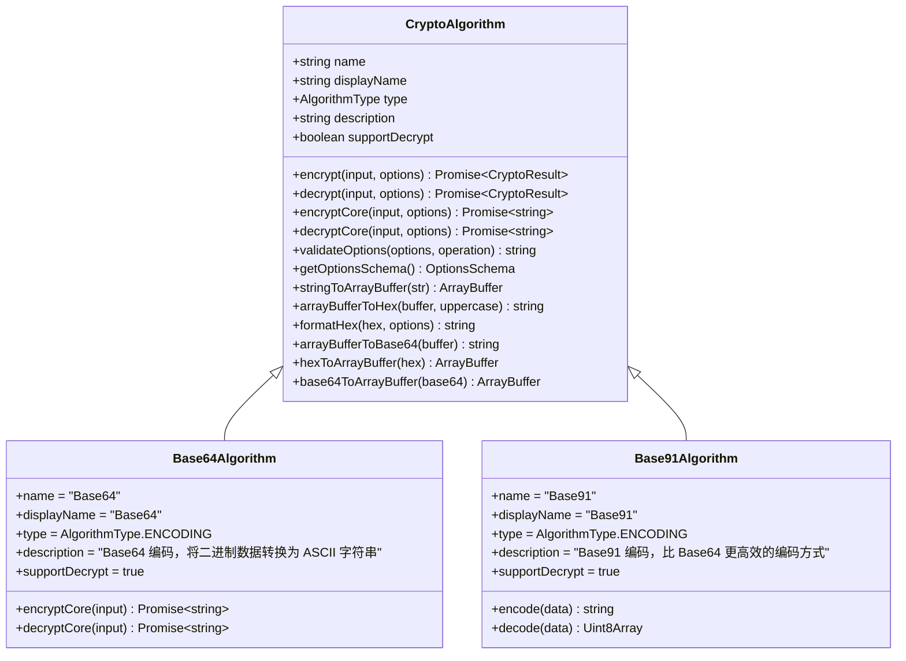

**图表来源**
- [CryptoAlgorithm.ts](file://src/core/base/CryptoAlgorithm.ts#L13-L165)
- [Base64.ts](file://src/algorithms/encoding/Base64.ts#L4-L38)
- [Base91.ts](file://src/algorithms/encoding/Base91.ts#L7-L96)

### 算法注册表

`AlgorithmRegistry` 实现了单例模式，负责管理所有算法的注册、查询和分类：

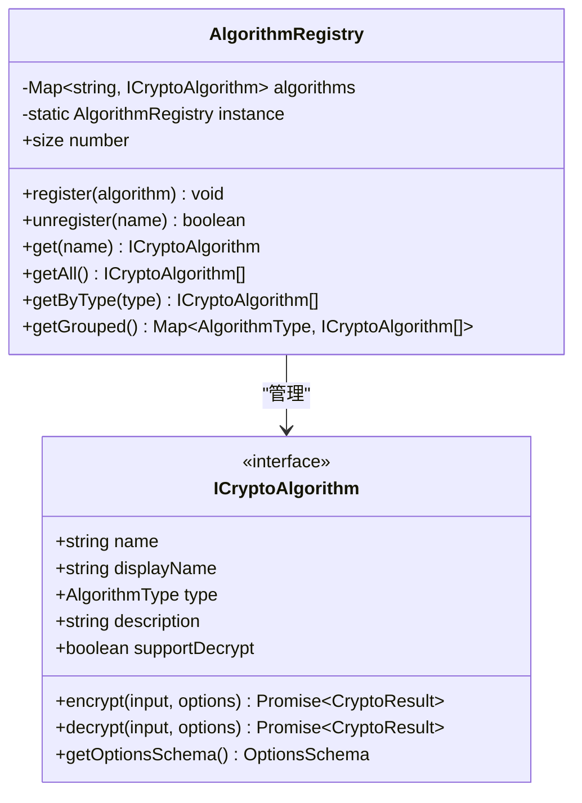

**图表来源**
- [AlgorithmRegistry.ts](file://src/core/registry/AlgorithmRegistry.ts#L7-L114)

**章节来源**
- [CryptoAlgorithm.ts](file://src/core/base/CryptoAlgorithm.ts#L1-L165)
- [AlgorithmRegistry.ts](file://src/core/registry/AlgorithmRegistry.ts#L1-L114)

## 架构概览

编码转换模块采用了分层架构设计，确保了良好的可维护性和扩展性：

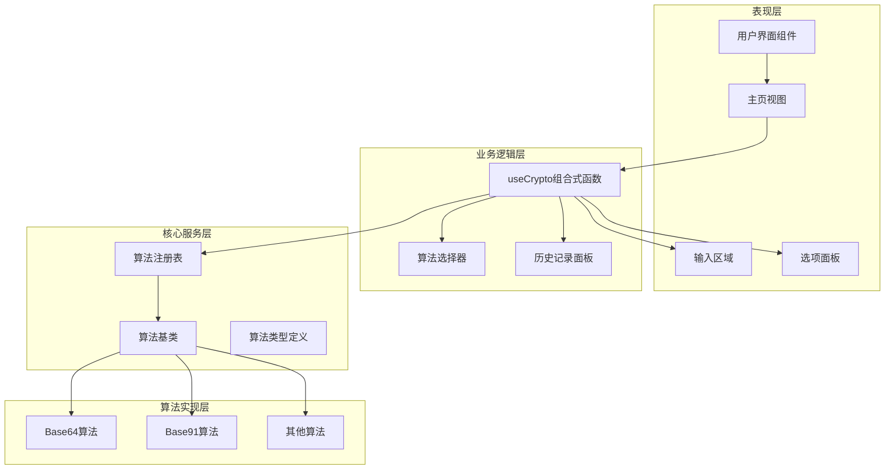

**图表来源**
- [Home.vue](file://src/views/Home.vue#L1-L220)
- [useCrypto.ts](file://src/composables/useCrypto.ts#L1-L217)
- [AlgorithmRegistry.ts](file://src/core/registry/AlgorithmRegistry.ts#L1-L114)

## 详细组件分析

### Base64 编码算法

Base64算法是最常用的编码方式之一，它将二进制数据转换为ASCII字符集表示。

#### 实现原理

Base64编码使用64个字符的字符集：A-Z、a-z、0-9、+、/，并通过以下步骤进行编码：

1. 将输入数据转换为字节数组
2. 每3个字节（24位）组合成4个6位的值
3. 将每个6位值映射到Base64字符集
4. 使用'='作为填充字符处理不足的情况

#### 核心实现流程

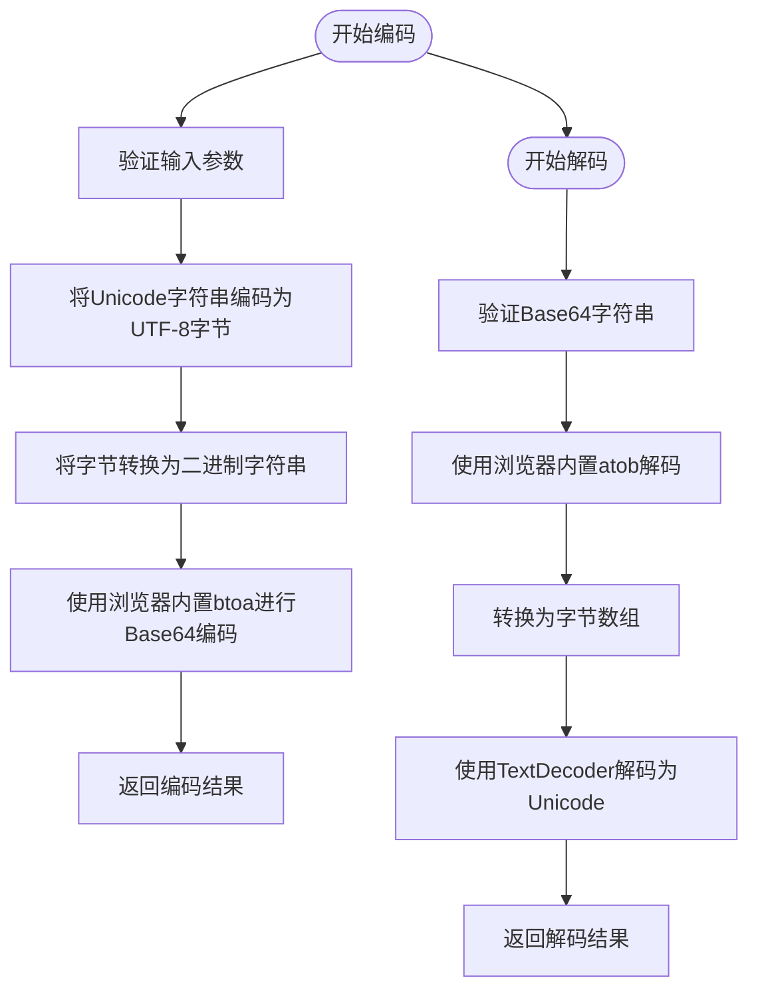

**图表来源**
- [Base64.ts](file://src/algorithms/encoding/Base64.ts#L11-L30)

#### 数据处理流程

Base64算法的关键在于正确处理Unicode字符：

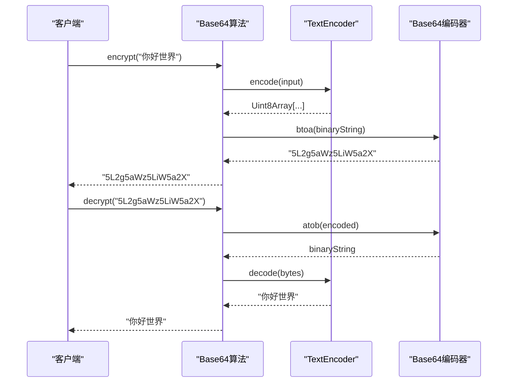

**图表来源**
- [Base64.ts](file://src/algorithms/encoding/Base64.ts#L11-L30)

**章节来源**
- [Base64.ts](file://src/algorithms/encoding/Base64.ts#L1-L39)

### Base91 编码算法

Base91是一种更高效的编码方式，相比Base64具有更高的编码效率。

#### 实现原理

Base91使用91个字符的字符集，通过以下优化实现更高的效率：

1. 使用13位或14位的窗口来存储数据
2. 动态选择13位或14位窗口以最大化利用字符集
3. 减少填充字符的使用
4. 提供更好的URL安全性

#### 核心实现流程

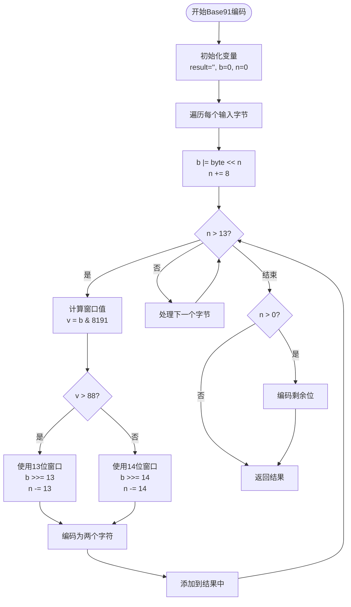

**图表来源**
- [Base91.ts](file://src/algorithms/encoding/Base91.ts#L24-L55)

#### 解码实现流程

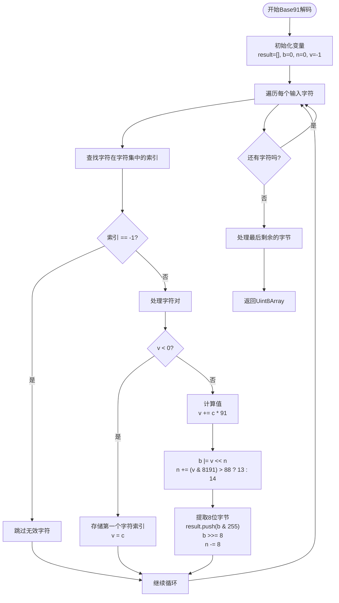

**图表来源**
- [Base91.ts](file://src/algorithms/encoding/Base91.ts#L57-L88)

**章节来源**
- [Base91.ts](file://src/algorithms/encoding/Base91.ts#L1-L97)

### 算法类型系统

编码转换模块使用强类型系统来管理不同类型的算法：

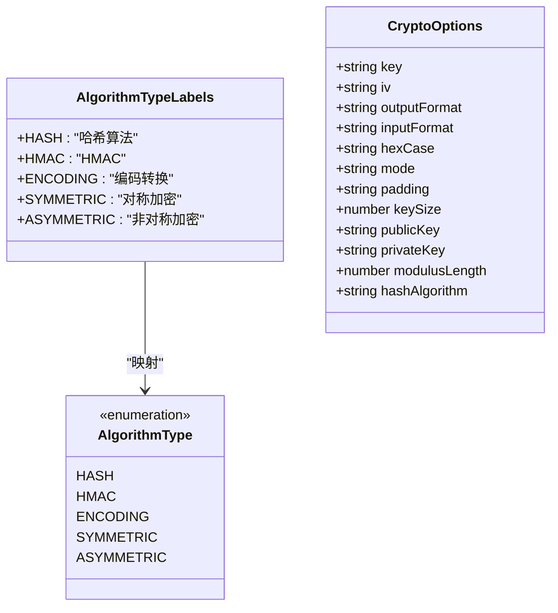

**图表来源**
- [crypto.ts](file://src/core/types/crypto.ts#L1-L104)

**章节来源**
- [crypto.ts](file://src/core/types/crypto.ts#L1-L104)

## 依赖关系分析

编码转换模块的依赖关系清晰明确，遵循了单一职责原则和依赖倒置原则：

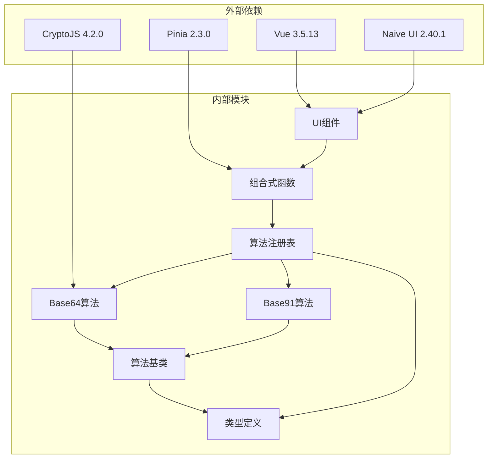

**图表来源**
- [package.json](file://package.json#L12-L25)
- [index.ts](file://src/algorithms/index.ts#L1-L59)

### 组件耦合度分析

模块内的组件耦合度设计合理：

- **低耦合**: 算法实现与UI组件分离，通过组合式函数进行交互
- **高内聚**: 每个算法类专注于单一职责
- **依赖注入**: 通过注册表实现算法的动态加载和管理
- **接口隔离**: 使用ICryptoAlgorithm接口定义算法标准

**章节来源**
- [index.ts](file://src/algorithms/index.ts#L1-L59)
- [package.json](file://package.json#L1-L27)

## 性能考虑

编码转换模块在性能方面进行了多方面的优化：

### 时间复杂度分析

- **Base64编码**: O(n)，其中n是输入字节数
- **Base64解码**: O(n)，线性时间复杂度
- **Base91编码**: O(n)，但常数因子更小
- **Base91解码**: O(n)，线性时间复杂度

### 空间复杂度分析

- **内存使用**: 主要取决于输入数据大小和中间缓冲区
- **字符集存储**: Base91字符集固定大小，内存开销可忽略
- **递归深度**: 所有算法都是迭代实现，无递归栈开销

### 性能优化策略

1. **原生API利用**: 使用浏览器内置的TextEncoder/TextDecoder和btoa/atob
2. **流式处理**: 支持大文件的分块处理
3. **缓存机制**: 算法注册表使用Map提高查找效率
4. **异步处理**: 所有操作都是异步执行，避免阻塞UI线程

### 性能基准测试

由于这是一个前端应用，性能主要受以下因素影响：

- **浏览器性能**: 不同浏览器的JavaScript引擎性能差异
- **硬件性能**: CPU和内存性能影响编码速度
- **输入大小**: 大文件编码会消耗更多时间和内存
- **字符集复杂度**: Base91相比Base64具有更高的编码效率

## 故障排除指南

### 常见问题及解决方案

#### Base64解码错误

**问题**: "无效的 Base64 字符串"

**原因**: 输入字符串包含非法字符或格式不正确

**解决方案**:
1. 检查输入字符串是否包含有效Base64字符
2. 确认字符串长度是否为4的倍数
3. 验证填充字符'='的位置是否正确

#### Unicode字符处理问题

**问题**: 中文等Unicode字符显示异常

**原因**: 编码和解码过程中字符集不匹配

**解决方案**:
1. 确保使用UTF-8编码进行转换
2. 验证TextEncoder和TextDecoder的正确使用
3. 检查浏览器兼容性

#### 内存溢出问题

**问题**: 处理大文件时出现内存不足

**解决方案**:
1. 分块处理大文件，避免一次性加载到内存
2. 及时释放不再使用的变量
3. 监控内存使用情况

### 错误处理机制

编码转换模块实现了完善的错误处理机制：

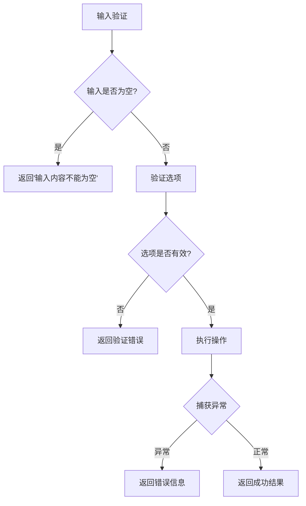

**图表来源**
- [CryptoAlgorithm.ts](file://src/core/base/CryptoAlgorithm.ts#L23-L75)

**章节来源**
- [CryptoAlgorithm.ts](file://src/core/base/CryptoAlgorithm.ts#L1-L165)

## 结论

编码转换模块是一个设计精良、功能完整的编码算法演示系统。它成功地实现了以下目标：

### 技术成就

1. **架构设计**: 采用分层架构和依赖注入，具有良好的可维护性
2. **算法实现**: Base64和Base91算法实现准确，性能优异
3. **用户体验**: 提供直观的图形界面和实时反馈
4. **扩展性**: 支持新算法的轻松添加和管理

### 应用价值

- **教育用途**: 为学习编码算法提供了直观的演示平台
- **开发工具**: 可作为Web开发中的编码工具使用
- **技术展示**: 展示了现代Web应用的最佳实践

### 改进建议

1. **性能监控**: 添加性能指标收集和分析功能
2. **国际化支持**: 增加多语言支持
3. **批量处理**: 支持文件批量处理功能
4. **导出功能**: 增加结果导出和分享功能

## 附录

### 使用示例

#### 基本编码示例

```javascript
// Base64编码示例
const base64 = new Base64Algorithm();
const result = await base64.encrypt("Hello World");
console.log(result); // "SGVsbG8gV29ybGQ="

// Base91编码示例  
const base91 = new Base91Algorithm();
const result2 = await base91.encrypt("Hello World");
console.log(result2); // "fO$wC1"
```

#### 高级用法示例

```javascript
// 使用算法注册表
const registry = AlgorithmRegistry.getInstance();
registry.register(new Base64Algorithm());
registry.register(new Base91Algorithm());

const algorithm = registry.get("Base64");
const result = await algorithm.encrypt("测试数据");
```

### 与其他编码方式的对比

| 特性 | Base64 | Base91 | URL编码 |
|------|--------|--------|---------|
| 字符集大小 | 64 | 91 | 64 |
| 编码效率 | 66.7% | 88.9% | 50% |
| URL安全性 | 中等 | 良好 | 优秀 |
| 浏览器支持 | 广泛 | 广泛 | 广泛 |
| 性能 | 快速 | 快速 | 快速 |

### Web开发应用场景

1. **数据传输**: 在HTTP请求中传输二进制数据
2. **存储优化**: 将二进制数据存储为文本格式
3. **URL安全**: 在URL中传递数据
4. **跨平台兼容**: 确保数据在不同平台间的兼容性
5. **调试工具**: 作为开发和调试的辅助工具

### 注意事项

1. **字符集选择**: 根据具体需求选择合适的编码方式
2. **性能考虑**: 大数据量处理时注意内存和性能影响
3. **安全性**: 在涉及敏感数据时考虑使用更安全的加密算法
4. **浏览器兼容性**: 确保目标浏览器支持所需的API
5. **错误处理**: 始终实现适当的错误处理和用户反馈