# 非对称加密模块

<cite>
**本文档引用的文件**
- [RSA.ts](file://src/algorithms/asymmetric/RSA.ts)
- [RSA2.ts](file://src/algorithms/asymmetric/RSA2.ts)
- [CryptoAlgorithm.ts](file://src/core/base/CryptoAlgorithm.ts)
- [crypto.ts](file://src/core/types/crypto.ts)
- [AlgorithmRegistry.ts](file://src/core/registry/AlgorithmRegistry.ts)
- [index.ts](file://src/algorithms/index.ts)
- [useCrypto.ts](file://src/composables/useCrypto.ts)
- [AlgorithmSelector.vue](file://src/components/crypto/AlgorithmSelector.vue)
- [Home.vue](file://src/views/Home.vue)
- [main.ts](file://src/main.ts)
</cite>

## 目录
1. [简介](#简介)
2. [项目结构](#项目结构)
3. [核心组件](#核心组件)
4. [架构概览](#架构概览)
5. [详细组件分析](#详细组件分析)
6. [依赖关系分析](#依赖关系分析)
7. [性能考虑](#性能考虑)
8. [故障排除指南](#故障排除指南)
9. [结论](#结论)

## 简介

本项目是一个基于Web Crypto API的非对称加密模块，实现了RSA和RSA2两种非对称加密算法。该模块提供了完整的密钥生成、加密解密、数字签名和验签功能，支持在浏览器环境中进行安全的密码学操作。

项目采用现代前端技术栈，使用Vue 3构建用户界面，通过Web Crypto API提供底层加密功能，确保了跨平台兼容性和安全性。

## 项目结构

项目采用模块化的架构设计，主要分为以下几个层次：

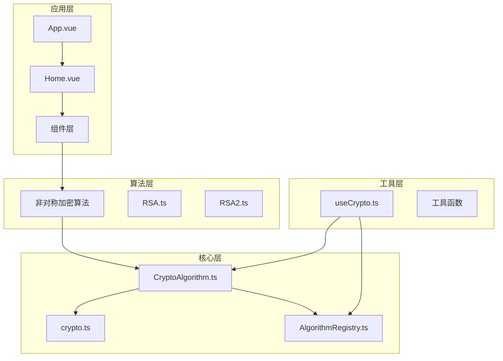

**图表来源**
- [main.ts](file://src/main.ts#L1-L10)
- [Home.vue](file://src/views/Home.vue#L1-L220)
- [AlgorithmRegistry.ts](file://src/core/registry/AlgorithmRegistry.ts#L1-L114)

**章节来源**
- [main.ts](file://src/main.ts#L1-L10)
- [index.ts](file://src/algorithms/index.ts#L1-L59)

## 核心组件

### 算法基类系统

项目采用抽象基类设计模式，所有加密算法都继承自统一的基类，确保了一致的接口和行为规范。

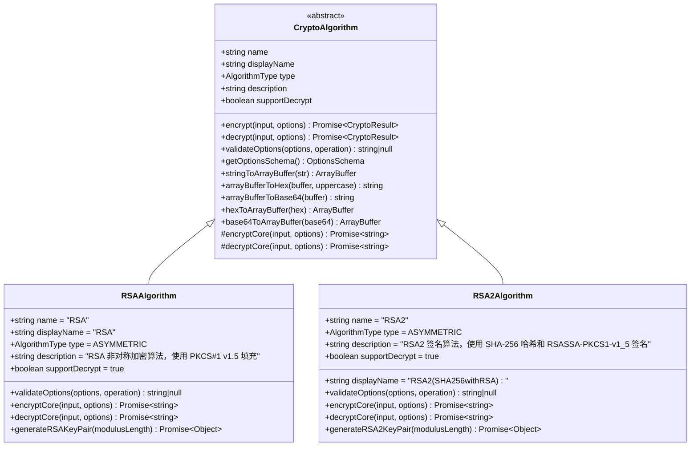

**图表来源**
- [CryptoAlgorithm.ts](file://src/core/base/CryptoAlgorithm.ts#L13-L165)
- [RSA.ts](file://src/algorithms/asymmetric/RSA.ts#L4-L125)
- [RSA2.ts](file://src/algorithms/asymmetric/RSA2.ts#L4-L142)

### 算法类型系统

项目定义了完整的算法类型枚举和类型检查机制：

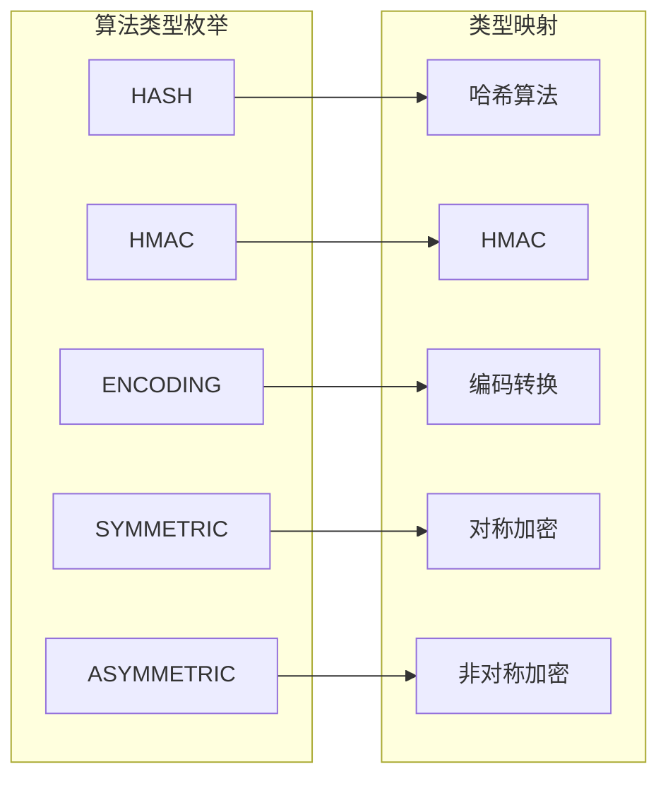

**图表来源**
- [crypto.ts](file://src/core/types/crypto.ts#L2-L17)

**章节来源**
- [CryptoAlgorithm.ts](file://src/core/base/CryptoAlgorithm.ts#L1-L165)
- [crypto.ts](file://src/core/types/crypto.ts#L1-L104)

## 架构概览

项目采用分层架构设计，确保了良好的可维护性和扩展性：

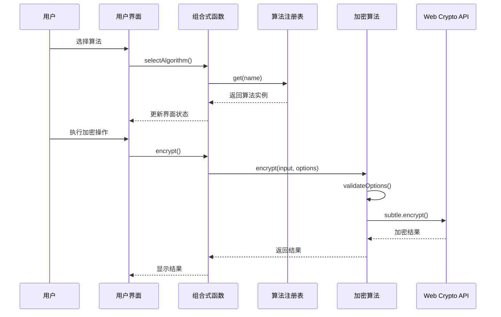

**图表来源**
- [useCrypto.ts](file://src/composables/useCrypto.ts#L74-L119)
- [AlgorithmRegistry.ts](file://src/core/registry/AlgorithmRegistry.ts#L50-L52)
- [RSA.ts](file://src/algorithms/asymmetric/RSA.ts#L21-L38)

### 数据流架构

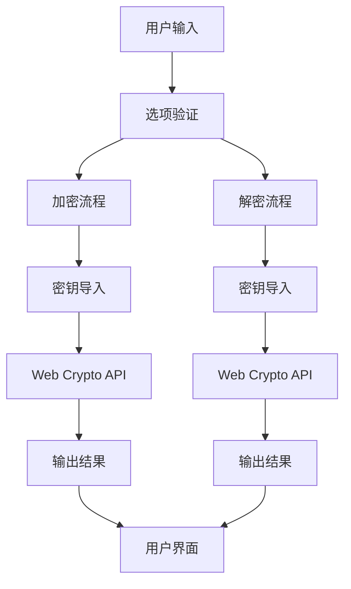

**图表来源**
- [CryptoAlgorithm.ts](file://src/core/base/CryptoAlgorithm.ts#L23-L75)
- [RSA.ts](file://src/algorithms/asymmetric/RSA.ts#L11-L19)

**章节来源**
- [useCrypto.ts](file://src/composables/useCrypto.ts#L1-L217)
- [AlgorithmRegistry.ts](file://src/core/registry/AlgorithmRegistry.ts#L1-L114)

## 详细组件分析

### RSA算法实现

RSA算法实现了标准的非对称加密功能，使用RSA-OAEP填充方案：

#### 核心加密流程

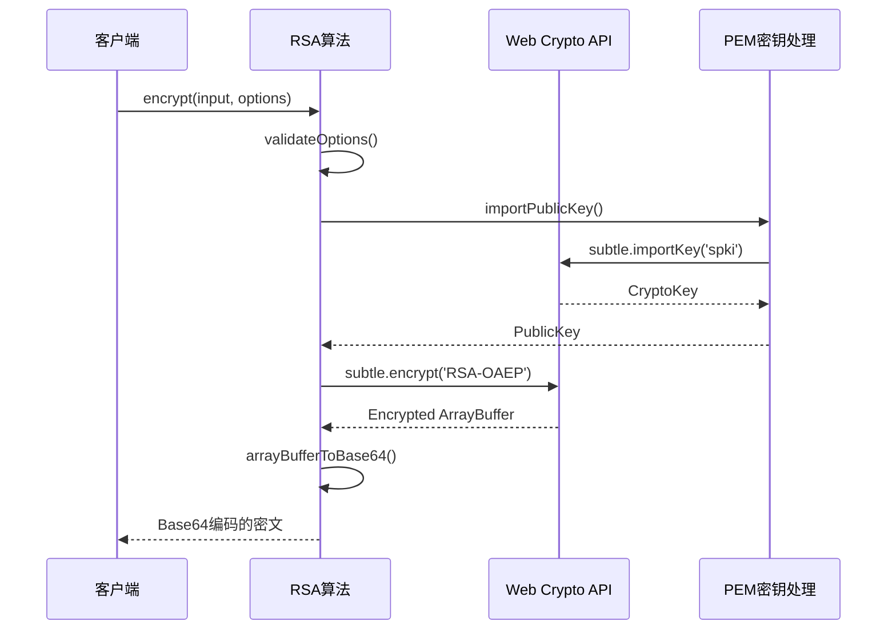

**图表来源**
- [RSA.ts](file://src/algorithms/asymmetric/RSA.ts#L21-L38)
- [RSA.ts](file://src/algorithms/asymmetric/RSA.ts#L59-L77)

#### 密钥生成机制

RSA算法支持动态密钥对生成，使用标准的2048位模长：

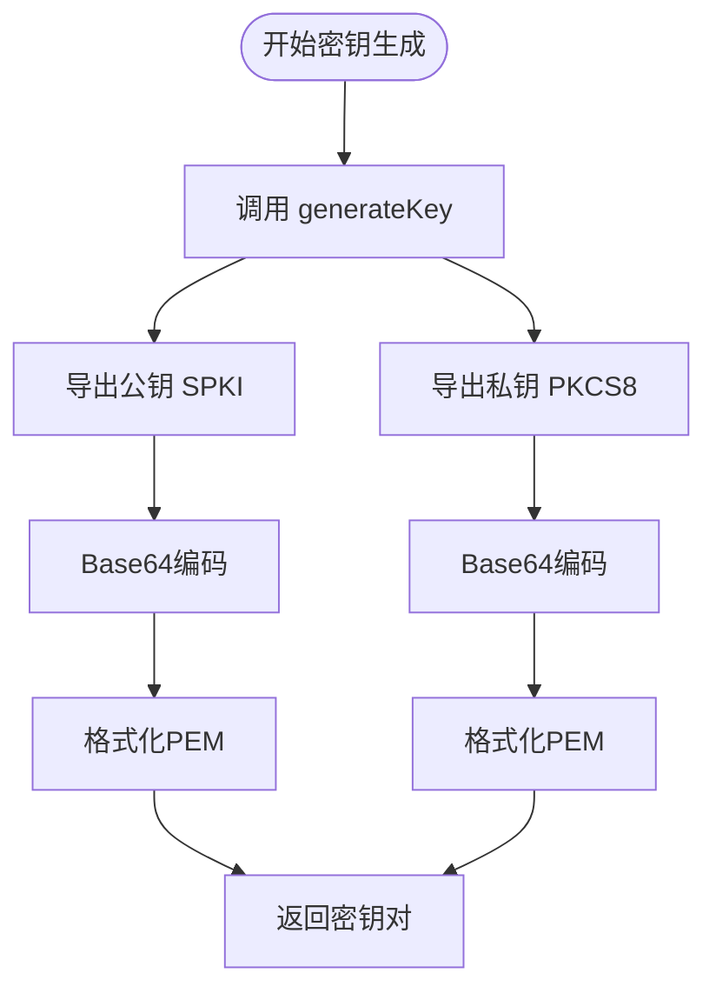

**图表来源**
- [RSA.ts](file://src/algorithms/asymmetric/RSA.ts#L128-L150)

**章节来源**
- [RSA.ts](file://src/algorithms/asymmetric/RSA.ts#L1-L166)

### RSA2算法实现

RSA2算法专门用于数字签名和验签，使用RSASSA-PKCS1-v1_5方案：

#### 数字签名流程

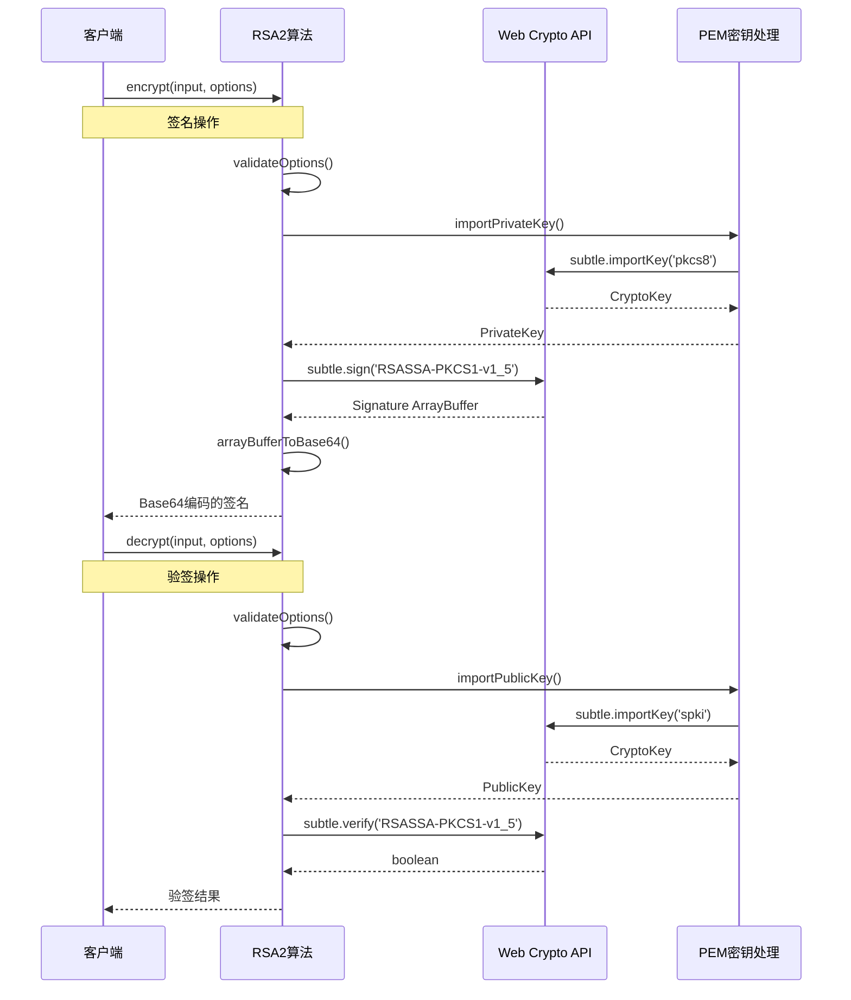

**图表来源**
- [RSA2.ts](file://src/algorithms/asymmetric/RSA2.ts#L21-L66)
- [RSA2.ts](file://src/algorithms/asymmetric/RSA2.ts#L88-L108)

#### 验签验证流程

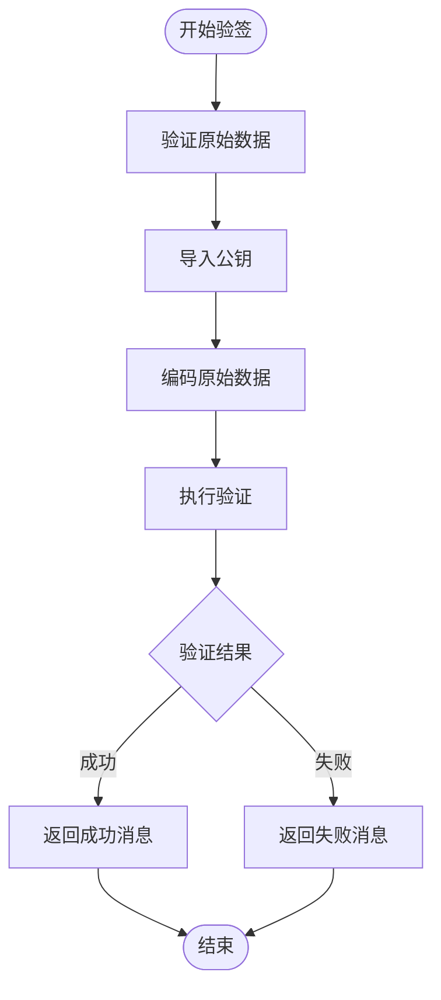

**图表来源**
- [RSA2.ts](file://src/algorithms/asymmetric/RSA2.ts#L40-L66)

**章节来源**
- [RSA2.ts](file://src/algorithms/asymmetric/RSA2.ts#L1-L183)

### 算法注册与管理

项目使用注册表模式管理所有算法实例：

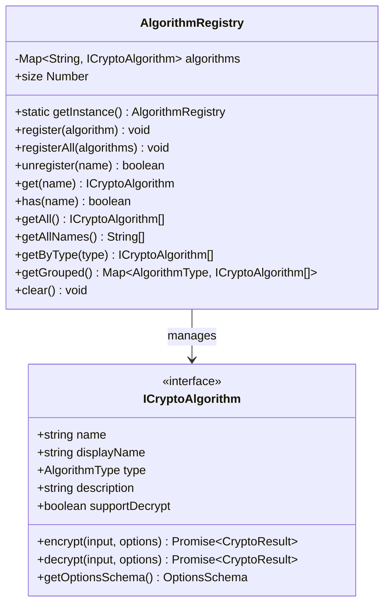

**图表来源**
- [AlgorithmRegistry.ts](file://src/core/registry/AlgorithmRegistry.ts#L7-L114)
- [crypto.ts](file://src/core/types/crypto.ts#L74-L91)

**章节来源**
- [AlgorithmRegistry.ts](file://src/core/registry/AlgorithmRegistry.ts#L1-L114)
- [index.ts](file://src/algorithms/index.ts#L28-L54)

## 依赖关系分析

### 核心依赖关系

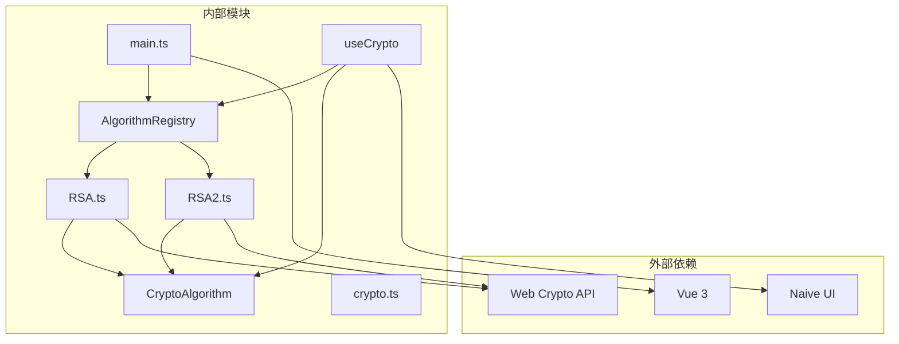

**图表来源**
- [main.ts](file://src/main.ts#L1-L10)
- [AlgorithmRegistry.ts](file://src/core/registry/AlgorithmRegistry.ts#L1-L114)
- [useCrypto.ts](file://src/composables/useCrypto.ts#L1-L217)

### 组件交互关系

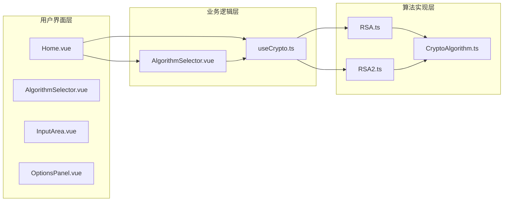

**图表来源**
- [Home.vue](file://src/views/Home.vue#L1-L220)
- [AlgorithmSelector.vue](file://src/components/crypto/AlgorithmSelector.vue#L1-L63)
- [useCrypto.ts](file://src/composables/useCrypto.ts#L1-L217)

**章节来源**
- [main.ts](file://src/main.ts#L1-L10)
- [index.ts](file://src/algorithms/index.ts#L1-L59)

## 性能考虑

### 加密性能优化

1. **异步操作优化**
   - 所有加密操作都是异步的，避免阻塞主线程
   - 使用Promise链式调用减少回调嵌套

2. **内存管理**
   - 及时释放ArrayBuffer对象
   - 避免重复创建相同的CryptoKey对象

3. **缓存策略**
   - 可以考虑缓存常用的CryptoKey对象
   - 对于频繁使用的算法实例进行复用

### 安全性能平衡

1. **密钥长度选择**
   - 默认使用2048位密钥长度
   - 支持4096位密钥以满足更高安全需求

2. **填充方案优化**
   - RSA使用OAEP填充提高安全性
   - RSA2使用PKCS#1 v1.5填充保证兼容性

**章节来源**
- [RSA.ts](file://src/algorithms/asymmetric/RSA.ts#L128-L150)
- [RSA2.ts](file://src/algorithms/asymmetric/RSA2.ts#L145-L167)

## 故障排除指南

### 常见问题及解决方案

#### 密钥格式问题

**问题**: PEM密钥导入失败
**原因**: PEM格式不正确或Base64编码错误
**解决方案**: 
- 确保PEM头部和尾部完整
- 检查Base64编码是否正确
- 验证密钥格式符合SPKI/PKCS#8标准

#### 浏览器兼容性问题

**问题**: Web Crypto API不可用
**原因**: 浏览器版本过低或HTTPS环境不支持
**解决方案**:
- 确保使用现代浏览器
- 在HTTPS环境下运行
- 提供降级方案或错误提示

#### 性能问题

**问题**: 大数据加密速度慢
**原因**: 密钥长度过大或数据量超限
**解决方案**:
- 使用对称加密处理大数据
- 采用混合加密方案
- 优化密钥长度选择

**章节来源**
- [RSA.ts](file://src/algorithms/asymmetric/RSA.ts#L59-L99)
- [RSA2.ts](file://src/algorithms/asymmetric/RSA2.ts#L88-L108)

### 错误处理机制

项目实现了完善的错误处理机制：

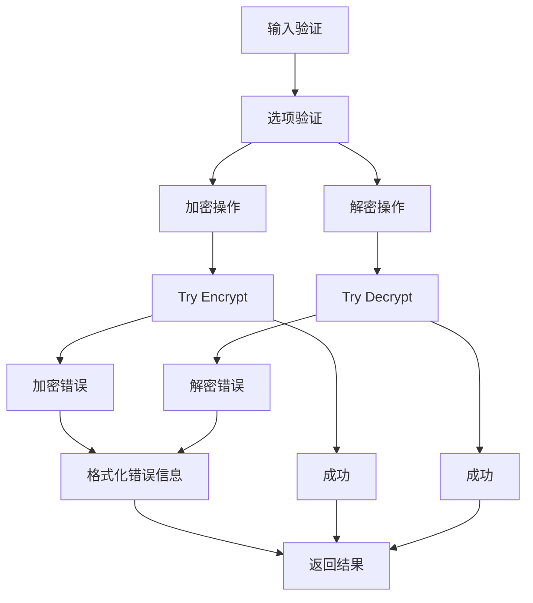

**图表来源**
- [CryptoAlgorithm.ts](file://src/core/base/CryptoAlgorithm.ts#L23-L75)

**章节来源**
- [CryptoAlgorithm.ts](file://src/core/base/CryptoAlgorithm.ts#L1-L165)

## 结论

本非对称加密模块提供了完整的RSA和RSA2算法实现，具有以下特点：

1. **安全性**: 基于Web Crypto API，确保了加密操作的安全性
2. **易用性**: 提供了直观的API接口和用户界面
3. **可扩展性**: 采用模块化设计，易于添加新的算法
4. **兼容性**: 支持主流浏览器和现代Web标准

该模块在实际应用中可以用于：
- 数据加密和解密
- 数字签名和验签
- 密钥交换
- SSL/TLS证书验证

通过合理的密钥管理和性能优化，可以在保证安全性的前提下提供良好的用户体验。