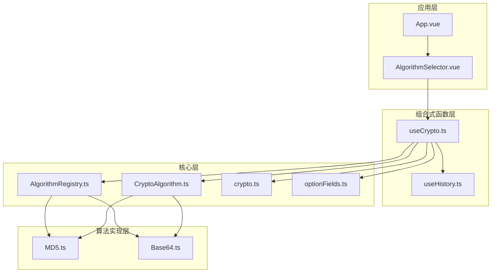
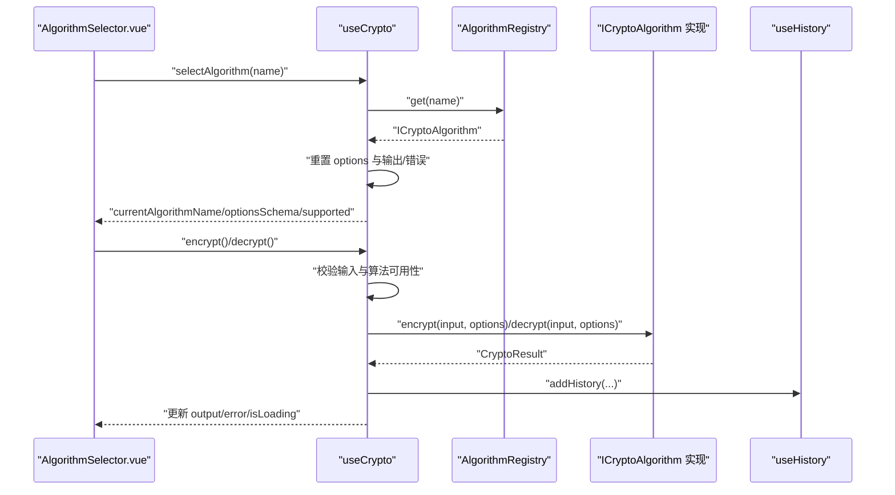
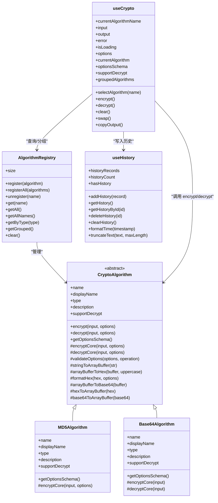

# useCrypto 加密组合式函数

<cite>
**本文引用的文件**
- [useCrypto.ts](file://src/composables/useCrypto.ts)
- [AlgorithmRegistry.ts](file://src/core/registry/AlgorithmRegistry.ts)
- [CryptoAlgorithm.ts](file://src/core/base/CryptoAlgorithm.ts)
- [crypto.ts](file://src/core/types/crypto.ts)
- [optionFields.ts](file://src/core/utils/optionFields.ts)
- [useHistory.ts](file://src/composables/useHistory.ts)
- [MD5.ts](file://src/algorithms/hash/MD5.ts)
- [Base64.ts](file://src/algorithms/encoding/Base64.ts)
- [AlgorithmSelector.vue](file://src/components/crypto/AlgorithmSelector.vue)
- [main.ts](file://src/main.ts)
</cite>

## 目录
1. [简介](#简介)
2. [项目结构](#项目结构)
3. [核心组件](#核心组件)
4. [架构总览](#架构总览)
5. [详细组件分析](#详细组件分析)
6. [依赖关系分析](#依赖关系分析)
7. [性能考虑](#性能考虑)
8. [故障排查指南](#故障排查指南)
9. [结论](#结论)
10. [附录：API 参考](#附录api-参考)

## 简介
本文件围绕 useCrypto 组合式函数进行系统性技术文档编写，重点阐述其作为加密业务逻辑封装的设计理念、状态管理机制、计算属性与核心方法实现，并深入解析与 AlgorithmRegistry 的交互方式、错误处理策略、异步操作管理以及历史记录集成。文档同时提供完整的 API 参考、参数说明、返回值类型与使用示例，帮助开发者快速上手并遵循最佳实践与性能优化建议。

## 项目结构
该仓库采用“模块化+组合式函数”的组织方式：
- composable 层：封装跨组件共享的状态与逻辑（如 useCrypto、useHistory）
- core 层：提供算法抽象基类、注册表、类型定义与工具
- algorithms 层：具体算法实现（哈希、编码、HMAC、对称/非对称）
- components 层：UI 组件（如 AlgorithmSelector.vue）
- main.ts 中完成算法注册与应用启动

图表来源
- [useCrypto.ts](file://src/composables/useCrypto.ts#L1-L217)
- [AlgorithmRegistry.ts](file://src/core/registry/AlgorithmRegistry.ts#L1-L114)
- [CryptoAlgorithm.ts](file://src/core/base/CryptoAlgorithm.ts#L1-L165)
- [crypto.ts](file://src/core/types/crypto.ts#L1-L104)
- [optionFields.ts](file://src/core/utils/optionFields.ts#L1-L137)
- [MD5.ts](file://src/algorithms/hash/MD5.ts#L1-L28)
- [Base64.ts](file://src/algorithms/encoding/Base64.ts#L1-L39)
- [AlgorithmSelector.vue](file://src/components/crypto/AlgorithmSelector.vue#L1-L63)
- [main.ts](file://src/main.ts#L1-L10)

章节来源
- [main.ts](file://src/main.ts#L1-L10)

## 核心组件
- useCrypto：提供算法选择、加解密、状态管理、历史记录集成与复制输出等能力
- AlgorithmRegistry：单例注册表，负责算法注册、查询、分组与批量管理
- CryptoAlgorithm：算法抽象基类，统一加解密流程、选项校验与辅助方法
- useHistory：历史记录管理，持久化存储与去重、格式化时间等

章节来源
- [useCrypto.ts](file://src/composables/useCrypto.ts#L1-L217)
- [AlgorithmRegistry.ts](file://src/core/registry/AlgorithmRegistry.ts#L1-L114)
- [CryptoAlgorithm.ts](file://src/core/base/CryptoAlgorithm.ts#L1-L165)
- [useHistory.ts](file://src/composables/useHistory.ts#L1-L153)

## 架构总览
useCrypto 通过 AlgorithmRegistry 获取当前算法实例，调用算法的 encrypt/decrypt 接口执行业务逻辑；同时维护本地响应式状态并在成功后写入历史记录；错误处理统一设置 error 并清空输出；isLoading 控制加载态；支持复制输出到剪贴板。

图表来源
- [useCrypto.ts](file://src/composables/useCrypto.ts#L56-L216)
- [AlgorithmRegistry.ts](file://src/core/registry/AlgorithmRegistry.ts#L48-L52)
- [useHistory.ts](file://src/composables/useHistory.ts#L44-L73)

## 详细组件分析

### useCrypto 组合式函数
- 设计原则
  - 单例状态：模块级 ref 维护 currentAlgorithmName、input、output、error、isLoading、options，确保全局一致的状态流
  - 计算属性：currentAlgorithm、optionsSchema、supportDecrypt、groupedAlgorithms 提供派生状态与 UI 需求
  - 异步流程：encrypt/decrypt 使用 try/catch/finally 管理 isLoading 与错误回显
  - 历史记录：成功后自动写入历史，避免重复记录
  - 交互友好：clear、swap、copyOutput 提升用户体验

- 状态管理机制
  - currentAlgorithmName：当前选中的算法名称（字符串）
  - input/output：输入与输出文本
  - error：错误信息
  - isLoading：异步操作进行中
  - options：算法选项对象，随算法切换重置并填充默认值

- 计算属性
  - currentAlgorithm：基于 registry.get(currentAlgorithmName) 返回的算法实例
  - optionsSchema：算法的选项配置（encrypt/decrypt 字段定义）
  - supportDecrypt：算法是否支持解密
  - groupedAlgorithms：按类型分组的算法列表（固定顺序：哈希、HMAC、编码、对称、非对称）

- 核心方法
  - selectAlgorithm(name)：切换算法，重置 options 为 schema 默认值，清空输出与错误
  - encrypt()：校验算法与输入，执行加密，成功写入 output 并添加历史，异常捕获统一处理
  - decrypt()：校验算法支持解密与输入，执行解密，成功写入 output 并添加历史，异常捕获统一处理
  - clear()：清空 input、output、error
  - swap()：交换 input 与 output，清空 error
  - copyOutput()：复制 output 到剪贴板，返回布尔结果

- 与 AlgorithmRegistry 的交互
  - 通过 registry.get(name) 获取算法实例
  - 通过 registry.getGrouped() 获取分组算法用于 UI 展示
  - 通过 registry.get(name)?.getOptionsSchema() 获取选项配置

- 错误处理策略
  - 输入校验：空输入或未选择算法时立即设置 error 并返回失败结果
  - 运行时异常：捕获异常并设置 error，清空 output
  - 结果回传：统一返回 { success, data?, error? }

- 异步操作管理
  - 在 encrypt/decrypt 开始前设置 isLoading=true，在 finally 中恢复为 false
  - 使用 Promise 返回结果，便于上层 UI 或测试使用

- 历史记录集成
  - 成功后调用 addHistory，包含算法名、显示名、操作类型、输入、输出与选项快照
  - 去重策略：若算法、操作、输入、输出完全相同则跳过
  - 持久化：localStorage 存储，超出上限自动截断

- 性能与可用性
  - 选项默认值预填：减少用户手动输入
  - 分组展示：提升算法选择效率
  - 复制输出：一键复制，降低交互成本

章节来源
- [useCrypto.ts](file://src/composables/useCrypto.ts#L6-L216)
- [AlgorithmRegistry.ts](file://src/core/registry/AlgorithmRegistry.ts#L48-L95)
- [useHistory.ts](file://src/composables/useHistory.ts#L44-L73)

### AlgorithmRegistry 注册表
- 单例模式：getInstance() 返回唯一实例，避免重复注册
- 核心能力：register/unregister/registerAll/get/getByType/getGrouped/size/clear
- 与 useCrypto 的协作：useCrypto 通过 get(name) 获取算法实例，getGrouped() 获取分组算法

章节来源
- [AlgorithmRegistry.ts](file://src/core/registry/AlgorithmRegistry.ts#L7-L114)

### CryptoAlgorithm 抽象基类
- 统一接口：encrypt/decrypt 对外暴露，内部执行 validateOptions、调用子类核心方法
- 子类职责：实现 encryptCore/decryptCore（部分算法无需实现 decryptCore）
- 辅助方法：字符串与 ArrayBuffer 转换、Hex/Base64 编解码、大小写格式化
- 选项 Schema：getOptionsSchema 默认返回空配置，子类可覆盖

章节来源
- [CryptoAlgorithm.ts](file://src/core/base/CryptoAlgorithm.ts#L13-L165)

### 类型与选项体系
- AlgorithmType：哈希、HMAC、编码、对称、非对称
- CryptoOptions：通用与各算法专属选项（密钥、IV、模式、填充、输出/输入格式、大小写等）
- OptionsSchema：每个算法的选项字段定义（encrypt/decrypt）
- HistoryRecord：历史记录结构，含时间戳与去重字段

章节来源
- [crypto.ts](file://src/core/types/crypto.ts#L1-L104)
- [optionFields.ts](file://src/core/utils/optionFields.ts#L1-L137)

### UI 组件集成
- AlgorithmSelector.vue：使用 useCrypto 的 groupedAlgorithms 与 selectAlgorithm，展示算法分组与描述
- 交互流程：用户选择算法 -> 触发 selectAlgorithm -> 更新 currentAlgorithmName 与 optionsSchema -> UI 响应

章节来源
- [AlgorithmSelector.vue](file://src/components/crypto/AlgorithmSelector.vue#L1-L63)
- [useCrypto.ts](file://src/composables/useCrypto.ts#L29-L54)

### 算法实现示例
- MD5Algorithm：继承 CryptoAlgorithm，实现哈希加密核心逻辑，支持输出格式与大小写控制
- Base64Algorithm：继承 CryptoAlgorithm，支持编码与解码，解码失败抛出错误

章节来源
- [MD5.ts](file://src/algorithms/hash/MD5.ts#L1-L28)
- [Base64.ts](file://src/algorithms/encoding/Base64.ts#L1-L39)

## 依赖关系分析

图表来源
- [AlgorithmRegistry.ts](file://src/core/registry/AlgorithmRegistry.ts#L7-L114)
- [CryptoAlgorithm.ts](file://src/core/base/CryptoAlgorithm.ts#L13-L165)
- [MD5.ts](file://src/algorithms/hash/MD5.ts#L6-L27)
- [Base64.ts](file://src/algorithms/encoding/Base64.ts#L4-L38)
- [useCrypto.ts](file://src/composables/useCrypto.ts#L74-L216)
- [useHistory.ts](file://src/composables/useHistory.ts#L36-L153)

## 性能考虑
- 状态粒度：模块级 ref 保证单一状态源，避免重复渲染
- 计算属性：仅在依赖变化时重新计算，降低 UI 重绘成本
- 选项默认值：在算法切换时一次性填充，减少后续交互开销
- 历史记录：localStorage 写入在成功后触发，避免频繁 IO；超出上限自动截断
- 异步处理：isLoading 精准控制，避免 UI 卡顿
- 算法实现：优先使用浏览器原生 TextEncoder/Decoder 与 WebCrypto（如适用），减少第三方依赖带来的体积与性能损耗

## 故障排查指南
- 症状：点击加密无响应
  - 检查 currentAlgorithm 是否存在（未选择算法时会直接报错）
  - 检查 input 是否为空
  - 查看 error 是否被设置
- 症状：解密报“不支持解密”
  - 检查算法的 supportDecrypt 标志
- 症状：复制输出失败
  - 浏览器环境需支持 Clipboard API，且页面处于安全上下文（HTTPS）
- 症状：历史记录未保存
  - 检查 localStorage 是否可用，容量是否受限
  - 确认 addHistory 是否被调用（仅在 encrypt/decrypt 成功时）
- 症状：算法选项不可用
  - 检查算法的 getOptionsSchema 返回值，确认字段是否正确配置

章节来源
- [useCrypto.ts](file://src/composables/useCrypto.ts#L78-L168)
- [useHistory.ts](file://src/composables/useHistory.ts#L18-L26)

## 结论
useCrypto 以组合式函数为核心，结合 AlgorithmRegistry 的集中管理与 CryptoAlgorithm 的统一抽象，实现了清晰、可扩展、易维护的加密业务逻辑封装。通过计算属性与模块级状态，提供良好的响应式体验；通过历史记录与复制功能，增强实用性。建议在新增算法时遵循 CryptoAlgorithm 抽象，完善 getOptionsSchema 与选项字段定义，确保 UI 与交互的一致性。

## 附录：API 参考

### useCrypto 返回对象
- 状态
  - currentAlgorithmName: string
  - currentAlgorithm: ICryptoAlgorithm | undefined
  - input: string
  - output: string
  - error: string
  - isLoading: boolean
  - options: CryptoOptions
  - optionsSchema: OptionsSchema
  - supportDecrypt: boolean
  - groupedAlgorithms: { label: string; type: AlgorithmType; algorithms: ICryptoAlgorithm[] }[]
- 方法
  - selectAlgorithm(name: string): void
  - encrypt(): Promise<CryptoResult>
  - decrypt(): Promise<CryptoResult>
  - clear(): void
  - swap(): void
  - copyOutput(): Promise<boolean>

章节来源
- [useCrypto.ts](file://src/composables/useCrypto.ts#L74-L216)
- [crypto.ts](file://src/core/types/crypto.ts#L74-L91)

### AlgorithmRegistry API
- register(algorithm: ICryptoAlgorithm): void
- registerAll(algorithms: ICryptoAlgorithm[]): void
- unregister(name: string): boolean
- get(name: string): ICryptoAlgorithm | undefined
- has(name: string): boolean
- getAll(): ICryptoAlgorithm[]
- getAllNames(): string[]
- getByType(type: AlgorithmType): ICryptoAlgorithm[]
- getGrouped(): Map<AlgorithmType, ICryptoAlgorithm[]>
- size: number
- clear(): void

章节来源
- [AlgorithmRegistry.ts](file://src/core/registry/AlgorithmRegistry.ts#L26-L109)

### CryptoAlgorithm 抽象方法
- encrypt(input: string, options?: CryptoOptions): Promise<CryptoResult>
- decrypt(input: string, options?: CryptoOptions): Promise<CryptoResult>
- getOptionsSchema(): OptionsSchema
- protected encryptCore(input: string, options?: CryptoOptions): Promise<string>
- protected decryptCore(input: string, options?: CryptoOptions): Promise<string>
- protected validateOptions(options?: CryptoOptions, operation?: 'encrypt' | 'decrypt'): string | null

章节来源
- [CryptoAlgorithm.ts](file://src/core/base/CryptoAlgorithm.ts#L23-L87)

### useHistory 返回对象
- 状态
  - historyRecords: HistoryRecord[]
  - historyCount: number
  - hasHistory: boolean
- 方法
  - addHistory(record: Omit<HistoryRecord, 'id' | 'timestamp'>): void
  - getHistory(): HistoryRecord[]
  - getHistoryById(id: string): HistoryRecord | undefined
  - deleteHistory(id: string): void
  - clearHistory(): void
  - formatTime(timestamp: number): string
  - truncateText(text: string, maxLength?: number): string

章节来源
- [useHistory.ts](file://src/composables/useHistory.ts#L36-L153)

### 使用示例（路径指引）
- 在组件中使用：参考 AlgorithmSelector.vue 的导入与调用
- 初始化算法：在 main.ts 中调用 registerAllAlgorithms 完成注册
- 自定义算法：继承 CryptoAlgorithm，实现 encryptCore/decryptCore 与 getOptionsSchema

章节来源
- [AlgorithmSelector.vue](file://src/components/crypto/AlgorithmSelector.vue#L1-L63)
- [main.ts](file://src/main.ts#L1-L10)
- [MD5.ts](file://src/algorithms/hash/MD5.ts#L6-L27)
- [Base64.ts](file://src/algorithms/encoding/Base64.ts#L4-L38)