# useHistory 历史记录组合式函数

<cite>
**本文档引用的文件**
- [useHistory.ts](file://src/composables/useHistory.ts)
- [crypto.ts](file://src/core/types/crypto.ts)
- [HistoryPanel.vue](file://src/components/history/HistoryPanel.vue)
- [useCrypto.ts](file://src/composables/useCrypto.ts)
- [Home.vue](file://src/views/Home.vue)
</cite>

## 目录
1. [简介](#简介)
2. [项目结构](#项目结构)
3. [核心组件](#核心组件)
4. [架构概览](#架构概览)
5. [详细组件分析](#详细组件分析)
6. [依赖关系分析](#依赖关系分析)
7. [性能考虑](#性能考虑)
8. [故障排除指南](#故障排除指南)
9. [结论](#结论)

## 简介

useHistory 是一个专门设计用于管理加密算法历史记录的 Vue 组合式函数。该函数提供了完整的本地存储持久化机制，支持历史记录的增删查改操作，并实现了智能去重策略和数量限制。通过与 useCrypto 组合式函数的深度集成，用户可以轻松追踪和恢复之前的加密/解密操作。

## 项目结构

useHistory 函数在项目中的位置和相关组件关系如下：

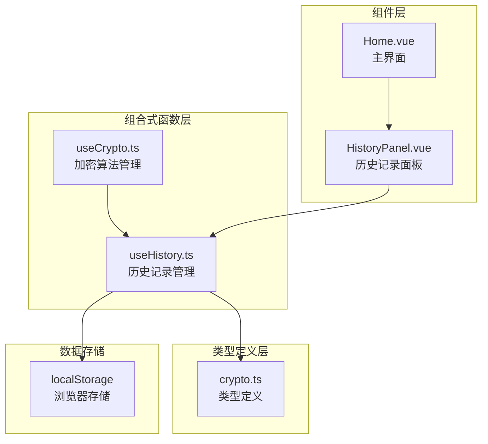

**图表来源**
- [useHistory.ts](file://src/composables/useHistory.ts#L1-L153)
- [useCrypto.ts](file://src/composables/useCrypto.ts#L1-L217)
- [HistoryPanel.vue](file://src/components/history/HistoryPanel.vue#L1-L138)

**章节来源**
- [useHistory.ts](file://src/composables/useHistory.ts#L1-L153)
- [crypto.ts](file://src/core/types/crypto.ts#L93-L103)

## 核心组件

### HistoryRecord 接口定义

HistoryRecord 是历史记录的核心数据结构，定义了历史记录的所有必要属性：

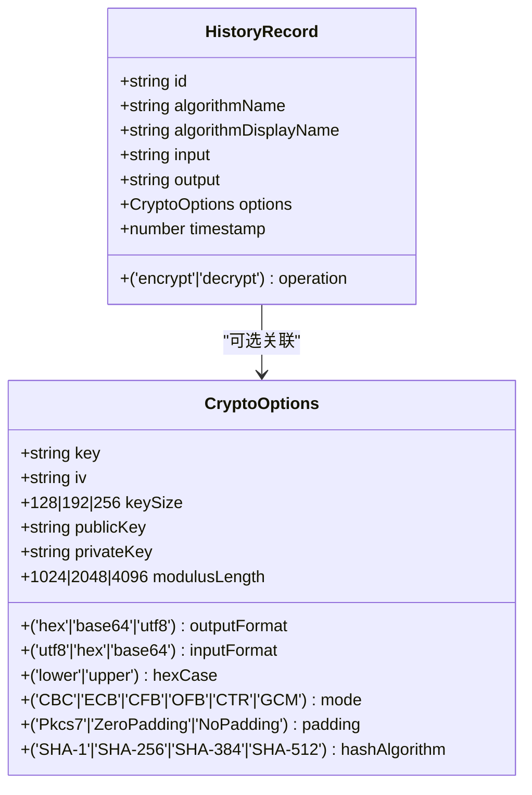

**图表来源**
- [crypto.ts](file://src/core/types/crypto.ts#L93-L103)
- [crypto.ts](file://src/core/types/crypto.ts#L19-L38)

### 主要功能特性

1. **数据持久化**: 使用 localStorage 实现跨会话的历史记录保存
2. **智能去重**: 自动检测并避免重复的历史记录
3. **数量限制**: 最多保存 100 条历史记录
4. **实时更新**: 基于 Vue 响应式系统的状态管理
5. **格式化显示**: 提供人性化的时间格式化和文本截断功能

**章节来源**
- [crypto.ts](file://src/core/types/crypto.ts#L93-L103)

## 架构概览

useHistory 函数采用模块化设计，通过组合式函数模式提供历史记录管理能力：

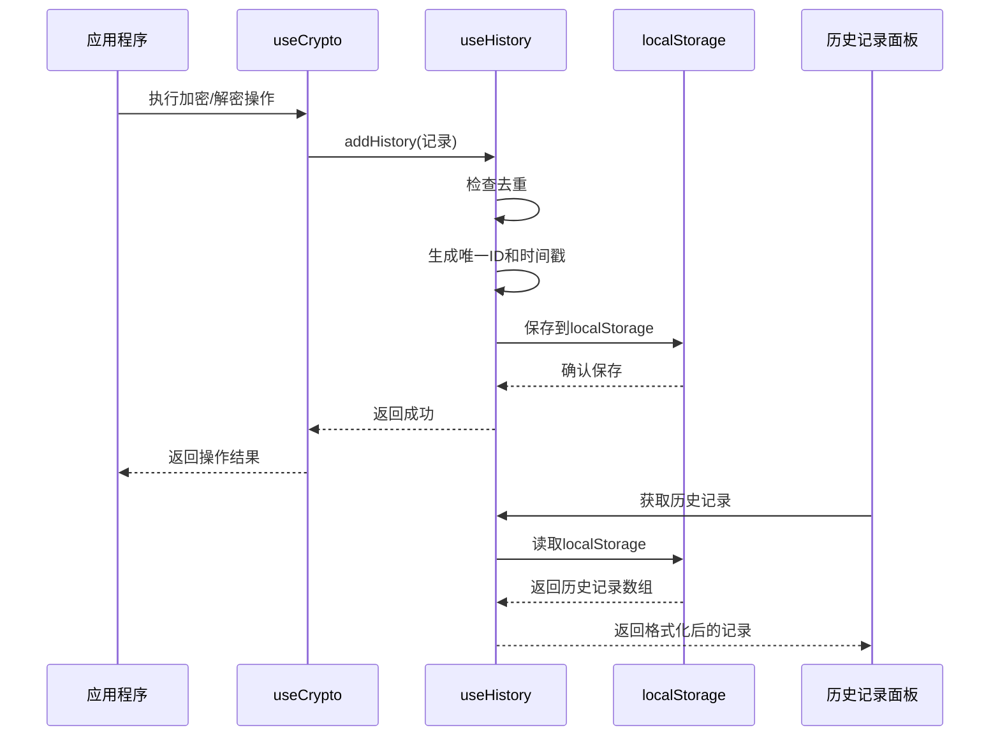

**图表来源**
- [useCrypto.ts](file://src/composables/useCrypto.ts#L78-L119)
- [useHistory.ts](file://src/composables/useHistory.ts#L44-L73)

## 详细组件分析

### 数据持久化机制

#### localStorage 存储策略

useHistory 采用以下存储策略确保数据安全和性能：

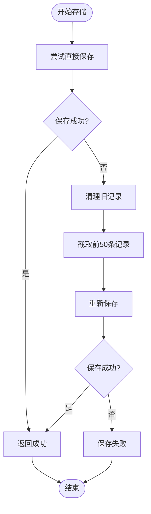

**图表来源**
- [useHistory.ts](file://src/composables/useHistory.ts#L18-L26)

#### 初始化流程

应用启动时的历史记录加载过程：

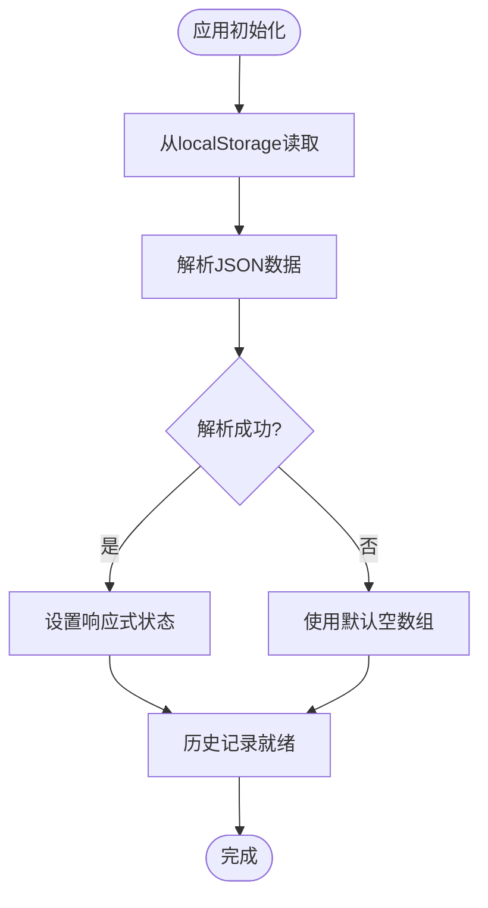

**图表来源**
- [useHistory.ts](file://src/composables/useHistory.ts#L8-L15)

**章节来源**
- [useHistory.ts](file://src/composables/useHistory.ts#L1-L153)

### 历史记录数据结构

#### HistoryRecord 字段详解

| 字段名 | 类型 | 必需 | 描述 |
|--------|------|------|------|
| id | string | 是 | 历史记录唯一标识符 |
| algorithmName | string | 是 | 算法名称（用于算法选择） |
| algorithmDisplayName | string | 是 | 算法显示名称 |
| operation | 'encrypt' \| 'decrypt' | 是 | 操作类型 |
| input | string | 是 | 输入内容 |
| output | string | 是 | 输出结果 |
| options | CryptoOptions | 否 | 算法选项配置 |
| timestamp | number | 是 | 时间戳（毫秒） |

**章节来源**
- [crypto.ts](file://src/core/types/crypto.ts#L93-L103)

### 增删查改操作实现

#### 添加历史记录（addHistory）

添加历史记录时的完整流程：

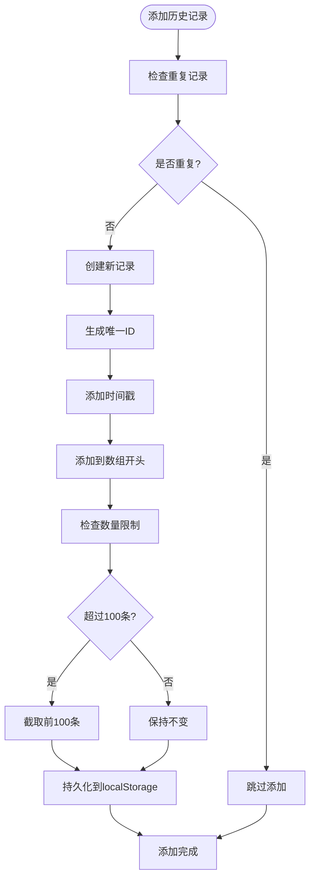

**图表来源**
- [useHistory.ts](file://src/composables/useHistory.ts#L44-L73)

#### 删除历史记录（deleteHistory）

删除历史记录的实现逻辑：

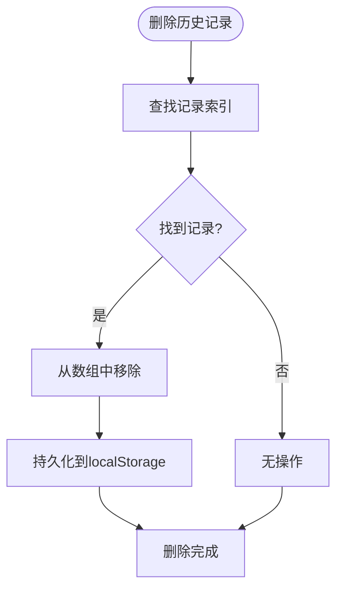

**图表来源**
- [useHistory.ts](file://src/composables/useHistory.ts#L85-L92)

**章节来源**
- [useHistory.ts](file://src/composables/useHistory.ts#L44-L98)

### 去重策略

#### 智能去重算法

useHistory 实现了基于多个维度的智能去重策略：

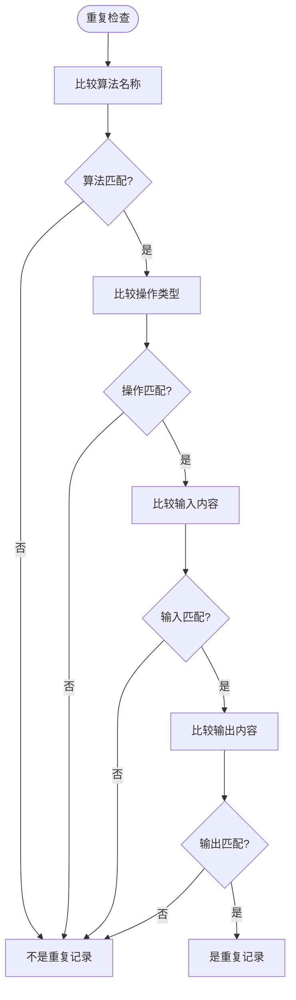

**图表来源**
- [useHistory.ts](file://src/composables/useHistory.ts#L46-L51)

#### 去重策略优势

1. **完整性保证**: 同时比较算法、操作、输入、输出四个关键维度
2. **用户体验**: 避免重复历史记录的出现
3. **存储效率**: 减少不必要的数据存储
4. **性能优化**: 使用高效的数组查找算法

**章节来源**
- [useHistory.ts](file://src/composables/useHistory.ts#L46-L55)

### 数量限制与内存管理

#### 最大历史记录数量

- **上限**: 100 条记录
- **触发条件**: 当记录数超过 100 条时自动截断
- **截断策略**: 保留最新的 100 条记录
- **内存管理**: 通过 slice 操作实现高效截断

#### 存储空间优化

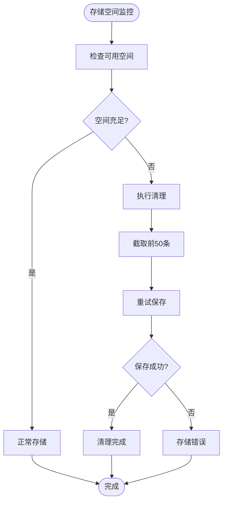

**图表来源**
- [useHistory.ts](file://src/composables/useHistory.ts#L23-L25)

**章节来源**
- [useHistory.ts](file://src/composables/useHistory.ts#L5-L26)

### 数据序列化与反序列化

#### JSON 序列化过程

useHistory 使用标准的 JSON 序列化机制：

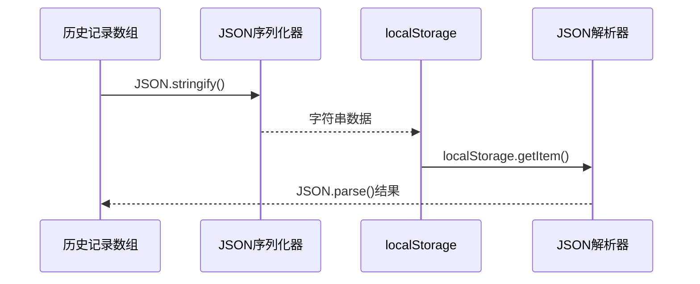

**图表来源**
- [useHistory.ts](file://src/composables/useHistory.ts#L10-L20)

#### 错误处理机制

- **解析失败**: 当 JSON 解析失败时返回空数组
- **存储失败**: 当 localStorage 写入失败时自动清理一半数据
- **兼容性**: 支持各种浏览器环境的 localStorage 实现

**章节来源**
- [useHistory.ts](file://src/composables/useHistory.ts#L8-L26)

### 用户界面集成

#### 历史记录面板组件

HistoryPanel.vue 组件与 useHistory 的集成：

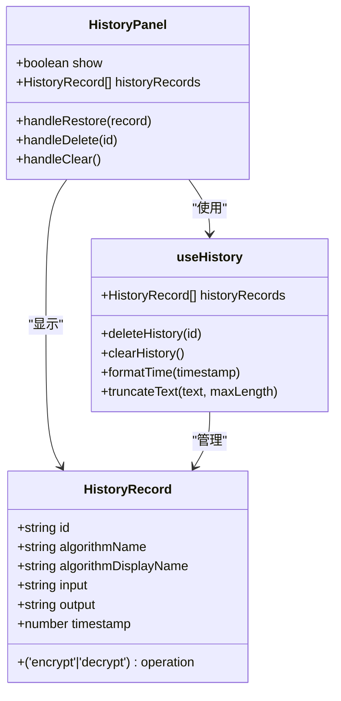

**图表来源**
- [HistoryPanel.vue](file://src/components/history/HistoryPanel.vue#L1-L138)
- [useHistory.ts](file://src/composables/useHistory.ts#L138-L152)

**章节来源**
- [HistoryPanel.vue](file://src/components/history/HistoryPanel.vue#L1-L138)

## 依赖关系分析

### 组件耦合度

useHistory 函数具有良好的模块化设计，与其他组件的耦合度较低：

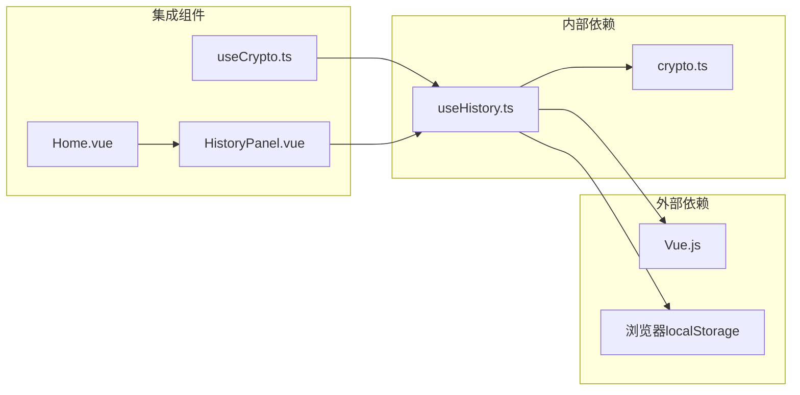

**图表来源**
- [useHistory.ts](file://src/composables/useHistory.ts#L1-L2)
- [useCrypto.ts](file://src/composables/useCrypto.ts#L4)
- [HistoryPanel.vue](file://src/components/history/HistoryPanel.vue#L16)

### 数据流分析

#### 正向数据流

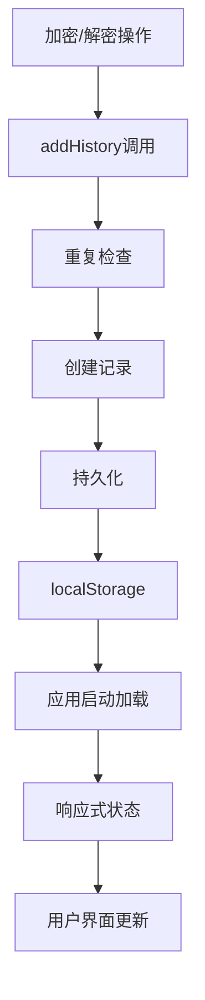

**图表来源**
- [useCrypto.ts](file://src/composables/useCrypto.ts#L98-L105)
- [useHistory.ts](file://src/composables/useHistory.ts#L34)

**章节来源**
- [useCrypto.ts](file://src/composables/useCrypto.ts#L74-L119)
- [useHistory.ts](file://src/composables/useHistory.ts#L34-L35)

## 性能考虑

### 时间复杂度分析

| 操作 | 时间复杂度 | 空间复杂度 | 说明 |
|------|------------|------------|------|
| 添加记录 | O(n) | O(1) | n为当前记录数（去重检查） |
| 删除记录 | O(n) | O(1) | n为当前记录数（查找索引） |
| 获取记录 | O(1) | O(1) | 直接访问响应式数组 |
| 去重检查 | O(n) | O(1) | 遍历现有记录 |
| 存储操作 | O(n) | O(n) | n为记录数（JSON序列化） |

### 内存优化策略

1. **懒加载**: 应用启动时只加载必要的历史记录
2. **及时清理**: 超限时自动截断，避免内存泄漏
3. **响应式优化**: 使用 Vue 响应式系统减少不必要的更新
4. **字符串截断**: UI 层面的文本截断减少 DOM 渲染负担

### 性能监控建议

- **存储容量监控**: 定期检查 localStorage 使用情况
- **操作延迟监控**: 监控历史记录操作的响应时间
- **内存使用监控**: 关注历史记录数组的内存占用

## 故障排除指南

### 常见问题及解决方案

#### localStorage 访问被拒绝

**症状**: 历史记录无法保存或读取
**原因**: 浏览器隐私模式或安全策略限制
**解决方案**: 
- 检查浏览器控制台错误信息
- 确认浏览器允许 localStorage 访问
- 考虑使用其他存储方案作为后备

#### JSON 解析错误

**症状**: 历史记录丢失或显示异常
**原因**: 存储的数据格式损坏
**解决方案**:
- 清理 localStorage 中的损坏数据
- 检查数据序列化过程
- 实施更严格的数据验证

#### 性能问题

**症状**: 页面加载缓慢或操作卡顿
**原因**: 历史记录过多导致的性能问题
**解决方案**:
- 检查历史记录数量
- 考虑增加数量限制
- 优化 UI 渲染逻辑

**章节来源**
- [useHistory.ts](file://src/composables/useHistory.ts#L12-L14)
- [useHistory.ts](file://src/composables/useHistory.ts#L21-L25)

### 调试技巧

1. **开发者工具**: 使用浏览器开发者工具检查 localStorage
2. **日志记录**: 在关键操作点添加日志输出
3. **单元测试**: 编写针对历史记录操作的测试用例
4. **性能分析**: 使用性能分析工具监控内存使用情况

## 结论

useHistory 组合式函数是一个设计精良的历史记录管理系统，具有以下突出特点：

### 技术优势

1. **完整的生命周期管理**: 从创建到销毁的全流程覆盖
2. **智能去重策略**: 基于多维度的精确去重算法
3. **可靠的持久化机制**: 健壮的错误处理和回退策略
4. **优秀的用户体验**: 即时响应和人性化的界面设计

### 最佳实践建议

1. **合理使用**: 避免在历史记录中存储敏感信息
2. **定期清理**: 建议用户定期清理不需要的历史记录
3. **备份策略**: 重要历史记录建议手动备份
4. **性能监控**: 关注 localStorage 使用情况和页面性能

### 扩展可能性

1. **云端同步**: 可扩展支持云端历史记录同步
2. **搜索功能**: 添加历史记录搜索和过滤功能
3. **标签系统**: 为历史记录添加自定义标签
4. **导入导出**: 支持历史记录的批量导入导出

通过其模块化设计和清晰的接口定义，useHistory 为整个加密工具提供了可靠的历史记录管理基础，是项目架构中的重要组成部分。