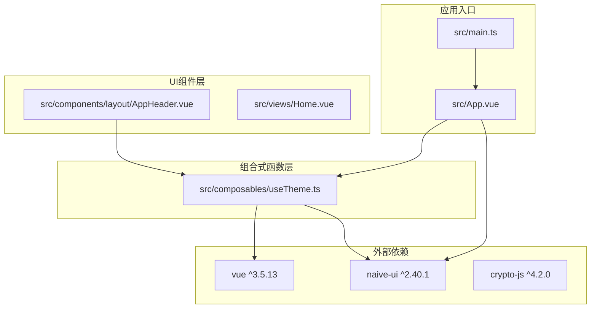
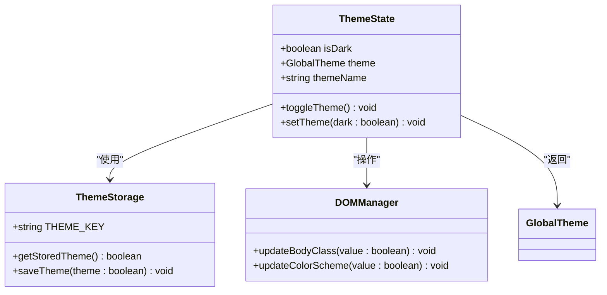
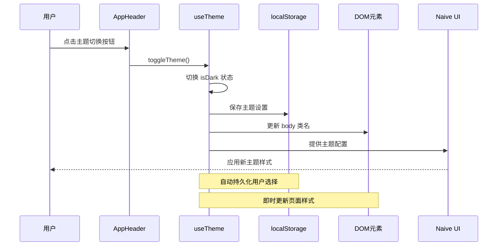
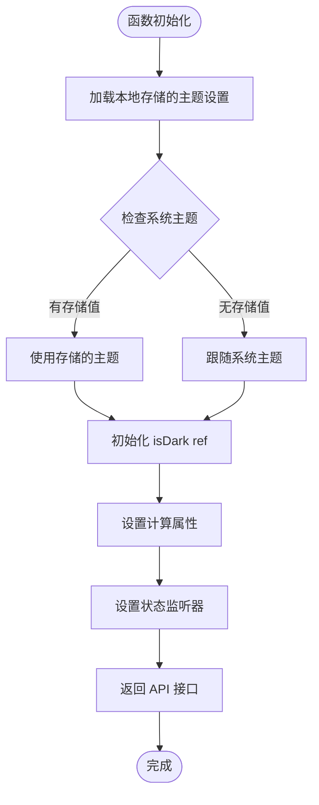
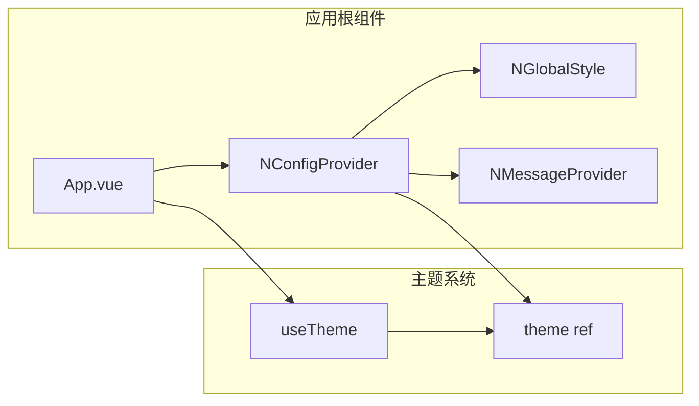
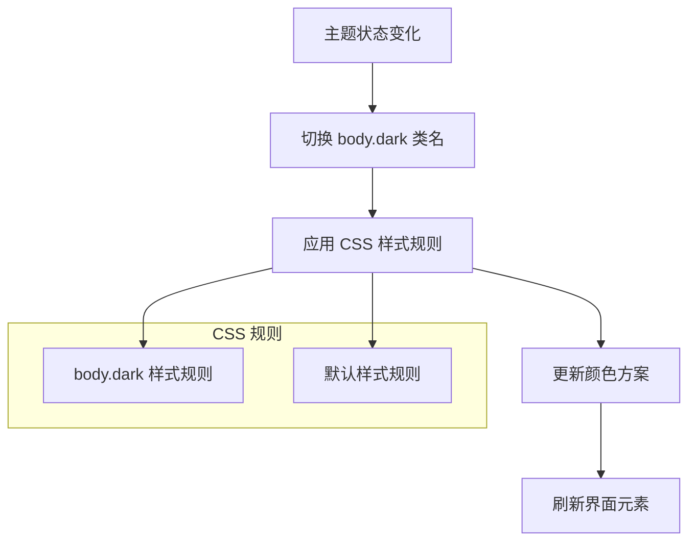
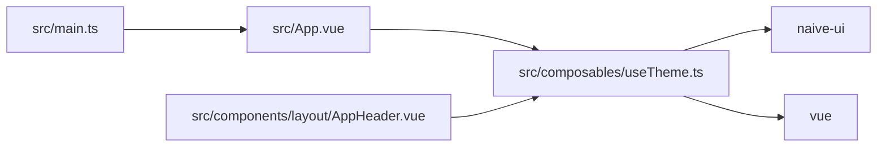

# useTheme 主题切换组合式函数

<cite>
**本文档引用的文件**
- [useTheme.ts](file://src/composables/useTheme.ts)
- [App.vue](file://src/App.vue)
- [main.ts](file://src/main.ts)
- [AppHeader.vue](file://src/components/layout/AppHeader.vue)
- [package.json](file://package.json)
</cite>

## 目录
1. [简介](#简介)
2. [项目结构](#项目结构)
3. [核心组件](#核心组件)
4. [架构概览](#架构概览)
5. [详细组件分析](#详细组件分析)
6. [依赖关系分析](#依赖关系分析)
7. [性能考虑](#性能考虑)
8. [故障排除指南](#故障排除指南)
9. [结论](#结论)
10. [附录](#附录)

## 简介

useTheme 是一个专门设计用于管理应用程序主题状态的 Vue 3 组合式函数。该函数实现了完整的主题切换功能，包括深色模式和浅色模式之间的无缝切换、用户偏好持久化、系统主题跟随以及 Naive UI 主题系统的集成。

本函数采用响应式设计模式，通过 Vue 的响应式系统管理主题状态，并与浏览器的本地存储进行深度集成，确保用户的选择在页面刷新后仍然保持一致。

## 项目结构

该项目采用模块化的架构设计，主题功能分布在多个关键文件中：



**图表来源**
- [main.ts](file://src/main.ts#L1-L10)
- [App.vue](file://src/App.vue#L1-L33)
- [useTheme.ts](file://src/composables/useTheme.ts#L1-L53)

**章节来源**
- [main.ts](file://src/main.ts#L1-L10)
- [App.vue](file://src/App.vue#L1-L33)
- [package.json](file://package.json#L1-L27)

## 核心组件

useTheme 组合式函数是整个主题系统的核心，提供了完整的主题管理功能：

### 主要功能特性

1. **响应式主题状态管理**：使用 Vue 的 ref 和 computed 实现响应式主题状态
2. **本地存储持久化**：自动保存用户主题选择到浏览器本地存储
3. **系统主题跟随**：默认跟随用户的系统主题设置
4. **Naive UI 集成**：与 Naive UI 的 darkTheme 完美集成
5. **实时样式更新**：通过 CSS 类名切换实现即时样式更新

### 数据结构设计



**图表来源**
- [useTheme.ts](file://src/composables/useTheme.ts#L4-L53)

**章节来源**
- [useTheme.ts](file://src/composables/useTheme.ts#L1-L53)

## 架构概览

useTheme 函数采用了清晰的分层架构，确保了代码的可维护性和扩展性：



**图表来源**
- [AppHeader.vue](file://src/components/layout/AppHeader.vue#L39-L47)
- [useTheme.ts](file://src/composables/useTheme.ts#L29-L43)

## 详细组件分析

### useTheme 组合式函数实现

#### 状态管理机制

useTheme 函数使用 Vue 的响应式系统来管理主题状态：



**图表来源**
- [useTheme.ts](file://src/composables/useTheme.ts#L6-L17)

#### 主题切换实现逻辑

主题切换功能通过以下步骤实现：

1. **状态切换**：toggleTheme() 方法简单地翻转 isDark 的布尔值
2. **持久化保存**：watch 监听器自动将新状态保存到 localStorage
3. **DOM 更新**：通过切换 body 元素的 'dark' 类名触发样式更新
4. **Naive UI 集成**：根据 isDark 状态返回相应的主题对象

#### API 设计详解

useTheme 函数提供了简洁而强大的 API 接口：

| 属性/方法 | 类型 | 描述 | 返回值 |
|-----------|------|------|--------|
| isDark | Ref<boolean> | 当前主题状态（深色/浅色） | boolean |
| theme | ComputedRef<GlobalTheme \| null> | Naive UI 主题配置 | GlobalTheme 或 null |
| themeName | ComputedRef<string> | 主题名称显示文本 | "深色" 或 "浅色" |
| toggleTheme | () => void | 切换主题的方法 | void |
| setTheme | (dark: boolean) => void | 设置特定主题的方法 | void |

**章节来源**
- [useTheme.ts](file://src/composables/useTheme.ts#L19-L52)

### 应用集成实现

#### App.vue 中的主题集成

在应用根组件中，useTheme 函数被正确集成以提供全局主题支持：



**图表来源**
- [App.vue](file://src/App.vue#L1-L16)
- [useTheme.ts](file://src/composables/useTheme.ts#L45-L52)

#### 头部组件中的主题控制

AppHeader 组件展示了如何在用户界面中实现主题切换控制：

| 功能特性 | 实现方式 | 用户体验 |
|----------|----------|----------|
| 图标切换 | 根据 isDark 状态显示不同图标 | 直观的视觉反馈 |
| 文字提示 | 动态显示切换提示文本 | 清晰的操作指导 |
| 点击交互 | 绑定 toggleTheme 方法 | 简单的一键切换 |
| 响应式更新 | 自动响应主题状态变化 | 即时的界面反馈 |

**章节来源**
- [AppHeader.vue](file://src/components/layout/AppHeader.vue#L1-L78)

### 样式系统集成

#### CSS 变量和类名系统

主题系统通过 CSS 类名切换实现样式更新：



**图表来源**
- [App.vue](file://src/App.vue#L29-L31)

#### Naive UI 主题集成

useTheme 函数与 Naive UI 的深度集成确保了组件库的统一主题体验：

| 主题类型 | 配置方式 | 效果 |
|----------|----------|------|
| 深色主题 | 使用 darkTheme 对象 | 所有 Naive UI 组件自动适配深色 |
| 浅色主题 | 使用 null 值 | 使用 Naive UI 默认浅色主题 |
| 动态切换 | 响应式计算属性 | 实时更新组件外观 |

**章节来源**
- [useTheme.ts](file://src/composables/useTheme.ts#L21-L23)

## 依赖关系分析

### 外部依赖分析

项目对第三方库的依赖关系清晰明确：

```mermaid
graph TB
subgraph "核心依赖"
vue[vue ^3.5.13]
naive_ui[naive-ui ^2.40.1]
end
subgraph "功能扩展"
crypto_js[crypto-js ^4.2.0]
pinia[pinia ^2.3.0]
icons[@vicons/ionicons5 ^0.12.0]
end
subgraph "开发工具"
vite[vite ^6.0.5]
typescript[typescript ~5.6.2]
end
useTheme --> vue
useTheme --> naive_ui
AppHeader --> icons
App --> crypto_js
App --> pinia
```

**图表来源**
- [package.json](file://package.json#L12-L25)

### 内部模块依赖

主题系统内部模块之间的依赖关系简洁高效：



**图表来源**
- [main.ts](file://src/main.ts#L1-L10)
- [App.vue](file://src/App.vue#L1-L16)
- [useTheme.ts](file://src/composables/useTheme.ts#L1-L2)

**章节来源**
- [package.json](file://package.json#L1-L27)

## 性能考虑

### 响应式性能优化

useTheme 函数在设计时充分考虑了性能因素：

1. **最小化响应式开销**：仅使用必要的 ref 和 computed
2. **懒加载策略**：主题配置按需计算
3. **事件去抖处理**：避免频繁的状态更新
4. **内存管理**：及时清理不需要的引用

### 存储性能优化

本地存储访问经过优化以确保最佳性能：

- **异步存储**：使用浏览器原生异步存储 API
- **批量更新**：避免重复的存储操作
- **错误处理**：优雅处理存储失败的情况

### 样式渲染优化

CSS 类名切换提供了高效的样式更新机制：

- **原生 DOM 操作**：直接操作类名比重新渲染更高效
- **选择器优化**：使用简单的类名选择器
- **缓存策略**：避免重复的样式计算

## 故障排除指南

### 常见问题及解决方案

#### 主题状态不持久化

**问题描述**：用户切换主题后刷新页面，主题设置丢失

**可能原因**：
1. localStorage 访问权限受限
2. 浏览器隐私设置阻止存储
3. 应用程序错误导致存储失败

**解决方案**：
1. 检查浏览器控制台是否有存储错误
2. 确认 localStorage API 可用性
3. 添加存储失败的降级处理

#### 主题切换无响应

**问题描述**：点击主题切换按钮没有反应

**可能原因**：
1. 事件绑定失败
2. 组合式函数未正确导入
3. Vue 响应式系统异常

**解决方案**：
1. 检查组件导入语句
2. 验证 useTheme 函数的正确性
3. 确认 Vue 版本兼容性

#### 样式更新延迟

**问题描述**：主题切换后样式更新有延迟

**可能原因**：
1. CSS 过渡动画影响
2. DOM 更新时机问题
3. 浏览器渲染性能

**解决方案**：
1. 检查 CSS 过渡属性
2. 调整 DOM 更新顺序
3. 优化渲染性能

**章节来源**
- [useTheme.ts](file://src/composables/useTheme.ts#L39-L43)

## 结论

useTheme 组合式函数是一个设计精良的主题管理系统，它成功地解决了现代 Web 应用中的主题切换需求。该函数具有以下显著优势：

1. **简洁的 API 设计**：提供直观易用的主题管理接口
2. **完整的功能覆盖**：从状态管理到持久化存储的全流程支持
3. **优秀的用户体验**：即时的主题切换和流畅的过渡效果
4. **良好的性能表现**：高效的响应式更新和最小化的资源消耗
5. **可靠的稳定性**：完善的错误处理和降级策略

该实现为开发者提供了一个可扩展的基础，可以轻松地添加更多主题选项或自定义主题配置。

## 附录

### 主题定制指南

#### 添加新的主题选项

要扩展主题系统以支持更多主题选项，可以按照以下步骤进行：

1. **定义新的主题状态**：扩展 isDark 的枚举值
2. **创建主题映射**：建立主题状态到实际主题对象的映射
3. **更新 UI 组件**：添加新的主题选择界面
4. **测试兼容性**：确保新主题与现有组件兼容

#### 自定义 CSS 变量

如果需要更精细的样式控制，可以考虑使用 CSS 变量：

```css
:root {
  --primary-color: #007bff;
  --secondary-color: #6c757d;
  --background-color: #ffffff;
}

body.dark {
  --primary-color: #0d6efd;
  --secondary-color: #adb5bd;
  --background-color: #1a1a1a;
}
```

#### 最佳实践建议

1. **保持主题一致性**：确保所有组件遵循相同的主题约定
2. **提供视觉反馈**：为主题切换提供适当的视觉指示
3. **考虑无障碍性**：确保主题切换不影响屏幕阅读器等辅助技术
4. **测试多设备兼容性**：验证主题在不同设备和浏览器上的表现
5. **文档化主题选项**：为用户提供清晰的主题使用说明