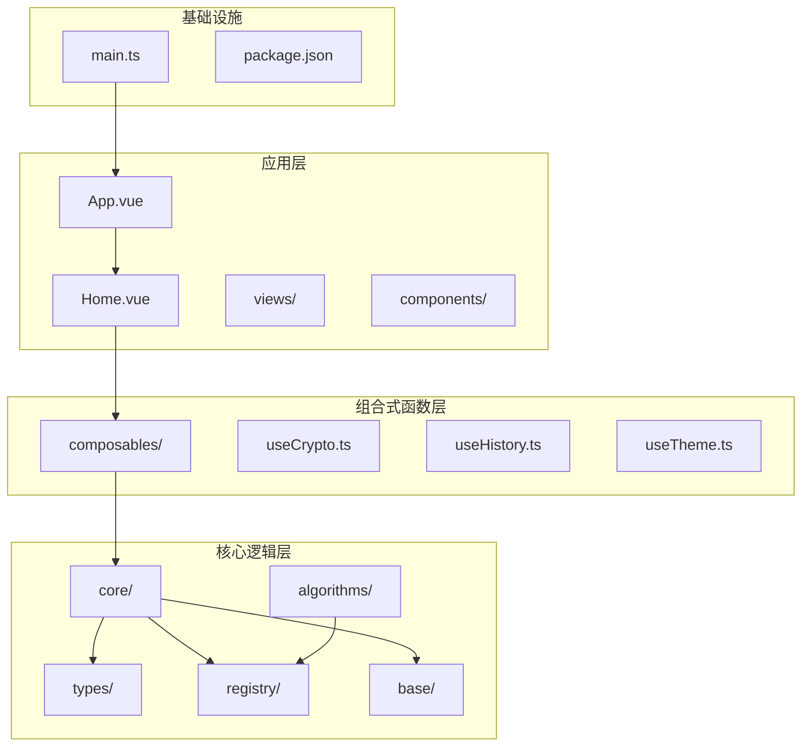
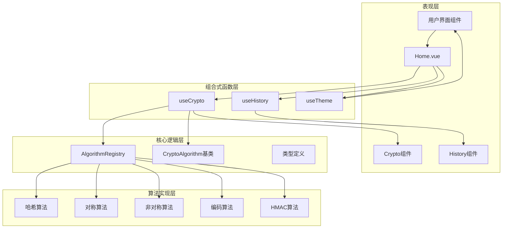
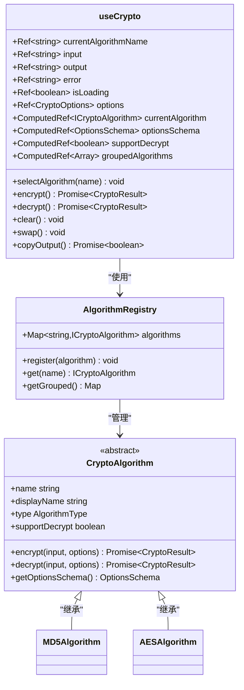
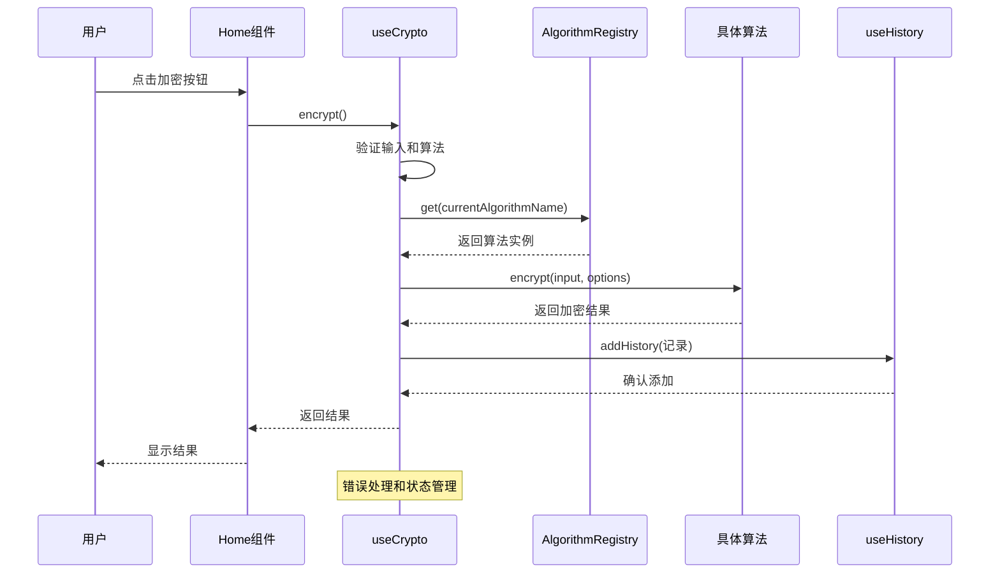
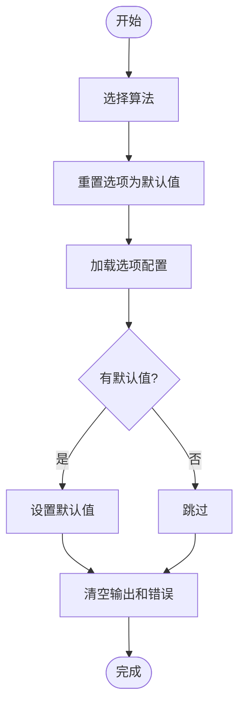
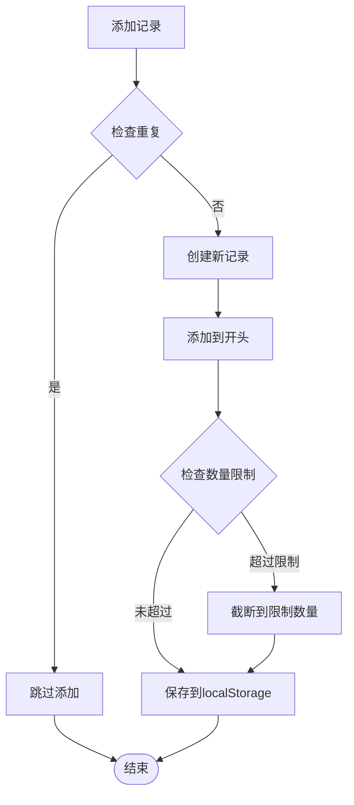
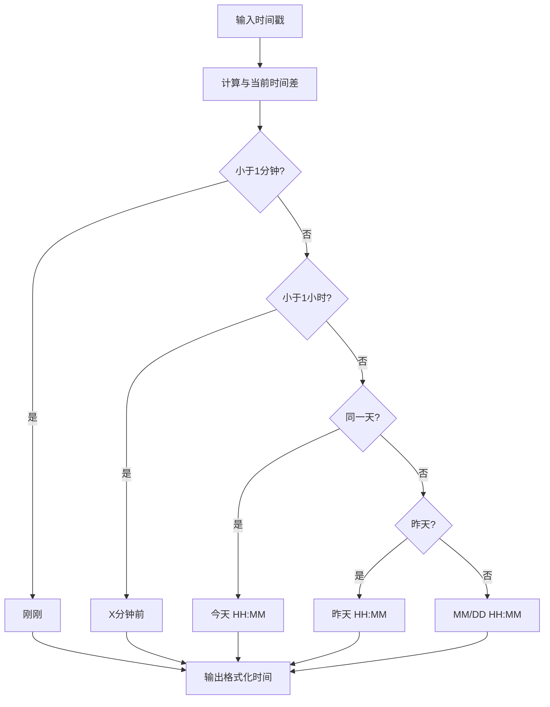
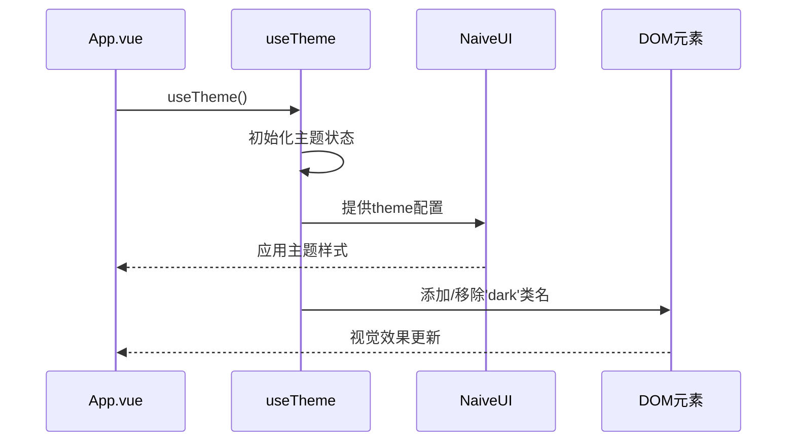
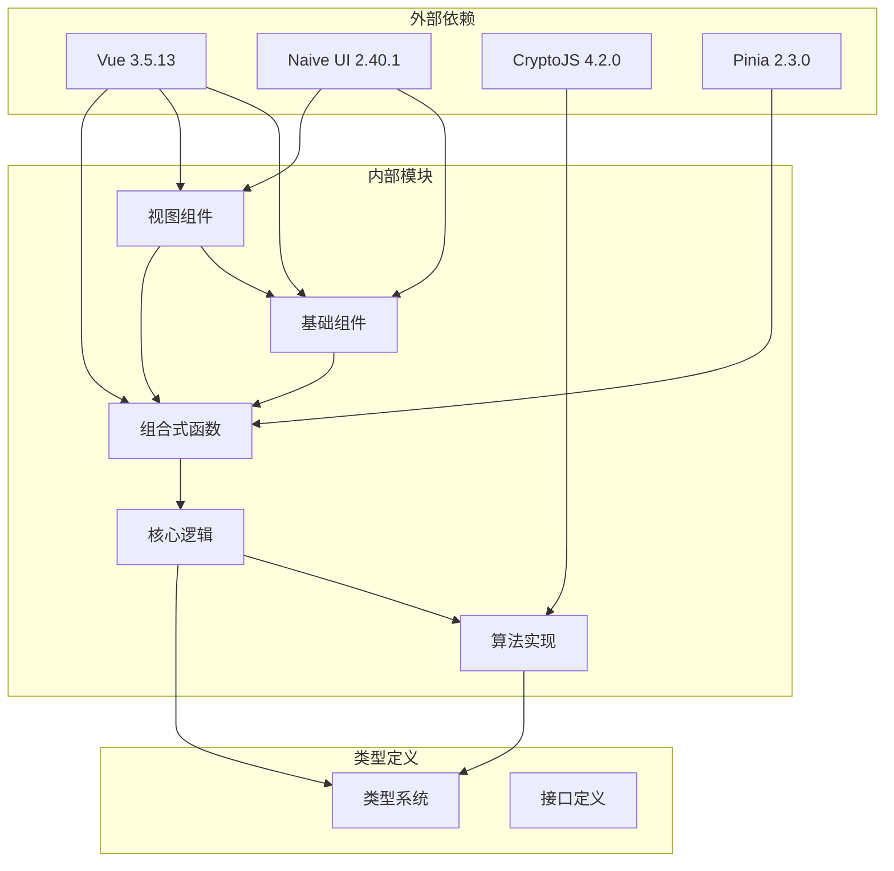

# 组合式函数系统

<cite>
**本文档引用的文件**
- [useCrypto.ts](file://src/composables/useCrypto.ts)
- [useHistory.ts](file://src/composables/useHistory.ts)
- [useTheme.ts](file://src/composables/useTheme.ts)
- [crypto.ts](file://src/core/types/crypto.ts)
- [AlgorithmRegistry.ts](file://src/core/registry/AlgorithmRegistry.ts)
- [CryptoAlgorithm.ts](file://src/core/base/CryptoAlgorithm.ts)
- [index.ts](file://src/algorithms/index.ts)
- [Home.vue](file://src/views/Home.vue)
- [App.vue](file://src/App.vue)
- [HistoryPanel.vue](file://src/components/history/HistoryPanel.vue)
- [InputArea.vue](file://src/components/crypto/InputArea.vue)
- [main.ts](file://src/main.ts)
- [package.json](file://src/package.json)
</cite>

## 目录
1. [简介](#简介)
2. [项目结构](#项目结构)
3. [核心组件](#核心组件)
4. [架构概览](#架构概览)
5. [详细组件分析](#详细组件分析)
6. [依赖关系分析](#依赖关系分析)
7. [性能考虑](#性能考虑)
8. [故障排除指南](#故障排除指南)
9. [结论](#结论)

## 简介

本项目采用Vue 3组合式函数架构，构建了一个功能完整的加密工具应用。组合式函数系统通过useCrypto、useHistory、useTheme三个核心模块，实现了业务逻辑封装、状态管理和跨组件共享功能。

该系统支持多种加密算法（哈希、HMAC、编码转换、对称加密、非对称加密），提供历史记录管理、主题切换等功能，展现了现代Vue 3开发的最佳实践。

## 项目结构

项目采用模块化设计，核心目录结构如下：



**图表来源**
- [main.ts](file://src/main.ts#L1-L10)
- [App.vue](file://src/App.vue#L1-L33)
- [Home.vue](file://src/views/Home.vue#L1-L220)

**章节来源**
- [main.ts](file://src/main.ts#L1-L10)
- [package.json](file://src/package.json#L1-L27)

## 核心组件

### useCrypto 组合式函数

useCrypto是整个加密系统的核心，负责算法选择、加密解密操作、状态管理等功能。

**主要功能特性：**
- 算法动态选择和配置
- 加密解密操作执行
- 输入输出数据管理
- 错误处理和状态反馈
- 历史记录集成

**关键API接口：**

| 属性/方法 | 类型 | 描述 |
|-----------|------|------|
| currentAlgorithmName | Ref<string> | 当前选中算法名称 |
| currentAlgorithm | ComputedRef<ICryptoAlgorithm> | 当前算法实例 |
| input/output/error | Ref<string> | 输入输出错误状态 |
| isLoading | Ref<boolean> | 加载状态 |
| options/optionsSchema | Ref<CryptoOptions> | 算法选项和配置模式 |
| supportDecrypt | ComputedRef<boolean> | 是否支持解密 |
| groupedAlgorithms | ComputedRef<Array> | 分类后的算法列表 |
| selectAlgorithm | Function | 选择算法并重置选项 |
| encrypt/decrypt | Async Function | 加密/解密操作 |
| clear/swap/copyOutput | Function | 清空/交换/复制功能 |

**章节来源**
- [useCrypto.ts](file://src/composables/useCrypto.ts#L74-L216)

### useHistory 组合式函数

useHistory专门负责历史记录的管理，提供本地存储持久化和历史记录操作功能。

**核心功能：**
- 历史记录的增删改查
- 本地存储持久化
- 去重和数量限制
- 时间格式化和文本截断

**API接口：**

| 属性/方法 | 类型 | 描述 |
|-----------|------|------|
| historyRecords | Ref<HistoryRecord[]> | 历史记录数组 |
| historyCount | ComputedRef<number> | 历史记录数量 |
| hasHistory | ComputedRef<boolean> | 是否存在历史记录 |
| addHistory | Function | 添加历史记录 |
| getHistory/getHistoryById | Function | 获取历史记录 |
| deleteHistory/clearHistory | Function | 删除或清空历史记录 |
| formatTime/truncateText | Function | 格式化时间和截断文本 |

**章节来源**
- [useHistory.ts](file://src/composables/useHistory.ts#L36-L152)

### useTheme 组合式函数

useTheme提供主题切换和状态管理功能，支持深色/浅色主题切换。

**功能特点：**
- 自动检测系统主题偏好
- 本地存储主题设置
- 实时主题切换
- DOM类名同步

**API接口：**

| 属性/方法 | 类型 | 描述 |
|-----------|------|------|
| isDark | Ref<boolean> | 是否为深色主题 |
| theme | ComputedRef<GlobalTheme> | 当前主题对象 |
| themeName | ComputedRef<string> | 主题名称 |
| toggleTheme/setTheme | Function | 切换或设置主题 |

**章节来源**
- [useTheme.ts](file://src/composables/useTheme.ts#L19-L52)

## 架构概览

系统采用分层架构设计，各层职责明确，耦合度低：



**图表来源**
- [useCrypto.ts](file://src/composables/useCrypto.ts#L1-L217)
- [useHistory.ts](file://src/composables/useHistory.ts#L1-L153)
- [useTheme.ts](file://src/composables/useTheme.ts#L1-L53)
- [AlgorithmRegistry.ts](file://src/core/registry/AlgorithmRegistry.ts#L1-L114)

## 详细组件分析

### useCrypto 组件深度分析

useCrypto是系统的核心组合式函数，实现了复杂的业务逻辑封装：

#### 状态管理架构



**图表来源**
- [useCrypto.ts](file://src/composables/useCrypto.ts#L74-L216)
- [AlgorithmRegistry.ts](file://src/core/registry/AlgorithmRegistry.ts#L7-L114)
- [CryptoAlgorithm.ts](file://src/core/base/CryptoAlgorithm.ts#L13-L165)

#### 加密流程序列图



**图表来源**
- [useCrypto.ts](file://src/composables/useCrypto.ts#L78-L119)
- [Home.vue](file://src/views/Home.vue#L36-L52)

#### 算法选择流程



**图表来源**
- [useCrypto.ts](file://src/composables/useCrypto.ts#L57-L72)

**章节来源**
- [useCrypto.ts](file://src/composables/useCrypto.ts#L1-L217)
- [Home.vue](file://src/views/Home.vue#L19-L92)

### useHistory 组件详细分析

useHistory专注于历史记录管理，提供了完整的CRUD操作和持久化机制：

#### 数据持久化策略



**图表来源**
- [useHistory.ts](file://src/composables/useHistory.ts#L44-L73)

#### 时间格式化算法



**图表来源**
- [useHistory.ts](file://src/composables/useHistory.ts#L101-L130)

**章节来源**
- [useHistory.ts](file://src/composables/useHistory.ts#L1-L153)

### useTheme 组件完整分析

useTheme实现了响应式的主题管理系统，支持系统偏好检测和手动切换：

#### 主题切换机制

```mermaid
stateDiagram-v2
[*] --> CheckStorage
CheckStorage --> CheckSystemPref{检查系统偏好}
CheckSystemPref --> |深色| DarkMode[深色主题]
CheckSystemPref --> |浅色| LightMode[浅色主题]
CheckSystemPref --> |未设置| SystemPref[跟随系统]
DarkMode --> ToggleTheme
LightMode --> ToggleTheme
ToggleTheme --> SaveToStorage[保存到localStorage]
SaveToStorage --> UpdateDOM[更新DOM类名]
UpdateDOM --> DarkMode
UpdateDOM --> LightMode
SystemPref --> DarkMode
SystemPref --> LightMode
```

**图表来源**
- [useTheme.ts](file://src/composables/useTheme.ts#L7-L43)

#### 主题集成流程



**图表来源**
- [App.vue](file://src/App.vue#L6-L15)
- [useTheme.ts](file://src/composables/useTheme.ts#L39-L43)

**章节来源**
- [useTheme.ts](file://src/composables/useTheme.ts#L1-L53)
- [App.vue](file://src/App.vue#L1-L33)

## 依赖关系分析

系统采用清晰的依赖层次结构，各模块间耦合度低：



**图表来源**
- [package.json](file://src/package.json#L12-L25)
- [useCrypto.ts](file://src/composables/useCrypto.ts#L1-L4)
- [useHistory.ts](file://src/composables/useHistory.ts#L1-L2)
- [useTheme.ts](file://src/composables/useTheme.ts#L1-L2)

**章节来源**
- [package.json](file://src/package.json#L1-L27)

## 性能考虑

### 状态管理优化

1. **响应式状态分离**：将不同类型的用户状态分离到独立的ref中，避免不必要的重新渲染
2. **计算属性缓存**：使用computed进行昂贵的计算结果缓存
3. **懒加载算法**：算法实例通过registry按需获取，减少内存占用

### 异步操作优化

1. **并发控制**：isLoading状态确保同一时间只有一个加密操作进行
2. **错误快速反馈**：立即设置错误状态，避免无效的异步等待
3. **资源清理**：finally块确保异步操作完成后正确清理状态

### 内存管理

1. **历史记录限制**：MAX_HISTORY常量限制历史记录数量，防止内存泄漏
2. **localStorage降级**：存储失败时自动截断到一半，保证系统稳定性
3. **组件卸载清理**：Vue组件自动清理响应式依赖

## 故障排除指南

### 常见问题及解决方案

#### 算法选择问题
**症状**：选择算法后无法进行操作
**原因**：算法实例获取失败或算法未正确注册
**解决**：检查AlgorithmRegistry是否正确初始化，确认算法名称匹配

#### 加密失败
**症状**：加密操作抛出异常或返回错误
**原因**：输入验证失败、算法不支持或运行时异常
**解决**：检查输入数据格式，确认算法支持相应操作

#### 历史记录丢失
**症状**：刷新页面后历史记录消失
**原因**：localStorage存储失败或权限问题
**解决**：检查浏览器存储权限，确认localStorage可用性

#### 主题切换失效
**症状**：切换主题后界面无变化
**原因**：DOM类名未正确更新或NaiveUI主题配置问题
**解决**：检查watch监听器是否正常工作，确认CSS类名同步

**章节来源**
- [useCrypto.ts](file://src/composables/useCrypto.ts#L78-L119)
- [useHistory.ts](file://src/composables/useHistory.ts#L18-L26)
- [useTheme.ts](file://src/composables/useTheme.ts#L39-L43)

## 结论

本项目的组合式函数系统展现了Vue 3最佳实践的典型应用：

**设计优势：**
- **高内聚低耦合**：每个组合式函数职责单一，便于测试和维护
- **类型安全**：完整的TypeScript类型定义确保开发时的类型安全
- **可扩展性**：基于AlgorithmRegistry的插件化架构支持新算法快速集成
- **用户体验**：完善的错误处理和状态反馈提升用户交互体验

**技术亮点：**
- **响应式状态管理**：充分利用Vue 3的响应式系统实现高效的状态更新
- **异步操作处理**：合理的异步流程控制和错误处理机制
- **本地存储集成**：历史记录和主题设置的持久化方案
- **组件复用**：组合式函数支持跨组件共享状态和逻辑

该系统为Vue开发者提供了组合式函数设计的完整参考，展示了如何在实际项目中有效运用组合式函数模式来构建复杂的应用程序。