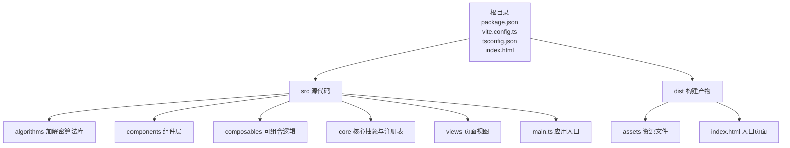
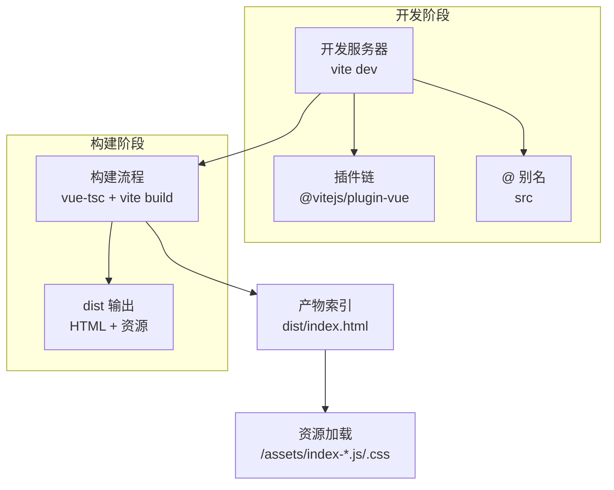
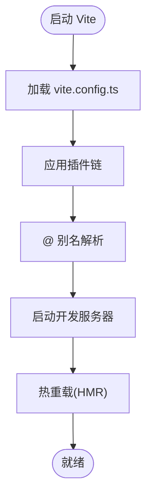
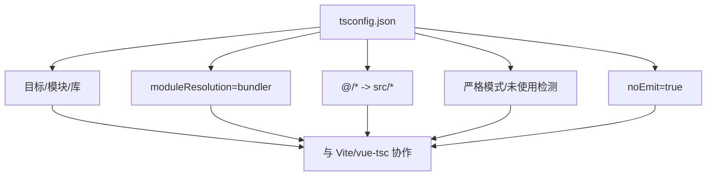
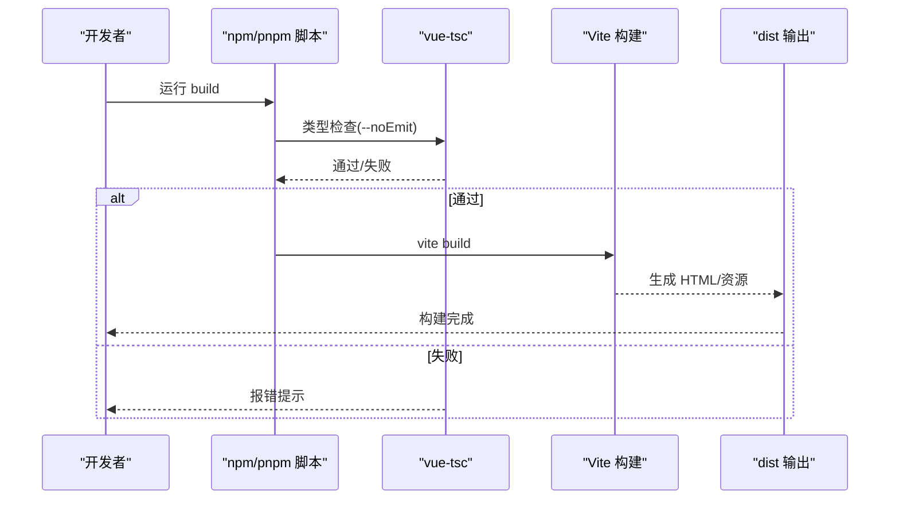
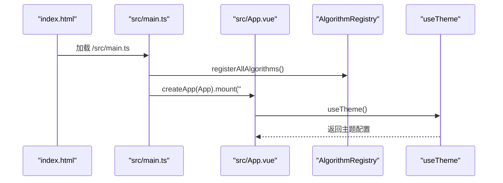
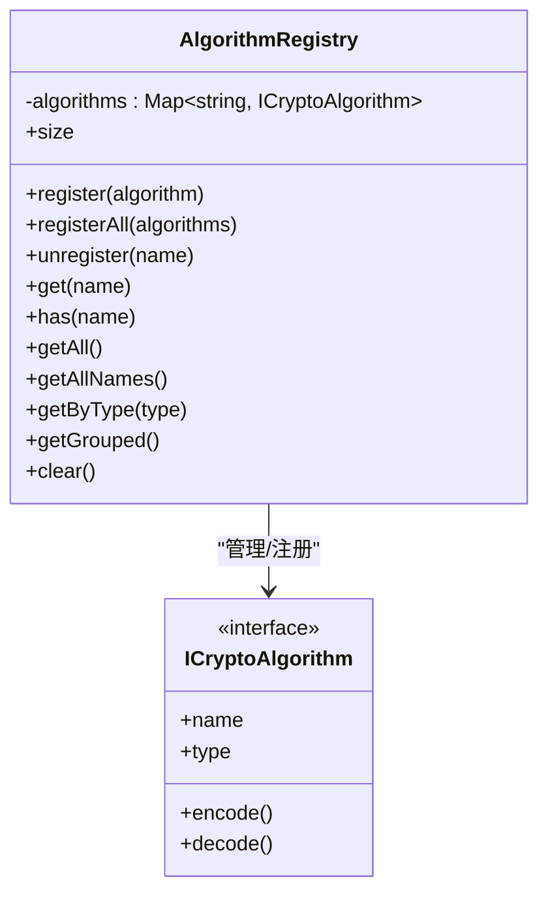
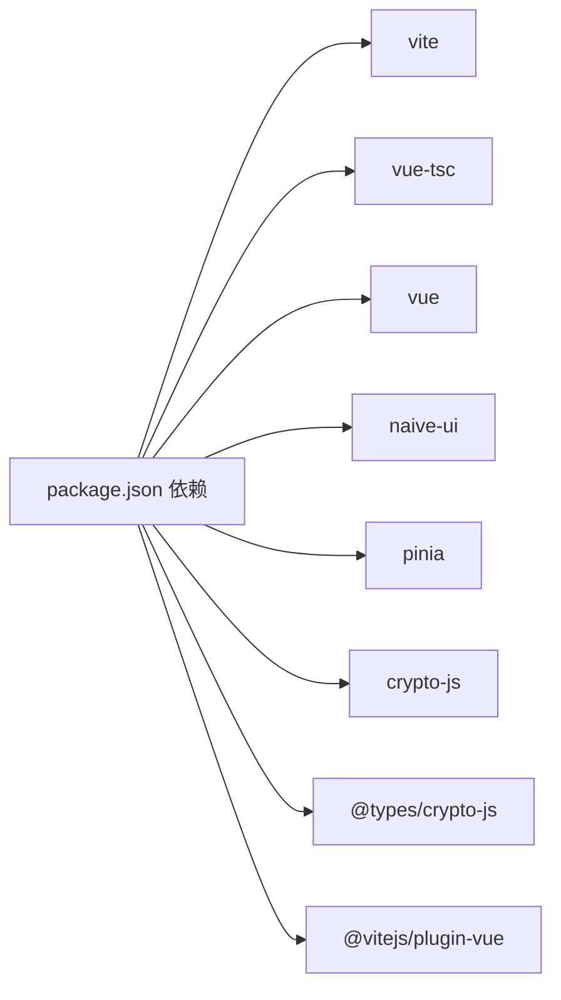

# 配置与构建

<cite>
**本文引用的文件**
- [vite.config.ts](file://vite.config.ts)
- [package.json](file://package.json)
- [tsconfig.json](file://tsconfig.json)
- [index.html](file://index.html)
- [src/main.ts](file://src/main.ts)
- [src/App.vue](file://src/App.vue)
- [src/composables/useTheme.ts](file://src/composables/useTheme.ts)
- [src/core/registry/AlgorithmRegistry.ts](file://src/core/registry/AlgorithmRegistry.ts)
- [src/algorithms/index.ts](file://src/algorithms/index.ts)
- [src/vite-env.d.ts](file://src/vite-env.d.ts)
- [dist/index.html](file://dist/index.html)
</cite>

## 目录
1. [简介](#简介)
2. [项目结构](#项目结构)
3. [核心组件](#核心组件)
4. [架构总览](#架构总览)
5. [详细组件分析](#详细组件分析)
6. [依赖关系分析](#依赖关系分析)
7. [性能考量](#性能考量)
8. [故障排查指南](#故障排查指南)
9. [结论](#结论)
10. [附录](#附录)

## 简介
本文件面向编码器项目的开发者与运维人员，系统性梳理开发与生产环境的配置与构建体系，涵盖 Vite 构建工具配置、TypeScript 编译设置、依赖管理与构建流程优化。内容包括：
- 开发服务器与热重载机制
- 代码分割与打包优化策略
- 环境变量与构建脚本说明
- 部署配置与最佳实践
- 常见问题排查与性能优化建议

## 项目结构
项目采用 Vue 3 + TypeScript + Vite 的现代前端技术栈，核心目录组织如下：
- 根目录包含构建与运行脚本、类型定义与入口 HTML
- 源代码位于 src 目录，按功能域划分为 algorithms、components、composables、core、views 等模块
- 构建产物输出至 dist 目录，包含静态资源与入口 HTML

图表来源
- [package.json](file://package.json#L1-L27)
- [vite.config.ts](file://vite.config.ts#L1-L13)
- [tsconfig.json](file://tsconfig.json#L1-L26)
- [index.html](file://index.html#L1-L14)
- [src/main.ts](file://src/main.ts#L1-L10)

章节来源
- [package.json](file://package.json#L1-L27)
- [vite.config.ts](file://vite.config.ts#L1-L13)
- [tsconfig.json](file://tsconfig.json#L1-L26)
- [index.html](file://index.html#L1-L14)

## 核心组件
本节聚焦于支撑开发与构建的关键配置文件及其职责：
- Vite 配置：插件启用、路径别名、开发服务器与预览
- TypeScript 配置：模块解析、严格模式、路径映射
- 包管理与脚本：开发、构建、预览、类型检查
- 应用入口与模板：应用挂载、主题与算法注册

章节来源
- [vite.config.ts](file://vite.config.ts#L1-L13)
- [tsconfig.json](file://tsconfig.json#L1-L26)
- [package.json](file://package.json#L1-L27)
- [src/main.ts](file://src/main.ts#L1-L10)
- [index.html](file://index.html#L1-L14)

## 架构总览
下图展示从开发到生产的端到端流程，以及关键配置点如何影响构建结果。

图表来源
- [vite.config.ts](file://vite.config.ts#L1-L13)
- [package.json](file://package.json#L6-L11)
- [dist/index.html](file://dist/index.html#L1-L15)

章节来源
- [vite.config.ts](file://vite.config.ts#L1-L13)
- [package.json](file://package.json#L6-L11)
- [dist/index.html](file://dist/index.html#L1-L15)

## 详细组件分析

### Vite 构建配置
- 插件启用：Vue 单文件组件支持
- 路径别名：通过 @ 指向 src，提升导入可读性
- 开发服务器：默认监听与热重载由 Vite 提供
- 预览：本地预览生产构建产物

图表来源
- [vite.config.ts](file://vite.config.ts#L1-L13)

章节来源
- [vite.config.ts](file://vite.config.ts#L1-L13)

### TypeScript 编译配置
- 目标与模块：ES2020 + ESNext，配合打包器进行模块化处理
- 解析策略：bundler 模式，避免 Node 解析差异
- 路径映射：与 Vite 的 @ 别名保持一致
- 严格模式：开启严格检查与未使用项检测
- 无 emit：构建由 Vite 与 vue-tsc 协作完成

图表来源
- [tsconfig.json](file://tsconfig.json#L1-L26)

章节来源
- [tsconfig.json](file://tsconfig.json#L1-L26)

### 包管理与构建脚本
- dev：启动开发服务器
- build：先执行类型检查，再进行生产构建
- preview：本地预览构建产物
- type-check：仅类型检查，不生成输出

图表来源
- [package.json](file://package.json#L6-L11)

章节来源
- [package.json](file://package.json#L6-L11)

### 应用入口与模板
- 入口文件：创建 Vue 应用、注册全部算法、挂载到 DOM
- 模板：基础 HTML 结构，引入入口脚本
- 主题与 UI：在根组件中注入 Naive UI 主题与全局样式

图表来源
- [index.html](file://index.html#L1-L14)
- [src/main.ts](file://src/main.ts#L1-L10)
- [src/App.vue](file://src/App.vue#L1-L32)
- [src/composables/useTheme.ts](file://src/composables/useTheme.ts#L1-L53)
- [src/algorithms/index.ts](file://src/algorithms/index.ts#L1-L59)
- [src/core/registry/AlgorithmRegistry.ts](file://src/core/registry/AlgorithmRegistry.ts#L1-L114)

章节来源
- [index.html](file://index.html#L1-L14)
- [src/main.ts](file://src/main.ts#L1-L10)
- [src/App.vue](file://src/App.vue#L1-L32)
- [src/composables/useTheme.ts](file://src/composables/useTheme.ts#L1-L53)
- [src/algorithms/index.ts](file://src/algorithms/index.ts#L1-L59)
- [src/core/registry/AlgorithmRegistry.ts](file://src/core/registry/AlgorithmRegistry.ts#L1-L114)

### 算法注册与类型系统
- 注册表：单例模式管理算法集合，支持按类型分组与查询
- 算法导出：集中导出密钥生成等能力
- 类型约束：通过核心类型定义确保算法实现一致性

图表来源
- [src/core/registry/AlgorithmRegistry.ts](file://src/core/registry/AlgorithmRegistry.ts#L1-L114)
- [src/algorithms/index.ts](file://src/algorithms/index.ts#L1-L59)

章节来源
- [src/core/registry/AlgorithmRegistry.ts](file://src/core/registry/AlgorithmRegistry.ts#L1-L114)
- [src/algorithms/index.ts](file://src/algorithms/index.ts#L1-L59)

## 依赖关系分析
- 构建工具链：Vite 作为构建核心，vue-tsc 负责类型检查，esbuild 与 Rollup 参与打包
- 运行时依赖：Vue 3、Naive UI、Pinia、crypto-js 等
- 类型声明：@types/crypto-js 提供第三方库类型支持

图表来源
- [package.json](file://package.json#L12-L25)

章节来源
- [package.json](file://package.json#L12-L25)

## 性能考量
- 代码分割与懒加载
  - 将大型算法模块按需加载，减少首屏体积
  - 使用动态 import 实现路由级或组件级懒加载
- 资源优化
  - 启用压缩与 Tree Shaking（由 Vite/Rollup 自动处理）
  - 分离 CSS 与 JS，利用浏览器缓存
- 构建缓存
  - 使用 Vite 的内置缓存与增量构建
  - 在 CI 中缓存 node_modules 以加速安装与构建
- 开发体验
  - 启用 HMR，缩短反馈周期
  - 严格类型检查前置，避免构建期错误

[本节为通用指导，无需列出具体文件来源]

## 故障排查指南
- 构建失败（类型错误）
  - 确认已先执行类型检查并通过
  - 检查 tsconfig.json 的 strict 与 noEmit 配置
- 路径别名无效
  - 确保 tsconfig.json 与 vite.config.ts 的 @ 别名一致
- 开发服务器无法热更新
  - 检查网络代理与端口占用
  - 确认未禁用 HMR 或存在冲突插件
- 预览页面空白
  - 检查 dist/index.html 是否正确引入资源
  - 确认静态资源路径与实际输出一致

章节来源
- [package.json](file://package.json#L6-L11)
- [tsconfig.json](file://tsconfig.json#L1-L26)
- [vite.config.ts](file://vite.config.ts#L1-L13)
- [dist/index.html](file://dist/index.html#L1-L15)

## 结论
本项目采用简洁高效的配置体系：Vite 提供快速开发与构建，TypeScript 保障类型安全，包管理脚本串联类型检查与打包流程。通过合理的别名、严格配置与模块化设计，既保证了开发效率，也为后续扩展与优化奠定了良好基础。

[本节为总结性内容，无需列出具体文件来源]

## 附录

### 环境变量配置
- 当前仓库未发现 .env 文件，建议在需要时新增以下文件并按需扩展：
  - .env.development：开发环境变量
  - .env.production：生产环境变量
- Vite 会自动加载对应环境文件，变量需以 VITE_ 前缀暴露给客户端代码

[本节为通用指导，无需列出具体文件来源]

### 构建脚本说明
- dev：启动开发服务器，支持热重载
- build：先类型检查，后生产构建
- preview：本地预览构建产物
- type-check：仅类型检查，不生成输出

章节来源
- [package.json](file://package.json#L6-L11)

### 部署配置指南
- 静态托管：将 dist 目录部署至任意静态服务器（Nginx、Apache、CDN）
- 路由回退：若使用 SPA 路由，确保回退到 index.html
- 资源路径：确认 dist/index.html 中的资源引用路径与部署路径一致

章节来源
- [dist/index.html](file://dist/index.html#L1-L15)