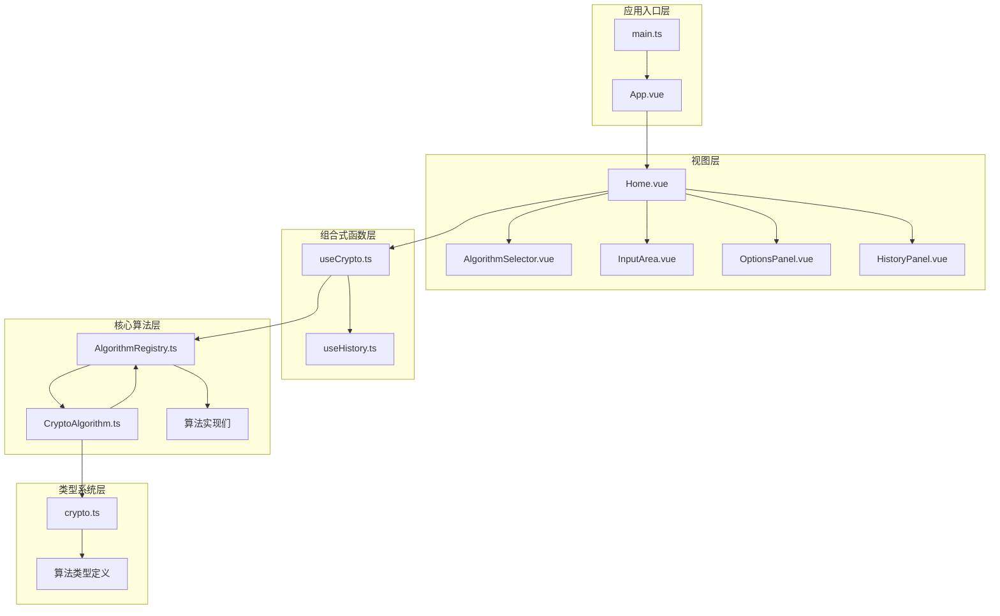
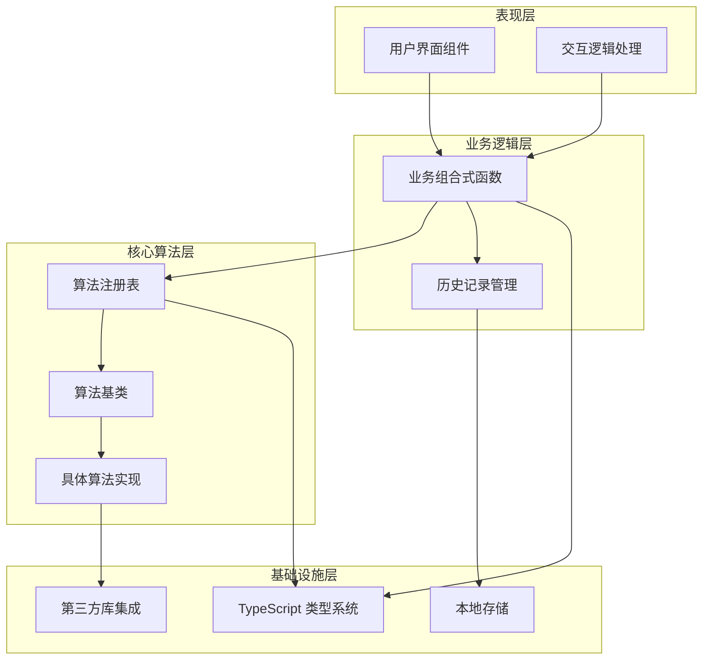
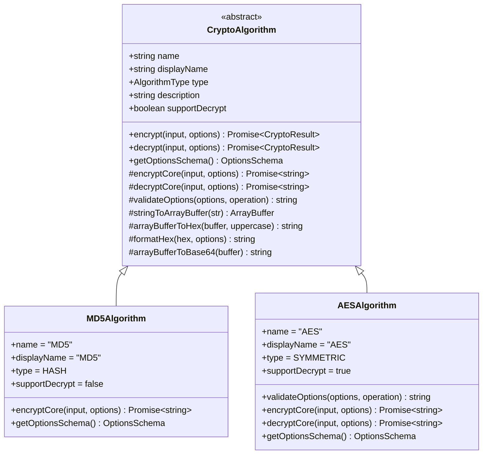
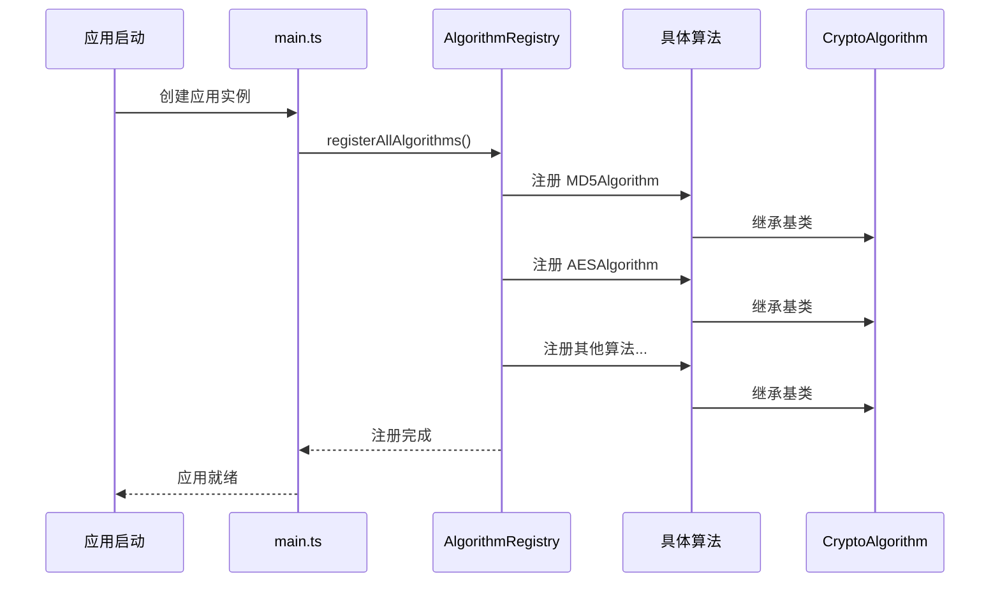
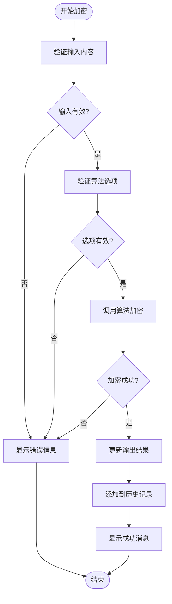
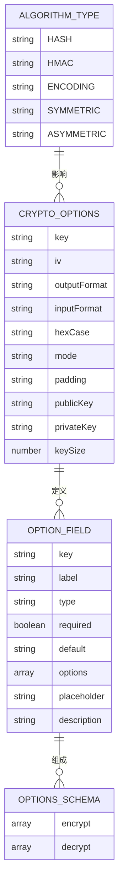

# 项目概述

<cite>
**本文档引用的文件**
- [package.json](file://package.json)
- [main.ts](file://src/main.ts)
- [App.vue](file://src/App.vue)
- [algorithms/index.ts](file://src/algorithms/index.ts)
- [CryptoAlgorithm.ts](file://src/core/base/CryptoAlgorithm.ts)
- [AlgorithmRegistry.ts](file://src/core/registry/AlgorithmRegistry.ts)
- [Home.vue](file://src/views/Home.vue)
- [useCrypto.ts](file://src/composables/useCrypto.ts)
- [AlgorithmSelector.vue](file://src/components/crypto/AlgorithmSelector.vue)
- [InputArea.vue](file://src/components/crypto/InputArea.vue)
- [crypto.ts](file://src/core/types/crypto.ts)
- [MD5.ts](file://src/algorithms/hash/MD5.ts)
- [AES.ts](file://src/algorithms/symmetric/AES.ts)
- [useHistory.ts](file://src/composables/useHistory.ts)
- [vite.config.ts](file://vite.config.ts)
</cite>

## 目录
1. [引言](#引言)
2. [项目结构](#项目结构)
3. [核心组件](#核心组件)
4. [架构总览](#架构总览)
5. [详细组件分析](#详细组件分析)
6. [依赖关系分析](#依赖关系分析)
7. [性能考虑](#性能考虑)
8. [故障排除指南](#故障排除指南)
9. [结论](#结论)

## 引言

本项目是一个基于 Vue 3 和 TypeScript 构建的 Web 加密工具应用，提供统一界面操作 15+ 种加密算法。项目采用模块化设计，通过算法注册表管理多种加密算法，包括哈希算法、编码转换、HMAC、对称加密和非对称加密等类别。

该应用的核心价值在于为用户提供了一个直观、统一的加密工具操作界面，支持多种主流加密算法的同时保持了良好的用户体验和安全性考虑。

## 项目结构

项目采用典型的 Vue 3 单页应用结构，主要分为以下几个层次：



**图表来源**
- [main.ts](file://src/main.ts#L1-L10)
- [App.vue](file://src/App.vue#L1-L33)
- [Home.vue](file://src/views/Home.vue#L1-L220)

**章节来源**
- [package.json](file://package.json#L1-L27)
- [vite.config.ts](file://vite.config.ts#L1-L13)

## 核心组件

### 算法注册与管理

项目实现了完整的算法注册机制，通过 AlgorithmRegistry 提供单例模式的算法管理服务：

- **算法注册表**：集中管理所有加密算法的注册、查询和分类
- **算法基类**：统一的加密算法抽象基类，提供标准化的接口和工具方法
- **算法分组**：按算法类型进行智能分组展示

### 组合式函数架构

使用 Vue 3 的组合式 API 设计模式：

- **状态管理**：集中管理算法选择、输入输出、选项配置等状态
- **业务逻辑**：封装加密、解密、历史记录等核心业务逻辑
- **响应式数据**：利用 Vue 3 的响应式系统实现数据驱动的界面更新

### 用户界面组件

提供直观易用的操作界面：

- **算法选择器**：支持分组显示的算法选择下拉框
- **输入输出区域**：支持复制、清空等操作的文本输入框
- **选项面板**：根据算法特性动态生成的配置面板
- **历史记录**：本地存储的历史操作记录管理

**章节来源**
- [AlgorithmRegistry.ts](file://src/core/registry/AlgorithmRegistry.ts#L1-L114)
- [CryptoAlgorithm.ts](file://src/core/base/CryptoAlgorithm.ts#L1-L165)
- [useCrypto.ts](file://src/composables/useCrypto.ts#L1-L217)

## 架构总览

项目采用了分层架构设计，确保了良好的可维护性和扩展性：



**图表来源**
- [Home.vue](file://src/views/Home.vue#L1-L220)
- [useCrypto.ts](file://src/composables/useCrypto.ts#L1-L217)
- [AlgorithmRegistry.ts](file://src/core/registry/AlgorithmRegistry.ts#L1-L114)

### 技术架构选择

项目在技术栈选择上体现了现代前端开发的最佳实践：

- **Vue 3 + TypeScript**：提供类型安全和现代化的开发体验
- **模块化设计**：清晰的文件组织和职责分离
- **响应式架构**：基于 Vue 3 的响应式系统实现数据驱动
- **插件化扩展**：通过注册表机制支持算法的动态扩展

## 详细组件分析

### 算法基类设计

CryptoAlgorithm 抽象基类提供了统一的算法接口和工具方法：



**图表来源**
- [CryptoAlgorithm.ts](file://src/core/base/CryptoAlgorithm.ts#L13-L165)
- [MD5.ts](file://src/algorithms/hash/MD5.ts#L6-L28)
- [AES.ts](file://src/algorithms/symmetric/AES.ts#L5-L171)

### 算法注册流程



**图表来源**
- [main.ts](file://src/main.ts#L1-L10)
- [algorithms/index.ts](file://src/algorithms/index.ts#L29-L54)
- [AlgorithmRegistry.ts](file://src/core/registry/AlgorithmRegistry.ts#L26-L31)

### 加密操作流程



**图表来源**
- [useCrypto.ts](file://src/composables/useCrypto.ts#L78-L119)
- [CryptoAlgorithm.ts](file://src/core/base/CryptoAlgorithm.ts#L23-L45)

**章节来源**
- [CryptoAlgorithm.ts](file://src/core/base/CryptoAlgorithm.ts#L1-L165)
- [algorithms/index.ts](file://src/algorithms/index.ts#L1-L59)

### 算法类型与选项系统

项目实现了完善的算法类型系统和动态选项配置：



**图表来源**
- [crypto.ts](file://src/core/types/crypto.ts#L1-L104)

**章节来源**
- [crypto.ts](file://src/core/types/crypto.ts#L1-L104)

## 依赖关系分析

项目依赖关系清晰，遵循单一职责原则：

```mermaid
graph TB
subgraph "运行时依赖"
V[Vue 3.5.13]
N[Naive UI 2.40.1]
C[CryptoJS 4.2.0]
P[Pinia 2.3.0]
end
subgraph "开发时依赖"
VT[vue-tsc 2.2.0]
T[TypeScript ~5.6.2]
VI[Vite 6.0.5]
VP[@vitejs/plugin-vue ^5.2.1]
end
subgraph "项目内部模块"
M[main.ts]
A[App.vue]
R[AlgorithmRegistry]
U[useCrypto]
S[AlgorithmSelector]
end
M --> V
A --> N
R --> C
U --> P
S --> N
VT --> T
VI --> VP
```

**图表来源**
- [package.json](file://package.json#L12-L25)

### 第三方库集成

项目合理选择了第三方库以平衡功能性和性能：

- **CryptoJS**：提供成熟的加密算法实现，支持多种加密标准
- **Naive UI**：提供丰富的 UI 组件，支持暗色主题和响应式设计
- **Pinia**：现代化的状态管理方案，提供更好的 TypeScript 支持

**章节来源**
- [package.json](file://package.json#L12-L25)

## 性能考虑

项目在性能方面采取了多项优化措施：

### 内存管理
- 使用响应式状态避免不必要的 DOM 更新
- 合理的组件生命周期管理
- 本地存储的容量控制和清理机制

### 算法性能
- 基于 CryptoJS 的优化实现
- 按需加载算法模块
- 结果缓存和去重机制

### 用户体验
- 异步操作的加载状态反馈
- 输入验证的即时反馈
- 历史记录的本地持久化

## 故障排除指南

### 常见问题及解决方案

**算法不可用**
- 检查算法是否正确注册
- 验证算法名称是否匹配
- 确认算法依赖是否正确安装

**加密失败**
- 检查输入格式是否正确
- 验证算法选项配置
- 确认密钥和 IV 设置

**历史记录异常**
- 检查浏览器本地存储权限
- 验证历史记录格式
- 清理损坏的历史数据

**章节来源**
- [useCrypto.ts](file://src/composables/useCrypto.ts#L78-L119)
- [useHistory.ts](file://src/composables/useHistory.ts#L18-L26)

## 结论

本项目成功地将复杂的加密算法封装在一个简洁易用的 Web 应用中，为不同技术水平的用户提供了统一的加密工具操作界面。通过模块化的架构设计、完善的类型系统和现代化的开发技术栈，项目不仅具备了良好的可维护性，还为未来的功能扩展奠定了坚实的基础。

项目的主要优势包括：
- **统一界面**：15+ 种算法的统一操作界面
- **类型安全**：完整的 TypeScript 类型定义
- **易于扩展**：插件化的算法注册机制
- **用户体验**：直观的交互设计和即时反馈
- **安全性**：本地存储和输入验证的安全考虑

对于初学者，该项目提供了一个学习现代前端加密应用开发的良好范例；对于经验丰富的开发者，项目展示了如何在实际项目中应用最佳实践和设计模式。