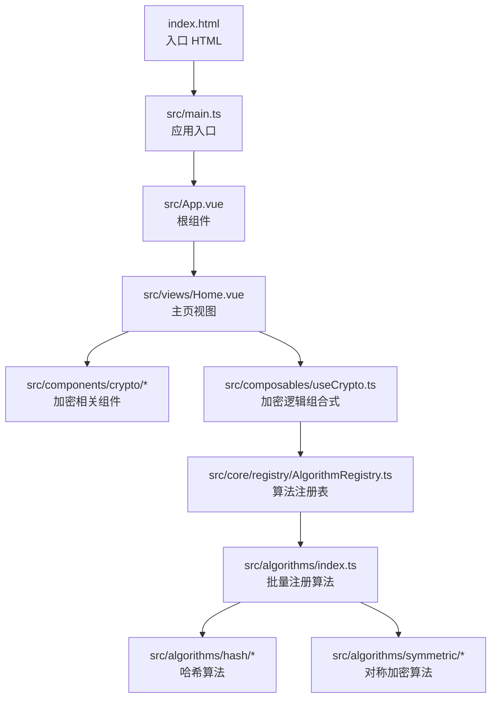
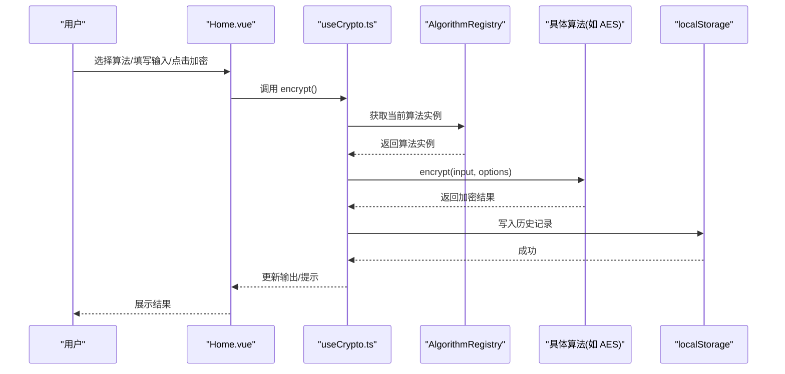
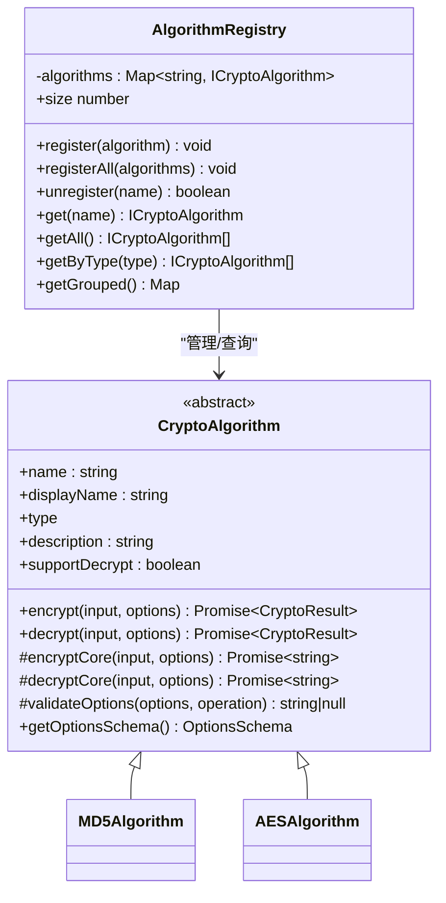
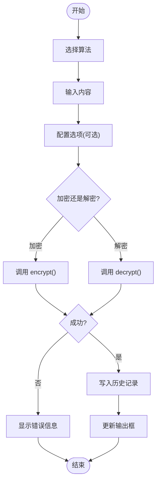
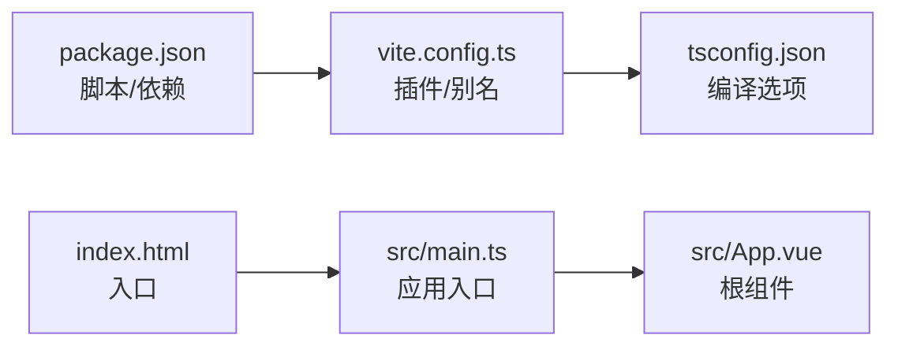

# 快速开始

## 目录
1. [简介](#简介)
2. [项目结构](#项目结构)
3. [核心组件](#核心组件)
4. [架构总览](#架构总览)
5. [详细组件分析](#详细组件分析)
6. [依赖关系分析](#依赖关系分析)
7. [性能考虑](#性能考虑)
8. [故障排除指南](#故障排除指南)
9. [结论](#结论)
10. [附录](#附录)

## 简介
本指南面向希望在30分钟内快速搭建并运行“编码器”项目的开发者。项目基于 Vue 3 + TypeScript + Vite 构建，提供多种加密算法的可视化操作界面，包括哈希、编码、HMAC、对称加密与非对称加密等。你将学会：
- 完整的环境要求与工具链准备
- 安装与启动步骤
- 基本使用示例
- 常见开发环境问题的排查与解决
- 项目目录结构与关键配置文件的作用
- 基本开发工作流程

## 项目结构
该项目采用“按功能域划分”的组织方式，核心目录与职责如下：
- src：源代码根目录
  - algorithms：算法实现（哈希、编码、HMAC、对称、非对称）
  - components：可复用 UI 组件（布局、加密相关控件、历史面板）
  - composables：组合式逻辑（状态与业务逻辑封装）
  - core：核心基础设施（算法基类、注册表、类型定义、工具）
  - views：页面视图（当前为首页）
  - App.vue、main.ts：应用入口与初始化
- dist：构建产物（生产环境）
- 配置文件：package.json、vite.config.ts、tsconfig.json、index.html

图表来源
- [index.html](file://index.html#L1-L14)
- [src/main.ts](file://src/main.ts#L1-L10)
- [src/App.vue](file://src/App.vue#L1-L33)
- [src/views/Home.vue](file://src/views/Home.vue#L1-L220)
- [src/composables/useCrypto.ts](file://src/composables/useCrypto.ts#L1-L217)
- [src/core/registry/AlgorithmRegistry.ts](file://src/core/registry/AlgorithmRegistry.ts#L1-L114)
- [src/algorithms/index.ts](file://src/algorithms/index.ts#L1-L59)

章节来源
- [package.json](file://package.json#L1-L27)
- [vite.config.ts](file://vite.config.ts#L1-L13)
- [tsconfig.json](file://tsconfig.json#L1-L26)
- [index.html](file://index.html#L1-L14)
- [src/main.ts](file://src/main.ts#L1-L10)
- [src/App.vue](file://src/App.vue#L1-L33)
- [src/views/Home.vue](file://src/views/Home.vue#L1-L220)

## 核心组件
- 应用入口与初始化
  - index.html：定义挂载点与标题
  - src/main.ts：创建应用、注册全部算法、挂载根组件
  - src/App.vue：主题配置、全局样式、消息容器
- 页面与交互
  - src/views/Home.vue：主界面，包含算法选择、参数面板、输入输出区、历史面板与操作按钮
  - src/components/crypto/*：算法选择器、输入区域、选项面板、历史面板
- 状态与业务逻辑
  - src/composables/useCrypto.ts：统一的加密/解密状态与流程控制
  - src/composables/useHistory.ts：本地存储的历史记录管理
- 算法体系
  - src/core/base/CryptoAlgorithm.ts：算法抽象基类，定义统一的加密/解密接口与辅助方法
  - src/core/registry/AlgorithmRegistry.ts：算法注册表（单例），负责算法的注册、查询与分组
  - src/algorithms/index.ts：集中导入并注册所有算法
  - src/algorithms/hash/MD5.ts、src/algorithms/symmetric/AES.ts：示例算法实现

章节来源
- [index.html](file://index.html#L1-L14)
- [src/main.ts](file://src/main.ts#L1-L10)
- [src/App.vue](file://src/App.vue#L1-L33)
- [src/views/Home.vue](file://src/views/Home.vue#L1-L220)
- [src/composables/useCrypto.ts](file://src/composables/useCrypto.ts#L1-L217)
- [src/composables/useHistory.ts](file://src/composables/useHistory.ts#L1-L153)
- [src/core/base/CryptoAlgorithm.ts](file://src/core/base/CryptoAlgorithm.ts#L1-L165)
- [src/core/registry/AlgorithmRegistry.ts](file://src/core/registry/AlgorithmRegistry.ts#L1-L114)
- [src/algorithms/index.ts](file://src/algorithms/index.ts#L1-L59)
- [src/algorithms/hash/MD5.ts](file://src/algorithms/hash/MD5.ts#L1-L28)
- [src/algorithms/symmetric/AES.ts](file://src/algorithms/symmetric/AES.ts#L1-L171)

## 架构总览
下图展示了从前端入口到算法执行与历史记录的完整调用链路。

图表来源
- [src/views/Home.vue](file://src/views/Home.vue#L1-L220)
- [src/composables/useCrypto.ts](file://src/composables/useCrypto.ts#L1-L217)
- [src/core/registry/AlgorithmRegistry.ts](file://src/core/registry/AlgorithmRegistry.ts#L1-L114)
- [src/algorithms/symmetric/AES.ts](file://src/algorithms/symmetric/AES.ts#L1-L171)
- [src/composables/useHistory.ts](file://src/composables/useHistory.ts#L1-L153)

## 详细组件分析

### 算法注册与发现机制
- AlgorithmRegistry（单例）：提供注册、注销、查询、按类型分组、遍历等能力
- algorithms/index.ts：集中导入并注册所有算法，确保应用启动时完成算法装配
- CryptoAlgorithm（抽象基类）：定义 encrypt()/decrypt() 的统一入口，内部完成输入校验、选项校验与异常处理；子类仅需实现核心逻辑

图表来源
- [src/core/base/CryptoAlgorithm.ts](file://src/core/base/CryptoAlgorithm.ts#L1-L165)
- [src/core/registry/AlgorithmRegistry.ts](file://src/core/registry/AlgorithmRegistry.ts#L1-L114)
- [src/algorithms/hash/MD5.ts](file://src/algorithms/hash/MD5.ts#L1-L28)
- [src/algorithms/symmetric/AES.ts](file://src/algorithms/symmetric/AES.ts#L1-L171)

章节来源
- [src/core/registry/AlgorithmRegistry.ts](file://src/core/registry/AlgorithmRegistry.ts#L1-L114)
- [src/algorithms/index.ts](file://src/algorithms/index.ts#L1-L59)
- [src/core/base/CryptoAlgorithm.ts](file://src/core/base/CryptoAlgorithm.ts#L1-L165)
- [src/algorithms/hash/MD5.ts](file://src/algorithms/hash/MD5.ts#L1-L28)
- [src/algorithms/symmetric/AES.ts](file://src/algorithms/symmetric/AES.ts#L1-L171)

### 加密/解密流程与状态管理
- useCrypto.ts：集中管理当前算法、输入输出、错误、加载状态、选项与分组算法列表；提供 encrypt()/decrypt()、清空、交换、复制等方法
- Home.vue：绑定 useCrypto 的状态与方法，渲染 UI 并触发操作
- useHistory.ts：以 localStorage 为持久化后端，维护历史记录列表，支持去重、截断与格式化时间

图表来源
- [src/composables/useCrypto.ts](file://src/composables/useCrypto.ts#L1-L217)
- [src/composables/useHistory.ts](file://src/composables/useHistory.ts#L1-L153)
- [src/views/Home.vue](file://src/views/Home.vue#L1-L220)

章节来源
- [src/composables/useCrypto.ts](file://src/composables/useCrypto.ts#L1-L217)
- [src/composables/useHistory.ts](file://src/composables/useHistory.ts#L1-L153)
- [src/views/Home.vue](file://src/views/Home.vue#L1-L220)

### 示例算法：MD5 与 AES
- MD5Algorithm：继承自 CryptoAlgorithm，实现哈希算法的 encryptCore；支持输出格式（hex/base64）与大小写控制
- AESAlgorithm：继承自 CryptoAlgorithm，实现对称加密的 encryptCore/decryptCore；包含密钥长度、模式、填充、IV 等选项校验与格式转换

章节来源
- [src/algorithms/hash/MD5.ts](file://src/algorithms/hash/MD5.ts#L1-L28)
- [src/algorithms/symmetric/AES.ts](file://src/algorithms/symmetric/AES.ts#L1-L171)

## 依赖关系分析
- 包管理与脚本
  - package.json 定义了开发与构建脚本（dev/build/preview/type-check），以及运行时与开发时依赖
- 构建与别名
  - vite.config.ts 启用 Vue 插件与路径别名 @ 指向 src，便于模块导入
- 类型系统
  - tsconfig.json 设置 ESNext 模块、严格模式、路径映射与编译目标，确保类型安全与现代语法支持
- 运行入口
  - index.html 通过 module 脚本引入 src/main.ts，实现应用挂载

图表来源
- [package.json](file://package.json#L1-L27)
- [vite.config.ts](file://vite.config.ts#L1-L13)
- [tsconfig.json](file://tsconfig.json#L1-L26)
- [index.html](file://index.html#L1-L14)
- [src/main.ts](file://src/main.ts#L1-L10)
- [src/App.vue](file://src/App.vue#L1-L33)

章节来源
- [package.json](file://package.json#L1-L27)
- [vite.config.ts](file://vite.config.ts#L1-L13)
- [tsconfig.json](file://tsconfig.json#L1-L26)
- [index.html](file://index.html#L1-L14)
- [src/main.ts](file://src/main.ts#L1-L10)
- [src/App.vue](file://src/App.vue#L1-L33)

## 性能考虑
- 构建优化
  - 使用 Vite 的原生 ESM 与按需编译，开发阶段热更新迅速
  - 生产构建开启压缩与 Tree-shaking（由 Vite/TypeScript 默认行为保证）
- 算法执行
  - 算法核心逻辑在 encryptCore/decryptCore 中执行，避免在 UI 线程做重型计算
  - 对于大文本，建议分批处理或在 Web Worker 中执行（扩展方向）
- 状态与渲染
  - 使用 Vue 响应式与细粒度组件拆分，减少不必要的重渲染
- 本地存储
  - 历史记录上限与去重策略降低存储压力与重复渲染

## 故障排除指南
- 启动失败：端口占用或权限不足
  - 确认未被占用的端口（Vite 默认端口），或在启动命令中指定端口
  - 在 Windows 上以管理员身份运行终端（若涉及端口绑定）
- 依赖安装失败
  - 若 npm install 失败，尝试更换为 pnpm 或使用缓存清理后重试
  - 确保网络可访问 npm registry 或配置镜像源
- TypeScript 报错
  - 运行类型检查脚本以定位问题
  - 检查 tsconfig.json 的路径映射与模块解析设置是否与实际目录一致
- 浏览器兼容性
  - 确保浏览器支持 Clipboard API（复制功能依赖）
  - 如需支持旧版浏览器，可在 polyfill 或降级方案中扩展
- 开发代理与跨域
  - 若接入后端服务，可在 Vite 配置中添加代理规则（扩展方向）

章节来源
- [package.json](file://package.json#L1-L27)
- [vite.config.ts](file://vite.config.ts#L1-L13)
- [tsconfig.json](file://tsconfig.json#L1-L26)
- [src/composables/useCrypto.ts](file://src/composables/useCrypto.ts#L1-L217)
- [src/composables/useHistory.ts](file://src/composables/useHistory.ts#L1-L153)

## 结论
本项目提供了清晰的前端加密工具框架：以 Vue 3 + TypeScript 为基础，结合可扩展的算法注册表与组合式逻辑，使新增算法与功能迭代变得简单。按照本指南的步骤，你可以在半小时内完成环境准备、安装与启动，并进行基础操作与排错。后续可在此基础上扩展更多算法、完善 UI 与交互，并接入后端服务。

## 附录

### 环境要求与工具链
- Node.js 版本：建议使用长期支持版本（LTS），确保与 TypeScript 与 Vite 兼容
- 包管理器：推荐使用 pnpm（与 lock 文件匹配），也可使用 npm 或 yarn
- 浏览器：现代浏览器即可，需支持 Clipboard API

章节来源
- [package.json](file://package.json#L1-L27)
- [tsconfig.json](file://tsconfig.json#L1-L26)

### 安装与启动步骤
- 步骤 1：克隆仓库并进入目录
- 步骤 2：安装依赖（优先使用 pnpm）
- 步骤 3：启动开发服务器
- 步骤 4：打开浏览器访问本地地址
- 步骤 5：构建生产包（可选）

章节来源
- [package.json](file://package.json#L1-L27)
- [vite.config.ts](file://vite.config.ts#L1-L13)
- [index.html](file://index.html#L1-L14)

### 基本使用示例
- 选择算法：在左侧算法选择器中选择目标算法
- 配置选项：根据算法支持情况配置密钥、模式、填充、IV、输入/输出格式等
- 输入内容：在输入区域填写明文或密文
- 执行操作：点击加密/解密按钮，查看输出结果
- 复制结果：点击复制按钮将结果复制到剪贴板
- 查看历史：点击历史面板，查看与恢复过往操作

章节来源
- [src/views/Home.vue](file://src/views/Home.vue#L1-L220)
- [src/components/crypto/AlgorithmSelector.vue](file://src/components/crypto/AlgorithmSelector.vue#L1-L63)
- [src/components/crypto/InputArea.vue](file://src/components/crypto/InputArea.vue#L1-L70)
- [src/composables/useCrypto.ts](file://src/composables/useCrypto.ts#L1-L217)
- [src/composables/useHistory.ts](file://src/composables/useHistory.ts#L1-L153)

### 关键配置文件说明
- package.json：定义脚本、依赖与项目元信息
- vite.config.ts：启用 Vue 插件与路径别名 @ 指向 src
- tsconfig.json：设置模块解析、路径映射与严格类型检查
- index.html：定义应用挂载点与标题

章节来源
- [package.json](file://package.json#L1-L27)
- [vite.config.ts](file://vite.config.ts#L1-L13)
- [tsconfig.json](file://tsconfig.json#L1-L26)
- [index.html](file://index.html#L1-L14)

### 开发工作流程建议
- 新增算法：在 algorithms 下新建文件，继承 CryptoAlgorithm，实现必要方法与选项 Schema，然后在 algorithms/index.ts 中注册
- 修改 UI：在 components 下扩展或修改现有组件，保持与 composable 的松耦合
- 状态管理：优先使用组合式逻辑封装，避免在组件中直接操作全局状态
- 构建与预览：使用构建脚本生成生产包，使用预览脚本本地验证

章节来源
- [src/core/base/CryptoAlgorithm.ts](file://src/core/base/CryptoAlgorithm.ts#L1-L165)
- [src/algorithms/index.ts](file://src/algorithms/index.ts#L1-L59)
- [src/composables/useCrypto.ts](file://src/composables/useCrypto.ts#L1-L217)

- [package.json](file://package.json#L1-L27)
